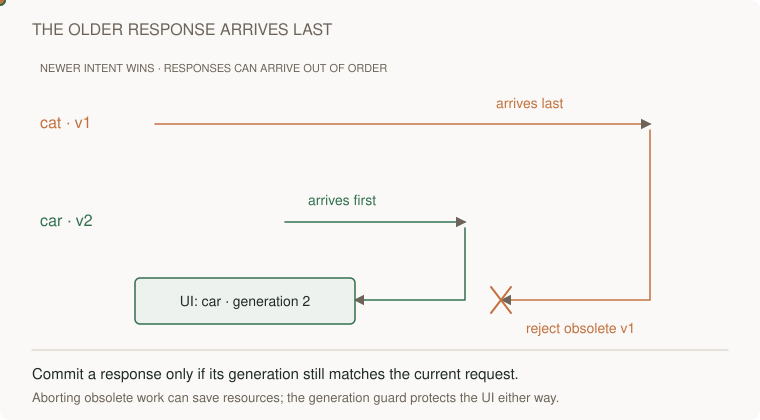
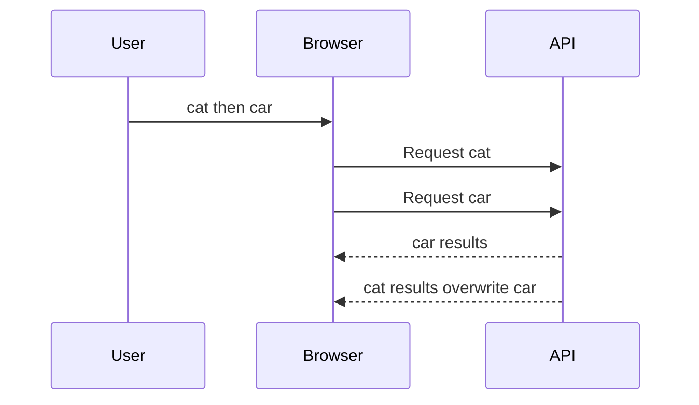
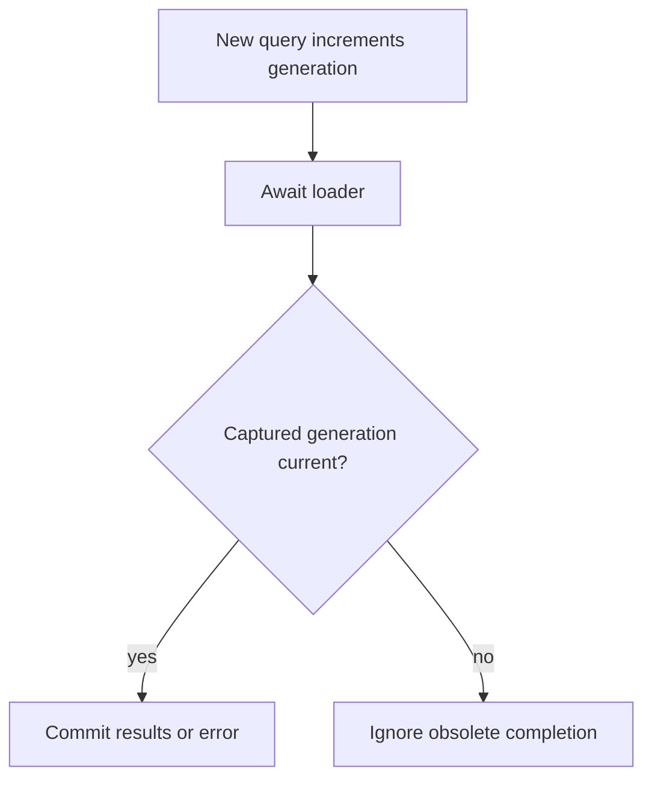

# Search race · the latest user intent wins

[Curriculum](../../../../README.md) · [Connect a usable interface to an API](../../README.md)

The search box shows bookmarks returned by an API. Alice types `cat`, then changes it to `car` before the first request finishes. The server may complete those requests in either order. The screen should keep answering the current query, `car`.

You will implement the small coordinator that decides which response may update the view. A generation is just a counter assigned to each new search. It is not the time when a network response arrives. Start by following the two requests in this animation, then use the table to define success and failure behavior.

> “Alice searches ‘cat’, then ‘car’. Cat finishes last and replaces the car results.
> Some loaders ignore cancellation. Which response may change the screen?”

Constructed 30-minute session. Prerequisite: [runtime model](../../../01-backend/labs/bounded-executor/runtime.md).
Keep [reference](../../../../01-code/02-data-structures-algorithms/typescript.ts) and [tests](../../../../01-code/02-data-structures-algorithms/typescript.test.ts) separate
from the initial attempt.

Original illustration: [browser race animation](../../../../../assets/learning/browser-race.svg)
and [static view](../../../../../assets/learning/browser-race-still.svg).

| Contract | Expected behavior |
|---|---|
| Worked input | Request 1=cat; request 2=car; complete 2 then 1 |
| Output | Only car commits, even if request 1 ignores abort |
| Failure | Current failure displays an error; obsolete failure cannot replace current state |
| Boundary | A disposed view never commits |
| Excluded | Debouncing, QPS and server-side cancellation guarantees |

Restate “latest” as request generation, not completion time. Trace both completions;
increment a generation per request; capture it before awaiting; commit only if it is
still current. Abort obsolete work when supported, but retain the generation guard.
Errors need the same guard as successes.

**Follow-up:** unmount before completion. Expected: abort and invalidate; test ignored
abort. **Follow-up:** reduce calls while typing. Expected: debounce separately; retain
generation correctness. Coordinator state is O(1) beyond payloads. Old network/server
work may continue after the browser aborts.

Run from root: `node --test curriculum/01-code/02-data-structures-algorithms/typescript.test.ts`. The
[real bookmark slice](../bookmark-editor/README.md) adds browser
empty/error/retry states, disposal and storage. Senior evidence requires reverse
completion and current-error tests; lead scope adds budgets and client compatibility.
