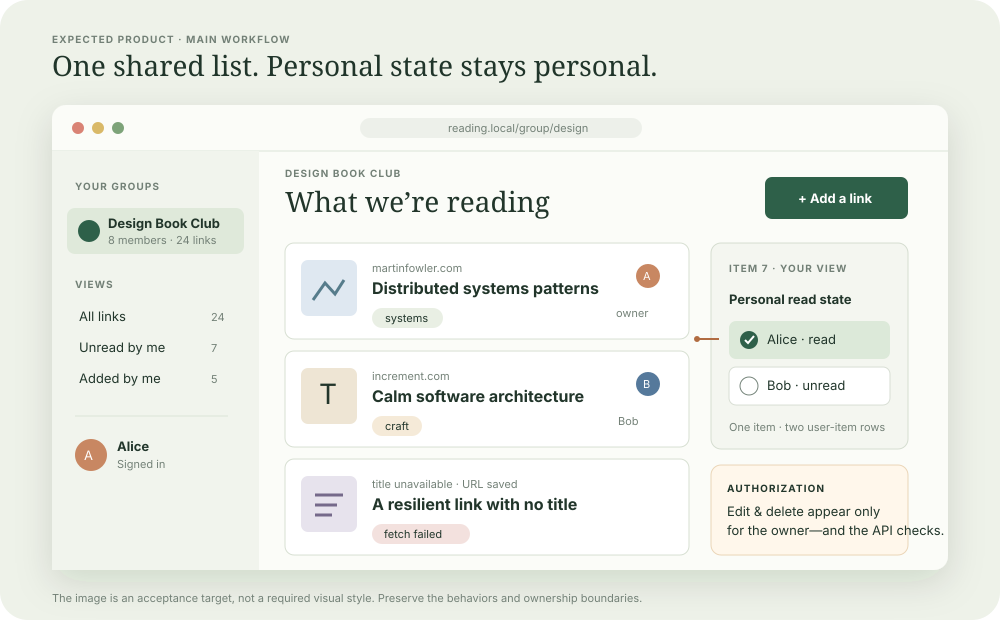
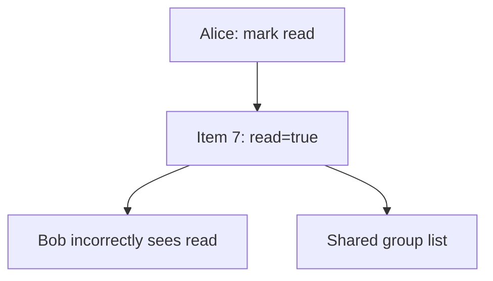
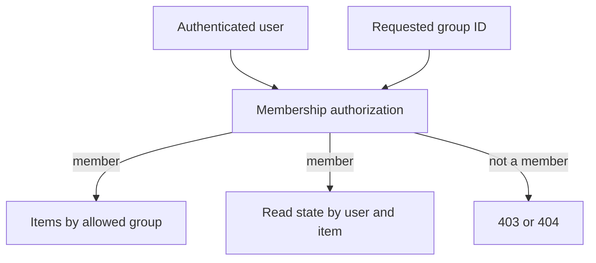
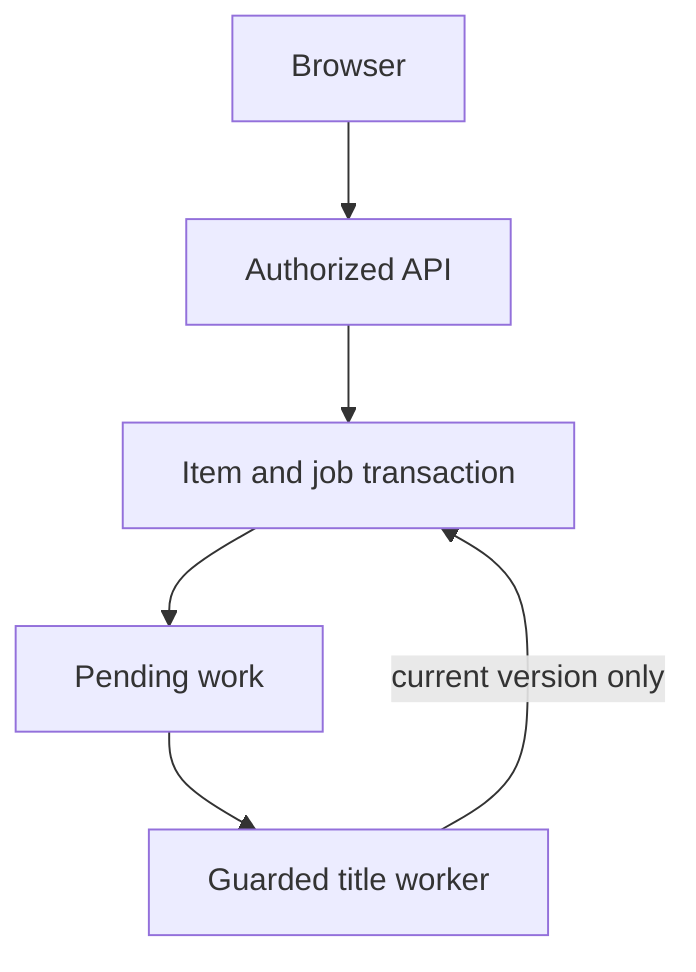
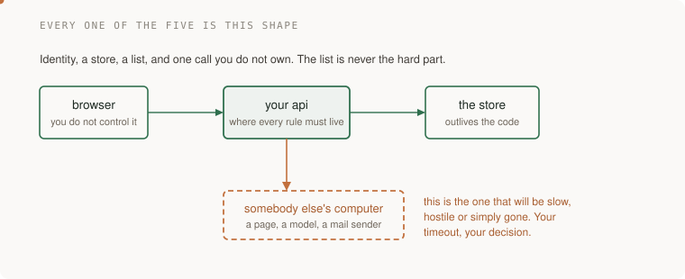
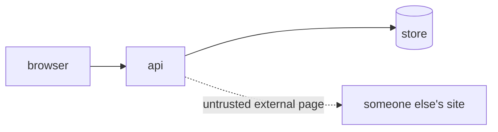

# 1. A shared reading list

[Curriculum](../../../README.md) · [Frontend and full-stack integration](../README.md) · [Project index](../../../../indexes/projects.md)

## The reviewer's brief

> A book club shares links. Alice marks a link read and Bob’s unread list unexpectedly changes. Correct the data model while preserving group visibility and owner-only edits. Which facts belong to a person, an item, and a group?

This is a **constructed practice brief**, not an attributed company question.
Prerequisites: [project index](../../../../indexes/projects.md) and [prerequisite lesson](../../../01-code/01-problem-solving/change-loop.md). This page is a build brief; it does not ship a runnable application. The original build and prompt sequence below defines the implementation checkpoints.

| Case | Exact input or workload | Expected outcome |
|---|---|---|
| Small example | Group G contains Alice and Bob; Alice creates item 7; Alice marks item 7 read. | Both see the item; only Alice has read state; Bob cannot edit Alice’s URL. |
| Boundary / failure | Bob sends a direct DELETE for item 7 while hiding the UI button. | Server refuses with the chosen 403/404 policy and the item remains. |
| Scope | One group initially; tags and visible fetch failure; no anonymous editing. | Explain any additional assumption before implementing it. |

## See the first reviewable result

**First slice:** In group G, Alice adds item 7 and marks it read. Open the two-member view: both see the link, only Alice sees her own read mark. **Show:** the screen for each account plus direct API calls demonstrating that Bob cannot edit/delete Alice's URL even if he crafts the request without the UI. A failed title fetch should leave the URL and a clear pending/failure state visible.

| Action | Alice's view | Bob's view / API result |
|---|---|---|
| Alice saves item 7 in group G | Item 7 appears with its URL | Item 7 appears in the same group. |
| Alice marks item 7 read | Read | Unread; Bob's state was not overwritten. |
| Bob marks item 7 read | Still read | Read; two separate person–item records exist. |
| Bob sends `DELETE /items/7` directly | Item 7 remains | `403` or a documented `404`; disabling a button alone fails this check. |
| Title provider times out on a new URL | URL persists with pending/failed title | URL persists with the same visible status. |

Model an item once per group, membership once per person and group, and read state once per person and item. Ask the learner to sketch these three boxes and their keys before writing the UI; the screenshot above is a *target view*, not a runnable implementation.

<!-- project-expectation:start -->

## What you are expected to hand over

**The finished artifact:** A responsive shared reading list where members add and tag links, personal read state never leaks between users, ownership is enforced by the server, and title-fetch failure stays visible.



Bring a runnable slice or decision artifact, its normal output, and a captured
failure from the table above. Include one check that turns red when the guarantee
breaks, the state owner, and the first operational limit. For each follow-up,
change the diagram **and** the evidence before claiming the design still works.

### How the review conversation gets harder

| Review gate | The interviewer changes | Expected response |
|---|---|---|
| Baseline | Run the small example from the table above. | Demonstrate the observable outcome end to end and identify which boundary owns it. |
| Failure | Reproduce the boundary/failure row above. | Show the failure before the fix, then prove the protected behavior without hiding the error. |
| Senior · Many groups | Alice belongs to two groups; Bob belongs to one. Which rows can Bob list? Predict which boundary must change before opening the design. | Filter by verified membership at the data access boundary; never trust a client-supplied group ID alone. Test list, detail, edit and title-job paths for cross-group leakage. |
| Lead · The title provider stalls | Saving must return in 300 ms while the provider takes ten seconds. What moves? State what evidence would make you reject your first design. | Atomically save the item and durable title job, return pending, and let a guarded bounded worker complete the title. Retry execution may repeat fetching; conditional versions protect the current result. |
| Evidence | A reviewer asks, “How do you know?” | Build in three stops: reproduce the small case and baseline failure; implement the protected boundary; then replay both changed requirements with captured outputs. |
| Handoff | The author is unavailable and the environment is new. | Another engineer can run, observe, break, and recover the artifact from the repository evidence. |

Before implementation, say the baseline invariant, the owner of each piece of
state, and what the user sees when the named dependency or assumption fails. That
five-minute explanation is part of the project: if it is vague, the build is not
ready to begin.

<!-- project-expectation:end -->

Before looking at the guidance, state the invariant in one sentence and trace the example. In interview practice, implement or sketch independently, then reveal the reasoning. During AI-assisted practice, use the prompts below and verify each checkpoint before the next request.

## Baseline and the failure to explain



An item-level boolean merges two different users’ facts. UI controls do not protect the write boundary.

<details>
<summary>Reveal the approach and decisions</summary>

Write the ownership and visibility rules before endpoints. Use items, memberships, and read-state keyed by person/item; enforce authorization in server queries. The invariant is that one member’s read action cannot change another member’s read state. Keep title extraction optional to successful saving.

</details>

## Follow-up 1 · Many groups

**Changed requirement:** Alice belongs to two groups; Bob belongs to one. Which rows can Bob list? Predict which boundary must change before opening the design.

<details>
<summary>Expected reasoning and changed diagram</summary>

Filter by verified membership at the data access boundary; never trust a client-supplied group ID alone. Test list, detail, edit and title-job paths for cross-group leakage.



</details>

## Follow-up 2 · The title provider stalls

**Changed requirement:** Saving must return in 300 ms while the provider takes ten seconds. What moves? State what evidence would make you reject your first design.

<details>
<summary>Expected reasoning and changed diagram</summary>

Atomically save the item and durable title job, return pending, and let a guarded bounded worker complete the title. Retry execution may repeat fetching; conditional versions protect the current result.



</details>

## Evidence to bring to review

Build in three stops: reproduce the small case and baseline failure; implement the protected boundary; then replay both changed requirements with captured outputs. Record commands, fixtures, and observed results in your implementation README. A diagram is a prediction until those checks run.

**Senior expectation:** Test separate users, direct unauthorized writes and provider failure. **Additional lead scope:** Define membership changes and ownership transfer contracts. Completion demonstrates practice evidence; it does not establish interview readiness or multi-team delivery experience.

## Build and prompt sequence



*A group adds links, tags them, marks them read, and sees what the group is reading.*

**Build**

Sign-in, add a URL, the system fetches the page title, tag it, mark it read, see
everyone's. This is the same system the [spine](../../../../projects/reading-list/README.md) uses, so if you
pick this one you can carry it through all five spine projects without starting
again.



**The thought process**

The first real decision is not technical. It is **what "shared" means**: one
group, or groups? Because "one group" is a system with users, and "groups" is a
system with memberships, and that is a different schema, a different
authorisation rule and a different set of screens. Deciding late costs you a
migration in a project that has no migrations yet.

Then the one people get wrong: **what owns "read"?** Marking something read is a
fact about a person *and* an item, not about the item. If you put a boolean on
the item, the second user to mark it read will silently mark it for everybody,
and you will not notice until somebody complains that their list is wrong.

Third: the fetch is somebody else's server. It can be slow, absent, enormous, or
deliberately hostile. You decide whether the user waits for it, and whichever
you choose, the timeout is yours to pick.

**How to organise the prompts**

```
I am building a shared reading list. Before any code: write the data
model and the endpoints, and tell me the three decisions in this design
most likely to be wrong.

Do not write code yet.
```

Argue with the answer. Specifically, check whether "read" is on the item.

```
Implement only sign-up and sign-in, with tests. Stop when I can run it
and log in.
```

```
Add the rule that a person can only edit or delete their own items.
Write the test for somebody else's item FIRST and show me it failing
before you add the check.
```

```
Now the fetch. It must have a timeout I chose, and a URL that hangs,
404s or returns no title must still leave a saved item with the failure
visible rather than swallowed.

Show me all four cases.
```

**On AWS**

For a small existing container, compare **ECS on Fargate**, **App Runner**
where available to your account, or **EC2** according to deployment control,
operational burden and steady versus bursty demand. A small **RDS PostgreSQL**
database fits the membership and ownership relations. A bounded **Lambda**
request path is also viable; manage connection reuse and concurrency deliberately,
and evaluate **RDS Proxy** when its connection behavior justifies the additional
service. Waiting on external calls consumes resources in any runtime.

Use **S3** for uploaded objects and an appropriate secrets/configuration store,
such as **Parameter Store** or **Secrets Manager**, based on rotation and access
needs. **Route 53** and **ACM** cover DNS and supported certificate integrations.
Compare the full account estimate, including database, load balancer, public IP,
network egress and logs; a small instance does not imply a free deployment.
Prefer the local implementation while learning the contract, and delete optional
cloud resources when the exercise ends.

**What productionising it means**

Somebody who is not you can deploy it from the README. Secrets are injected, not
committed. There is a backup and you have restored from it. The fetch cannot
hang the whole app. And the authorisation rule has a test that fails when you
remove the check — that one rule is the difference between a demo and something
you would let a group of friends use.

**The learning**

Almost every small product is this: identity, a store, a list, and one call to
someone else's computer. The hard parts are never the list. They are who is
allowed to do what, and what happens when the other computer misbehaves.

**How you would know it is wrong**

- Sign in as one user and send a delete for another user's item **directly**, not through the UI. It must refuse.
- Turn off your network and add a URL. The failure should be visible, the record sane.
- Two accounts, same item, one marks it read. Check the other's list.
- Deploy from a clean clone in a fresh directory, on a machine that has never seen the project.

**Stage it**

1. Auth and an empty list, deployed and reachable.
2. Items, tags, and the authorisation rule with its failing-first test.
3. The fetch, with its four failure cases.
4. Backups, a restore you have actually done, and the README a stranger can follow.

---

[Back to the ordered project index](../../../../indexes/projects.md)
