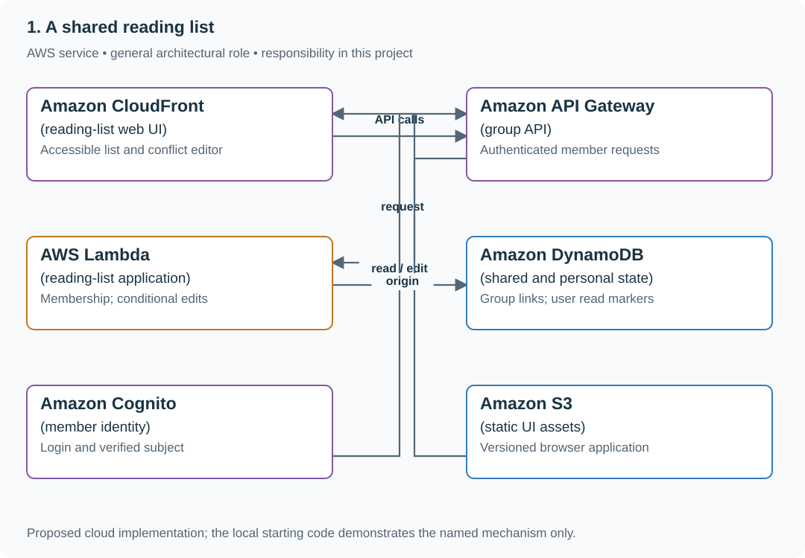

# Build a shared reading-list UI with private reading state

## Application background

A study group shares links and notes while each member marks their own progress. The API supplies shared bookmark data plus the current member's reading state; browsers may edit stale versions.

This is a fictional engineering scenario. The workload figures later in the page are exercise assumptions, not measured production traffic.

## Your assignment

**Deliver:** A usable browser interface over the supplied API, with separate member state and draft-preserving conflict handling.

Build a reading list for a six-person study group. Members share saved links and notes, but each person tracks their own read state. Two people edit the same note on different devices, and an unsaved draft must survive a conflict.

**Required behavior:** Group membership controls link visibility. Shared link metadata and per-user read state are separate. Conditional edits return a conflict without discarding the user’s draft; delayed responses cannot overwrite newer UI state.

The required first milestone is a working local implementation of the behavior above. The numbered implementation steps define the scope; the cloud architecture is a later extension, not something the starter has already provisioned.

## Get the code and run the supplied example

The code is in the public [junior-to-staff repository](https://github.com/Soulful-Iris/junior-to-staff). Install Git and Python 3.12+. No AWS account or Python packages are required for this first run. If you already have a checkout, use it and skip cloning.

```bash
git clone https://github.com/Soulful-Iris/junior-to-staff.git
cd junior-to-staff
python3 examples/architecture-starts/a_shared_reading_list.py
```

**Supplied file:** [`examples/architecture-starts/a_shared_reading_list.py`](https://github.com/Soulful-Iris/junior-to-staff/blob/main/examples/architecture-starts/a_shared_reading_list.py). You can also [read or download the source here](../../../../examples/architecture-starts/a_shared_reading_list.py).

This program is a **mechanism demonstration**: it runs the small scenario in one process and prints the result. It is not an HTTP service, a complete application, or an AWS deployment. A successful run demonstrates this mechanism only; it does not establish the workload or failure guarantees of the application you will build.

**Example output from the supplied run:**

Generated IDs and timestamps may differ; compare the state transitions and outcomes.

```text
{'state': 'saved', 'server': {'version': 4, 'note': 'Ana note'}}
{'state': 'conflict', 'draft': 'Ben draft', 'server': {'version': 4, 'note': 'Ana note'}}
Personal read state: {('ana', 'l7'): True, ('ben', 'l7'): False}
```

### Run the application you will extend

The [reading-list API setup guide](../../../../examples/reading-list-starter/README.md) gives you a real local HTTP server, SQLite database, save/list/edit requests and controlled title success/timeout behavior. Start it in one terminal and send the documented `curl` requests from another. Read that setup before following the implementation steps below. The demo above isolates this lesson's mechanism; the server is where you integrate it.

For a first run, start this in **terminal 1** from the repository root:

```bash
python3 examples/reading-list-starter/app.py --db /tmp/reading-list.sqlite3
```

In **terminal 2**, save one bookmark with a controlled title timeout:

```bash
curl -i http://127.0.0.1:8080/bookmarks \
  -H 'X-Demo-User: alice' -H 'Content-Type: application/json' \
  -d '{"url":"https://example.com/docs","title_mode":"timeout"}'
```

Expect **201 Created**, a bookmark `id` and `title_status: "timeout"`. The URL is persisted despite the title failure. This is the supplied baseline; the assignment adds the behavior described above. The lookup is a fixture, so no external website is contacted. For members Bob or Ben in a scenario, use the starter's second demo identity `bob`; Alice or Ana corresponds to `alice`.

Work in your own branch or copy `examples/reading-list-starter/` to `work/a-shared-reading-list/`. `app.py` exists in that directory; add the modules named below there as you separate HTTP, storage and background work. The server has demo membership, not production authentication.

## Local components and state to implement

This table names the records, interfaces or decision inputs for your deliverable. Unless a name is explicitly linked to supplied source above, it is something you create. Implement the local state transitions first, then connect the HTTP, storage or worker boundaries required by the steps.

| Record / module | Key or interface | Responsibility |
|---|---|---|
| links | group,link_id,version,url,note | Shared metadata and conditional edit authority. |
| read_state | user,link_id,read_at | Personal state independent of other members. |
| editor_state | base_version,draft,server_value,request_generation | Explicit dirty/saving/conflict UI state. |

## Implement the assignment

### 1. Build the group list first

Implement membership, create/list and stable link IDs. Save the URL before optional title enrichment. Paginate by a stable key and show loading, empty and unavailable states without clearing previously loaded content unnecessarily.

### 2. Separate personal interaction state

Store read/unread by authenticated user and link. Marking a link read changes only that user’s view. Optimistic UI should roll back or display a retry state after a failed write rather than pretending the server accepted it.

### 3. Implement an explicit editor state machine

Keep base version and draft separately from the latest server record. Save with expected version; on 409 show current server text beside the preserved draft. Use request generations so an older save response cannot replace a newer draft.

### 4. Handle membership and accessibility

Reauthorize API reads and writes after revocation, including warm caches. Provide keyboard-accessible controls and clear save/conflict announcements. Keep a revoked member’s local draft from being silently submitted under another user’s session.

## Demonstrate the completed local result

| Action | Expected visible result |
|---|---|
| Run the starting program | Ana saves; Ben retains a conflicting draft; their read states remain independent. |
| Deliver an older save response late | The newer local draft is not replaced. |
| Revoke membership | New list and save requests are denied even with cached group data. |

**Handoff:** In your implementation README, include the start command, one successful operation, the failure case above and the resulting stored state or decision. State which dependencies are simulated. Someone with a fresh checkout should be able to reproduce this without your chat history.

## Workload assumptions and capacity decisions

These are constructed exercise assumptions. The stated workload is a design target; the local demonstration does not establish that throughput. Use the [estimation constants](../../../01-code/01-problem-solving/estimation-constants.md) to check units before choosing capacity.

| Input or objective | Calculation / consequence |
|---|---|
| Six members × 200 saved links | 1,200 potential personal read-state rows for 200 shared links; do not put one global read flag on the link. |
| 50 concurrent active readers exercise peak | Begin with paginated database reads; a cache is optional after measuring. |
| Two edits from revision 3 | Exactly one revision-3 conditional update can win; the second client keeps its draft. |

## Map the local implementation to AWS

**Deployment status: local only.** Running the supplied command creates no AWS resources and configures no cloud connections. The diagram is a proposed deployment of the completed application. Each box needs either a deployed runtime, a provisioned service or an explicitly external dependency.

Read the diagram by following the arrows from the entry point: application code accepts the request or event, the state owner commits it, and any worker produces the later result. The table ties those roles to code and adapter work. Multiple boxes do not imply multiple Python files already exist.



The UI needs its own explicit state model as much as the backend needs conditional writes. A successful conflict response is useful only if the browser preserves the work the user was trying to save.

| Local responsibility | Cloud destination and role | Implementation still required |
|---|---|---|
| Local static/media delivery path | Amazon CloudFront: reading-list web UI | Configure an origin, cache policy and private-content access; distinguish cached bytes from current authorization. |
| Local HTTP boundary or the endpoint you will add | Amazon API Gateway: group API | Create routes and an integration; translate requests and responses and configure identity validation. |
| Python operation or worker function | AWS Lambda: reading-list application | Write a Lambda event adapter, package its dependencies and give its role only the required resource actions. |
| Local dictionary, SQLite records or state model | Amazon DynamoDB: shared and personal state | Design partition/sort keys and write a storage adapter with conditional updates or transactions; Python state and SQL are not uploaded as a database. |
| Local fixture identity or caller supplied to the operation | Amazon Cognito: member identity | Configure an identity provider and validate tokens; retain resource ownership checks in application code. |
| Local file, object fixture or exported payload | Amazon S3: static UI assets | Implement upload/download and metadata adapters, scoped access, object naming, retention and incomplete-upload cleanup. |

### Provision resources, then connect the application

| Resource or boundary | Initial configuration and reason |
|---|---|
| API data | Include group scope in every key/query; conditional versions on shared edits. |
| Frontend delivery | Cache versioned static assets; keep private API responses out of shared caches. |
| Identity | Membership remains an application decision after token validation; revocation affects current reads/writes. |

Use one disposable AWS environment for the cloud exercise. Put the named resources in `infra/template.yaml` or your existing IaC tool, pass resource IDs through configuration, and scope each runtime role to its own tables, buckets and queues. The diagram is a design to implement; it is not a claim that these resources have been deployed. Record the commands you used to deploy and remove the exercise resources.

For concrete provisioning commands, configuration wiring and cleanup, use the [AWS foundation guide](../../../../examples/architecture-starts/infra/README.md). It includes a deployable table/queue/object-storage foundation and explains which application and service adapters you still implement.

A provisioned queue or table does not make the local program use it. Configure resource IDs in the deployed runtime, replace the local adapter, and replay the same successful and failing operation against that runtime. Record the deployed commit and observable result, then remove the disposable resources using your infrastructure tool.

## Extend the design after the baseline works


Add offline editing. Queue operations with base versions and identities, then surface genuine conflicts on reconnect instead of replaying last-write-wins over other members’ work.

<details>
<summary>Additional design reasoning and requirement changes</summary>

## Follow-up 1 · Many groups

**Changed requirement:** Alice belongs to two groups; Bob belongs to one. Which rows can Bob list? Predict which boundary must change before opening the design.

<details>
<summary>Expected reasoning and changed diagram</summary>

Filter by verified membership at the data access boundary; never trust a client-supplied group ID alone. Test list, detail, edit and title-job paths for cross-group leakage.

</details>

## Follow-up 2 · The title provider stalls

**Changed requirement:** Saving must return in 300 ms while the provider takes ten seconds. What moves? State what evidence would make you reject your first design.

<details>
<summary>Expected reasoning and changed diagram</summary>

Atomically save the item and durable title job, return pending, and let a guarded bounded worker complete the title. Retry execution may repeat fetching; conditional versions protect the current result.

</details>

</details>
