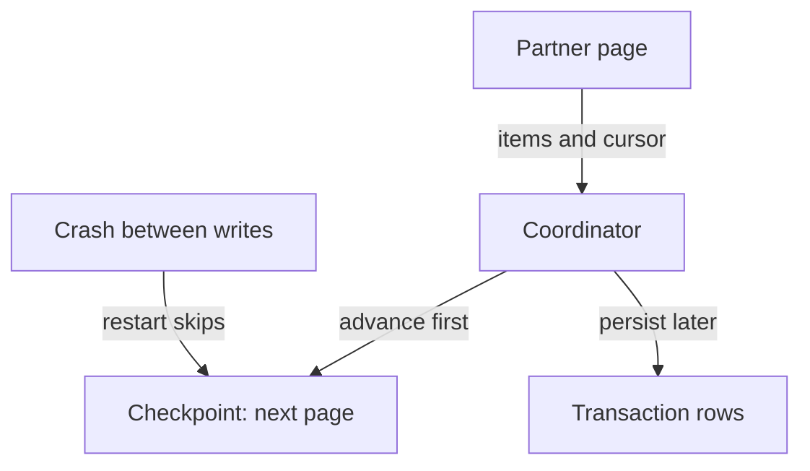
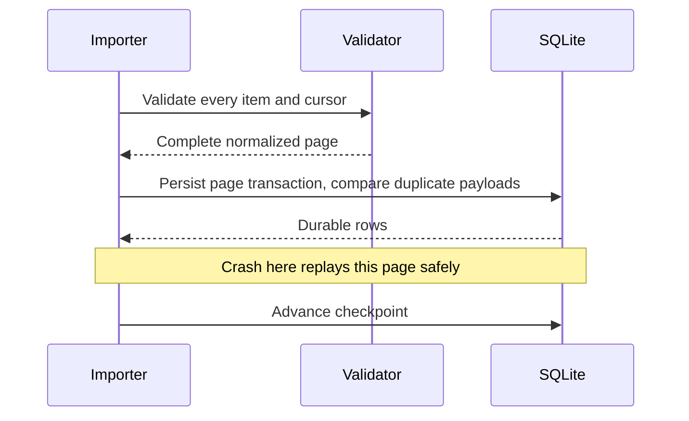
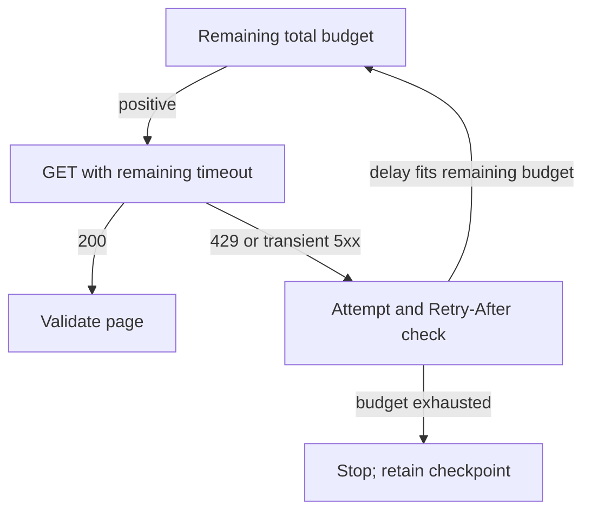

# Repair decimal amounts and restart recovery in a transaction importer

[Curriculum](../../../../README.md) · [Find defects and evaluate engineering evidence](../../README.md)

## Application and assignment

A finance job downloads pages of transaction records from a partner and stores amounts as integer cents. It remembers a page cursor so a later invocation can continue. If amounts are rounded incorrectly or progress advances before a page is stored, reconciliation is wrong even when every HTTP response succeeds.

You receive an unfamiliar Python package, fixtures, and a separate reference solution. Diagnose the 29-cent loss and skipped-page symptom, repair the package, and explain how identity and progress remain correct after a restart. The exercise stores synthetic records. It moves no real money.

## Contract and starting evidence

> “Finance imports USD transactions from a partner. Yesterday's reconciliation lost
> 29 cents and a restart skipped a page. The partner says its API is healthy.
> Complete this package without changing transaction identity. What do you inspect first?”

This is a **constructed** 75-minute practical/debug session. Start with
[the candidate brief](../../../../../practice/candidate/practical-debug.md); keep
[the assessor key](assessor.md) and `reference/` closed on the first attempt.
Prerequisites: [maps and identity](../../../../01-code/02-data-structures-algorithms/lessons/01-maps.md),
[runtime boundaries](../../../01-backend/labs/bounded-executor/runtime.md), and [the assessment rubric](../../../../../practice/README.md).

| Contract | Expected behavior |
|---|---|
| Input | Pages of `{id, amount: decimal-string, currency: "USD"}`, opaque next cursor or null |
| Worked output | `a:"0.29", b:"-1.10"`, followed by duplicate `a` and `c:"0.00"` → `(a,29),(b,-110),(c,0)` cents |
| Identity | Equal ID/equal normalized payload replays harmlessly; equal ID/different payload fails the entire page |
| Bounds | At most 100 pages per invocation, 3 attempts per page, total 5-second budget checked at transport and durable boundaries; amount strings at most 128 characters and absolute amount at most 10 billion USD |
| Failure | `"0.001"` on page 2 rejects page 2; page 1 remains durable and checkpoint stays at page 2 |
| Scope | One importer at a time; USD whole cents; Retry-After is numeric seconds by partner contract; no real money movement |

The deadline is cooperative at the store boundary: it does not interrupt a SQLite
commit already in progress. If time expires after persistence, progress is left for
safe replay and no success is returned. Decimal coefficient/exponent conversion is
independent of the ambient decimal precision; a tiny fractional cent cannot round
away before validation.

## Run and investigate

From the repository root:

```sh
cd curriculum/02-applications/04-testing/labs/importer
PACKAGE=starter python -m unittest test_importer -v
# After your independent repair; supplied solution check is a different activity:
PACKAGE=reference python -m unittest test_importer -v
```

Requires Python 3.10+ and the standard library. SQLite files are temporary in tests.
The starter deliberately has a syntax failure; a failed first command is expected.
[Baseline output](baseline.txt) records what happens before any repair. Read modules
in dependency order: domain `model`, HTTP `transport`, persistence `store`, coordinator
`importer`. Do not replace the package with one script. Candidate edits belong in
`starter/`; never count green reference tests as candidate evidence.

## Start with the smallest useful trace

1. Restate identity and amount units. Write the 29-cent example before touching code.
2. Run the command; separate “cannot import” from “incorrect business result.” Fix
   one executable boundary, then rerun. Record a hypothesis and the smallest input
   that distinguishes it from another cause.
3. Map one page through validation, persistence, and checkpointing. Ask who owns
   each acknowledgment. A misleading comment calls early checkpointing “faster”; a
   successful transport log says nothing about durable rows.
4. Add one injected failure at a time. Inspect actual calls and fake-clock values,
   not elapsed sleep time. Preserve passing callers while changing a boundary.
5. Prove replay safety and termination separately. A page limit bounds a loop but
   does not explain a repeated cursor or detect conflicting business identity.

The starting failure path acknowledges progress before the durable effect:



Before reading the next diagram, predict the rows and cursor after a crash immediately
after persisting page 1. Which operation must be safe to repeat?



Validation before mutation prevents half a malformed page from appearing. Compare
existing payloads inside the page transaction, so a late conflict rolls back earlier
inserts from that page. Keeping progress separate intentionally teaches replay;
an atomic page-plus-checkpoint transaction is also a valid design if the assessment
contract and crash tests are changed consistently.

## Changed constraints

**Question 1:** The partner returns `p2 → p3 → p2`. Is checking only `next == current`
enough? **Expected reasoning:** no; retain the set of requested cursors, reject any
non-null next cursor already seen, and retain a finite page budget. Space is O(P)
cursor history plus the page's O(m) normalized items; retained store/output is O(n).
The final sorted output adds O(n log n) ordering cost unless the storage index supplies
that order. Transport/SQLite costs are not hidden inside a claimed O(n/P) wall time.

**Question 2:** HTTP 429 arrives after 0.3 seconds with `Retry-After: 0.8` and the total
budget is 1 second. **Expected answer:** refuse the retry at fake time 0.3; do not
sleep 0.8 or start another request. Pass only remaining budget to the transport.



**Question 3:** The process dies after the page commits, before checkpointing.
**Expected answer:** reopening the same SQLite file replays equal IDs without double
counting; conflicting payloads remain errors. A finished checkpoint is distinct from
the initial null cursor. Tests reopen a real database connection.

Senior evidence is a narrow repair, causally meaningful regressions, and explicit
resource/failure bounds. Lead evidence adds partner-contract ownership, reconciliation
metrics, migration compatibility and a rollout that keeps the old checkpoint readable.
Finish with the separate [three-PR review](review/README.md). Do a second unfamiliar
session on a later occasion; this is curriculum evidence, not a hiring probability.
