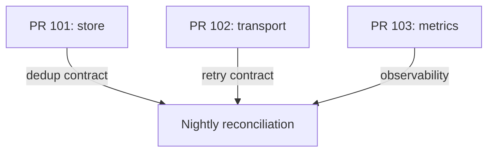
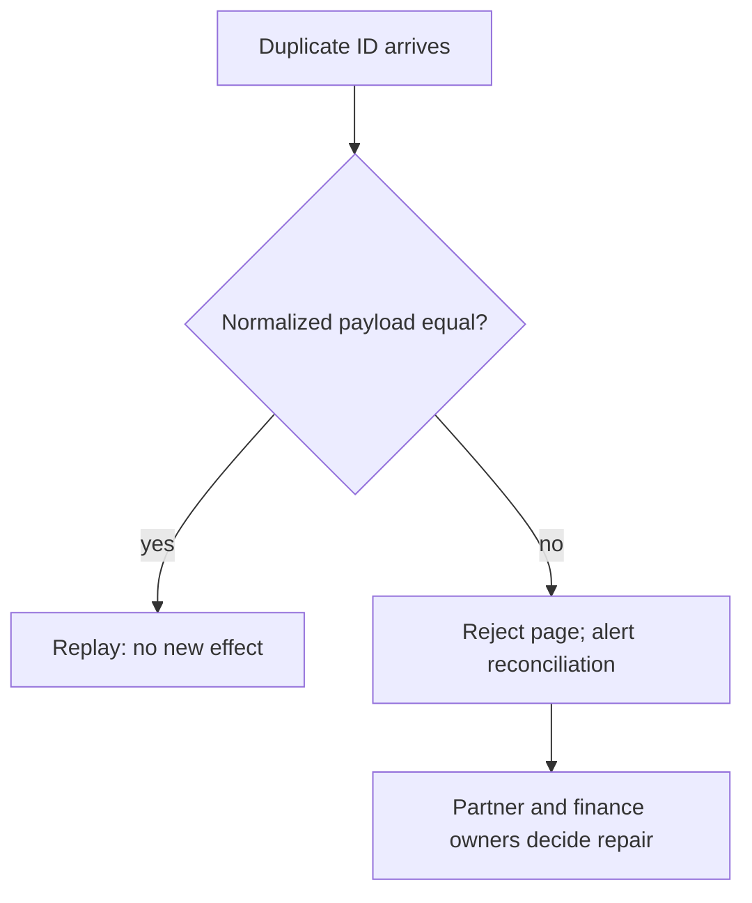

# Three PRs before the finance release

[Curriculum](../../../../../README.md) · [Find defects and evaluate engineering evidence](../../../README.md)

> “Three teams want to merge changes before tonight's reconciliation. You have
> 25 minutes. Which change blocks release, which needs a contract decision, and
> which can ship? Provide a minimal reproduction before suggesting a rewrite.”

This constructed review is a separate session after the [importer](../README.md).
Open [PR 101](pr-101.diff), [PR 102](pr-102.diff) and [PR 103](pr-103.diff). They are
proposed patches against the reference, not already applied code. Keep the
[review key](assessor.md) closed.

PR 101 (storage team) removes payload comparison to save a SELECT. PR 102 (integration
team) caps the partner's retry delay to finish earlier. PR 103 (operations) logs
attempt/status without finance payload. These are applicable unified diffs. After the
assessment, `python -m unittest discover -s curriculum/02-applications/04-testing/labs/importer/review -v`
from the repository root applies each in a temporary copy: the first two must produce
their named regressions, while the third must emit only the bounded metadata.

| Constraint | Expected evidence |
|---|---|
| Caller | Nightly importer restarts using an existing progress row |
| Input | Repeated transaction `a` with amount changing `0.29 → 2.00` |
| Invariant | Replays cannot silently change or conceal finance data |
| Output | Three separate review decisions, one executable regression each |
| Excluded | Style-only cleanup and rewriting the API client |

Read the diff and state the claimed benefit. Trace the contract across its caller,
construct a counterexample, then give the narrowest release decision. A review
comment should contain behavior, input, consequence and a regression; “looks unsafe”
is not enough.

**Follow-up:** a reviewer says all duplicate IDs are harmless. Predict the ledger
after the changed amount before opening the key. **Expected answer:** idempotence
requires equality of normalized payload, not just matching ID.

**Follow-up:** release is in ten minutes and retries overload the partner. **Expected
answer:** stop the faulty optimization, retain bounded behavior, assign the service
owner to clarify Retry-After rather than inventing a zero-delay retry. Senior review
must reproduce effects; lead review also assigns the contract decision and rollback.
