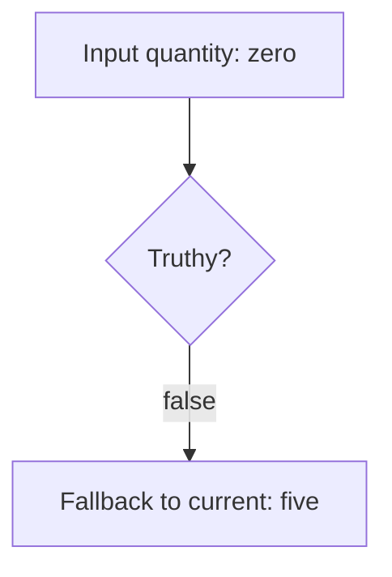
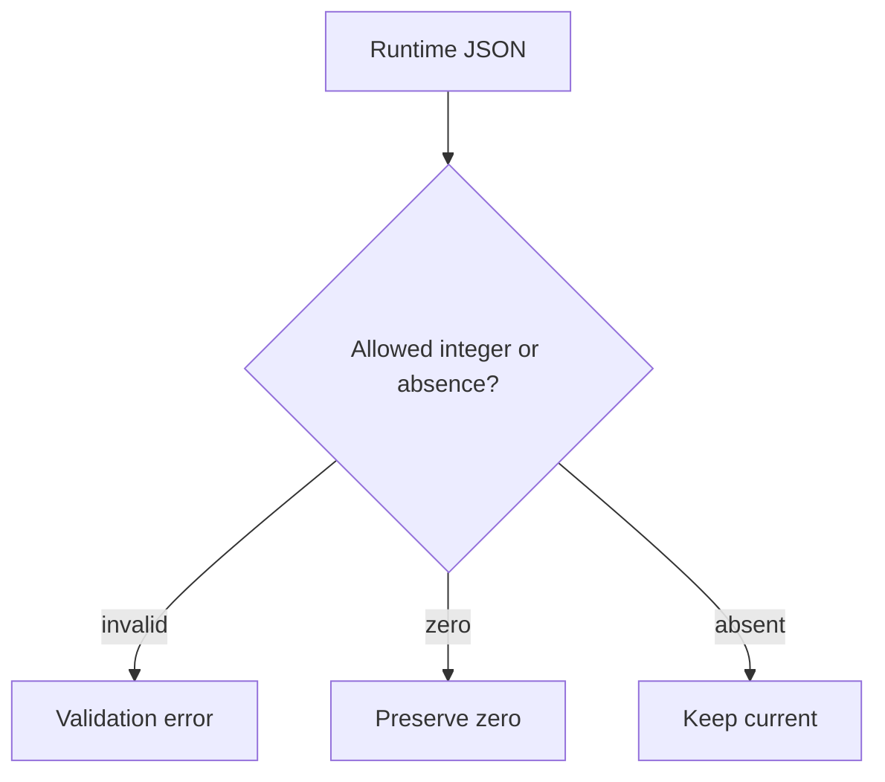

# Preserve zero when applying a quantity update

[Curriculum](../../../../README.md) · [Find defects and evaluate engineering evidence](../../README.md)

## Application and assignment

A shop user changes an item quantity from five to zero. The application reports success but keeps five. In this exercise, zero is an intentional value, while an omitted field means “leave the quantity unchanged”. JavaScript truthiness does not express that distinction.

Repair the small TypeScript function below and state the runtime validation policy for null, strings, negative values, and fractions. This is a focused code exercise with an inline baseline. The linked importer is a separate, larger package investigation.

## Contract and starting evidence

> “A customer changes quantity from five to zero, presses Save, and sees five again.
> The UI and API both say success. Reproduce this before changing the fallback.”

Constructed 30-minute debugging session. Prerequisite: [explicit identity](../../../../01-code/02-data-structures-algorithms/lessons/01-maps.md).
This is a small build brief; [the importer](../importer/README.md) supplies the unfamiliar
multi-module assessment. This four-line example is not a substitute for it.

| Contract | Expected behavior |
|---|---|
| Input | Optional integer quantity, current=5 |
| Example | `{quantity:0}` → 0; `{}` → 5 |
| Failure | Negative, fractional and nonnumeric values rejected at the runtime boundary |
| Clarify | Does null mean omitted or invalid? Decide before repair |
| Excluded | Concurrent database writes |

```typescript
function applyQuantity(input: { quantity?: number }, current: number) {
  return input.quantity || current;
}
```



Write a zero regression, test missing/null separately, inspect caller JSON validation,
then change the rule conflating absence with falsiness. `??` treats undefined and null
as absence; it does not validate negative numbers, fractions or strings.



**Follow-up:** caller sends `"0"`. Expected: TypeScript annotations do not validate
HTTP JSON. **Follow-up:** two writers read v4. Expected: a client comparison cannot
serialize writes; use [the editor's conditional store operation](../../../03-frontend/labs/bookmark-editor/README.md).

Senior evidence: reproduction, minimal cause, regression and adjacent boundary checks.
Lead scope: decide compatibility before changing null semantics. Runtime/space cost is
O(1); correctness depends on the declared input meaning.
