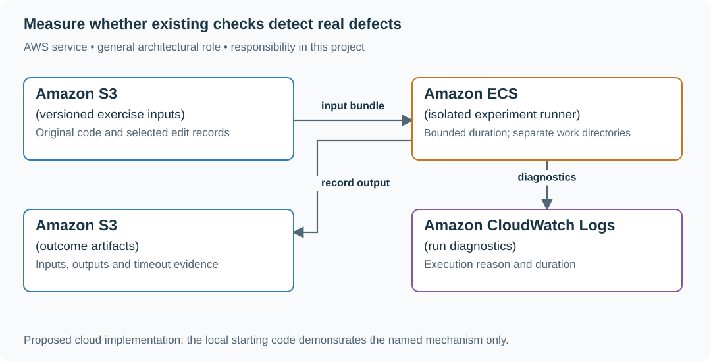

# 1. The suite that can fail

## What you are building

> Review the evidence protecting a multi-user bookmark service. A green suite exists, but nobody knows whether it notices a missing owner filter or an off-by-one expiry check. Produce a short sensitivity report using the existing exercise code; this project does not add a publishing gate to this guide.

**Working contract:** Distinguish meaningful behavior changes from equivalent edits. Report which selected defects are detected, which survive and which time out. A percentage over a small selected set is evidence about that set, not proof of all correctness.

## Workload and the decisions it changes

These are constructed exercise assumptions. The large workload is a design target; the local demonstration does not establish that throughput. Use the [estimation constants](../../../01-code/01-problem-solving/estimation-constants.md) to check units before choosing capacity.

| Input or objective | Calculation / consequence |
|---|---|
| Four proposed edits | Missing owner filter and < changed to <= are semantic candidates; a comment change and a safe local rename are excluded. |
| Two relevant semantic candidates | One detected and one surviving means 50% of this selected set, not 25% of all four textual edits. |
| Ten-second execution deadline assumption | A hang is recorded separately from an assertion failure and a normal pass. |

## Start with one working boundary

Run from the repository root with Python 3.12+:

```bash
python3 examples/architecture-starts/01_the_suite_that_can_fail.py
```

[Open the starting code](../../../../examples/architecture-starts/01_the_suite_that_can_fail.py). This is a runnable demonstration of the critical state boundary. The API, UI, cloud adapters and operating behavior below are the application you build around it.

| Record / module | Key or interface | Responsibility |
|---|---|---|
| mutation_record | edit_id,changed_behavior,scope | Why the edit is relevant to the contract. |
| observation | edit_id,input,outcome,elapsed | Reproducible evidence from an isolated run. |
| review_report | detected,survived,timed_out,excluded | Honest denominator and remaining uncertainty. |

## AWS implementation



The cloud version is a bounded experiment runner with durable evidence. S3 or ECS does not decide whether a mutation is meaningful; that judgment comes from the stated behavior contract.

## Build it in this order

### 1. Choose the protected behavior

Open an existing ownership/expiry implementation and write its exact examples: Ben must not see Ana’s record; a record is expired at now >= expires_at. Keep the original program and environment fixed while changing one behavior at a time.

### 2. Classify candidate edits

Remove the owner predicate and change the expiry comparison independently. Exclude comments and equivalent renames from the semantic denominator. Inspect whether the edit is reachable and actually changes the contract before calling it a surviving defect.

### 3. Capture isolated outcomes

Run each selected version in a disposable directory with a fixed input and deadline. Record normal failure, timeout, execution error and survival separately. Keep the smallest input that exposes a missed behavior; do not manufacture a failure when the current evidence already catches the defect.

### 4. Write the engineering conclusion

Name the uncovered boundary and the evidence needed to protect it. Report sampled scope and limitations. Keep this as a learning exercise and review artifact; no CI requirement or automatic website-publishing check is introduced.

## Infrastructure configuration

| Resource or boundary | Initial configuration and reason |
|---|---|
| Local first | Use separate temporary directories and fixed inputs; cloud execution is optional for larger experiment batches. |
| Runner | No production credentials; CPU/memory/wall limits and cleanup after every run. |
| Artifacts | Store commit identity and selected edits with outcomes; exclude secrets and unrelated user data. |

Use one disposable AWS environment for the cloud exercise. Put the named resources in `infra/template.yaml` or your existing IaC tool, pass resource IDs through configuration, and scope each runtime role to its own tables, buckets and queues. The diagram is a design to implement; it is not a claim that these resources have been deployed. Record the commands you used to deploy and remove the exercise resources.

## Observe the result

| Action | Expected visible result |
|---|---|
| Run the starting program | The report uses two semantic candidates and names the surviving expiry boundary. |
| Use a comment-only edit | It is excluded rather than counted as a missed defect. |
| Make an edit loop forever | The outcome is timeout with its input retained, not an invented pass. |

## The next design decision

All twenty selected defects are detected. Report that result and the sampled risks honestly; expand coverage only for a concrete uncovered behavior, not to meet a quota of failures.

<details>
<summary>Further constraints from the original project</summary>

## Follow-up 1 · A mutant hangs

**Changed requirement:** One mutant creates an infinite loop. Does that count as a successful detection? Predict which boundary must change before opening the design.

<details>
<summary>Expected reasoning and changed diagram</summary>

Record timeout separately and impose a runner deadline. If termination is part of the contract it is a detected harm, but it is not a passing assertion; retain the smallest hanging input.

</details>

## Follow-up 2 · All relevant mutants are caught

**Changed requirement:** The suite kills all twenty selected semantic mutants. Must you invent a current regression? State what evidence would make you reject your first design.

<details>
<summary>Expected reasoning and changed diagram</summary>

No. Preserve the passing regressions and report the sampled scope. Add new challenge cases based on risks, not a quota of failures; a seeded defect demonstrates sensitivity even after its repair.

</details>

</details>
