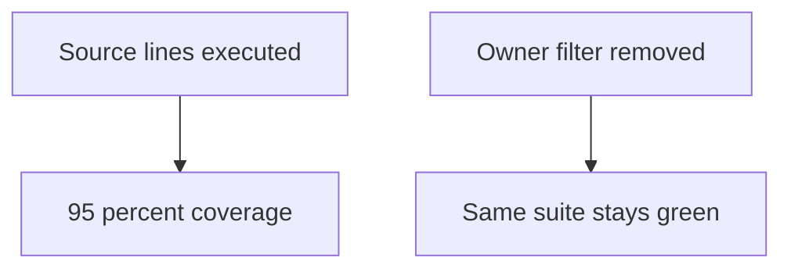
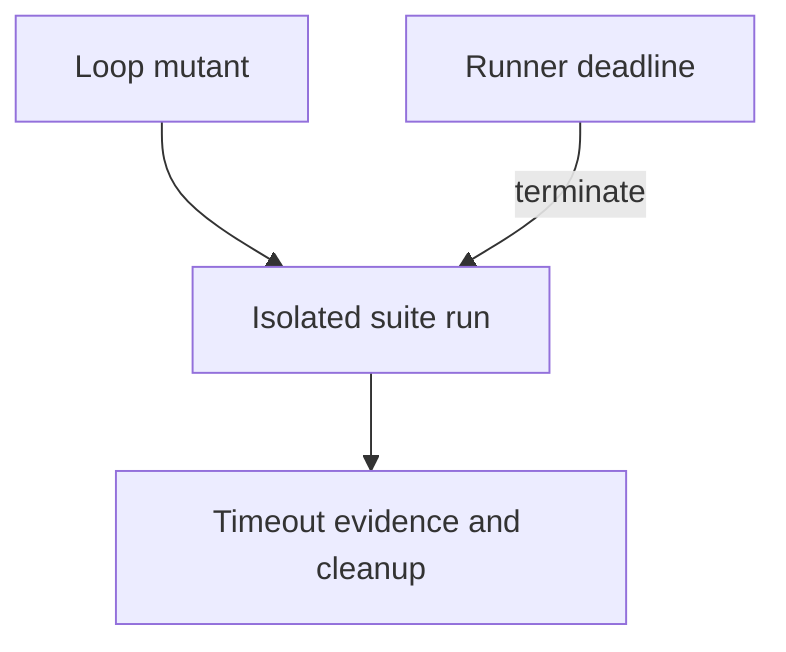
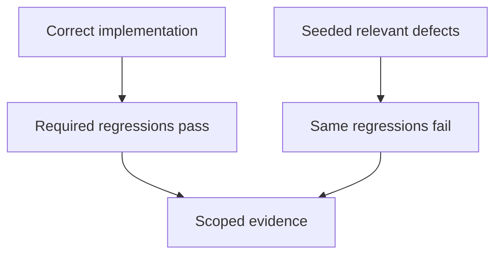

# 1. The suite that can fail

[Curriculum](../../../README.md) · [Testing, debugging, and code review](../README.md) · [Project index](../../../../indexes/projects.md)

## The reviewer's brief

> Your bookmark suite reports 95% line coverage, but nobody knows whether removing an owner filter would be caught. Build a reversible mutation experiment. Which changed behaviors deserve a failing test?

This is a **constructed practice brief**, not an attributed company question.
Prerequisites: [the section](../testing-strategy.md). This page is a build brief; it does not ship a runnable application. The original build and prompt sequence below defines the implementation checkpoints.

| Case | Exact input or workload | Expected outcome |
|---|---|---|
| Small example | Four isolated mutants: remove owner filter, turn `<` into `<=`, change a comment, and rename a local variable. | Evaluate two semantic mutants; exclude the two behavior-equivalent edits; list surviving semantic mutants with reproduction inputs. |
| Boundary / failure | The first mutation remains applied while the second runs. | Stop because later results are contaminated; restore or discard the isolated worktree. |
| Scope | Twenty selected mutations are a sample, not a completeness or mastery measure. | Explain any additional assumption before implementing it. |

<!-- project-expectation:start -->

## What you are expected to hand over

**The finished artifact:** A script that takes your P1 repository, makes one small semantic change (flip a comparison, drop a line, invert a boolean, off-by-one a slice), runs the suite, records whether it went red, and reverts. Twenty mutations, one report.

Treat that sentence as a review contract, not an inspiration. A reviewable
submission contains all of the following:

- the narrow working slice or decision artifact described above, reproducible
  from a clean checkout with assumptions stated;
- captured proof of the normal flow **and** the boundary/failure row above;
- tests, probes, or metrics that can go red when the important guarantee breaks;
- a short decision record naming ownership, excluded scope, and the first
  operational limit; and
- a changed contract, diagram, and new evidence for each follow-up—not only a
  paragraph claiming the original design still works.

### How the review conversation gets harder

| Review gate | The interviewer changes | Expected response |
|---|---|---|
| Baseline | Run the small example from the table above. | Demonstrate the observable outcome end to end and identify which boundary owns it. |
| Failure | Reproduce the boundary/failure row above. | Show the failure before the fix, then prove the protected behavior without hiding the error. |
| Senior · A mutant hangs | One mutant creates an infinite loop. Does that count as a successful detection? Predict which boundary must change before opening the design. | Record timeout separately and impose a runner deadline. If termination is part of the contract it is a detected harm, but it is not a passing assertion; retain the smallest hanging input. |
| Lead · All relevant mutants are caught | The suite kills all twenty selected semantic mutants. Must you invent a current regression? State what evidence would make you reject your first design. | No. Preserve the passing regressions and report the sampled scope. Add new challenge cases based on risks, not a quota of failures; a seeded defect demonstrates sensitivity even after its repair. |
| Evidence | A reviewer asks, “How do you know?” | Build in three stops: reproduce the small case and baseline failure; implement the protected boundary; then replay both changed requirements with captured outputs. |
| Handoff | The author is unavailable and the environment is new. | Another engineer can run, observe, break, and recover the artifact from the repository evidence. |

Before implementation, say the baseline invariant, the owner of each piece of
state, and what the user sees when the named dependency or assumption fails. That
five-minute explanation is part of the project: if it is vague, the build is not
ready to begin.

<!-- project-expectation:end -->

Before looking at the guidance, state the invariant in one sentence and trace the example. In interview practice, implement or sketch independently, then reveal the reasoning. During AI-assisted practice, use the prompts below and verify each checkpoint before the next request.

## Baseline and the failure to explain



Execution coverage says a line ran; it does not say the assertion distinguishes correct behavior from a harmful alternative.

<details>
<summary>Reveal the approach and decisions</summary>

Classify relevant semantic mutants, run each against the same clean base, and distinguish killed, survived, invalid, and timed-out mutants. The invariant is isolation of each experiment. Read survivors to eliminate equivalent behavior before calling them gaps.

</details>

## Follow-up 1 · A mutant hangs

**Changed requirement:** One mutant creates an infinite loop. Does that count as a successful detection? Predict which boundary must change before opening the design.

<details>
<summary>Expected reasoning and changed diagram</summary>

Record timeout separately and impose a runner deadline. If termination is part of the contract it is a detected harm, but it is not a passing assertion; retain the smallest hanging input.



</details>

## Follow-up 2 · All relevant mutants are caught

**Changed requirement:** The suite kills all twenty selected semantic mutants. Must you invent a current regression? State what evidence would make you reject your first design.

<details>
<summary>Expected reasoning and changed diagram</summary>

No. Preserve the passing regressions and report the sampled scope. Add new challenge cases based on risks, not a quota of failures; a seeded defect demonstrates sensitivity even after its repair.



</details>

## Evidence to bring to review

Build in three stops: reproduce the small case and baseline failure; implement the protected boundary; then replay both changed requirements with captured outputs. Record commands, fixtures, and observed results in your implementation README. A diagram is a prediction until those checks run.

**Senior expectation:** Demonstrate mutant isolation and explain one survivor. **Additional lead scope:** Manage runtime budgets and avoid using mutation scores as a universal ranking. Completion demonstrates practice evidence; it does not establish interview readiness or multi-team delivery experience.

## Build and prompt sequence

*You end up with a number: what share of deliberately planted bugs your existing
test suite catches.*

**Build**

A script that takes your P1 repository, makes one small semantic change (flip a
comparison, drop a line, invert a boolean, off-by-one a slice), runs the suite,
records whether it went red, and reverts. Twenty mutations, one report.

**The thought process**

The decision that has to come first is **which mutations count**. Change a log
message and no test should fail — that is not a gap. Change a rounding rule and
something must. So before writing any code you are writing a list of *semantic*
edits, and that list is a statement about what your software is for.

Second decision: what does a score mean? 100% caught on twenty hand-picked
mutations establishes sensitivity to that sample; it proves neither broad
coverage nor that the sample was necessarily too easy. The
honest output is the *list of survivors*, not the percentage.

**How to organise the prompts**

```
Read this repository. List 20 small SEMANTIC changes I could make to the
source that SHOULD make a test fail. Exclude anything cosmetic: logs,
comments, formatting, variable names.

For each, say which behaviour it breaks. Do not write code yet.
```

That list is the project. Argue with it before it becomes a script.

```
Now write a runner that, for each mutation: applies it, runs the suite,
records pass/fail, reverts, and confirms the tree is clean again before
the next one.

If the tree is not clean after a revert, stop the whole run and tell me.
```

The last sentence is the one that matters. A mutation runner that leaves
edits behind will poison every later result, and the failure looks like a
suddenly worse score.

```
Report only the SURVIVORS: mutations where the suite stayed green.
For each, name the test that should have caught it.
```

**On AWS**

Run it in **GitHub Actions** first when the repository already uses it. Move to **AWS CodeBuild** only when you need something
Actions cannot give you: a machine with more memory than the hosted runner, or
a build that must sit inside your VPC to reach a private database. Estimate the chosen CodeBuild machine and duration: twenty mutations mean
roughly twenty suite executions plus setup, not a known fixed price.

What you do **not** want is EC2. A permanently-running instance to do
occasional work is the most common early AWS mistake, and it costs money while
you sleep.

**What productionising it means**

Nightly, not on every push — twenty suite runs is too slow for a pull request.
Store the survivor list somewhere durable (an S3 object keyed by commit is
enough) so the trend is visible, and alert only when the list *grows*. A
mutation score that silently drifts down is the exact thing you built this to
notice.

**The learning**

Coverage tells you which lines ran. This tells you which lines are *defended*.
After one run you will never read a coverage percentage the same way, because
you will have seen a fully-covered function survive four mutations untouched.

**How you would know it is wrong**

- Plant a mutation you are certain is caught. If the runner reports it as a survivor, the runner is broken, not the suite.
- Check the tree is clean after the run: `git status` must be empty.
- Run it twice and compare. Different results on identical input means something is not being reverted.
- Read three survivors by hand and confirm they are real gaps rather than mutations that changed nothing.

---

[Back to the ordered project index](../projects.md)
