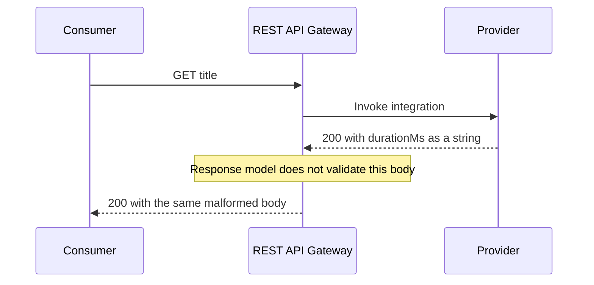
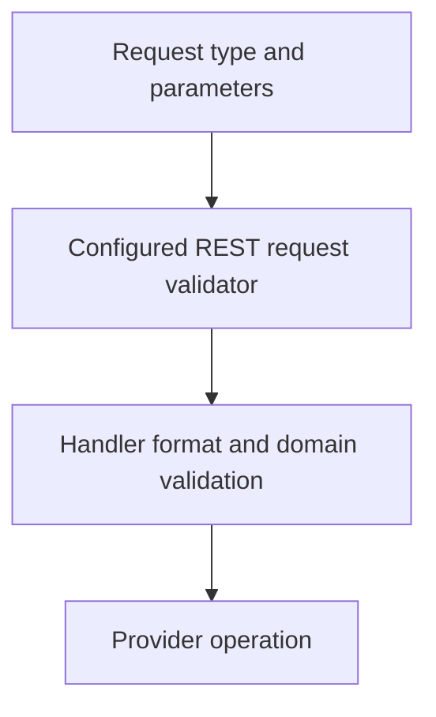
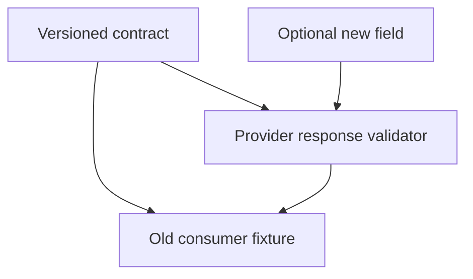

# 2. The contract nobody breaks by accident

[Curriculum](../../../README.md) · [Testing, debugging, and code review](../README.md) · [Project index](../../../../indexes/projects.md)

## The reviewer's brief

> The title service returns HTTP 200 with `durationMs:"12"`, although its contract requires a number. The API gateway has a response model. Where is the malformed payload actually rejected?

This is a **constructed practice brief**, not an attributed company question.
Prerequisites: [the section](../testing-strategy.md). This page is a build brief; it does not ship a runnable application. The original build and prompt sequence below defines the implementation checkpoints.

| Case | Exact input or workload | Expected outcome |
|---|---|---|
| Small example | Provider returns `{title:"Guide",durationMs:12}` and then `{title:"Guide",durationMs:"12"}`. | First response passes the provider contract test; second fails the actual runtime/test validator. |
| Boundary / failure | Provider changes milliseconds to seconds but retains the numeric type. | A semantic fixture catches the unit change; schema type validation alone does not. |
| Scope | REST API Gateway basic request validation; do not assume the same feature in HTTP APIs. | Explain any additional assumption before implementing it. |

## See the first reviewable result

**First slice:** Record a provider response `{"title":"Guide","durationMs":12}`. Change `durationMs` to string `"12"` and watch the provider contract fail. Then change the meaning from milliseconds to seconds while keeping a number: **show** a semantic fixture that catches what a schema alone cannot. Run both caller and provider checks in CI.

<!-- project-expectation:start -->

## What you are expected to hand over

**The finished artifact:** Split P1's link-fetching into a second service with an HTTP interface. Then write the contract: a machine-readable description of what the caller sends and what the callee promises, and a test on each side that checks itself against that same file.

Bring a runnable slice or decision artifact, its normal output, and a captured
failure from the examples above. Include one check that turns red when the guarantee
breaks, the state owner, and the first operational limit. For each follow-up,
change the diagram **and** the evidence before claiming the design still works.

### How the review conversation gets harder

| Review gate | The interviewer changes | Expected response |
|---|---|---|
| Baseline | Run the small example from the cases above. | Demonstrate the observable outcome end to end and identify which boundary owns it. |
| Failure | Reproduce the boundary/failure case above. | Show the failure before the fix, then prove the protected behavior without hiding the error. |
| Senior · The request content type differs | A caller sends text/plain and a malformed numeric query parameter. Which gateway checks apply? Predict which boundary must change before opening the design. | REST basic validation checks required parameter presence/nonblank values, not numeric formats. Body validation requires a matching model or a deliberate $default/reject policy. Validate domain types in the handler. |
| Lead · The provider evolves | Add an optional field while an old consumer remains deployed. What should fail? State what evidence would make you reject your first design. | The compatible addition should pass agreed consumer tolerance checks. Removing a required field or changing its meaning must fail. Include strict-consumer behavior explicitly instead of assuming all additions are harmless. |
| Evidence | A reviewer asks, “How do you know?” | Build in three stops: reproduce the small case and baseline failure; implement the protected boundary; then replay both changed requirements with captured outputs. |
| Handoff | The author is unavailable and the environment is new. | Another engineer can run, observe, break, and recover the artifact from the repository evidence. |

Before implementation, say the baseline invariant, the owner of each piece of
state, and what the user sees when the named dependency or assumption fails. That
five-minute explanation is part of the project: if it is vague, the build is not
ready to begin.

<!-- project-expectation:end -->

Before looking at the guidance, state the invariant in one sentence and trace the example. In interview practice, implement or sketch independently, then reveal the reasoning. During AI-assisted practice, use the prompts below and verify each checkpoint before the next request.

## Baseline and the failure to explain



A model describing response shape is not automatic enforcement of the backend response body. Put the validator where the outgoing payload is constructed or verify it in provider tests.

<details>
<summary>Reveal the approach and decisions</summary>

Write one versioned wire contract and separate semantic examples. Both consumer and provider test their own code against it. The invariant is that all required shapes and meanings remain compatible; avoid duplicated literal schemas that silently drift.

</details>

## Follow-up 1 · The request content type differs

**Changed requirement:** A caller sends `text/plain` and a malformed numeric query parameter. Which gateway checks apply? Predict which boundary must change before opening the design.

<details>
<summary>Expected reasoning and changed diagram</summary>

REST basic validation checks required parameter presence/nonblank values, not numeric formats. Body validation requires a matching model or a deliberate `$default`/reject policy. Validate domain types in the handler.



</details>

## Follow-up 2 · The provider evolves

**Changed requirement:** Add an optional field while an old consumer remains deployed. What should fail? State what evidence would make you reject your first design.

<details>
<summary>Expected reasoning and changed diagram</summary>

The compatible addition should pass agreed consumer tolerance checks. Removing a required field or changing its meaning must fail. Include strict-consumer behavior explicitly instead of assuming all additions are harmless.



</details>

## Evidence to bring to review

Build in three stops: reproduce the small case and baseline failure; implement the protected boundary; then replay both changed requirements with captured outputs. Record commands, fixtures, and observed results in your implementation README. A diagram is a prediction until those checks run.

**Senior expectation:** Catch malformed 200 payloads and unit changes locally. **Additional lead scope:** Own version compatibility and enforcement at each deployed boundary. Completion demonstrates practice evidence; it does not establish interview readiness or multi-team delivery experience.

## Supplied mechanism practice

- [Executable request/response boundary lab](../../01-backend/labs/api-contract/README.md) — includes its own run command, fixtures and validation limits.

These exercises verify specific boundaries; completing their reference tests does not implement or assess the full project.

## Build and prompt sequence

*You end up able to change one service and find out in seconds whether you broke
another one, without running both.*

**Build**

Split P1's link-fetching into a second service with an HTTP interface. Then
write the contract: a machine-readable description of what the caller sends and
what the callee promises, and a test on **each side** that checks itself against
that same file.

**The thought process**

The first decision is **who owns the contract**. If the provider owns it, the
consumer discovers breakage after the fact. If the consumer owns it, the
provider cannot change anything. Real answer: the contract is a third artefact
that both sides test against and neither owns alone.

The second decision is what belongs in it. Field names and types, obviously.
But the expensive breakages are semantic: a field that used to always be
present becoming optional, a timestamp changing zone, an id switching from
numeric to opaque. Those are contract terms too, and they are the ones a schema
alone will not catch.

**How to organise the prompts**

```
Here are the two sides of this call. Write the contract as a schema plus
a written list of promises that a schema cannot express — optionality,
units, ordering, idempotency, what "empty" means.

Do not write tests yet.
```

```
Now write two tests that read that same contract file: one that checks
the provider's real response satisfies it, and one that checks the
consumer's code only relies on what it promises.

Neither test may contain a literal copy of the schema.
```

That last constraint is the whole design. Two tests with their own copies of the
truth drift apart, and you will trust them right up until they disagree.

```
Break the contract on purpose in three ways: rename a field, make a
required field optional, change a unit. Show me which test catches
which, and tell me plainly if any of the three is caught by neither.
```

**On AWS**

With **Lambda** behind **REST API Gateway**, basic validation can reject a
request body against the configured content-type model and check required
parameter presence. It does not validate parameter types/formats, and an
unmatched content type needs an explicit reject/default-model policy. Do not
assume the same configuration works for HTTP APIs.

A method response model describes the response; it does not automatically
validate backend response bodies. Validate the actual provider output in code
when needed and run a provider contract test that rejects the malformed HTTP 200
fixture above. Checked 2026-09-22 against [REST request validation](https://docs.aws.amazon.com/apigateway/latest/developerguide/api-gateway-method-request-validation.html)
and [method response models](https://docs.aws.amazon.com/apigateway/latest/developerguide/api-gateway-method-settings-method-response.html).

Keep the contract file in the repository, not only in the API Gateway
configuration. Configuration that exists nowhere in git is configuration nobody
can review. If you want it shared across repositories, an S3 object with
versioning on is enough; **AWS CodeArtifact** is the heavier answer and only
earns its place once several teams consume it.

**What productionising it means**

The contract test runs in both services' pipelines, and the provider's pipeline
fails if it breaks the contract even when its own tests pass. That is the point
of the whole exercise: making a breakage loud on the side that caused it, not
on the side that suffers it.

**The learning**

Two services that pass all their own tests can still be broken together, and
the thing that catches it is not a bigger test suite — it is a shared artefact
that neither side is allowed to quietly redefine.

**How you would know it is wrong**

- Change a field name in the provider only. The provider's pipeline must go red.
- Delete the contract file. Both tests must fail loudly, not pass vacuously.
- Search both tests for a hard-coded field name that should have come from the contract.
- Make a *compatible* change (add an optional field). Nothing should fail. A contract test that blocks safe changes gets deleted within a month.

---

[Back to the ordered project index](../projects.md)
