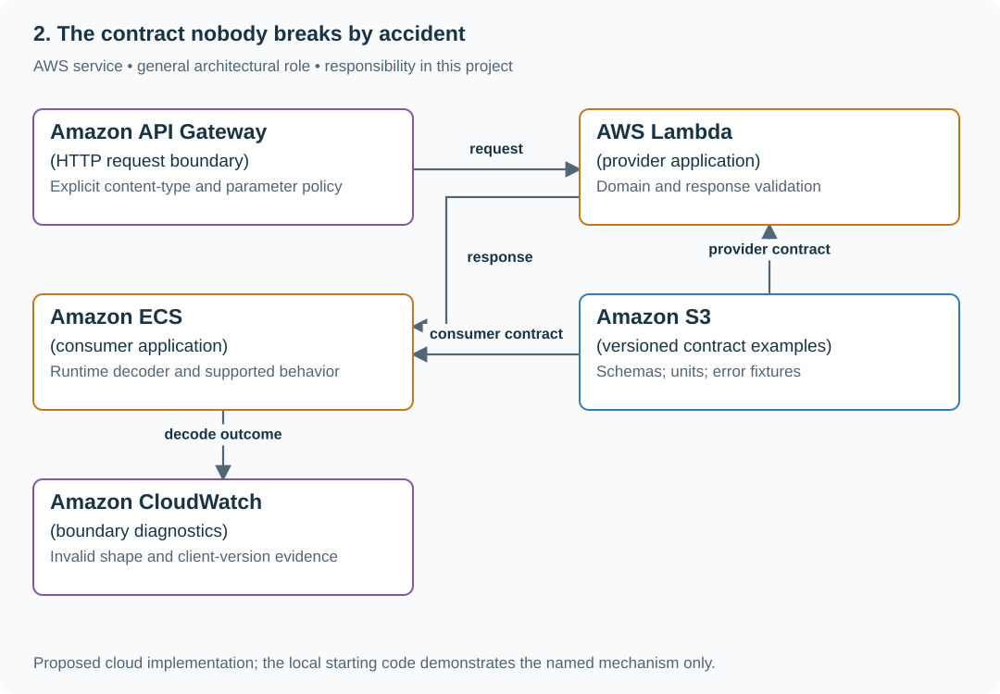

# Protect API response types, units and compatibility

## Application background

Two applications share a preview API returning a title and an elapsed duration. They can deploy independently, so a compatible JSON shape must also retain agreed field meanings and units.

This is a fictional engineering scenario. The workload figures later in the page are exercise assumptions, not measured production traffic.

## Your assignment

**Deliver:** A producer/consumer contract and a comparison of representative responses, including string-versus-number and milliseconds-versus-seconds changes.

Protect a preview API used by two separately deployed applications. It returns title and durationMs; a provider refactor changes durationMs from 12 to "12", and another changes the unit to seconds without changing the JSON type.

**Required behavior:** The provider and consumers agree on field presence, runtime types, units and error shapes. Static language declarations do not validate bytes received over HTTP. Compatibility is demonstrated with the supported old consumer behavior.

The required first milestone is a working local implementation of the behavior above. The numbered implementation steps define the scope; the cloud architecture is a later extension, not something the starter has already provisioned.

## Get the code and run the supplied example

The code is in the public [junior-to-staff repository](https://github.com/Soulful-Iris/junior-to-staff). Install Git and Python 3.12+. No AWS account or Python packages are required for this first run. If you already have a checkout, use it and skip cloning.

```bash
git clone https://github.com/Soulful-Iris/junior-to-staff.git
cd junior-to-staff
python3 examples/architecture-starts/02_the_contract_nobody_breaks_by_accident.py
```

**Supplied file:** [`examples/architecture-starts/02_the_contract_nobody_breaks_by_accident.py`](https://github.com/Soulful-Iris/junior-to-staff/blob/main/examples/architecture-starts/02_the_contract_nobody_breaks_by_accident.py). You can also [read or download the source here](../../../../examples/architecture-starts/02_the_contract_nobody_breaks_by_accident.py).

This program is a **mechanism demonstration**: it runs the small scenario in one process and prints the result. It is not an HTTP service, a complete application, or an AWS deployment. A successful run demonstrates this mechanism only; it does not establish the workload or failure guarantees of the application you will build.

**Example output from the supplied run:**

Generated IDs and timestamps may differ; compare the state transitions and outcomes.

```text
{'title': 'Guide', 'durationMs': 12} shape accepted; unit meaning still requires the contract
{'title': 'Guide', 'durationMs': '12'} invalid durationMs
```

### Set up your implementation workspace

Create `work/02-the-contract-nobody-breaks-by-accident/` in your checkout (or use a separate repository). Copy the supplied mechanism into that directory as `mechanism.py`, then extract its state transitions into functions you can call from your implementation. The record and module names below describe what you must implement; they are not a promise that files with those names already exist. Keep a `README.md` beside your implementation with its exact run commands and observed results.

## Local components and state to implement

This table names the records, interfaces or decision inputs for your deliverable. Unless a name is explicitly linked to supplied source above, it is something you create. Implement the local state transitions first, then connect the HTTP, storage or worker boundaries required by the steps.

| Record / module | Key or interface | Responsibility |
|---|---|---|
| response_schema | title:string,durationMs:number >= 0 | Runtime validation plus documented units. |
| consumer_examples | supported client version and input/output | Actual decoding and usage behavior. |
| error_contract | status,code,message,request_id | Stable failure interpretation across versions. |

## Implement the assignment

### 1. Write the wire contract

Use the existing request/response boundary lab as the starting application. Document exact JSON, content type, required fields, units and error responses. Keep successful and failed examples for each supported consumer.

### 2. Validate the runtime boundary

Parse and validate received data before domain logic uses it. Check booleans separately when the language treats them as numbers. Gateway request validation, where configured, does not automatically validate provider responses or semantic units.

### 3. Exercise old and new consumers directly

Send the numeric response and then the string response through the actual decoding path. Add an optional field and observe whether each supported client tolerates it; do not assume every decoder ignores unknown fields.

### 4. Evolve with an explicit adapter

Introduce a new field/version for changed units or meaning, preserve the old representation during the support window, and derive both from one canonical value. Record owner and retirement evidence without coupling the guide’s deployment to new checks.

## Demonstrate the completed local result

| Action | Expected visible result |
|---|---|
| Run the starting program | Numeric 12 is accepted; string "12" is rejected. |
| Change milliseconds to seconds without renaming | The semantic example reveals the incompatible meaning. |
| Send an unexpected content type | The API follows the documented reject/parse policy instead of silently bypassing validation. |

**Handoff:** In your implementation README, include the start command, one successful operation, the failure case above and the resulting stored state or decision. State which dependencies are simulated. Someone with a fresh checkout should be able to reproduce this without your chat history.

## Workload assumptions and capacity decisions

These are constructed exercise assumptions. The stated workload is a design target; the local demonstration does not establish that throughput. Use the [estimation constants](../../../01-code/01-problem-solving/estimation-constants.md) to check units before choosing capacity.

| Input or objective | Calculation / consequence |
|---|---|
| Two consumers released independently | A provider rollout cannot assume simultaneous consumer upgrades. |
| 12 milliseconds versus "12" | The latter violates the numeric runtime contract even if a permissive caller coerces it. |
| 0.012 seconds in durationMs | Type-valid but semantically wrong; units belong in the contract and examples. |

## Map the local implementation to AWS

**Deployment status: local only.** Running the supplied command creates no AWS resources and configures no cloud connections. The diagram is a proposed deployment of the completed application. Each box needs either a deployed runtime, a provisioned service or an explicitly external dependency.

Read the diagram by following the arrows from the entry point: application code accepts the request or event, the state owner commits it, and any worker produces the later result. The table ties those roles to code and adapter work. Multiple boxes do not imply multiple Python files already exist.



The gateway handles a configured request boundary. Provider response validation and consumer decoding are separate application responsibilities.

| Local responsibility | Cloud destination and role | Implementation still required |
|---|---|---|
| Local HTTP boundary or the endpoint you will add | Amazon API Gateway: HTTP request boundary | Create routes and an integration; translate requests and responses and configure identity validation. |
| Python operation or worker function | AWS Lambda: provider application | Write a Lambda event adapter, package its dependencies and give its role only the required resource actions. |
| Application or worker process | Amazon ECS: consumer application | Build a container and task definition; supply configuration, task roles and graceful shutdown behavior. |
| Local file, object fixture or exported payload | Amazon S3: versioned contract examples | Implement upload/download and metadata adapters, scoped access, object naming, retention and incomplete-upload cleanup. |
| Local counters, timestamps and diagnostic output | Amazon CloudWatch: boundary diagnostics | Emit bounded metrics and logs, build the named operational view and configure retention and access. |

### Provision resources, then connect the application

| Resource or boundary | Initial configuration and reason |
|---|---|
| Gateway | Configure body models/content-type handling deliberately; validate domain formats in the handler. |
| Versioning | Store schemas and supported consumer examples with the implementation commit. |
| Diagnostics | Log safe schema error paths, not entire sensitive request/response bodies. |

Use one disposable AWS environment for the cloud exercise. Put the named resources in `infra/template.yaml` or your existing IaC tool, pass resource IDs through configuration, and scope each runtime role to its own tables, buckets and queues. The diagram is a design to implement; it is not a claim that these resources have been deployed. Record the commands you used to deploy and remove the exercise resources.

For concrete provisioning commands, configuration wiring and cleanup, use the [AWS foundation guide](../../../../examples/architecture-starts/infra/README.md). It includes a deployable table/queue/object-storage foundation and explains which application and service adapters you still implement.

A provisioned queue or table does not make the local program use it. Configure resource IDs in the deployed runtime, replace the local adapter, and replay the same successful and failing operation against that runtime. Record the deployed commit and observable result, then remove the disposable resources using your infrastructure tool.

## Extend the design after the baseline works


Add a strict consumer that rejects unknown fields. Decide whether an additive response change requires a version for that supported client, and document the evidence behind the decision.

<details>
<summary>Additional design reasoning and requirement changes</summary>

## Follow-up 1 · The request content type differs

**Changed requirement:** A caller sends `text/plain` and a malformed numeric query parameter. Which gateway checks apply? Predict which boundary must change before opening the design.

<details>
<summary>Expected reasoning and changed diagram</summary>

REST basic validation checks required parameter presence/nonblank values, not numeric formats. Body validation requires a matching model or a deliberate `$default`/reject policy. Validate domain types in the handler.

</details>

## Follow-up 2 · The provider evolves

**Changed requirement:** Add an optional field while an old consumer remains deployed. What should fail? State what evidence would make you reject your first design.

<details>
<summary>Expected reasoning and changed diagram</summary>

The compatible addition should pass agreed consumer tolerance checks. Removing a required field or changing its meaning must fail. Include strict-consumer behavior explicitly instead of assuming all additions are harmless.

</details>

## Supplied mechanism practice

- [Executable request/response boundary lab](../../01-backend/labs/api-contract/README.md) — includes its own run command, fixtures and validation limits.

These exercises verify specific boundaries; completing their reference tests does not implement or assess the full project.

</details>
