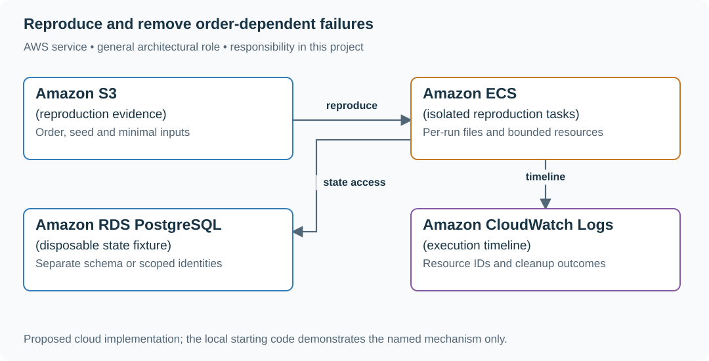

# 3. The flake hunter

## What you are building

> Diagnose an intermittent failure in a shared-store exercise. A case that expects an empty store passes alone but fails after another case creates an item. Rerunning until green hides the dependency rather than explaining it.

**Working contract:** Produce a minimal deterministic reproduction and a causal explanation. Distinguish shared state, timing, external dependency and resource collision. A retry is evidence of variability, not proof of repair.

## Workload and the decisions it changes

These are constructed exercise assumptions. The stated workload is a design target; the local demonstration does not establish that throughput. Use the [estimation constants](../../../01-code/01-problem-solving/estimation-constants.md) to check units before choosing capacity.

| Input or objective | Calculation / consequence |
|---|---|
| Two orderings: create→expect-empty and expect-empty→create | The same inputs produce different outcomes only when state leaks between cases. |
| Twenty parallel runs share one filename assumption | A resource collision can remain invisible in every sequential ordering. |
| One fixed seed and recorded order | Reproduction must retain both; a seed alone may not capture external scheduling. |

## Start with one working boundary

Run from the repository root with Python 3.12+:

```bash
python3 examples/architecture-starts/03_the_flake_hunter.py
```

[Open the starting code](../../../../examples/architecture-starts/03_the_flake_hunter.py). This is a runnable demonstration of the critical state boundary. The API, UI, cloud adapters and operating behavior below are the application you build around it.

| Record / module | Key or interface | Responsibility |
|---|---|---|
| reproduction | seed,order,environment,shared_resource | Minimal facts needed to reproduce. |
| fixture_lifecycle | allocate,reset,cleanup | Explicit ownership of state, files, ports and clocks. |
| incident_note | symptom,cause,repair,evidence | Explains why the variability disappeared. |

## AWS implementation



Cloud isolation can help reproduce resource collisions, but the first diagnosis is local and deterministic. Infrastructure cannot compensate for a fixture that silently shares mutable state.

## Build it in this order

### 1. Reduce the failure

Preserve the failing order and remove unrelated cases until the two-operation dependency remains. Record the initial store, process reuse and cleanup behavior. Avoid adding sleeps; they change timing without establishing ownership.

### 2. Give state a clear lifecycle

Allocate a fresh store per independent case, unique temporary paths and explicit cleanup. If sharing is intentional, synchronize it and name the shared contract. Reset fake clocks and randomness as deliberately as database rows.

### 3. Force a suspected race

When only parallel execution fails, use a barrier to overlap the relevant operations and capture the shared filename/port/key. Replace accidental shared resources with unique identities or proper synchronization; a hundred lucky reruns are weaker than one controlled explanation.

### 4. Record the bounded repair

Compare the minimal reproduction before and after isolation. Keep an owner and expiry for any temporary quarantine and state the evidence gap. Do not turn a flaky rerun loop into a requirement for publishing this website.

## Infrastructure configuration

| Resource or boundary | Initial configuration and reason |
|---|---|
| Isolation | Unique run identity in files, schema names and object prefixes; never point the exercise at shared production data. |
| Timing | Injectable clock and explicit barriers for controlled schedules; avoid arbitrary sleep-based repairs. |
| Cleanup | Run even after failure and record cleanup errors separately from the original symptom. |

Use one disposable AWS environment for the cloud exercise. Put the named resources in `infra/template.yaml` or your existing IaC tool, pass resource IDs through configuration, and scope each runtime role to its own tables, buckets and queues. The diagram is a design to implement; it is not a claim that these resources have been deployed. Record the commands you used to deploy and remove the exercise resources.

For concrete provisioning commands, configuration wiring and cleanup, use the [AWS foundation guide](../../../../examples/architecture-starts/infra/README.md). It includes a deployable table/queue/object-storage foundation and explains which application and service adapters you still implement.

## Observe the result

| Action | Expected visible result |
|---|---|
| Run the starting program | Shared state makes one order fail; fresh stores make both independent. |
| Reuse one file in parallel | The forced overlap exposes the collision. |
| Remove arbitrary sleeps | The repaired ownership still explains the result. |

## The next design decision

The failure depends on a third-party API. Replace it with a controlled response timeline for diagnosis, then document which live integration behavior remains outside that local reproduction.

<details>
<summary>Further constraints from the original project</summary>

## Follow-up 1 · Parallel execution fails

**Changed requirement:** Sequential shuffled runs pass, but concurrent runs fail. What experiment comes next? Predict which boundary must change before opening the design.

<details>
<summary>Expected reasoning and changed diagram</summary>

Use a barrier to overlap two operations on a shared resource. Give files/ports unique test identities or synchronize intentional sharing; preserve the forced overlap as a regression.

</details>

## Follow-up 2 · The fix will take a week

**Changed requirement:** The flaky test blocks every merge while a repair is underway. How do you quarantine it honestly? State what evidence would make you reject your first design.

<details>
<summary>Expected reasoning and changed diagram</summary>

Remove it from the blocking gate only with an owner, expiry and visible nonblocking execution. Its passing reruns must not be treated as repair evidence; track the protected behavior’s temporary coverage gap.

</details>

</details>
