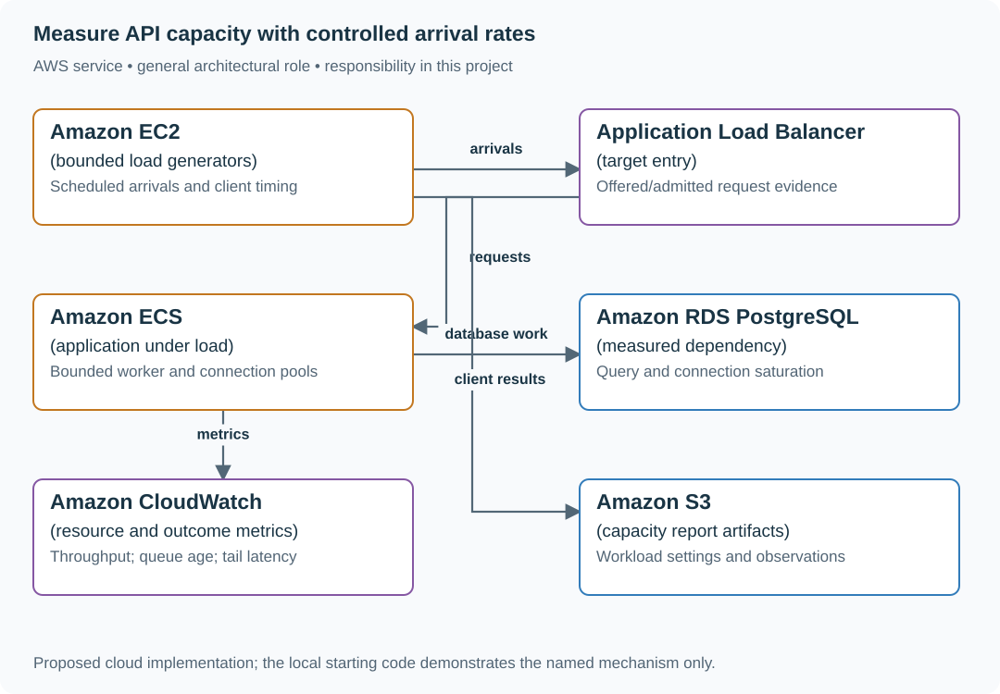

# 4. The load test that finds the real limit

## What you are building

> Measure the capacity of a bookmark API before a launch. Requests arrive at 120/s while the service completes 100/s. A closed-loop generator waits for responses and accidentally slows its own offered load, making the overloaded service appear healthy.

**Working contract:** Report offered, admitted, completed, rejected and queued work separately under a stated arrival model. Measure generator headroom and client-observed latency including waiting. This is a one-off capacity exercise, not an added deployment check.

## Workload and the decisions it changes

These are constructed exercise assumptions. The large workload is a design target; the local demonstration does not establish that throughput. Use the [estimation constants](../../../01-code/01-problem-solving/estimation-constants.md) to check units before choosing capacity.

| Input or objective | Calculation / consequence |
|---|---|
| Open-loop 120 arrivals/s; 100 completions/s; ten seconds | 1,200 arrivals, at most 1,000 completions and about 200 waiting absent shedding. |
| Closed-loop 100 users with one-second service | Offered rate adapts to response time; it does not maintain the same external arrival schedule. |
| Generator initially tops out at 80/s | Doubling generators may reveal that the earlier limit belonged to the client, not the service. |

## Start with one working boundary

Run from the repository root with Python 3.12+:

```bash
python3 examples/architecture-starts/04_the_load_test_that_finds_the_real_limit.py
```

[Open the starting code](../../../../examples/architecture-starts/04_the_load_test_that_finds_the_real_limit.py). This is a runnable demonstration of the critical state boundary. The API, UI, cloud adapters and operating behavior below are the application you build around it.

| Record / module | Key or interface | Responsibility |
|---|---|---|
| arrival_schedule | planned_at,request_id,tenant_class | Independent offered workload. |
| request_result | sent_at,finished_at,status | Client-visible latency and outcome. |
| capacity_report | offered,completed,backlog,p99,resource | Reproducible workload and constraining dependency. |

## AWS implementation



The generator is part of the measurement system and can be the bottleneck. Separating its evidence from server metrics prevents a client limit from being reported as service capacity.

## Build it in this order

### 1. Build a controlled arrival schedule

Choose fixed or randomized open-loop arrivals with a seed and bounded run duration. Record planned and actual send times so generator delay is visible. Use a disposable service environment and synthetic identities.

### 2. Find the first saturation point

Increase offered rate in short steps while observing completed throughput, queue age, CPU, pool waits and database work. Stop when the named operating limit is reached. A latency chart without arrival and completion rates cannot explain capacity.

### 3. Check the generator

Measure its CPU, sockets and scheduling lag. Add a second generator only to resolve suspected client saturation. Compare the same workload and verify that combined actual offered rate matches the plan before attributing a limit to the application.

### 4. Measure fairness and recovery

Repeat with one hot tenant producing 90% of requests. Record class-specific admission and latency. Stop arrivals and observe drain time; an apparently fast service with a large hidden queue is not recovered until that queue is handled or expired.

## Infrastructure configuration

| Resource or boundary | Initial configuration and reason |
|---|---|
| Scope | Isolated target, finite duration and explicit stop threshold; no background recurring workload is added. |
| Generator | Sufficient CPU/network headroom and recorded scheduling delay. |
| Target | Known instance counts, connection limits and dataset size so results can be interpreted and repeated. |

Use one disposable AWS environment for the cloud exercise. Put the named resources in `infra/template.yaml` or your existing IaC tool, pass resource IDs through configuration, and scope each runtime role to its own tables, buckets and queues. The diagram is a design to implement; it is not a claim that these resources have been deployed. Record the commands you used to deploy and remove the exercise resources.

## Observe the result

| Action | Expected visible result |
|---|---|
| Run the starting program | 1,200 arrive, 1,000 complete and 200 remain waiting. |
| Double a saturated generator | Offered rate changes; reassess the previous conclusion. |
| Stop arrivals | Observe whether the backlog drains within the declared wait budget. |

## The next design decision

Use a realistic distribution of request costs rather than one cheap endpoint. Weight the workload by user behavior and report which route or tenant class consumes the limiting resource.

<details>
<summary>Further constraints from the original project</summary>

## Follow-up 1 · The generator saturates

**Changed requirement:** Doubling generators raises measured service throughput from 80/s to 100/s. What was the earlier limit? Predict which boundary must change before opening the design.

<details>
<summary>Expected reasoning and changed diagram</summary>

The earlier result included generator capacity. Measure generator CPU, sockets and offered rate, then rerun with enough headroom; do not label 80/s an application limit.

</details>

## Follow-up 2 · Only one tenant is hot

**Changed requirement:** One tenant produces 90% of traffic. Does a global average show everyone’s experience? State what evidence would make you reject your first design.

<details>
<summary>Expected reasoning and changed diagram</summary>

Split latency, errors and admission by bounded tenant class, and test fairness. Use a concurrency/rate budget at admission to keep one hot tenant from consuming all downstream work.

</details>

</details>
