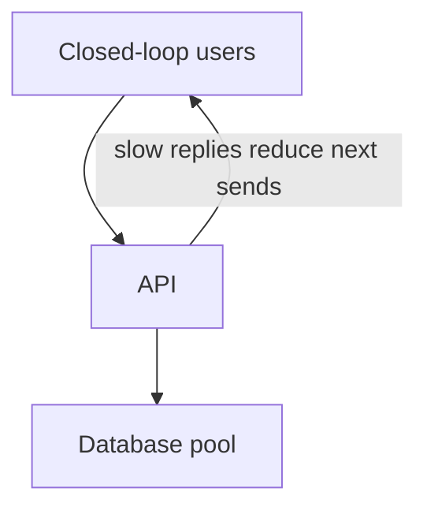
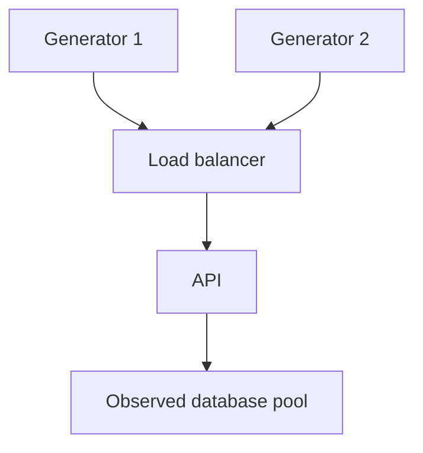
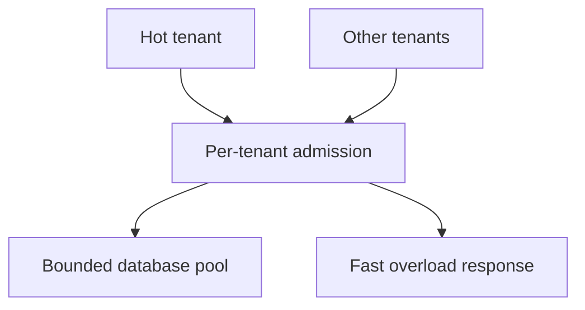

# 4. The load test that finds the real limit

[Curriculum](../../../README.md) · [Testing, debugging, and code review](../README.md) · [Project index](../../../../indexes/projects.md)

## The reviewer's brief

> Your reading-list API appears stable at fifty concurrent users. In production arrivals continue when it slows, so backlog grows. Measure a useful limit without letting the load generator conceal demand. Which arrival model matches the question?

This is a **constructed practice brief**, not an attributed company question.
Prerequisites: [the section](../testing-strategy.md). This page is a build brief; it does not ship a runnable application. The original build and prompt sequence below defines the implementation checkpoints.

| Case | Exact input or workload | Expected outcome |
|---|---|---|
| Small example | Open-loop arrivals 120/s, service capacity 100/s, initially empty queue, duration 10 s. | Absent shedding, backlog grows by about 200 requests; admitted throughput cannot exceed 100/s. |
| Boundary / failure | A closed-loop generator waits for each response before sending again. | Report reduced offered load; its stable throughput does not prove stability under fixed external arrivals. |
| Scope | Toy capacity, controlled environment, bounded duration and explicit stop conditions. | Explain any additional assumption before implementing it. |

## See the first reviewable result

**First slice:** Generate fixed open-loop arrivals of 120/s against 100/s service capacity for 10 s. **Show:** admitted throughput, around 200 additional queued requests without shedding, p95/p99 latency and user-visible rejection when capacity is bounded. Repeat with a closed-loop client and label its *lower offered load*, so the second green chart cannot falsely prove the service handles 120/s.

<!-- project-expectation:start -->

## What you are expected to hand over

**The finished artifact:** A load generator that ramps traffic against P1 until something fails, and a record of what failed, at what throughput, and what a user saw.

Bring a runnable slice or decision artifact, its normal output, and a captured
failure from the examples above. Include one check that turns red when the guarantee
breaks, the state owner, and the first operational limit. For each follow-up,
change the diagram **and** the evidence before claiming the design still works.

### How the review conversation gets harder

| Review gate | The interviewer changes | Expected response |
|---|---|---|
| Baseline | Run the small example from the cases above. | Demonstrate the observable outcome end to end and identify which boundary owns it. |
| Failure | Reproduce the boundary/failure case above. | Show the failure before the fix, then prove the protected behavior without hiding the error. |
| Senior · The generator saturates | Doubling generators raises measured service throughput from 80/s to 100/s. What was the earlier limit? Predict which boundary must change before opening the design. | The earlier result included generator capacity. Measure generator CPU, sockets and offered rate, then rerun with enough headroom; do not label 80/s an application limit. |
| Lead · Only one tenant is hot | One tenant produces 90% of traffic. Does a global average show everyone’s experience? State what evidence would make you reject your first design. | Split latency, errors and admission by bounded tenant class, and test fairness. Use a concurrency/rate budget at admission to keep one hot tenant from consuming all downstream work. |
| Evidence | A reviewer asks, “How do you know?” | Build in three stops: reproduce the small case and baseline failure; implement the protected boundary; then replay both changed requirements with captured outputs. |
| Handoff | The author is unavailable and the environment is new. | Another engineer can run, observe, break, and recover the artifact from the repository evidence. |

Before implementation, say the baseline invariant, the owner of each piece of
state, and what the user sees when the named dependency or assumption fails. That
five-minute explanation is part of the project: if it is vague, the build is not
ready to begin.

<!-- project-expectation:end -->

Before looking at the guidance, state the invariant in one sentence and trace the example. In interview practice, implement or sketch independently, then reveal the reasoning. During AI-assisted practice, use the prompts below and verify each checkpoint before the next request.

## Baseline and the failure to explain



Waiting clients can reduce generated demand as latency rises. That is a valid user model for some tasks, but it masks queue growth under independent arrivals.

<details>
<summary>Reveal the approach and decisions</summary>

Choose arrival process, failure threshold and observation point before running. Measure offered/admitted/completed/shed work and queue age together. The invariant is accounting for every offered request and bounding test damage; infer a bottleneck only from resource evidence.

</details>

## Follow-up 1 · The generator saturates

**Changed requirement:** Doubling generators raises measured service throughput from 80/s to 100/s. What was the earlier limit? Predict which boundary must change before opening the design.

<details>
<summary>Expected reasoning and changed diagram</summary>

The earlier result included generator capacity. Measure generator CPU, sockets and offered rate, then rerun with enough headroom; do not label 80/s an application limit.



</details>

## Follow-up 2 · Only one tenant is hot

**Changed requirement:** One tenant produces 90% of traffic. Does a global average show everyone’s experience? State what evidence would make you reject your first design.

<details>
<summary>Expected reasoning and changed diagram</summary>

Split latency, errors and admission by bounded tenant class, and test fairness. Use a concurrency/rate budget at admission to keep one hot tenant from consuming all downstream work.



</details>

## Evidence to bring to review

Build in three stops: reproduce the small case and baseline failure; implement the protected boundary; then replay both changed requirements with captured outputs. Record commands, fixtures, and observed results in your implementation README. A diagram is a prediction until those checks run.

**Senior expectation:** Attribute one limit with offered-load and saturation evidence. **Additional lead scope:** Define tenant fairness and resource budgets across services. Completion demonstrates practice evidence; it does not establish interview readiness or multi-team delivery experience.

## Build and prompt sequence

*You end up knowing which component breaks first, at what rate, and what the
failure looks like from outside.*

**Build**

A load generator that ramps traffic against P1 until something fails, and a
record of what failed, at what throughput, and what a user saw.

**The thought process**

First decision: **find the limit, do not verify a target.** "Can it do 100
requests per second" is a yes/no that teaches nothing. "What breaks first, and
at what number" gives you both a limit and a to-do list.

Second decision: what counts as failure. Errors, obviously — but latency past a
threshold you choose is also failure, and so is success with stale data. Decide
before you run, or you will pick the definition that makes the graph look good.

Third, and the one people skip: **where the load comes from.** A generator on
your laptop measures your home broadband. A generator in the same VPC measures
the system without the internet in front of it. Both are useful and they answer
different questions.

**How to organise the prompts**

```
Write a load test that ramps from 1 to N concurrent users, increasing
every 30 seconds, recording per-step throughput, p50 and p99 latency, and
error rate.

Stop automatically when error rate passes 1% or p99 passes 2 seconds.
Report the step where it stopped and what the errors were.
```

```
Now tell me, from the numbers: what resource ran out? Name the evidence
in the data that points at it rather than guessing from the
architecture.
```

Asking for the evidence rather than the diagnosis is what keeps this honest.
The answer is very often the connection pool or the file descriptor limit, not
the thing anyone expected.

```
Run it again with only that one limit raised. Report the new breaking
point and what broke instead.
```

**On AWS**

The generator wants to be somewhere with real network capacity. **Fargate**
tasks in the same region as the system, several of them, is the straightforward
answer; a single **EC2** instance is fine too and is cheaper per hour if you
already have one running.

Where AWS genuinely changes the exercise is on the observed side: with
**CloudWatch** metrics on the load balancer and the database you can see *which
component* saturated rather than inferring it. Turn on **Enhanced Monitoring**
on RDS for the duration of the test and off afterwards, because it is billed per
instance per interval and it is easy to leave on.

One caution worth stating plainly: load-testing your own infrastructure is
fine, and load-testing anything you do not own is not. Point it at your own
account only.

**What productionising it means**

A smaller version of the same test runs on a schedule against staging, and the
breaking point is recorded over time. A limit that halves after a release is the
single most useful performance signal you can have, and nobody has it, because
the test is written once and never re-run.

**The learning**

The thing that breaks first is almost never the thing you optimised, and you
cannot find it by reasoning about the architecture — only by pushing until
something gives and then reading the evidence.

**How you would know it is wrong**

- Run the generator against a deliberately slow endpoint. It must report a low limit, not a high one.
- Check the generator itself is not the bottleneck: double the generators and see whether the reported limit moves. If it does, you were measuring your load test.
- Compare p99 against a hand-timed request during the run. If they disagree, the measurement is wrong.
- Confirm the run stopped on your stated condition rather than on a crash.

---

[Back to the ordered project index](../projects.md)
