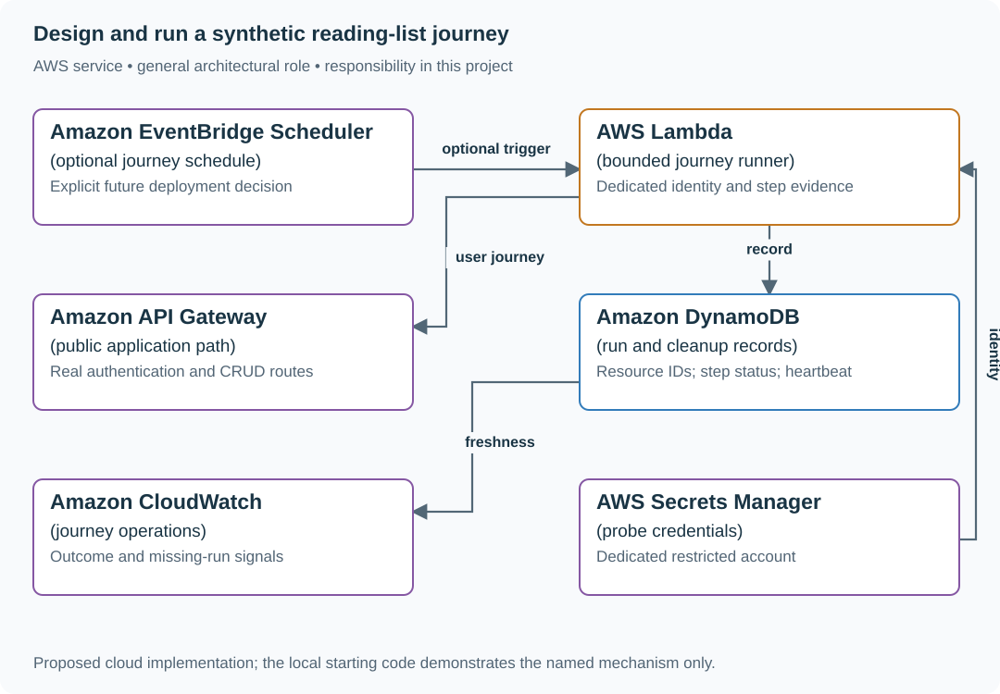
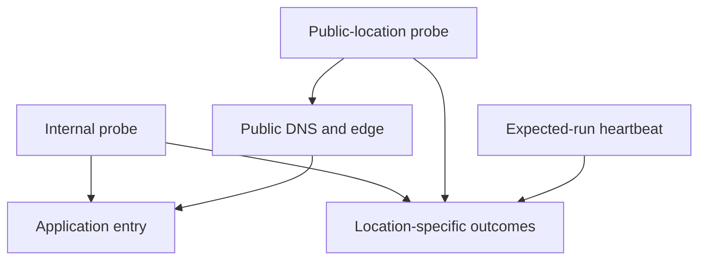

# Design and run a synthetic reading-list journey

## Application background

A reading-list server can reply Healthy while a user still cannot save a bookmark. A more useful check follows a small user journey: sign in as a dedicated account, create a recognizable bookmark, read it back and remove it.

This exercise starts with one manual run of that journey. The account and marker data must be separate from real users. If cleanup fails, operators need to know what remains rather than accumulating unexplained records.

### Example walkthrough

| Action | Expected behavior |
|---|---|
| Create marker bookmark `probe-17` | Receive its saved ID. |
| Read the marker through the normal user path | Confirm that the saved content is accessible to the probe account. |
| Remove the marker | Confirm cleanup or record the item that needs attention. |

A synthetic journey is an operation performed by a controlled artificial user to observe real application behavior. Scheduling it repeatedly is a separate operating decision, not something this example installs.

## Your assignment

**Deliver:** Run one manual create/read/cleanup journey using an isolated probe account. Write the operating plan needed before anybody schedules it repeatedly.

**Required behavior:** A run succeeds only when every required step succeeds. Dependent steps skipped after failure are reported as skipped. Cleanup is attempted independently, and missing runs are distinct from successful runs.

The primary deliverable is the report or operational procedure named above, backed by a reproducible local demonstration. Build the smallest supporting code needed to make that evidence visible.

## Get the code and run the supplied example

The code is in the public [junior-to-staff repository](https://github.com/Soulful-Iris/junior-to-staff). Install Git and Python 3.12+. No AWS account or Python packages are required for this first run. If you already have a checkout, use it and skip cloning.

```bash
git clone https://github.com/Soulful-Iris/junior-to-staff.git
cd junior-to-staff
python3 examples/architecture-starts/05_the_test_that_runs_in_production_forever.py
```

**Supplied file:** [`examples/architecture-starts/05_the_test_that_runs_in_production_forever.py`](https://github.com/Soulful-Iris/junior-to-staff/blob/main/examples/architecture-starts/05_the_test_that_runs_in_production_forever.py). You can also [read or download the source here](../../../../examples/architecture-starts/05_the_test_that_runs_in_production_forever.py).

This program is a **mechanism demonstration**: it runs the small scenario in one process and prints the result. It is not an HTTP service, a complete application, or an AWS deployment. A successful run demonstrates this mechanism only. It does not establish the workload or failure guarantees of the application you will build.

**Example output from the supplied run:**

Generated IDs and timestamps may differ. Compare the state transitions and outcomes.

```text
Journey successful: False
Step evidence: {'create': 'failed', 'read': 'skipped', 'delete': 'cleanup_attempted', 'verify_absent': 'unknown'}
Runner stale: True
```

### Set up your implementation workspace

Create `work/05-the-test-that-runs-in-production-forever/` in your checkout (or use a separate repository). Copy the supplied mechanism into that directory as `mechanism.py`, then extract its state transitions into functions you can call from your implementation. The record and module names below describe what you must implement. They are not a promise that files with those names already exist. Keep a `README.md` beside your implementation with its exact run commands and observed results.

## Local components and state to implement

This table names the records, interfaces or decision inputs for your deliverable. Unless a name is explicitly linked to supplied source above, it is something you create. Implement the local state transitions first, then connect the HTTP, storage or worker boundaries required by the steps.

| Record / module | Key or interface | Responsibility |
|---|---|---|
| journey_run | run_id,started_at,location,step_outcomes | One complete execution with explicit skipped states. |
| synthetic_resource | run_id,owner,created_at | Cleanup identity and expiry fallback. |
| heartbeat | runner,last_started,last_completed | Scheduler health independent of application outcome. |

## Implement the assignment

### 1. Build one manual journey

Use a dedicated account and run identity. Follow the real public DNS/TLS/application path, create a unique marker and verify its content after reading. Run it on demand first and inspect every step’s visible result.

### 2. Make cleanup independent

Keep the created resource ID as soon as it is known. Attempt deletion in a finally-style cleanup path even after a read failure, and record cleanup failure separately. Add expiry-based cleanup for abandoned synthetic data without letting it hide a failing journey.

### 3. Model missing and skipped outcomes

A create failure means read is skipped, not passed. Emit the run result and heartbeat separately. If a future scheduler is configured, monitor freshness from an independent path so a dead runner does not report its own absence as success.

### 4. Define regional interpretation

A probe inside the application VPC does not exercise public DNS and routing. Use a second location when that distinction matters, and retain location-specific evidence. A single-location failure is a useful signal, not automatic proof of a global outage.

## Demonstrate the completed local result

| Action | Expected visible result |
|---|---|
| Run the starting program | Failed create plus skipped read is not success. An absent runner becomes stale. |
| Fail the read after creation | Cleanup still attempts deletion and records its own outcome. |
| Stop the optional runner | The freshness signal detects absence independently of application errors. |

**Handoff:** In your implementation README, include the start command, one successful operation, the failure case above and the resulting stored state or decision. State which dependencies are simulated. Someone with a fresh checkout should be able to reproduce this without your chat history.

## Workload assumptions and capacity decisions

These are constructed exercise assumptions. The stated workload is a design target. The local demonstration does not establish that throughput. Use the [estimation constants](../../../01-code/01-problem-solving/estimation-constants.md) to check units before choosing capacity.

| Input or objective | Calculation / consequence |
|---|---|
| One-minute interval in the proposed deployed design | 1,440 runs/day and at least 4,320 create/read/delete operations before authentication and absence checks. |
| Three missing intervals | A separate heartbeat policy detects a stopped runner. No result is not a healthy result. |
| Dedicated synthetic namespace | Probe data must not appear in real users’ lists, analytics or billing. |

## Map the local implementation to AWS

**Deployment status: local only.** Running the supplied command creates no AWS resources and configures no cloud connections. The diagram is a proposed deployment of the completed application. Each box needs either a deployed runtime, a provisioned service or an explicitly external dependency.

Read the diagram by following the arrows from the entry point: application code accepts the request or event, the state owner commits it, and any worker produces the later result. The table ties those roles to code and adapter work. Multiple boxes do not imply multiple Python files already exist.



The journey measures the user path. Heartbeat evidence measures whether the journey ran. The proposed scheduler is part of the lesson architecture, not a change to this website’s publishing behavior.

| Local responsibility | Cloud destination and role | Implementation still required |
|---|---|---|
| Manual invocation or local schedule input | Amazon EventBridge Scheduler: optional journey schedule | Create schedules targeting the dispatcher and preserve occurrence identity across retries and overlapping invocation. |
| Python operation or worker function | AWS Lambda: bounded journey runner | Write a Lambda event adapter, package its dependencies and give its role only the required resource actions. |
| Local HTTP boundary or the endpoint you will add | Amazon API Gateway: public application path | Create routes and an integration. Translate requests and responses and configure identity validation. |
| Local dictionary, SQLite records or state model | Amazon DynamoDB: run and cleanup records | Design partition/sort keys and write a storage adapter with conditional updates or transactions. Python state and SQL are not uploaded as a database. |
| Local counters, timestamps and diagnostic output | Amazon CloudWatch: journey operations | Emit bounded metrics and logs, build the named operational view and configure retention and access. |
| Local provider configuration placeholder | AWS Secrets Manager: probe credentials | Store provider credentials, scope runtime reads and implement rotation without writing secrets to logs. |

### Provision resources, then connect the application

| Resource or boundary | Initial configuration and reason |
|---|---|
| Execution | A manually invoked runner is enough for this exercise. Scheduling is an explicit later infrastructure choice. |
| Identity | Probe account has only synthetic-data permissions. Credentials never enter logs. |
| Cleanup | Finite runtime and orphan-retention policy. Cap synthetic data volume even if deletion repeatedly fails. |

Use one disposable AWS environment for the cloud exercise. Put the named resources in `infra/template.yaml` or your existing IaC tool, pass resource IDs through configuration, and scope each runtime role to its own tables, buckets and queues. The diagram is a design to implement. It is not a claim that these resources have been deployed. Record the commands you used to deploy and remove the exercise resources.

For concrete provisioning commands, configuration wiring and cleanup, use the [AWS foundation guide](../../../../examples/architecture-starts/infra/README.md). It includes a deployable table/queue/object-storage foundation and explains which application and service adapters you still implement.

A provisioned queue or table does not make the local program use it. Configure resource IDs in the deployed runtime, replace the local adapter, and replay the same successful and failing operation against that runtime. Record the deployed commit and observable result, then remove the disposable resources using your infrastructure tool.

## Extend the design after the baseline works


A probe passes while real users fail because its account has special permissions. Compare its identity, data size and routing with the user population and remove privileges that bypass the behavior being measured.

<details>
<summary>Follow-up scenarios and worked designs</summary>

## Follow-up 1 · The scheduler stops

**Changed requirement:** No probe result arrives for three intervals. Is that equivalent to success?

<details>
<summary>Worked design and implementation</summary>

No. Monitor heartbeat freshness separately from journey outcome. Distinguish no eligible data from missing instrumentation. Alert on the absent run with the monitor’s owner and last successful timestamp.

**Model three outcomes.** A journey can succeed, fail, or have no trustworthy observation. Persist expected run time, actual start, completion and result separately. A heartbeat watcher needs a failure path independent enough to notice the scheduler's silence.

Pause the scheduler for three intervals in the exercise and show stale observation with the last completed timestamp. Do not fill the missing slots with success or include them silently in a success denominator. Provide an owner and a recovery action for the monitor itself.

</details>

## Follow-up 2 · A regional path fails

**Changed requirement:** The probe in the application VPC passes, but public DNS fails for a region. What changes?

<details>
<summary>Worked design and implementation</summary>

Probe the actual public entry path from a second location and keep region-specific outcomes. Do not automatically collapse a single-location failure into global outage. Correlate it with other evidence.

**Change where the observation starts.** The internal probe skips public DNS, edge routing and some network paths. Add a second vantage point that uses the same public hostname and TLS path as the affected users. Record location and journey version with each result.

Construct a result table where the VPC probe passes and one public location fails DNS. Classify it as a path-specific problem until more evidence establishes the scope. The architecture change is an independent observation path, not running the same internal command twice.

**Revised flow.** These are proposed components to implement, not extra services started by the supplied demo.



</details>

</details>
