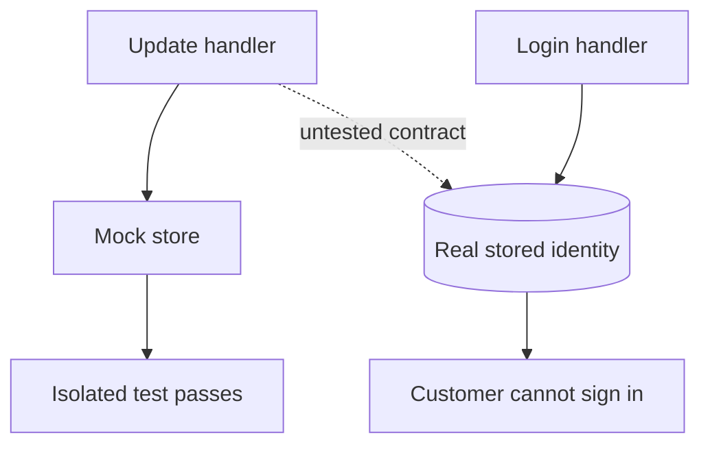
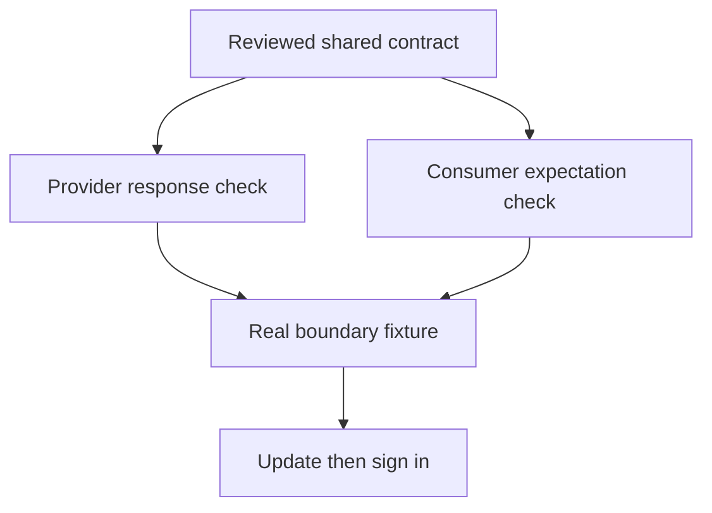
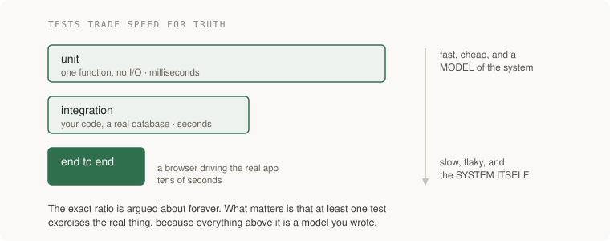
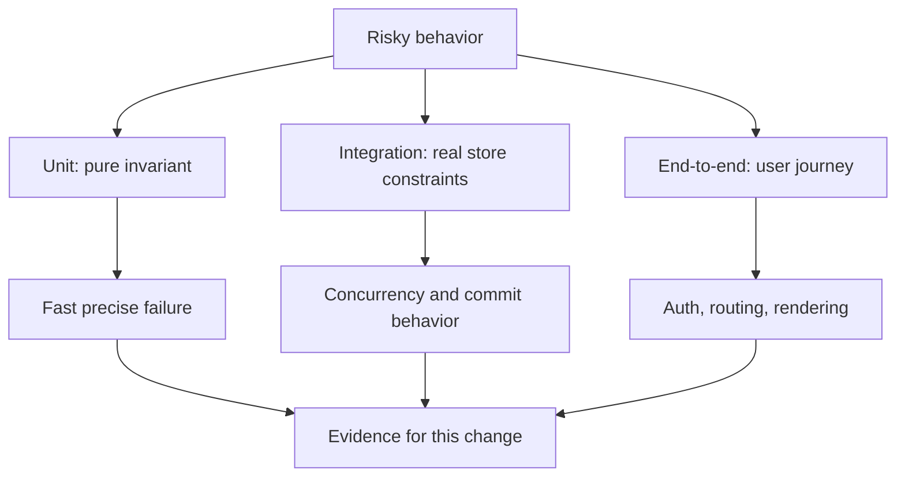

# Testing

[Curriculum](../../README.md) · [Find defects and evaluate engineering evidence](README.md)

> Project connection · feeds **P1 (it works)** and everything after it

## At the whiteboard

> “Changing an email works in the UI, but the same customer can no longer log
> in. The email-update test is green. What behavior did the test fail to protect,
> and which boundary would your next test cross?”

Tests are experiments with predictions. The important question is which wrong
behavior would make each experiment fail.

| Given | Expected observation |
|---|---|
| Account uses `Ada@Example.com` | Defined case-normalization policy applies consistently |
| User confirms change to `ada@new.example` | The new address can authenticate |
| Update succeeds but login reads a different representation | Integration test fails |
| A known-broken normalizer is installed | At least one contract test turns red |

**Ask first:** is email comparison case-sensitive in this product, and is an
unconfirmed address allowed to replace the login identity? Agree before coding.



## Reason through the test boundary

1. Write the user journey and policy first. A test that only checks the handler's
   returned message does not prove the account is usable.
2. Use a unit test for normalization rules, a real-store integration test for
   the shared representation, and one end-to-end journey for the visible flow.
3. Control unrelated nondeterminism such as mail delivery; keep the database
   boundary real when database behavior is the claim under test.
4. Inject the inconsistent normalizer. Observe the expected failure before
   accepting the repaired suite.

**Follow-up:** “The provider renamed `email` to `address`. Both teams' unit tests
pass. What additional contract would detect the mismatch?”



The shared contract must not be copied into two tests that can drift separately.
Ask an AI for tests against the agreed examples, then show which planted defect
each test catches.

## The one-liner

Tests are how you find out that a change broke something, without a person
clicking through the app. They are not about proving the code is right. They are
about making breakage **loud** instead of silent, and the whole craft is in
deciding which breakage you care about.

## The failure it prevents

You ask for a small change: "when someone updates their email, send a
confirmation." It works. You ship it.

Three weeks later a customer cannot log in. The email-update path also writes to
the `users` table, and the new code writes the email in lowercase while login
compares it case-sensitively. Nothing errored. Nothing logged. The bug was
introduced by a change that had nothing to do with login, and it was found by a
human being locked out of their account.

A test suite is not there to tell you the email feature works. It is there so
that the *login* test goes red when you touch the email feature.

That is the actual job: **tests are a tripwire on the code you were not
thinking about.**

## The mental model

Three things are worth holding.

**1. A test is an experiment with a prediction.** You put the system in a known
state, do one thing, and assert what should now be true. If you cannot say in
advance what would make it fail, you have not written a test, you have written a
script that runs.

**2. Tests trade speed for realism.** The closer a test is to the real system,
the more real boundaries it can exercise, usually with more setup and runtime.
Flakiness is not an unavoidable feature: control clocks, data and ordering.



You want most of your tests at the top and a few at the bottom. The exact ratio
is argued about endlessly and does not matter much; what matters is that you
have **at least one test that exercises the real thing end to end**, because
everything above it is a model of the system rather than the system.

**3. The thing you are really testing is the change, not the code.** Before a
test is worth keeping, ask: what edit would make this go red? If the honest
answer is unclear, inspect its assertion and supported input domain before
keeping or deleting it. A narrow boundary test may catch just one important bug.


## What good looks like

- Each test names the behaviour, not the function: `rejects_login_when_password_expired`, not `test_login_2`.
- A failing test tells you what broke without opening the file.
- Tests do not depend on each other or on the order they run in.
- The suite runs on every change, automatically, and nobody has to remember to run it.
- There is at least one test that would catch the bug you shipped last month.
- Test data is built in the test, not loaded from a fixture nobody understands.

Done badly, you see:

- A suite that is green and a product that is broken.
- Tests that merely copy implementation assumptions rather than the contract.
  Writing a test after implementation is fine when its expected result is independent.
- A mocked database, so the test passes and the real query has a typo in it.
- One enormous test that sets up half the app and asserts twelve things, so when
  it fails you learn nothing.
- Tests that were skipped months ago and nobody noticed, because a skip and a
  pass look identical in the summary line.

## Ask Claude for this

**Request 1 — the suite for a feature you just had built**

```
Here is the change you just made. Write tests for it.

Before writing anything, list the ways this code could be wrong: wrong
output, wrong state left behind, wrong behaviour on a second call, wrong
behaviour when the input is empty / duplicated / very large.

Then write one test per item on that list. For each test, add a comment
saying what edit to the source would make this test fail.

Do not mock the database. Use a real one with a throwaway schema.
```

*Why it is asked that way:* the first instruction makes the model enumerate
failure modes before it is attached to a solution, which is the part it is good
at and the part people skip. The comment requirement is the important one — it
forces each test to name the edit it defends against, and a test that cannot name
one is visibly worthless on the page.

*What you should get back:* a list of failure modes, then tests that map onto
them one to one. If you get five tests that all check the happy path with
different numbers, the list was skipped.

Prefer observable behavior, but match the assertion to the contract:

| Test | Defect it can expose | Boundary it does not cover |
|---|---|---|
| Provider called once for one accepted charge | Accidental duplicate invocation | Real provider settlement |
| Row exists after a real SQL transaction | Query typo or wrong persistence | External side effects |
| `x + 0` becomes `x` for integer inputs | Equivalent mutant: survival is expected | No changed behavior to detect |

A mock call-count assertion is useful when invocation count is itself the promise.
It is brittle when it only encodes an incidental implementation detail.

**Request 2 — proving the suite can actually fail**

```
Pick the three most important tests in this file. For each one, introduce a
small, realistic bug into the source that it should catch. Run the suite and
show me the output. Then revert.

If any of the three still passes with the bug in place, tell me that
plainly and explain why.
```

*Why:* a known, non-equivalent defect is a useful negative control. Inject it in
a disposable copy and confirm the intended assertion—not an unrelated crash—fails.

*What you should get back:* results and an explanation of any survivor. Was the
mutation applied and executed? Did it change supported behavior, or is it
equivalent? Only then decide whether an assertion or input case is missing.

**Request 3 — the test for the bug you just hit**

```
This bug reached a user: <describe what happened>.

First write the test that reproduces it and watch it fail. Show me the
failure output. Only then fix the code.
```

*Why:* a red reproduction followed by a green repair is strong regression
evidence. Test chronology alone is not the criterion: the expected result must
come from the contract, and the test must exercise the relevant boundary.

## How you would know it is wrong

The checks for this topic, each one capable of going red:

1. **Break it on purpose.** Change a `>` to a `>=`, delete a line, invert a
   boolean in a disposable copy. A behavior-changing mutation in the tested
   domain should fail; investigate equivalent and unexecuted mutants separately.
2. **Read the summary line properly.** `21 passed, 10 errors` is not green. A
   skipped test and a passing test look the same at a glance and mean opposite
   things. Count them.
3. **Check what a "green" run actually ran.** If ten tests silently skip because
   a fixture file is missing on this machine, the number at the bottom is a lie
   about a smaller suite.
4. **Look for the test that cannot fail.** A threshold set below the floor
   ("assert improvement > 0.5dB" when the process alone produces 0.79) will pass
   forever and read as rigour.
5. **Run the tests somewhere other than your machine.** A suite that only passes
   where it was written is telling you about your laptop.

> The rule under all five: **before believing a green result, say what it would
> have looked like if the thing were broken.** If the answer is "the same", it
> proved nothing.

## Your slice of the project

On **P1**, add:

- One end-to-end test that creates a record, reads it back, and deletes it,
  against a real database.
- Three unit tests over the piece of logic with the most branches.
- One test that reproduces a bug you actually hit while building, written
  *after* you hit it and *before* you fixed it.
- Proof that the suite can fail: a commit message or note recording which bug you
  planted and which test caught it.

**Acceptance criteria you can check yourself:**

- `git stash` your fix for the reproduced bug and the suite goes red.
- The suite runs from a clean clone with one command, on a machine that is not
  the one you built it on.
- No test takes longer than a second unless it is deliberately the slow one.

## Words you now own

- **unit test** — checks one piece of logic in isolation, no database, no network.
- **integration test** — checks your code against a real dependency, usually a database.
- **end-to-end test** — drives the whole system the way a user would.
- **fixture** — prepared data or state a test starts from.
- **mock / stub** — a controlled dependency substitute; useful for caller behavior, not proof of the real dependency's semantics.
- **flaky test** — passes and fails without the code changing. Treat as broken; a suite people do not trust is a suite nobody reads.
- **coverage** — the share of lines the tests execute. Says what ran, never whether it was checked.
- **mutation testing** — deliberately introducing bugs to see whether the suite notices. The honest version of coverage.
- **regression test** — a test written to make sure a specific bug never comes back.
- **test double** — the family name for mocks, stubs, fakes and spies.

---

**Not covered here:** performance testing, load testing and chaos testing are
senior-tier and live in [Reliability](../../03-production/05-reliability/failure-budgets.md),
because they measure the system under conditions rather than the code under
change. Property-based testing is genuinely useful and deliberately left out of
the application foundations; it is easier to appreciate once you have felt an example-based
suite miss something.

[Learning sequence](../../README.md) · [Independent practice](../../../practice/interview-guide.md)

## Draw it from memory · Choose the boundary your test proves



**Redraw challenge:** Which test would fail if authorization were removed? A happy-path unit test is not enough.
