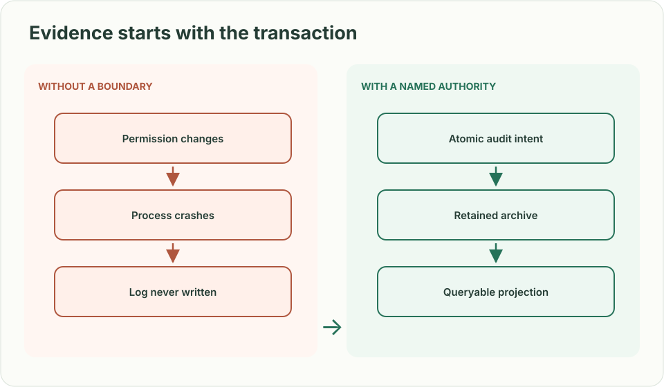
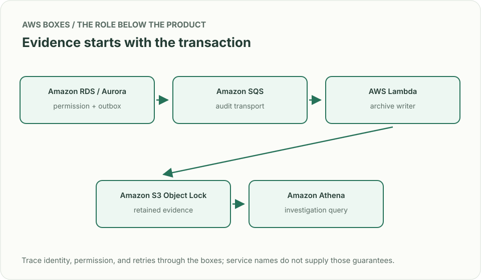
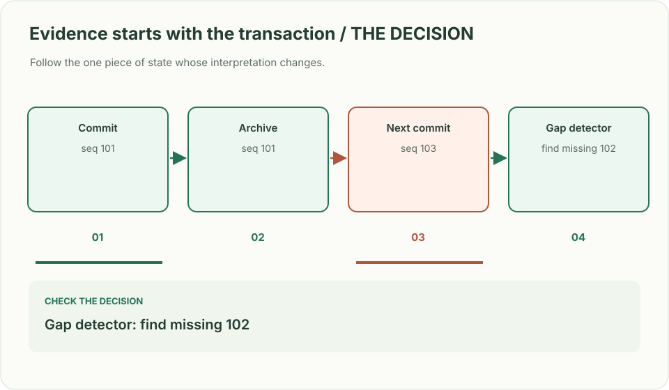

# Audit trail: who changed this permission?

## What you are building

> You maintain access control for a reporting product. A customer says that a confidential report became public at 14:03. Build the permission-change endpoint and an investigation view that can identify the actor, the exact change, and any missing export to the retained archive.

**Working contract:** PATCH /reports/{id}/permissions commits the permission version and its audit intent together. GET /audit accepts a tenant-scoped resource ID and shows archive completeness separately from search freshness.

## Workload and the decisions it changes

These are constructed exercise assumptions. The large workload is a design target; the local demonstration does not establish that throughput. Use the [estimation constants](../../../01-code/01-problem-solving/estimation-constants.md) to check units before choosing capacity.

| Input or objective | Calculation / consequence |
|---|---|
| 2,000 changes/s peak; 1 KiB envelope | About 2 MiB/s before storage overhead. If sustained all day, roughly 177 GB/day decimal; do not extrapolate a peak into a retention bill without a duty cycle. |
| Seven-year exercise retention | Separate retained evidence from a short-lived search index; the real retention policy is a product/legal decision. |
| Archive lag objective: 60 seconds | At peak a one-minute relay outage leaves 120,000 events to reconcile. |

## Start with one working boundary

Run from the repository root with Python 3.12+:

```bash
python3 examples/architecture-starts/audit_trail.py
```

[Open the starting code](../../../../examples/architecture-starts/audit_trail.py). This is a runnable demonstration of the critical state boundary. The API, UI, cloud adapters and operating behavior below are the application you build around it.

| Record / module | Key or interface | Responsibility |
|---|---|---|
| permissions | tenant,resource,version | Current access authority; conditional update prevents lost edits. |
| audit_outbox | event_id,resource_version,actor,change | Immutable event identity and verified actor; written in the permission transaction. |
| archive_receipts | event_id,object_key,object_version,checksum | Tracks durable export evidence, not just a successful queue send. |

## AWS implementation


Aurora establishes which change happened. S3 Object Lock protects the retained object versions after export. Athena reads the archive without making a mutable search index the sole evidence source.

## Build it in this order

### 1. Implement the permission transaction

Take actor and tenant from trusted authentication context. Require an expected resource version. In the same transaction, update the permission and append an event containing schema version, previous/new policy, request identity and server time. Do not turn an audit insertion failure into a successful unaudited change.

### 2. Export and reconcile evidence

Write a relay that reads committed outbox rows, uploads batches under immutable keys and records archive receipts. Retry with the same event IDs. Reconcile resource versions against archived events: an object checksum proves the bytes you have, not that every change reached the archive.

### 3. Build the investigator view

Query by tenant, report and time range. Show event sequence, actor and before/after state, plus archive watermark and search-index watermark. When the index lags, provide the retained object reference and an authorized Athena query path. Keep tokens and sensitive report content out of events.

### 4. Separate write privileges

The application may append archive objects but cannot overwrite evidence or shorten retention. Give investigation roles read-only access by scope; record evidence access separately. Practice recreating the search projection from retained records.

## Infrastructure configuration

| Resource or boundary | Initial configuration and reason |
|---|---|
| Aurora PostgreSQL | Permission and outbox tables share one transaction. Give the relay read access to the outbox, not permission-administration rights. |
| S3 archive | Enable versioning and choose a retention mode deliberately. Use short disposable exercise retention; do not lock sample objects for seven real years. |
| Athena and Glue | Partition by date and tenant scope; restrict query-result buckets as carefully as the source. |
| Relay operations | Bound batches, retry failed exports, track oldest unarchived event and missing resource versions. |

Use one disposable AWS environment for the cloud exercise. Put the named resources in `infra/template.yaml` or your existing IaC tool, pass resource IDs through configuration, and scope each runtime role to its own tables, buckets and queues. The diagram is a design to implement; it is not a claim that these resources have been deployed. Record the commands you used to deploy and remove the exercise resources.

## Observe the result

| Action | Expected visible result |
|---|---|
| Run the starting program | The permission is version 2 and its unexported audit event remains available. |
| Stop the relay for one minute | Permission commits remain auditable in the outbox; archive lag becomes visible. |
| Remove the search projection | An authorized investigator can still reconstruct changes from retained evidence. |

## The next design decision

Design recovery when the database is restored to yesterday but the archive contains today’s events. Identify the latest proven resource version before permitting new changes. An append-only bucket cannot repair an application that reuses old event identities.

<details>
<summary>Additional design cases, alternatives and original source notes</summary>

> **Interviewer:** “A customer reports that access to a sensitive report changed yesterday. Show who made the change, what the old and new permissions were, and whether anyone tampered with the evidence.”

**Your contract.** The app processes 2,000 permission changes/s at peak and supports 7-year retained records for this exercise. Define which fields are sensitive and which employee roles may read them. These numbers are invented; retention and legal requirements are product decisions.

| Incident | Required outcome |
|---|---|
| Permission update commits; process crashes before emitting audit event | Change and audit intent are both durable, or the permission update fails |
| Two changes happen within the same second | Unambiguous ordering per resource and actor, with server-generated identity |
| Operator changes an audit row | Detection and an immutable retained source outside the operator's write privileges |
| User asks to delete personal data | Apply the governing retention rule; document any lawful exception and restrict access |



## Separate evidence from visibility

Commit the permission transition and an audit intent in the **same transaction**. The event records who acted, verified tenant, target, before/after references, request ID, decision time, and policy version. Never let clients supply “actor” as an authoritative field. A dispatcher can export immutable records asynchronously; a searchable index is a *projection*, so losing it must not lose the retained original. Version the envelope so future readers can interpret old records. Avoid logging raw secrets; limit reader privileges and produce a separate audit for audit access.



| AWS box | Job here | Alternative and deciding factor |
|---|---|---|
| Aurora PostgreSQL transaction | Update permission plus append outbox/audit intent atomically | DynamoDB TransactWriteItems if permissions already live in DynamoDB |
| SQS + Lambda | Transfer committed intents into a retained archive, with retry and dedupe | Kinesis when ordered high-rate streams and multiple independent consumers matter |
| S3 Object Lock | Retain versioned evidence under separately controlled permissions | Purpose-built immutable ledger if chain verification and query access justify complexity |
| Athena | Query partitioned retained events for investigation | OpenSearch projection for interactive search, never as the sole evidence source |

S3 Object Lock protects retained **object versions** under configured retention/legal hold; it does not prove a missing event was ever emitted. Reconcile the outbox and archived sequence ranges and alert on gaps.



**Senior follow-up:** A projected audit search is 20 minutes behind during an incident. Show the operator how to query the retained source and display a truthful freshness indicator.

**Staff follow-up:** Legal hold blocks deletion for one tenant while another has an erasure request. Define record scope, separation of duties, access logs, and a test of restore and evidence export; seek counsel on actual retention obligations.

**Practice artifact:** Draw the commit and export boundaries. Trace a crash at each boundary and show whether the event exists, is discoverable, and is independently protected.

**Source boundary:** Original exercise. [S3 Object Lock](https://docs.aws.amazon.com/AmazonS3/latest/userguide/object-lock.html) describes the AWS retention primitive, not a blanket legal compliance guarantee. A [June 2026 Meta engineering account](https://engineering.fb.com/2026/06/25/security/privacy-aware-infrastructure-in-the-ai-native-era-an-asset-classification-case-study/) motivates provenance and policy classification; this is not a reported Meta interview question.

</details>
