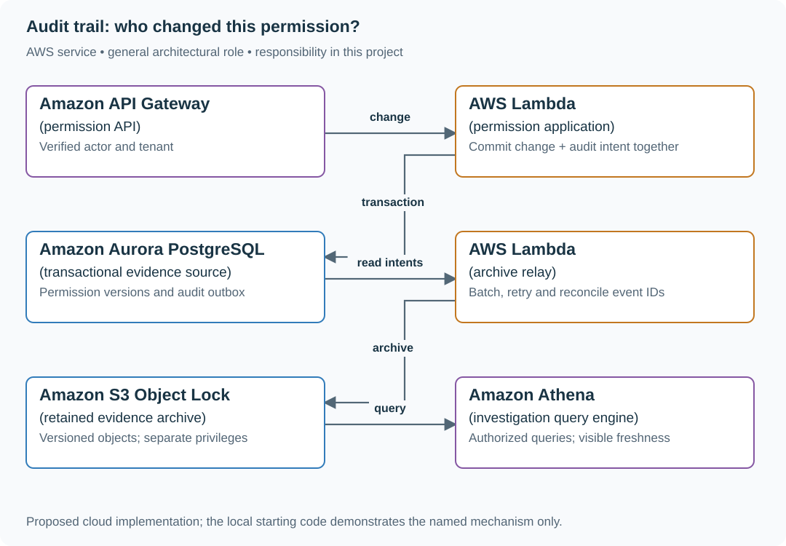

# Record permission changes with durable audit evidence

## Application background

An administrator changes a report from private to visible to the whole company. The next day its owner asks who made that change and when. The current permission setting answers who can see the report now, but it does not explain how that setting changed.

You need a separate history of permission changes. Each entry records the person, report, previous setting, new setting and time. This history is an audit trail. It must not quietly disappear when a later change replaces the current setting.

### Example walkthrough

| Action | Expected behavior |
|---|---|
| At 14:03, administrator Ana makes report 17 public | Store the new permission and a history entry describing Ana's change. |
| The archive destination is unavailable | Keep the change record and remember that it still needs exporting. |
| An investigator opens report 17's history | Show the change and whether its archive export completed. |

The permission change and its history entry belong in the same database transaction. Here, a transaction means that both changes are saved together or neither is saved.

## Your assignment

**Deliver:** Build a permission-change operation that saves its history with the change. Add a view for investigating that history and a way to resume incomplete archive exports.

**Required behavior:** PATCH /reports/{id}/permissions saves the new permission version and its history record in one database transaction. GET /audit accepts a tenant-scoped resource ID and shows archive completeness separately from search freshness.

The required first milestone is a working local implementation of the behavior above. The numbered implementation steps define the scope. The cloud architecture is a later extension, not something the starter has already provisioned.

## Get the code and run the supplied example

The code is in the public [junior-to-staff repository](https://github.com/Soulful-Iris/junior-to-staff). Install Git and Python 3.12+. No AWS account or Python packages are required for this first run. If you already have a checkout, use it and skip cloning.

```bash
git clone https://github.com/Soulful-Iris/junior-to-staff.git
cd junior-to-staff
python3 examples/architecture-starts/audit_trail.py
```

**Supplied file:** [`examples/architecture-starts/audit_trail.py`](https://github.com/Soulful-Iris/junior-to-staff/blob/main/examples/architecture-starts/audit_trail.py). You can also [read or download the source here](../../../../examples/architecture-starts/audit_trail.py).

This program is a **mechanism demonstration**: it runs the small scenario in one process and prints the result. It is not an HTTP service, a complete application, or an AWS deployment. A successful run demonstrates this mechanism only. It does not establish the workload or failure guarantees of the application you will build.

**Example output from the supplied run:**

Generated IDs and timestamps may differ. Compare the state transitions and outcomes.

```text
After simulated crash before export: [('report-7', 2, 'team')]
Still available to relay: [('report-7:2', '{"actor": "ana", "before": "private", "after": "team"}')]
```

### Set up your implementation workspace

Create `work/audit-trail/` in your checkout (or use a separate repository). Copy the supplied mechanism into that directory as `mechanism.py`, then extract its state transitions into functions you can call from your implementation. The record and module names below describe what you must implement. They are not a promise that files with those names already exist. Keep a `README.md` beside your implementation with its exact run commands and observed results.

## Local components and state to implement

This table names the records, interfaces or decision inputs for your deliverable. Unless a name is explicitly linked to supplied source above, it is something you create. Implement the local state transitions first, then connect the HTTP, storage or worker boundaries required by the steps.

| Record / module | Key or interface | Responsibility |
|---|---|---|
| permissions | tenant,resource,version | Current access authority. Conditional update prevents lost edits. |
| audit_outbox | event_id,resource_version,actor,change | Immutable event identity and verified actor. Written in the permission transaction. |
| archive_receipts | event_id,object_key,object_version,checksum | Tracks durable export evidence, not just a successful queue send. |

## Implement the assignment

### 1. Implement the permission transaction

Take actor and tenant from trusted authentication context. Require an expected resource version. In the same transaction, update the permission and append an event containing schema version, previous/new policy, request identity and server time. Do not turn an audit insertion failure into a successful unaudited change.

### 2. Export and reconcile evidence

Write a relay that reads committed outbox rows, uploads batches under immutable keys and records archive receipts. Retry with the same event IDs. Reconcile resource versions against archived events: an object checksum proves the bytes you have, not that every change reached the archive.

### 3. Build the investigator view

Query by tenant, report and time range. Show event sequence, actor and before/after state, plus archive watermark and search-index watermark. When the index lags, provide the retained object reference and an authorized Athena query path. Keep tokens and sensitive report content out of events.

### 4. Separate write privileges

The application may append archive objects but cannot overwrite evidence or shorten retention. Give investigation roles read-only access by scope. Record evidence access separately. Practice recreating the search projection from retained records.

## Demonstrate the completed local result

| Action | Expected visible result |
|---|---|
| Run the starting program | The permission is version 2 and its unexported audit event remains available. |
| Stop the relay for one minute | Permission commits remain auditable in the outbox. Archive lag becomes visible. |
| Remove the search projection | An authorized investigator can still reconstruct changes from retained evidence. |

**Handoff:** In your implementation README, include the start command, one successful operation, the failure case above and the resulting stored state or decision. State which dependencies are simulated. Someone with a fresh checkout should be able to reproduce this without your chat history.

## Workload assumptions and capacity decisions

These are constructed exercise assumptions. The stated workload is a design target. The local demonstration does not establish that throughput. Use the [estimation constants](../../../01-code/01-problem-solving/estimation-constants.md) to check units before choosing capacity.

| Input or objective | Calculation / consequence |
|---|---|
| 2,000 changes/s peak. 1 KiB envelope | About 2 MiB/s before storage overhead. If sustained all day, roughly 177 GB/day decimal. Do not extrapolate a peak into a retention bill without a duty cycle. |
| Seven-year exercise retention | Separate retained evidence from a short-lived search index. The real retention policy is a product/legal decision. |
| Archive lag objective: 60 seconds | At peak a one-minute relay outage leaves 120,000 events to reconcile. |

## Map the local implementation to AWS

**Deployment status: local only.** Running the supplied command creates no AWS resources and configures no cloud connections. The diagram is a proposed deployment of the completed application. Each box needs either a deployed runtime, a provisioned service or an explicitly external dependency.

Read the diagram by following the arrows from the entry point: application code accepts the request or event, the state owner commits it, and any worker produces the later result. The table ties those roles to code and adapter work. Multiple boxes do not imply multiple Python files already exist.



Aurora establishes which change happened. S3 Object Lock protects the retained object versions after export. Athena reads the archive without making a mutable search index the sole evidence source.

| Local responsibility | Cloud destination and role | Implementation still required |
|---|---|---|
| Local HTTP boundary or the endpoint you will add | Amazon API Gateway: permission API | Create routes and an integration. Translate requests and responses and configure identity validation. |
| Python operation or worker function | AWS Lambda: permission application | Write a Lambda event adapter, package its dependencies and give its role only the required resource actions. |
| Local records and transaction boundary | Amazon Aurora PostgreSQL: transactional evidence source | Write PostgreSQL schema/migrations and a database adapter. Configure credentials, connection limits and recovery. |
| Python operation or worker function | AWS Lambda: archive relay | Write a Lambda event adapter, package its dependencies and give its role only the required resource actions. |
| Local retained audit export | Amazon S3 Object Lock: retained evidence archive | Write immutable export objects and define retention/access policy. Document what prevents alteration and how exports reconcile. |
| Local investigation/report query | Amazon Athena: investigation query engine | Define an archive schema and catalog, query the exported data and constrain query access and cost. |

### Provision resources, then connect the application

| Resource or boundary | Initial configuration and reason |
|---|---|
| Aurora PostgreSQL | Permission and outbox tables share one transaction. Give the relay read access to the outbox, not permission-administration rights. |
| S3 archive | Enable versioning and choose a retention mode deliberately. Use short disposable exercise retention. Do not lock sample objects for seven real years. |
| Athena and Glue | Partition by date and tenant scope. Restrict query-result buckets as carefully as the source. |
| Relay operations | Bound batches, retry failed exports, track oldest unarchived event and missing resource versions. |

Use one disposable AWS environment for the cloud exercise. Put the named resources in `infra/template.yaml` or your existing IaC tool, pass resource IDs through configuration, and scope each runtime role to its own tables, buckets and queues. The diagram is a design to implement. It is not a claim that these resources have been deployed. Record the commands you used to deploy and remove the exercise resources.

For concrete provisioning commands, configuration wiring and cleanup, use the [AWS foundation guide](../../../../examples/architecture-starts/infra/README.md). It includes a deployable table/queue/object-storage foundation and explains which application and service adapters you still implement.

A provisioned queue or table does not make the local program use it. Configure resource IDs in the deployed runtime, replace the local adapter, and replay the same successful and failing operation against that runtime. Record the deployed commit and observable result, then remove the disposable resources using your infrastructure tool.

## Extend the design after the baseline works


Design recovery when the database is restored to yesterday but the archive contains today’s events. Identify the latest proven resource version before permitting new changes. An append-only bucket cannot repair an application that reuses old event identities.

<details>
<summary>Additional design cases, alternatives and original source notes</summary>


**Your contract.** The app processes 2,000 permission changes/s at peak and supports 7-year retained records for this exercise. Define which fields are sensitive and which employee roles may read them. These numbers are invented. Retention and legal requirements are product decisions.

| Incident | Required outcome |
|---|---|
| Permission update commits. Process crashes before emitting audit event | Change and audit intent are both durable, or the permission update fails |
| Two changes happen within the same second | Unambiguous ordering per resource and actor, with server-generated identity |
| Operator changes an audit row | Detection and an immutable retained source outside the operator's write privileges |
| User asks to delete personal data | Apply the governing retention rule. Document any lawful exception and restrict access |

## Separate evidence from visibility

Commit the permission transition and an audit intent in the **same transaction**. The event records who acted, verified tenant, target, before/after references, request ID, decision time, and policy version. Never let clients supply “actor” as an authoritative field. A dispatcher can export immutable records asynchronously. A searchable index is a *projection*, so losing it must not lose the retained original. Version the envelope so future readers can interpret old records. Avoid logging raw secrets. Limit reader privileges and produce a separate audit for audit access.

| AWS box | Job here | Alternative and deciding factor |
|---|---|---|
| Aurora PostgreSQL transaction | Update permission plus append outbox/audit intent atomically | DynamoDB TransactWriteItems if permissions already live in DynamoDB |
| SQS + Lambda | Transfer committed intents into a retained archive, with retry and dedupe | Kinesis when ordered high-rate streams and multiple independent consumers matter |
| S3 Object Lock | Retain versioned evidence under separately controlled permissions | Purpose-built immutable ledger if chain verification and query access justify complexity |
| Athena | Query partitioned retained events for investigation | OpenSearch projection for interactive search, never as the sole evidence source |

S3 Object Lock protects retained **object versions** under configured retention/legal hold. It does not prove a missing event was ever emitted. Reconcile the outbox and archived sequence ranges and alert on gaps.

**Senior follow-up:** A projected audit search is 20 minutes behind during an incident. Show the operator how to query the retained source and display a truthful freshness indicator.

**Staff follow-up:** Legal hold blocks deletion for one tenant while another has an erasure request. Define record scope, separation of duties, access logs, and a test of restore and evidence export. Seek counsel on actual retention obligations.

**Practice artifact:** Draw the commit and export boundaries. Trace a crash at each boundary and show whether the event exists, is discoverable, and is independently protected.

**Source boundary:** Original exercise. [S3 Object Lock](https://docs.aws.amazon.com/AmazonS3/latest/userguide/object-lock.html) describes the AWS retention primitive, not a blanket legal compliance guarantee. A [June 2026 Meta engineering account](https://engineering.fb.com/2026/06/25/security/privacy-aware-infrastructure-in-the-ai-native-era-an-asset-classification-case-study/) motivates provenance and policy classification. This is not a reported Meta interview question.

</details>
