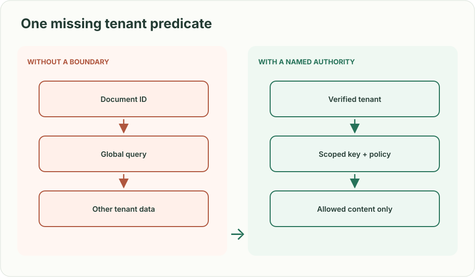
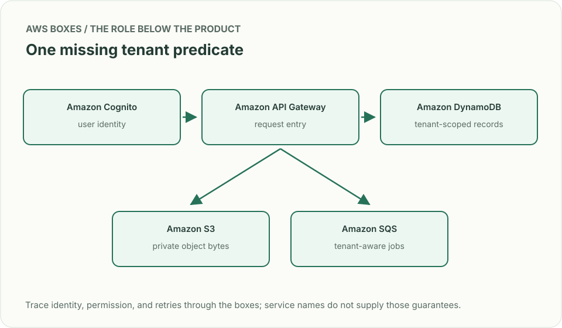
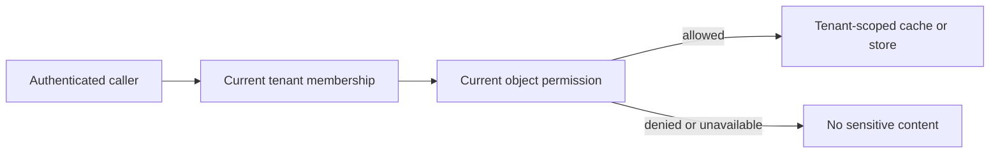
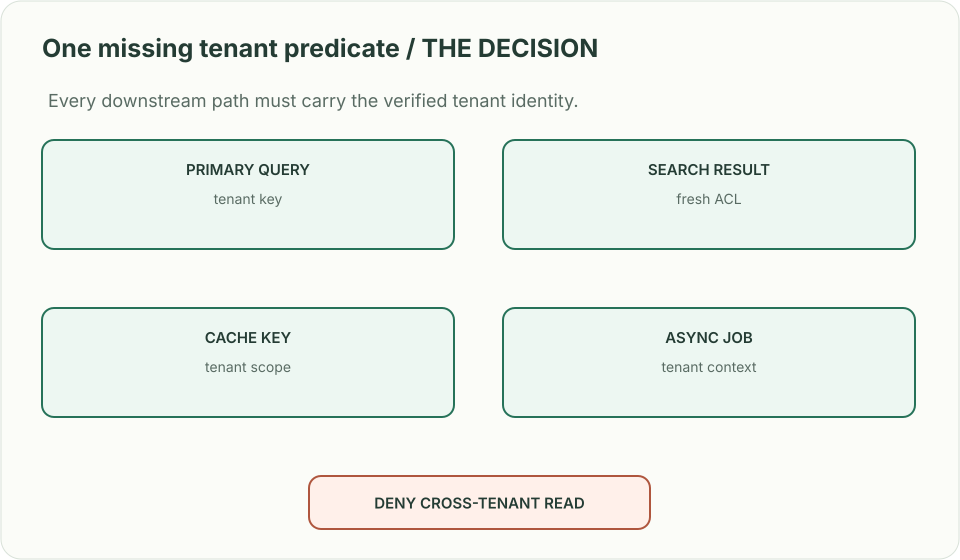

# Tenant isolation: an ID in the URL is not authority

> **Interviewer:** “Our SaaS dashboard serves 4,000 organizations from shared infrastructure. An engineer accidentally queries a document using only its document ID. How do you keep one tenant from reading another tenant's data, including through search, caches, exports, and background jobs?”

**Your contract.** Each request carries a verified tenant identity. Files and search snippets are sensitive. Some large tenants may need stronger isolation later. This is a constructed exercise.

| Request or failure | Required result |
|---|---|
| Tenant A requests B's document ID | 404 or 403 under stated disclosure policy; no title or content leaks |
| A signed URL for A's private file expires | New download requires fresh authorization; a cached URL must not bypass it |
| Worker receives A's job ID with B's object key | Refuse the mixed-tenant work before reading bytes |
| Tenant B floods export jobs | Tenant A retains its reserved share of processing capacity |

## Name the isolation boundary

Derive tenant identity from authenticated claims and membership, never a caller-supplied URL or body field alone. Carry it in a typed request context, scope all primary and secondary indexes, object keys, cache keys, logs, and queued messages. Check membership again at the **read of sensitive content**; an old search hit cannot authorize a snippet. Write a negative test that deliberately reuses a valid ID from another tenant. Separate security isolation from noisy-neighbor capacity: both need enforcement.

| AWS box | Job here | Alternative and deciding factor |
|---|---|---|
| Cognito or external OIDC | Verify caller identity and tenant membership claims | Existing identity provider with short-lived, verified tokens |
| API Gateway + application policy | Validate claims and bind tenant context to operations | ALB + ECS application when existing identity integration is already owned |
| DynamoDB scoped partition keys | Store records under tenant-prefixed keys; use conditional reads/writes | Separate tables or accounts for regulated tenants needing a stronger physical boundary |
| S3 private objects | Store tenant-scoped bytes; issue short-lived links after authorization | Separate buckets/accounts for strict billing and administrative isolation |
| SQS tenant-aware worker | Preserve tenant context and budgets in asynchronous jobs | Per-tenant queues for stronger rate isolation and operational cost |

An IAM leading-key policy can provide defense in depth for correctly mapped sessions; an application role shared by all tenants does not magically make IAM understand end-user identity. Treat signed URLs as bearer capabilities until expiry and minimize their lifetime.
A tenant prefix partitions keys; it neither authenticates a caller nor proves
current object permission. A versioned cache key is safe only when its version
comes from trusted permission state, not a caller or stale search result.

For this exercise, check permission on every sensitive read and fail unavailable
when the authority cannot be consulted. A bounded authorization cache is a
**different** contract: name its maximum age and include propagation/clock delay.
Already issued bearer downloads remain usable until their enforced expiry unless
a read-time broker or revocation-aware edge checks them. Do not promise instant
revocation from an application check that the download route bypasses.

**Drill:** warm search, snippet, cache, export and direct-download routes; pause
indexing, revoke access and repeat each read. Distinguish a storage-key test, an
IAM-session isolation test and an application ACL test. None replaces the others.

**Senior follow-up:** A bulk export includes a deleted document. Define the consistency point, authorization check at worker time, pagination snapshot rule, and deletion behavior.

**Staff follow-up:** Move one enterprise tenant into its own AWS account without changing public IDs. Plan key ownership, dual reads, rollback, cost attribution, and measurable proof that no pooled path still exposes data.

**Practice artifact:** Draw boundaries for request, index/cache, object, and queue; write five cross-tenant negative tests and one saturation test. Explain why each box must carry or recover trusted tenant context.

**Source boundary:** Original scenario. AWS's [pooled storage isolation](https://docs.aws.amazon.com/whitepapers/latest/saas-tenant-isolation-strategies/pooled-storage-isolation-strategies.html) and [multitenant DynamoDB strategies](https://docs.aws.amazon.com/whitepapers/latest/multi-tenant-saas-storage-strategies/multitenancy-on-dynamodb.html) describe the alternative isolation models.
