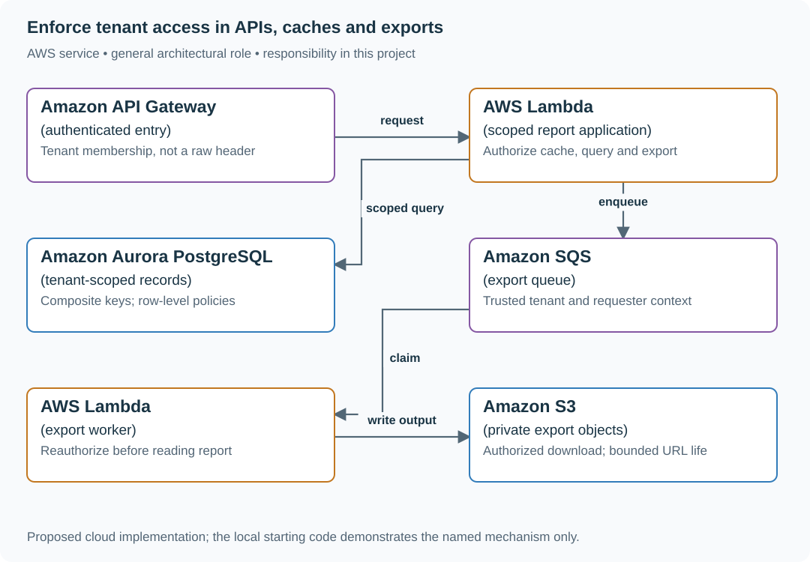
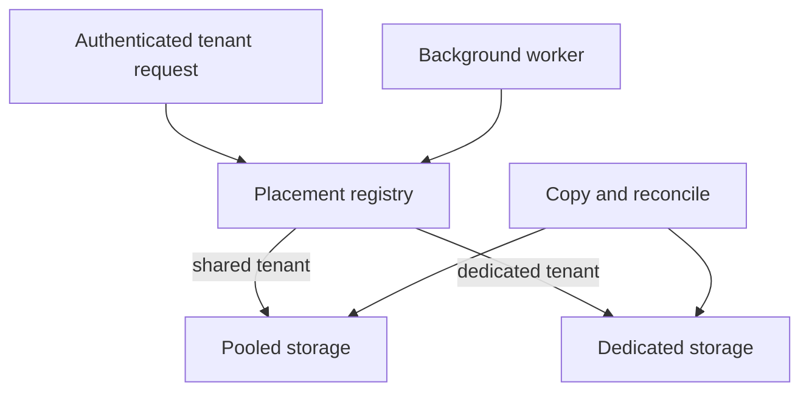

# Enforce tenant access in APIs, caches and exports

## Application background

Acme and Birch use the same report application, but each company expects its data to remain private. A company account is called a tenant. Its members may request reports, reuse previously generated results and download exported files.

Checking the company only on the first page is not enough. A guessed report ID, a saved download link or a queued export can reach the same data through another route. A person can also lose permission after work has already started.

### Example walkthrough

| Action | Expected behavior |
|---|---|
| An Acme member requests a Birch report ID | Return no report content. |
| An Acme export waits while its requester loses access | Check current permission before producing or exposing the file. |
| The former member asks for a previously cached report | Do not return the stored copy just because it exists. |

Every path to the data must use the current tenant and permission rules. A cache is a reusable copy of a result, not a separate source of permission.

## Your assignment

**Deliver:** Build report reads and exports that enforce the requesting company's current permissions. Demonstrate what happens to cached results and waiting exports when access is removed.

**Required behavior:** Every request has one verified tenant context. GET /reports/{id}, export creation and export download must authorize the resource under that context. Do not trust an X-Tenant-ID header independently of membership.

The required first milestone is a working local implementation of the behavior above. The numbered implementation steps define the scope. The cloud architecture is a later extension, not something the starter has already provisioned.

## Get the code and run the supplied example

The code is in the public [junior-to-staff repository](https://github.com/Soulful-Iris/junior-to-staff). Install Git and Python 3.12+. No AWS account or Python packages are required for this first run. If you already have a checkout, use it and skip cloning.

```bash
git clone https://github.com/Soulful-Iris/junior-to-staff.git
cd junior-to-staff
python3 examples/architecture-starts/tenant_isolation.py
```

**Supplied file:** [`examples/architecture-starts/tenant_isolation.py`](https://github.com/Soulful-Iris/junior-to-staff/blob/main/examples/architecture-starts/tenant_isolation.py). You can also [read or download the source here](../../../../examples/architecture-starts/tenant_isolation.py).

This program is a **mechanism demonstration**: it runs the small scenario in one process and prints the result. It is not an HTTP service, a complete application, or an AWS deployment. A successful run demonstrates this mechanism only. It does not establish the workload or failure guarantees of the application you will build.

**Example output from the supplied run:**

Generated IDs and timestamps may differ. Compare the state transitions and outcomes.

```text
404 scoped resource
Acme revenue
403 membership revoked
```

### Set up your implementation workspace

Create `work/tenant-isolation/` in your checkout (or use a separate repository). Copy the supplied mechanism into that directory as `mechanism.py`, then extract its state transitions into functions you can call from your implementation. The record and module names below describe what you must implement. They are not a promise that files with those names already exist. Keep a `README.md` beside your implementation with its exact run commands and observed results.

## Local components and state to implement

This table names the records, interfaces or decision inputs for your deliverable. Unless a name is explicitly linked to supplied source above, it is something you create. Implement the local state transitions first, then connect the HTTP, storage or worker boundaries required by the steps.

| Record / module | Key or interface | Responsibility |
|---|---|---|
| membership | (subject,tenant),role,revision | Current authorization basis. Revocation changes the revision. |
| reports | (tenant,report_id) | Tenant scope is part of every key and query. |
| export_jobs | tenant,requester,report_id,policy_revision | Workers reauthorize before reading. Downloads reauthorize before issuing access. |

## Implement the assignment

### 1. Create trusted request context

Resolve the authenticated subject’s active organization and role. Reject a requested tenant without membership. Make repository methods require a tenant argument. Avoid an unscoped get-by-ID convenience method that callers can accidentally use.

### 2. Protect cached and asynchronous reads

Key caches with tenant and object version. Check current authorization before returning cached content. A worker loads the job’s verified tenant and requester, then checks current access before generating bytes. Never accept a queue-provided object prefix as unrestricted filesystem or bucket authority.

### 3. Make export access revocable

Keep exports private. Reauthorize each new download request. A presigned URL remains usable until expiry, so choose a short documented window or proxy every download if immediate revocation is required. Revocation must also stop future regeneration from queued jobs.

### 4. Bound tenant resource use

Add per-tenant admitted-job counters and a fair scheduler. Show Acme over its limit while Birch continues making progress. Partition metrics by bounded tier or top offenders instead of creating millions of uncontrolled labels.

## Demonstrate the completed local result

| Action | Expected visible result |
|---|---|
| Run the starting program | Acme cannot read Birch’s report, and revoked Ana cannot receive her warm cached report. |
| Enqueue a job then revoke access | The worker records denied/cancelled and produces no downloadable export. |
| Mix tenant ID and object ID in a request | No cross-tenant result or existence disclosure outside the chosen 404 policy. |

**Handoff:** In your implementation README, include the start command, one successful operation, the failure case above and the resulting stored state or decision. State which dependencies are simulated. Someone with a fresh checkout should be able to reproduce this without your chat history.

## Workload assumptions and capacity decisions

These are constructed exercise assumptions. The stated workload is a design target. The local demonstration does not establish that throughput. Use the [estimation constants](../../../01-code/01-problem-solving/estimation-constants.md) to check units before choosing capacity.

| Input or objective | Calculation / consequence |
|---|---|
| 4,000 organizations. 250 reports each | One million reports. A guessed global report ID is not proof of membership. |
| 2,000 reads/s peak. 200 export jobs/min | Apply tenant scope to synchronous reads, caches, queue payloads and output downloads. |
| One tenant sends 1,000 jobs/min | Set per-tenant admission and worker shares before a shared queue becomes a noisy-neighbor outage. |

## Map the local implementation to AWS

**Deployment status: local only.** Running the supplied command creates no AWS resources and configures no cloud connections. The diagram is a proposed deployment of the completed application. Each box needs either a deployed runtime, a provisioned service or an explicitly external dependency.

Read the diagram by following the arrows from the entry point: application code accepts the request or event, the state owner commits it, and any worker produces the later result. The table ties those roles to code and adapter work. Multiple boxes do not imply multiple Python files already exist.



A shared database can be safe when tenant scope is enforced consistently. Dedicated databases trade cost and operating complexity for a stronger isolation boundary. Choose that for requirements that application-level scoping cannot satisfy.

| Local responsibility | Cloud destination and role | Implementation still required |
|---|---|---|
| Local HTTP boundary or the endpoint you will add | Amazon API Gateway: authenticated entry | Create routes and an integration. Translate requests and responses and configure identity validation. |
| Python operation or worker function | AWS Lambda: scoped report application | Write a Lambda event adapter, package its dependencies and give its role only the required resource actions. |
| Local records and transaction boundary | Amazon Aurora PostgreSQL: tenant-scoped records | Write PostgreSQL schema/migrations and a database adapter. Configure credentials, connection limits and recovery. |
| Local pending-work collection | Amazon SQS: export queue | Publish committed job intent, consume messages and persist deduplication/ownership state. Add visibility, retry and dead-letter handling. |
| Python operation or worker function | AWS Lambda: export worker | Write a Lambda event adapter, package its dependencies and give its role only the required resource actions. |
| Local file, object fixture or exported payload | Amazon S3: private export objects | Implement upload/download and metadata adapters, scoped access, object naming, retention and incomplete-upload cleanup. |

### Provision resources, then connect the application

| Resource or boundary | Initial configuration and reason |
|---|---|
| Aurora PostgreSQL | Tenant composite keys. Row-level security as defense in depth with a non-bypass application role and transaction-scoped tenant setting. |
| S3 private exports | Tenant-prefixed immutable objects. No public bucket access. Scoped worker permissions and short-lived authorized downloads. |
| SQS workers | Validate job schema and tenant relationship. Bound tenant concurrency and expose backlog age per tier. |
| Identity | Validate issuer/audience and membership. Identity-provider authentication does not authorize each report. |

Use one disposable AWS environment for the cloud exercise. Put the named resources in `infra/template.yaml` or your existing IaC tool, pass resource IDs through configuration, and scope each runtime role to its own tables, buckets and queues. The diagram is a design to implement. It is not a claim that these resources have been deployed. Record the commands you used to deploy and remove the exercise resources.

For concrete provisioning commands, configuration wiring and cleanup, use the [AWS foundation guide](../../../../examples/architecture-starts/infra/README.md). It includes a deployable table/queue/object-storage foundation and explains which application and service adapters you still implement.

A provisioned queue or table does not make the local program use it. Configure resource IDs in the deployed runtime, replace the local adapter, and replay the same successful and failing operation against that runtime. Record the deployed commit and observable result, then remove the disposable resources using your infrastructure tool.

## Extend the design after the baseline works
### Worked follow-up: Move one tenant into dedicated storage

An enterprise customer wants independent recovery and access controls. Forking every endpoint would make the two products drift. The new responsibility is deciding where a tenant lives and preventing stale workers from writing to its old home.

| Starting design | Changed requirement |
|---|---|
| All tenant rows share one storage placement. | A placement registry routes one tenant to its own database or account. |

**Revised architecture.** Follow the changed responsibility and failure path below. This is a design to implement. The supplied local example does not provision these components.



**What to implement.** Add a trusted placement record keyed by tenant with location, state and generation. Resolve it after authentication in both HTTP and worker paths. Copy one snapshot, apply newer changes and tombstones, then briefly quiesce that tenant's writers to reconcile and switch placement. Fence old-generation writes at the storage boundary. Move credentials and encryption access with the placement. In AWS, the dedicated target can be a separate RDS database or account-scoped table, with an assumed role restricted to that tenant.

**Walk through the result.** Move tenant T while tenant U continues normally. Resume an old T export after cutover. It must refresh its placement or fail, not read from the pooled copy. Reconcile values and deletions before routing. Keep the old copy inaccessible until its retention and rollback obligations end.


Offer dedicated storage to a regulated customer without forking the entire application. Define tenant placement metadata, connection routing, restore scope and the migration boundary between shared and dedicated storage.

<details>
<summary>Additional design cases, alternatives and original source notes</summary>


**Your contract.** Each request carries a verified tenant identity. Files and search snippets are sensitive. Some large tenants may need stronger isolation later. This is a constructed exercise.

| Request or failure | Required result |
|---|---|
| Tenant A requests B's document ID | 404 or 403 under stated disclosure policy. No title or content leaks |
| A signed URL for A's private file expires | New download requires fresh authorization. A cached URL must not bypass it |
| Worker receives A's job ID with B's object key | Refuse the mixed-tenant work before reading bytes |
| Tenant B floods export jobs | Tenant A retains its reserved share of processing capacity |

## Name the isolation boundary

Derive tenant identity from authenticated claims and membership, never a caller-supplied URL or body field alone. Carry it in a typed request context, scope all primary and secondary indexes, object keys, cache keys, logs, and queued messages. Check membership again at the **read of sensitive content**. An old search hit cannot authorize a snippet. Write a negative test that deliberately reuses a valid ID from another tenant. Separate security isolation from noisy-neighbor capacity: both need enforcement.

| AWS box | Job here | Alternative and deciding factor |
|---|---|---|
| Cognito or external OIDC | Verify caller identity and tenant membership claims | Existing identity provider with short-lived, verified tokens |
| API Gateway + application policy | Validate claims and bind tenant context to operations | ALB + ECS application when existing identity integration is already owned |
| DynamoDB scoped partition keys | Store records under tenant-prefixed keys. Use conditional reads/writes | Separate tables or accounts for regulated tenants needing a stronger physical boundary |
| S3 private objects | Store tenant-scoped bytes. Issue short-lived links after authorization | Separate buckets/accounts for strict billing and administrative isolation |
| SQS tenant-aware worker | Preserve tenant context and budgets in asynchronous jobs | Per-tenant queues for stronger rate isolation and operational cost |

An IAM leading-key policy can provide defense in depth for correctly mapped sessions. An application role shared by all tenants does not magically make IAM understand end-user identity. Treat signed URLs as bearer capabilities until expiry and minimize their lifetime.
A tenant prefix partitions keys. It neither authenticates a caller nor proves
current object permission. A versioned cache key is safe only when its version
comes from trusted permission state, not a caller or stale search result.

For this exercise, check permission on every sensitive read and fail unavailable
when the authority cannot be consulted. A bounded authorization cache is a
**different** contract: name its maximum age and include propagation/clock delay.
Already issued bearer downloads remain usable until their enforced expiry unless
a read-time broker or revocation-aware edge checks them. Do not promise instant
revocation from an application check that the download route bypasses.

**Drill:** warm search, snippet, cache, export and direct-download routes. Pause
indexing, revoke access and repeat each read. Distinguish a storage-key test, an
IAM-session isolation test and an application ACL test. None replaces the others.

**Senior follow-up:** A bulk export includes a deleted document. Define the consistency point, authorization check at worker time, pagination snapshot rule, and deletion behavior.

**Staff follow-up:** Move one enterprise tenant into its own AWS account without changing public IDs. Plan key ownership, dual reads, rollback, cost attribution, and measurable proof that no pooled path still exposes data.

**Practice artifact:** Draw boundaries for request, index/cache, object, and queue. Write five cross-tenant negative tests and one saturation test. Explain why each box must carry or recover trusted tenant context.

**Source boundary:** Original scenario. AWS's [pooled storage isolation](https://docs.aws.amazon.com/whitepapers/latest/saas-tenant-isolation-strategies/pooled-storage-isolation-strategies.html) and [multitenant DynamoDB strategies](https://docs.aws.amazon.com/whitepapers/latest/multi-tenant-saas-storage-strategies/multitenancy-on-dynamodb.html) describe the alternative isolation models.

</details>
