# 11 · Security — five projects

> Senior tier · each one an afternoon · read [the section](README.md) first

Five projects, and all five produce a check that can go red — which is the
section's standing rule, because *"we have never had an authorisation
incident"* and *"we would not know if we had"* produce identical dashboards.

You end up with a route-to-rule table that is diffed rather than remembered, a
test suite that impersonates one user against another's data, a CI pipeline
with no long-lived cloud key in it, a lockfile diff read for tampering rather
than CVEs, and — the one that matters most — a written list of the paths that
go around your own controls.



---

### 1. Routes minus checks

*You end up with a committed table of every route and its authorisation rule, and a difference that equals your published list of public routes — exactly.*

**Build**

Enumerate every route in your application and every authorisation check, then
subtract one list from the other mechanically. Commit the table. Make the
subtraction run in CI, so a new route without a check fails the build.

**The thought process**

The first decision is **what counts as a check**, and it is stricter than it
sounds. Middleware that establishes who the user is has not authorised
anything. A role check — `requires editor` — is coarse authorisation and says
nothing about *this row*. The only thing that counts for a mutating route is a
check against the specific object, and being pedantic about this distinction is
most of the value in the project.

Second: **this has to be mechanical or it is worthless.** A table you wrote by
hand is accurate on the day you wrote it. What you want is a list of routes
generated from the framework's router and a list of checks generated by
grepping or by a decorator registry, with the difference computed by a script.
The artefact is the script, not the table.

Third, and this is the shape that makes it enforceable: **make the safe
direction the default.** Uncovered routes should be denied rather than allowed,
so a forgotten check fails closed. If your framework cannot do that, the CI
diff is the substitute — and the difference must equal an explicit, published
list of deliberately public routes, not a shrug.

Fourth: **read three handlers yourself before believing the output.** A model
asked to audit authorisation sees a decorator on six routes and reports a
pattern. The file-and-line requirement in the prompt is what forces evidence
per row, and spot-checking is what tells you whether it complied.

**How to organise the prompts**

```
List every route in this codebase. Produce a table: method and path;
handler; does it require authentication; the authorisation rule,
quoted; the file and line where that rule runs; and whether the check
is object-level (this specific record) or only role- or session-level.

Routes where you cannot point to a line go first. Do not fix anything
and do not summarise — I want every route.
```

The file-and-line column is the constraint doing all the work. Without it you
get a summary; with it, every row needs evidence.

```
Now write the script that regenerates both halves of this table from
the code — routes from the router, checks from wherever they are
declared — and prints the difference.

The script's exit code should be non-zero when a route has no check
and is not on an explicit allowlist of public routes.
```

```
For every route you marked "role-level only": show me the query it
runs, and tell me whose rows that query can return if I pass an id I
do not own.
```

This is the prompt that converts a category into a finding. "Role-level only"
sounds like a minor gap until you read the query.

```
Which of these routes take an id from the request and use it in a
database lookup without a WHERE clause scoped to the caller? List them
with the line.
```

**On AWS**

Where the checks live matters, and the AWS-shaped mistake is putting them too
early. **API Gateway** authorizers — JWT or Lambda — are excellent at *who*
and structurally incapable of *which row*, because they run before your handler
knows what object is being touched. An **ALB** with OIDC authentication has the
same property. Treating either as "authorisation is handled" is the most common
version of this failure on AWS.

If you want the policy-engine shape from the section, **Amazon Verified
Permissions** is the managed one: policies in Cedar, evaluated per request, with
the object as a first-class input. The reason to consider it over hand-written
checks is that it gives you one place to audit and test; the reason to be
careful is exactly the drift failure the section names — a new endpoint that is
not mapped is governed by nothing, so configure unmapped to mean denied.

For the "what can all of it reach" half of the section's four questions,
**IAM Access Analyzer** is the tool worth an afternoon: external access findings
tell you which of your resources can be reached from outside your account, and
unused access findings tell you which roles and permissions nobody has
exercised — which is the raw material for actually shrinking a policy rather
than intending to.

And for denials: log them, then send them somewhere with an alarm.
**CloudTrail** covers AWS-API-level denials (`AccessDenied` events are the
signal that something is probing or that something is misconfigured), but your
*application's* denials are yours to emit. Zero denials last week is not clean —
the internet probes everything — it means the check cannot go red.

**What productionising it means**

The table is generated, not maintained. The diff runs in CI and fails the
build. The allowlist of public routes is a file somebody reviews. Denials are
logged with actor, object and rule, and there is one place a spike would be
visible. And the whole thing survives a framework upgrade, because it is
derived from the router rather than from a convention.

**The learning**

Broken access control is not a sophisticated attack, it is an omission — and
omissions are invisible to every instrument except subtraction. The reason this
has been the top web application risk for years running is that reviewing what
*is* checked will never find the route that nobody thought about.

**How you would know it is wrong**

- Add a route with no check and confirm CI fails. If it passes, the diff is decorative.
- Pick three rows the table calls covered and read the handlers yourself. Believing an audit you did not spot-check is the mistake the audit was meant to prevent.
- Count last week's authorisation denials. Zero means they are not logged.
- Check whether "authenticated" is standing in for "authorised" anywhere, especially at the gateway.
- Ask whether the uncovered set is a named list or an absence. An absence is not an allowlist.

---

### 2. The cross-user suite

*You end up with a test that signs in as one user, reaches for another's object on every mutating endpoint, and expects a refusal — and it goes red when you delete one check.*

**Build**

Write a test suite that, for every mutating endpoint, authenticates as user A
and sends a well-formed request naming user B's object. Every one must be
refused and every refusal must be logged. Run it in CI. Then delete one
authorisation check and confirm the suite catches it.

**The thought process**

The first thing to be clear about is **why the UI is not the test.** The delete
button renders only on your own items, which is a user-experience decision and
not a control. The request is just HTTP; anyone can construct it. So the suite
has to talk to the API directly, and any test that drives the browser is
testing the wrong layer.

Second: **well-formed is the whole point.** The request must be valid in every
respect except ownership — correct shape, correct types, a real object id that
exists and belongs to somebody else. A malformed request gets rejected by
validation and tells you nothing. This is fiddly to set up because you need two
real users with real data, and that fixture is most of the work.

Third, and this is the distinction that catches a subtle class of bug: **404
and 403 are both acceptable refusals and they leak different things.** Returning
403 confirms the object exists, which is an information leak in some products
and completely fine in others. Decide deliberately and assert on whichever you
chose, because an endpoint that silently switched from one to the other has
changed behaviour nobody reviewed.

Fourth: **the suite must be generated or it will rot.** A hand-written test per
endpoint is a list that falls behind the router within a month. Drive it from
the same route enumeration as project 1, so a new mutating endpoint is
automatically in scope and automatically fails until someone writes its
fixture.

Fifth, and this is the acceptance test for the suite itself: **break a check on
purpose and watch it go red.** A test suite that has never failed is a suite you
have no evidence about.

**How to organise the prompts**

```
Here is my route table. Generate a test that, for every MUTATING
endpoint, authenticates as user A and sends a valid request naming an
object owned by user B.

The request must be well-formed in every respect except ownership.
Each must be refused. Assert on the exact status I specify, and assert
a denial was logged with the actor and the object id.
```

```
Build the fixture: two users, each with at least one of every object
type, created through the real API rather than inserted directly.

Tell me which objects could not be created through the API, because
those are the ones my suite will silently skip.
```

The "could not be created" question is the one that finds the hole. Objects
that only exist via a migration or an admin path are exactly the ones nobody
tests.

```
Now drive this from the route enumeration rather than a hard-coded
list, so a new mutating route is in scope automatically and fails
until somebody adds its fixture.
```

```
Delete the ownership check in <handler>. Run the suite and show me
exactly which test failed and what it printed. Then restore it.

If nothing failed, tell me why the suite could not see it.
```

That last prompt is the instrument check. If deleting a real check does not
turn anything red, the suite proves nothing — and that is a finding about the
suite, not about the code.

**On AWS**

Two AWS-specific things belong in this project because they are where the
object-level check gets bypassed rather than omitted.

The first is **pre-signed S3 URLs**. Generating one is an authorisation
decision made at generation time, and the URL then works for anyone who has it,
for as long as its expiry allows. If your handler generates a pre-signed URL
from an id supplied by the caller without checking ownership, you have built an
IDOR with a shareable link attached. Include pre-signed URL generation in the
cross-user suite: user A asking for a URL to user B's object must be refused
before the URL exists.

The second is **SSRF against the instance metadata service**, which is the
AWS-native form of the section's "your server talked into spending its
authority for someone else". If any endpoint fetches a URL the user supplies —
a link preview, a webhook, an avatar import — then `169.254.169.254` is the
first thing an attacker tries, and on IMDSv1 it hands back instance
credentials. The fixes are concrete and worth doing today: **require IMDSv2**
(it needs a PUT to get a session token, which a blind SSRF cannot do) and set
the **hop limit to 1** so a containerised process cannot reach it. Then add an
SSRF case to the suite: a request whose target URL is a link-local or private
address must be refused.

For seeing abuse of credentials that did leak, **GuardDuty** has findings
specifically for instance credentials used from outside AWS, which is the exact
signature of a successful SSRF, and **CloudTrail** is where you confirm what
the stolen credential actually did.

**What productionising it means**

The suite runs on every pull request, not nightly. The fixture is created
through the real API so it cannot drift from reality. Denials are asserted, not
just refusals, because a refusal nobody logged is a refusal nobody can count.
New mutating routes are in scope by construction. And somebody has watched the
suite go red for a real reason at least once.

**The learning**

The security test you want is not "does the happy path work" but "does the
forbidden path fail", and those need opposite instincts: you have to write a
test that you want to see rejected. Once you have built one of these, you stop
believing any access-control claim that has not been attempted from the wrong
account.

**How you would know it is wrong**

- Delete one check. If the suite stays green, it is not testing what you think.
- Check whether the suite covers pre-signed URL generation and any other place authorisation happens away from the handler.
- Look for object types with no fixture. Those endpoints are skipped, silently.
- Point one user-supplied-URL endpoint at `169.254.169.254` and see what comes back. Then check your IMDSv2 and hop-limit settings.
- Confirm every refusal produced a log line with actor and object. Otherwise you cannot ever count denials.

---

### 3. Deleting the secret instead of rotating it

*You end up with no long-lived cloud credential in CI, and a revocation drill with a stopwatch number attached.*

**Build**

Census every credential the system uses. Split the list in two: the ones
workload identity federation can eliminate, and the ones that must remain
stored. Convert your CI-to-AWS path to OIDC federation. Then revoke something
in staging, on purpose, and time the recovery.

**The thought process**

Start with the inversion that gives this project its name: **the best secret is
one that does not exist.** A rotation schedule for a credential that should not
exist is diligence spent maintaining the vulnerability. So the first pass over
the census is not "how often do we rotate this" but "why does this exist at
all".

Second, why this matters more than it seems: **long-lived credentials outlive
everything around them** — the person who made them, the ticket that justified
them, and everyone's memory that they exist. GitGuardian's retest of secrets
leaked on public GitHub in 2022 found more than 64% still valid in January
2026. Four years. Nobody decided that; it is just what happens to a credential
with no expiry.

Third, the mechanism: **federation replaces a stored key with a proof.** Your
CI job holds a short-lived OIDC token issued by its own platform, exchanges it
for cloud credentials that live minutes, and stores nothing. The interesting
part is the trust policy, because that is where you say *which* CI job is
allowed to become *which* role — and it is where the mistake lives.

Fourth: **the revocation drill is the real deliverable.** Knowing your
credentials is theory; knowing how long it takes to kill one and recover is
operations. The number is usually worse than expected, and it is usually worse
because recovery needs a code change or a person who is asleep.

**How to organise the prompts**

```
Find every credential this system uses: environment variables, CI
secrets, config files, cloud keys, database passwords, third-party API
tokens. For each: what it grants, how long it lives, and what breaks
when it is revoked.

Then split the list. A: credentials that workload identity federation
between the platforms involved could ELIMINATE. B: credentials that
must remain stored secrets. Propose rotation only for B.
```

The split is the whole prompt. Ask for a secrets audit and you get a rotation
schedule covering everything, which quietly blesses the keys that should not
exist.

```
Convert the CI-to-cloud credential to OIDC federation. Write the trust
policy, and then attack it: what else could assume this role if I got
a condition slightly wrong?
```

That second question is the one that matters and I would not skip it — see the
AWS note below.

```
For everything in list B, tell me: where is it stored, who owns it,
when does it expire, and what would tell me it had been used by
somebody who should not have it.
```

```
Design a revocation drill for <one credential> in staging: how to
revoke it, how to know the system noticed, how to restore, and what
I should time.
```

**On AWS**

The mechanism is **GitHub Actions OIDC** exchanged for an IAM role via
`sts:AssumeRoleWithWebIdentity`. You register GitHub's OIDC provider in IAM
once, create a role, and write a trust policy. The whole security of the
arrangement is in that trust policy's condition block, and there is one
specific way to get it wrong that is worth memorising: **conditioning on
`aud` alone, or on `sub` with a careless wildcard, lets repositories you do not
own assume your role.** The condition must pin `token.actions.githubusercontent.com:sub`
to your own org, repo and — if you care — branch or environment. Then test it
by trying to assume the role from somewhere that should not be allowed. That is
the same "try the bypass you believe is closed" instinct as project 5, applied
to your own trust policy.

For list B, the storage comparison: **Secrets Manager** gives you built-in
rotation with Lambda rotation functions and cross-region replication;
**SSM Parameter Store** `SecureString` is the cheaper, simpler option with no
managed rotation. The honest rule is that if a secret needs automated rotation
and a rotation function exists for it — RDS credentials are the canonical case
— Secrets Manager earns its cost, and otherwise Parameter Store is the boring
right answer. Both encrypt with **KMS**, and the KMS key policy is a second
authorisation layer people forget they have.

The AWS-native way to remove a whole category from list A: **RDS IAM database
authentication** lets your application get a short-lived token instead of
holding a database password at all. It has real limits — connection rate,
engine support — but it deletes the credential people are least willing to
rotate.

And for verification: **IAM Credential Report** lists every user's access keys
with their age and last-used date, which turns "we probably do not have old
keys" into a CSV. **IAM Access Analyzer**'s unused-access findings do the same
for roles and permissions. Both answer the question in a minute and neither is
run often enough.

**What productionising it means**

No long-lived cloud key exists in CI. The trust policy is pinned to your
repository and somebody has tried to assume it from outside and failed. Every
remaining stored secret has a named owner and an expiry date, and the expiry is
enforced by something other than a calendar reminder. The revocation drill has
been run, timed, and written down, and the number is short enough that you
would do it during an incident rather than negotiating.

**The learning**

Rotation is what you do with credentials you could not eliminate, and most
teams have the ratio backwards — they build elaborate rotation for keys that
federation would delete, then keep the one credential nobody dares touch. The
shift is from "how do we manage secrets" to "how few can we have".

**How you would know it is wrong**

- Read the expiry on the credential CI uses. Months means a stored key, whatever the dashboard calls it.
- Try to assume your CI role from a repository you do not own. It must fail, and you should watch it fail.
- Revoke something in staging and time the recovery. That number is your incident response time.
- Run the IAM credential report and sort by key age. There is usually one from before anyone remembers.
- Check whether list A is empty. If it is, name your CI and your cloud and ask again — the pairing exists.

---

### 4. The lockfile diff, read for tampering

*You end up able to say, inside a minute, the age of your newest production dependency — and with a cooldown that would have stopped the last few real incidents.*

**Build**

Take a real lockfile diff and review it for tamper signals rather than known
vulnerabilities: version age, install-script changes, provenance, publisher
changes. Set a cooldown so versions younger than a day cannot be installed.
Generate an SBOM. Then answer "are we affected by X?" as a query rather than as
archaeology.

**The thought process**

The first thing to separate is **two completely different instruments wearing
similar badges.** A CVE scanner answers "is this known to be bad", which is a
question about the past. Tamper review answers "was this changed under me",
which is a question about the last few days. A package compromised yesterday
has no CVE, so a green scan is not evidence about the thing you are worried
about.

Second: **the lockfile diff is production code arriving in a pull request.**
It changes what executes on your machines, and it is the one file in every
review that nobody reads because it is long and machine-generated. Reading it
is a discipline, which is why the practical answer is a tool that reads it and
surfaces four columns.

Third, the highest-leverage policy: **a cooldown.** Most malicious releases are
caught within hours — pnpm's own documentation argues within one — so refusing
versions younger than a day sidesteps most of the risk for almost no cost. You
need an exclude list for urgent security fixes, and that list is a deliberate,
reviewed exception rather than a bypass.

Fourth: **provenance is useful mostly by its absence.** A package that normally
publishes with provenance suddenly publishing without it is a signal tooling
can check, and that asymmetry — absence is the alarm — is the thing to
understand. It is also precisely how the malicious axios versions were spotted.

Fifth: **the SBOM's value is on a specific bad Tuesday.** When a compromise is
announced, "are we running it?" should be a query against an inventory, not an
afternoon of grepping deploys. Build it now so the answer takes a minute then.

**How to organise the prompts**

```
Here is the lockfile diff from this pull request. For every package
added or changed: days since this version was published; does it add
or change install scripts; is it published with provenance or
attestations; has the publisher or publishing method changed recently.

Do not report CVE counts. I am asking about tampering, not known bugs.
```

The prohibition is load-bearing. Left alone, the answer becomes a vulnerability
report, which is a different and less urgent question.

```
Configure a cooldown: refuse versions younger than 24 hours, with an
explicit exclude list for urgent fixes. Show me the config, and tell
me what happens in CI when somebody adds a package published an hour
ago.
```

```
Generate an SBOM for what actually runs in production — not for the
repository, for the built artefact. Explain the difference and tell me
which one I just produced.
```

That distinction catches a real mistake. An SBOM of your source tree includes
dev dependencies and omits whatever the base image contributed.

```
Now use it: here is a package name and version that was just
announced as compromised. Write the query that tells me whether it is
in anything I am running, and how long that query takes.
```

**On AWS**

Two places this lands concretely.

For container images, **Amazon ECR** has image scanning — basic scanning on
push, and enhanced scanning backed by **Amazon Inspector**, which continuously
rescans images already in the registry as new vulnerabilities are published.
The continuous part is what matters: an image that was clean when you pushed it
is not clean forever, and a scan-on-push-only posture quietly tells you
otherwise. Inspector also covers running EC2 instances and Lambda functions,
and it can emit an SBOM for what it found.

For packages, **CodeArtifact** is the proxying repository, and the reason to
put it in the path is that it gives you a control point — upstream packages are
cached on first use, so you get a record of what you pulled and a place to
block a specific version across every build at once. That "block it everywhere
in one action" property is what you want on the bad Tuesday.

For the build itself: run installs with lifecycle scripts disabled and strictly
from the lockfile, and publish from CI with no long-lived token, which is
project 3's work reappearing here. If you are signing artefacts,
**AWS Signer** covers Lambda code signing and container image signing, and
**CodeBuild** can produce build provenance.

And for the inventory question, if your SBOMs land in **S3**, **Athena** over
them turns "are we affected" into SQL. That is unglamorous and it is exactly
the difference between a minute and an afternoon.

**What productionising it means**

The cooldown is configured, not intended, and CI fails when it is violated. The
exclude list is short and reviewed. An SBOM is produced for every build
artefact and stored somewhere queryable. Lockfile diffs get read — by a tool if
not by a person — for the four tamper columns. And somebody can state the age
of the newest production dependency without looking it up for ten minutes,
because if nobody can, there is no cooldown whatever the policy document says.

**The learning**

The supply chain is the part of your codebase you did not write and cannot
review, so the controls have to be structural rather than attentive — age,
provenance, install scripts, one place to block. Vulnerability scanning feels
like it covers this and covers a disjoint problem: the known past, not the
tampered present.

**How you would know it is wrong**

- Ask for the age of your newest production dependency. If it takes more than a minute, there is no cooldown.
- Add a package published an hour ago and check CI refuses it.
- Take a real announced compromise and time how long it takes to answer "are we running it".
- Check whether your SBOM describes the artefact or the repository. They are different documents and only one is true in production.
- Confirm install scripts are disabled in CI. Then check the same for your container build, which is usually a separate config nobody changed.

---

### 5. The second path

*You end up with a written list of the ways around each of your own controls, and at least one of them closed.*

**Build**

Take three controls you believe you have — the authorisation check, the OIDC
publishing path, the review requirement — and for each, hunt the parallel path
that goes around it. Then actually attempt the bypass you believe is closed.
Close one.

**The thought process**

This is the most senior project in the section and the reasoning generalises
past security. The observation is the one from the axios compromise: **the
control was real and a second path went around it.** Trusted publishing over
OIDC was correctly configured. The attacker did not defeat it; they published
manually with a stolen long-lived token, through a door nobody had closed
because nobody had enumerated the doors.

So the first move is a reframing: **stop asking whether the control is strong
and start asking whether it is the only way in.** Those are different audits
and almost everybody does the first one. Strength is what you think about when
you build it; exclusivity is what you have to go and check.

Second, the method: **for each control, ask who else can reach the protected
thing, and how.** Not "can the gate be forced" but "what else has a key". The
answers are usually mundane — an admin console, a migration script, a break-
glass role, a legacy API version, a CI job from a project that was archived,
somebody's laptop.

Third, and this is where most of the findings come from: **look for things that
were once the main path.** Every bypass was, at some point, the normal way to
do it. The old publish token, the pre-SSO login page, the direct database
access that predates the service. Deprecation removes something from the
documentation, not from the system.

Fourth: **then attempt it.** A control believed to be exclusive and never
tested is in the same evidentiary state as one that is not. Try the dry-run
publish with the token you think is dead. Try the login path you think is
disabled. The axios attacker found that check unrun; that is the position you
are trying not to be in.

Fifth, the honest scoping: **you will not close them all**, and some of the
second paths are load-bearing — break-glass access exists for a reason. The
deliverable is the list plus a decision per item, not zero.

**How to organise the prompts**

```
Here is a control I believe I have: <describe it — for example, "only
CI can deploy to production, over OIDC">.

Do not evaluate whether it is strong. Enumerate every OTHER way the
protected thing could be reached: other credentials, other roles,
console access, legacy endpoints, break-glass paths, anything that
predates this control.

For each, say whether it is currently open and how I would check.
```

The "do not evaluate strength" instruction is what stops the answer becoming
reassurance about the gate.

```
Now the same question backwards. If I wanted to change what runs in
production WITHOUT going through the designed path, what are my
options, ranked by how likely they are to still work?
```

Asking it from the attacker's side produces a different and usually longer
list than asking it from the defender's.

```
For each path on that list, write the specific command or request I
should run to find out whether it still works, and what a "still open"
result looks like.
```

```
I ran them. <Results.> For each open path: close it, put a detection
on it, or write down why it stays open and who approved that. Tell me
which of the three you recommend and why.
```

Three outcomes rather than one is deliberate. A path you cannot close should
get a detection; a path you keep on purpose should have a name against it.

**On AWS**

The enumeration has AWS-specific answers worth knowing, because "who else can
reach this" has a literal tool.

**IAM Access Analyzer** external access findings answer, mechanically, which
principals outside your account can reach a resource — S3 buckets, KMS keys,
roles, SQS queues. That is the second-path question asked of your resource
policies, and it is the single highest-yield thing in this project.

For the "what else has a key" question inside your account: **IAM policy
simulator** and Access Analyzer's unused-access findings, plus a
**CloudTrail** query for which principals have actually touched the resource in
the last ninety days. That last one reliably surfaces a role nobody remembers
creating.

For the paths that predate the control: check for **IAM users with access keys**
where you believe everything is role-based; check for **security groups** with
0.0.0.0/0 where you believe everything is behind a load balancer; check whether
**S3 Block Public Access** is on at the account level and not just per-bucket;
check whether an old **API Gateway stage** is still deployed. Each is a
five-minute query and each is a classic second path.

For detection on the ones you keep: **CloudTrail** with a metric filter and
alarm on use of the break-glass role, **GuardDuty** for anomalous credential
use, and **AWS Config** rules for the settings you want to stay true — Config's
value here is that it tells you when something drifts back open, which is the
failure mode of a control you closed once.

**What productionising it means**

The second-path list is a document with a decision per line: closed, detected,
or accepted with a name against it. Break-glass paths are alarmed, so using one
is noisy by design. Config rules watch the settings you closed, because
somebody will reopen one with good intentions. And the enumeration is repeated
— annually, or when the architecture changes — because every new integration is
a new door.

**The learning**

Security review has two halves and almost everyone does only the first: is this
control correct, and is this control the only way. The second half is where the
real incidents live, because a bypass does not have to defeat anything — it
just has to still be there. Once you have hunted one second path you will never
again read "we require X" as meaning "X is required".

**How you would know it is wrong**

- Attempt the bypass rather than reasoning about it. A dry-run publish with a token you believe is dead should be refused; find out.
- Run Access Analyzer external findings. If you expected zero and got some, that gap is the project.
- Ask when each control was introduced, then look for what it replaced. The replaced thing is usually still there.
- Check whether break-glass use is alarmed. An accepted second path with no detection is an unmanaged one.
- Count the paths you closed. If the answer is zero, either your system is unusually tidy or you enumerated from the documentation rather than from the account.
