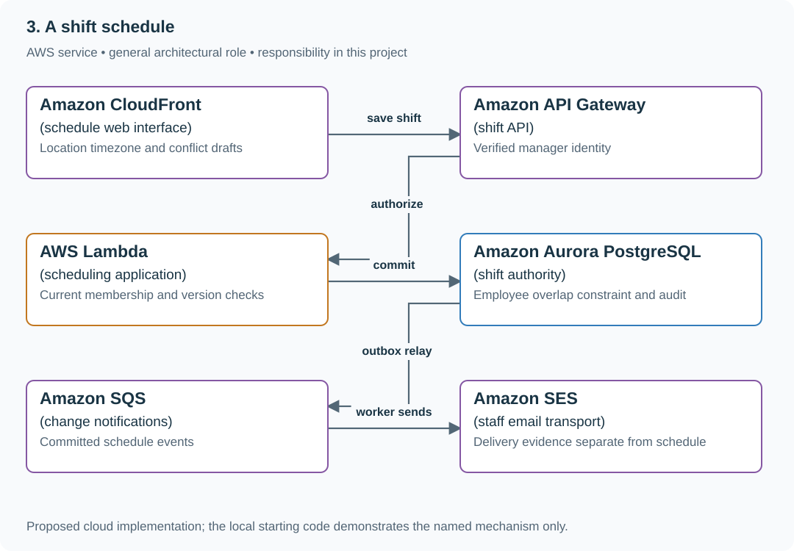

# 3. A shift schedule

## What you are building

> Build a shift planner for a café with two locations. A manager assigns Ana from 09:00–12:00 while another manager assigns her 11:00–14:00. A former manager still has the schedule open in a browser after their access is revoked.

**Working contract:** Only current managers may change a location’s schedule. An employee cannot hold overlapping active shifts across locations. Cached schedule visibility and stale browser sessions do not authorize new changes.

## Workload and the decisions it changes

These are constructed exercise assumptions. The stated workload is a design target; the local demonstration does not establish that throughput. Use the [estimation constants](../../../01-code/01-problem-solving/estimation-constants.md) to check units before choosing capacity.

| Input or objective | Calculation / consequence |
|---|---|
| 40 employees; two locations; four weeks visible | A small relational dataset; correctness matters more than distributed storage. |
| [09:00,12:00) and [11:00,14:00) | They overlap; [12:00,15:00) is a valid adjacent shift. |
| Immediate revocation for new writes | Recheck current membership at commit; token validity alone is insufficient. |

## Start with one working boundary

Run from the repository root with Python 3.12+:

```bash
python3 examples/architecture-starts/a_shift_schedule.py
```

[Open the starting code](../../../../examples/architecture-starts/a_shift_schedule.py). This is a runnable demonstration of the critical state boundary. The API, UI, cloud adapters and operating behavior below are the application you build around it.

| Record / module | Key or interface | Responsibility |
|---|---|---|
| shifts | employee,start_utc,end_utc,location,version | Authoritative occupancy and conditional edits. |
| manager_membership | subject,location,role,revision | Current write authorization. |
| audit_events | shift,actor,before,after,request_id | Who changed the schedule and why. |

## AWS implementation



A relational exclusion constraint directly expresses overlapping employee occupancy. Identity and cached UI state are inputs to the workflow, while current membership and the database write decide whether the change is allowed.

## Build it in this order

### 1. Model time and overlap

Store UTC instants plus the location timezone needed for display and recurring intent. Use half-open intervals and require end after start. In PostgreSQL, enforce employee/time exclusion in the write transaction; a prior availability query is only advisory.

### 2. Authorize the actual mutation

Resolve current manager membership for the target location and validate employee eligibility. Scope every query and update. If access changes during a long edit, the final save checks current authority and returns a clear denial without silently losing the draft.

### 3. Make concurrent changes visible

Require expected shift version for edits/cancellations. Show who changed the latest version and preserve the losing proposal. Commit an audit intent with the change so a crash cannot erase evidence of an accepted schedule edit.

### 4. Publish and recover schedules

Send notifications asynchronously after commit. A failed notification does not cancel a valid shift. Keep versioned export/print views and demonstrate recovery from backup while preserving accepted assignments and audit history.

## Infrastructure configuration

| Resource or boundary | Initial configuration and reason |
|---|---|
| Database | Exclusion constraint by employee/time and short transactions; index location/date views separately. |
| Authorization | Current membership check for each mutation; no client-supplied manager role. |
| Notifications | Bounded retry and visible failure status without changing committed shift ownership. |

Use one disposable AWS environment for the cloud exercise. Put the named resources in `infra/template.yaml` or your existing IaC tool, pass resource IDs through configuration, and scope each runtime role to its own tables, buckets and queues. The diagram is a design to implement; it is not a claim that these resources have been deployed. Record the commands you used to deploy and remove the exercise resources.

For concrete provisioning commands, configuration wiring and cleanup, use the [AWS foundation guide](../../../../examples/architecture-starts/infra/README.md). It includes a deployable table/queue/object-storage foundation and explains which application and service adapters you still implement.

## Observe the result

| Action | Expected visible result |
|---|---|
| Run the starting program | The overlap is rejected, the adjacent shift succeeds, and revoked m1 cannot assign Ben. |
| Two managers race for one employee | One authoritative transaction rejects the conflict. |
| Stop email delivery | The committed schedule remains correct and notification failure is visible. |

## The next design decision

Add recurring shifts across a daylight-saving transition. Keep local recurrence intent separate from UTC occurrences and define the policy for nonexistent or ambiguous local times.

<details>
<summary>Further constraints from the original project</summary>

## Follow-up 1 · A link was cached

**Changed requirement:** You add CloudFront for static assets. What happens to the protected schedule route? Predict which boundary must change before opening the design.

<details>
<summary>Expected reasoning and changed diagram</summary>

Use a cache-disabled behavior for protected schedule data and no-store responses. Validate the token against the authoritative store for every new request; fail closed if it is unavailable. Static shell assets may remain cached.

</details>

## Follow-up 2 · Product accepts bounded revocation

**Changed requirement:** Product now allows up to 60 seconds before a revoked link stops working globally. What must be specified? State what evidence would make you reject your first design.

<details>
<summary>Expected reasoning and changed diagram</summary>

Choose and verify a bounded authorization propagation/cache policy; an object TTL alone is not necessarily the token-decision bound. Measure warm identical GETs across delivery locations and define fail-closed behavior. Signed expiry bounds access only under its actual expiry semantics.

</details>

## Supplied mechanism practice

- [Warm-cache revocation fixtures](../../../04-scale-and-evolution/01-data-at-scale/labs/cache-consistency/revocation.md) — includes its own run command, fixtures and validation limits.

These exercises verify specific boundaries; completing their reference tests does not implement or assess the full project.

</details>
