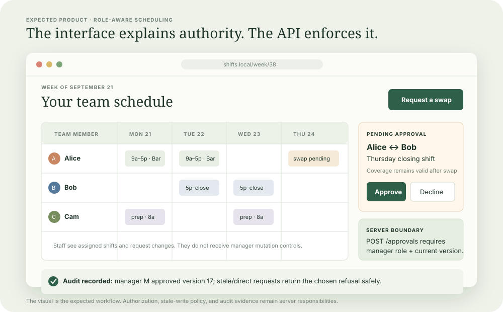
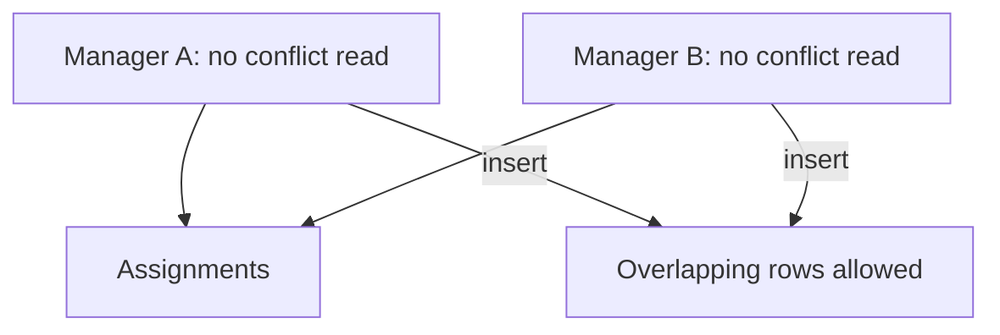
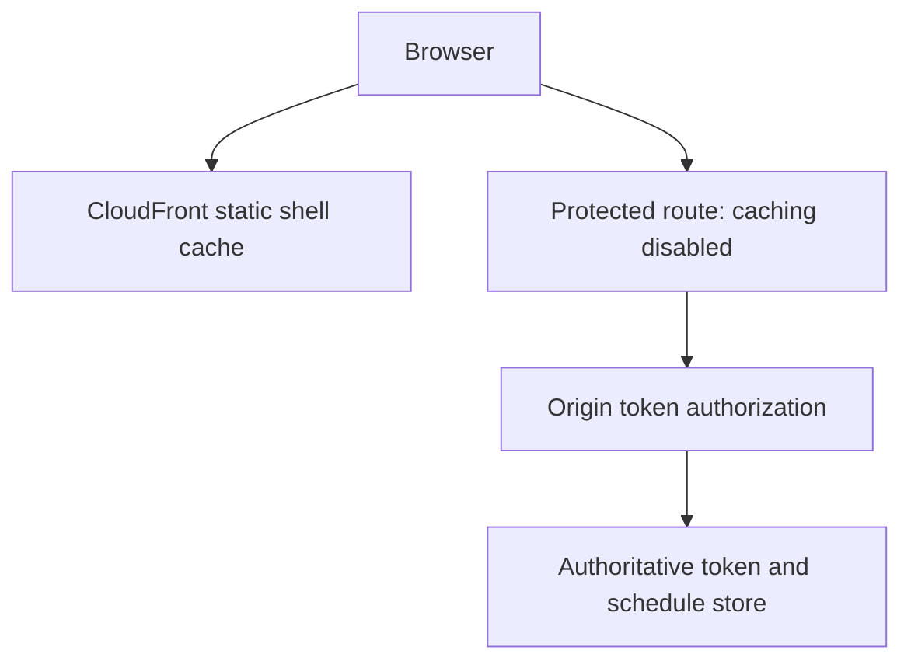
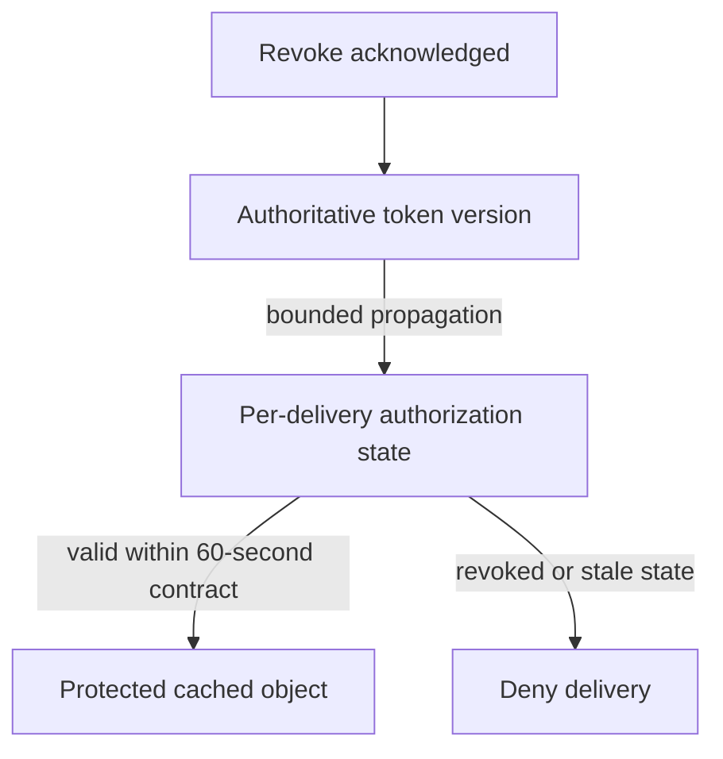
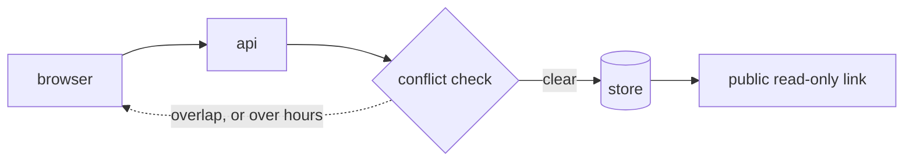

# 3. A shift schedule

[Curriculum](../../../README.md) · [Security](../README.md) · [Project index](../../../../indexes/projects.md)

## The reviewer's brief

> Two managers assign the same person to overlapping shifts at the same time. A public schedule link must also stop authorizing new reads immediately after revocation is acknowledged. Design both enforcement boundaries. Which cache hits execute authorization?

This is a **constructed practice brief**, not an attributed company question.
Prerequisites: [project index](../../../../indexes/projects.md) and [prerequisite lesson](../../../01-code/01-problem-solving/change-loop.md). This page is a build brief; it does not ship a runnable application. The original build and prompt sequence below defines the implementation checkpoints.

| Case | Exact input or workload | Expected outcome |
|---|---|---|
| Small example | A: person 7 at 09:00–12:00 UTC; B: same person at 11:00–14:00 UTC, concurrent saves. | Exactly one commits; the other returns conflict. Adjacent 12:00–14:00 after 09:00–12:00 is permitted by half-open intervals. |
| Boundary / failure | Warm GET token T returns 200; revoke T; issue identical GET again. | After revocation acknowledgment, the new GET returns 403/404; no shared cached body bypasses authorization. |
| Scope | No recall of already downloaded data; authoritative revocation checked on each new protected request. | Explain any additional assumption before implementing it. |

## See the first reviewable result

**First slice:** Give manager and employee views of the same schedule. Two concurrent writes assign person 7 to 09:00–12:00 and 11:00–14:00 UTC; exactly one saves, the other receives a conflict. **Show:** a direct API swap request from a non-owner returning your declared 403/404 policy, and a read after token revocation that cannot return a warm cached private schedule.

| Action | Expected screen or response | Invariant to inspect |
|---|---|---|
| Concurrently save person 7 at `[09:00,12:00)` and `[11:00,14:00)` | One success, one conflict | Database contains one of the overlapping shifts, never both. |
| Save `[12:00,14:00)` after `[09:00,12:00)` | Success | Half-open intervals allow touching endpoints. |
| Staff member edits a manager-only assignment through a direct API call | `403` or documented `404` | Server checks role and ownership even if the button is hidden. |
| GET protected schedule with token T; revoke T; repeat the identical GET after acknowledgment | First `200`, subsequent `403`/`404` | No shared cache serves the old private response. |

Sketch separate boxes for the browser, protected route, authorization store, and assignment database. Mark the exact atomic write that prevents overlap and the authorization check that *every* protected GET must reach; static asset caching has a different rule.

<!-- project-expectation:start -->

## What you are expected to hand over

**The finished artifact:** A role-aware shift schedule where staff can see their work and request swaps, managers approve changes, and every direct API request enforces the same authorization shown by the interface.



Bring a runnable slice or decision artifact, its normal output, and a captured
failure from the examples above. Include one check that turns red when the guarantee
breaks, the state owner, and the first operational limit. For each follow-up,
change the diagram **and** the evidence before claiming the design still works.

### How the review conversation gets harder

| Review gate | The interviewer changes | Expected response |
|---|---|---|
| Baseline | Run the small example from the cases above. | Demonstrate the observable outcome end to end and identify which boundary owns it. |
| Failure | Reproduce the boundary/failure case above. | Show the failure before the fix, then prove the protected behavior without hiding the error. |
| Senior · A link was cached | You add CloudFront for static assets. What happens to the protected schedule route? Predict which boundary must change before opening the design. | Use a cache-disabled behavior for protected schedule data and no-store responses. Validate the token against the authoritative store for every new request; fail closed if it is unavailable. Static shell assets may remain cached. |
| Lead · Product accepts bounded revocation | Product now allows up to 60 seconds before a revoked link stops working globally. What must be specified? State what evidence would make you reject your first design. | Choose and verify a bounded authorization propagation/cache policy; an object TTL alone is not necessarily the token-decision bound. Measure warm identical GETs across delivery locations and define fail-closed behavior. Signed expiry bounds access only under its actual expiry semantics. |
| Evidence | A reviewer asks, “How do you know?” | Build in three stops: reproduce the small case and baseline failure; implement the protected boundary; then replay both changed requirements with captured outputs. |
| Handoff | The author is unavailable and the environment is new. | Another engineer can run, observe, break, and recover the artifact from the repository evidence. |

Before implementation, say the baseline invariant, the owner of each piece of
state, and what the user sees when the named dependency or assumption fails. That
five-minute explanation is part of the project: if it is vague, the build is not
ready to begin.

<!-- project-expectation:end -->

Before looking at the guidance, state the invariant in one sentence and trace the example. In interview practice, implement or sketch independently, then reveal the reasoning. During AI-assisted practice, use the prompts below and verify each checkpoint before the next request.

## Baseline and the failure to explain



Read-then-write checks race. Protect overlap with a database exclusion constraint or another correctly serialized transaction protocol.

<details>
<summary>Reveal the approach and decisions</summary>

Define time intervals and timezone interpretation, then enforce the overlap invariant at the atomic write boundary. For strict link revocation choose no shared caching on protected responses and authoritative token checks. A token in a cache key isolates tokens but does not recheck revocation.

</details>

## Follow-up 1 · A link was cached

**Changed requirement:** You add CloudFront for static assets. What happens to the protected schedule route? Predict which boundary must change before opening the design.

<details>
<summary>Expected reasoning and changed diagram</summary>

Use a cache-disabled behavior for protected schedule data and no-store responses. Validate the token against the authoritative store for every new request; fail closed if it is unavailable. Static shell assets may remain cached.



</details>

## Follow-up 2 · Product accepts bounded revocation

**Changed requirement:** Product now allows up to 60 seconds before a revoked link stops working globally. What must be specified? State what evidence would make you reject your first design.

<details>
<summary>Expected reasoning and changed diagram</summary>

Choose and verify a bounded authorization propagation/cache policy; an object TTL alone is not necessarily the token-decision bound. Measure warm identical GETs across delivery locations and define fail-closed behavior. Signed expiry bounds access only under its actual expiry semantics.



</details>

## Evidence to bring to review

Build in three stops: reproduce the small case and baseline failure; implement the protected boundary; then replay both changed requirements with captured outputs. Record commands, fixtures, and observed results in your implementation README. A diagram is a prediction until those checks run.

**Senior expectation:** Test overlapping transactions and warm-cache revocation, including origin outage. **Additional lead scope:** Own the revocation SLA, global propagation and timezone policy. Completion demonstrates practice evidence; it does not establish interview readiness or multi-team delivery experience.

## Supplied mechanism practice

- [Warm-cache revocation fixtures](../../../04-scale-and-evolution/01-data-at-scale/labs/cache-consistency/revocation.md) — includes its own run command, fixtures and validation limits.

These exercises verify specific boundaries; completing their reference tests does not implement or assess the full project.

## Build and prompt sequence

*Who works when, with conflicts caught before they are saved.*

**Build**

People, shifts, assignments. Assigning somebody to two overlapping shifts is
refused with a reason. A read-only link a person can open without an account.



**The thought process**

This one is about **where a rule lives**. The overlap check can sit in the
interface, in the application, or at an atomic database boundary. A plain
read-then-write application check races when two people save together. A
database constraint or correctly serialized transaction protocol protects
the rule; the concurrent fixture distinguishes these mechanisms.

Then time, which is harder than it looks: a shift crossing midnight, a week
starting on Sunday somewhere and Monday elsewhere, a daylight-saving transition
where a local hour happens twice. Store instants in UTC, store the intended
timezone separately, and never do arithmetic on local strings.

Third: the read-only link. A URL anyone can open is an authorisation decision
disguised as a convenience. Unguessable, revocable, and it must not expose
anything beyond the shifts — no phone numbers, no other groups.

**How to organise the prompts**

```
I am building a shift schedule. Write the data model, and tell me for
each rule I have (no overlaps, maximum hours per week) whether it can be
enforced in the database itself or only in application code, and why.

Do not write code yet.
```

```
Implement the overlap rule as a database constraint. Then write a test
that fires two conflicting assignments CONCURRENTLY and asserts exactly
one succeeded.

Show me that test failing against an application-only check first.
```

That sequence is the project. Watching the application-level check let both
writes through is worth more than any explanation of race conditions.

```
Timezones: store instants in UTC with the intended zone alongside.
Write tests for a shift crossing midnight and one crossing a
daylight-saving boundary.
```

```
The public link: unguessable, revocable, and returning only shift times
and names. Show me exactly what it exposes.
```

**On AWS**

**RDS** PostgreSQL, because you want real constraints — exclusion constraints
over time ranges are a genuine reason to choose Postgres for this, and they are
the shortest route to a rule that holds under concurrency. DynamoDB can be made
to work with careful key design, and this is the clearest case among these application projects where a
relational store is simply the better answer.

For the public link, choose the revocation contract first. This exercise uses
**strict revocation for new requests after acknowledgment**: configure the
protected route with caching disabled and `Cache-Control: no-store`, and check
the token against the authoritative store on every request. Fail closed when
that check is unavailable. Cache the static shell separately in **CloudFront**.
Previously downloaded data and in-flight responses cannot be recalled.

A cache hit can bypass the origin, even when the token is in the cache key.
Signed expiry and invalidation alone are not an immediate-revocation proof.
A bounded-staleness alternative must specify the authorization-state bound and
verify it across delivery locations. Technical semantics checked 2026-09-22:
[CloudFront delivery](https://docs.aws.amazon.com/AmazonCloudFront/latest/DeveloperGuide/HowCloudFrontWorks.html)
and [cache-key policy](https://docs.aws.amazon.com/AmazonCloudFront/latest/DeveloperGuide/controlling-the-cache-key.html).

Reminders, if you add them: **EventBridge Scheduler** for a one-off "your shift
starts in an hour" and **SES** or **SNS** to deliver it. Scheduler over a cron
Lambda here because one-off scheduled events at arbitrary times are exactly what
it is for, and rolling that yourself means a table and a poller.

**What productionising it means**

The rule holds under concurrent writes, and there is a test proving it. Times
survive a daylight-saving boundary. The public link can be revoked and you have
revoked one. And somebody other than the author can read the schedule and
believe it, which is the actual product.

**The learning**

A concurrent rule needs an atomic enforcement boundary. A database constraint
is one direct mechanism; explicit locking or serializable transactions with
correct retries can also protect suitable invariants. A prior UI or application
read alone does not reserve the right to write.

**How you would know it is wrong**

- Fire two conflicting assignments at the same instant. Exactly one must survive.
- Create a shift over a daylight-saving change and check the duration is what you meant.
- Open the public link in a private window. Check what it shows — and what it does not.
- Warm the identical GET, revoke its token, and repeat before any former TTL expires: the new request must be denied after acknowledgment. Also vary tokens at the same path to prove isolation; make authorization unavailable and verify fail-closed behavior.

**Stage it**

1. People and shifts, no rules.
2. The overlap rule in the database, with the concurrency test.
3. Timezones and the two boundary tests.
4. The public link, with revocation.

---

[Back to the ordered project index](../../../../indexes/projects.md)
