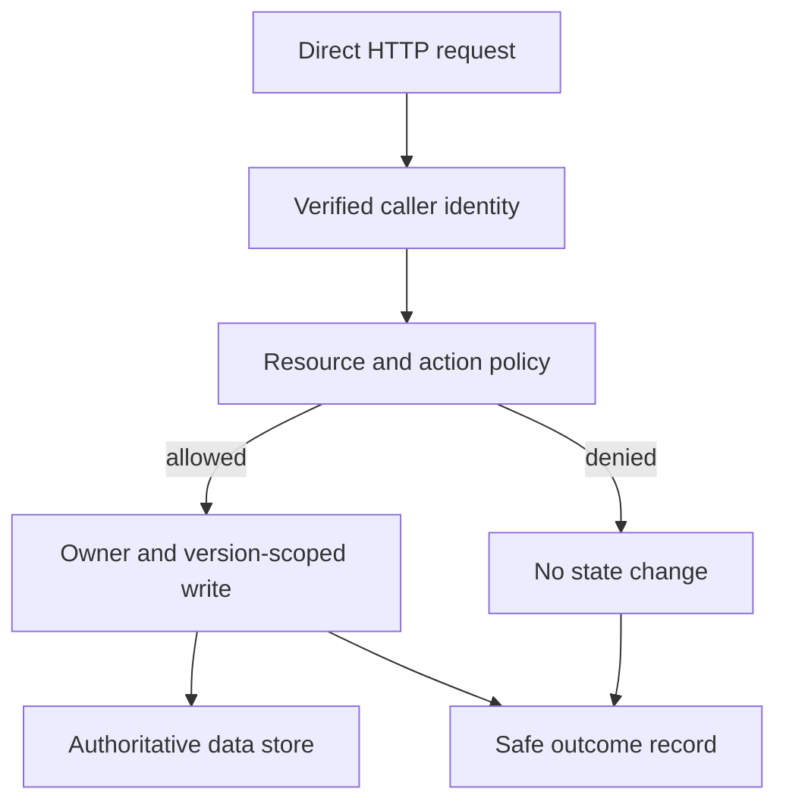

# Enforce who can act on each resource and what the server can reach

Alice saves a private bookmark. Bob is signed in to the same application, but he does not own Alice's bookmark. The interface hides its edit button from Bob. He can still send an HTTP request directly if he knows or guesses its ID. The server must make the permission decision even when no browser button was involved.

You will distinguish identity from permission, place the decision beside the protected operation, and follow it into caches, jobs and outbound requests. The goal is a small application whose trust boundaries can be explained with concrete requests.

## Separate the two questions

**Authentication** asks who is calling. **Authorization** asks whether that identity may perform this action on this resource. Being signed in does not imply ownership of every row. A role such as editor may still be limited to a particular group.

| Request | Decision under this exercise's private-bookmark policy |
|---|---|
| Alice edits Alice's bookmark 41 | Allow a valid edit |
| Bob edits Alice's bookmark 41 | Deny and leave the row unchanged |
| Bob submits `owner: "alice"` in JSON | Treat it as untrusted input, not identity evidence |
| No authenticated identity | Reject the protected operation |

The [local reading-list API](../../../examples/reading-list-starter/README.md) supports owner-scoped note edits with demonstration identities. `X-Demo-User` is deliberately not production authentication. Use it to observe ownership behavior, then integrate a maintained authentication mechanism before claiming a deployed identity boundary.

## Bind permission to the data operation

This illustrative SQL update combines object identity, trusted owner and expected record version:

```sql
UPDATE bookmarks
SET note = :new_note, version = version + 1
WHERE id = :bookmark_id
  AND owner = :authenticated_owner
  AND version = :expected_version;
```

Bind parameters through the database driver. Do not build the query by concatenating request text. Check the affected-row count and apply the documented response policy. An unavailable and unauthorized item can share the same external response to avoid revealing unnecessary details, while internal records retain a safe reason.



The UI can hide unavailable actions for usability. The server enforces the rule because direct clients can bypass the UI. Validation is a third concern: a well-formed note can still be an unauthorized edit.

**Try the boundary locally:** create a bookmark as Alice, then use its ID in Bob's note-edit request. Inspect the response and list the bookmark again as Alice. The protected content must remain unchanged. Use the starter README's exact routes and version fields rather than inventing an endpoint.

## Decide how permissions are represented

| Design | Useful starting point | Failure to prevent |
|---|---|---|
| Shared authorization module called by handlers | A small application with direct owner/group rules | A route omits the call |
| Central policy service | Several services need consistent policy evaluation | Stale or incomplete resource/policy mapping |
| Relationship-based permissions | Sharing depends on user, group and resource relationships | Delayed relationship updates authorize stale access |

Choose from the actual sharing model and operating constraints. No row count or team size automatically determines the right architecture. Unmapped protected operations should fail closed under this exercise policy.

If support gains permission to act for Alice, record the acting support identity, affected customer, action, scope, reason and outcome. Do not replace the support identity with Alice and erase who performed the action. Keep emergency access and routine customer access distinguishable.

## Recheck the boundary in caches and jobs

A cached value may be current enough as content while its permission decision is stale. Decide how quickly a revoked share must stop authorizing new responses. A token-specific cache key alone does not check whether the token was revoked.

Similarly, a job may wait after the initiating user loses access. Store trusted task identity and recheck the authorization required at execution or publication. Do not assume that permission at enqueue time lasts forever.

| Changed situation | Required design question |
|---|---|
| Share revoked while content stays cached | Who enforces the current permission and its freshness bound? |
| User removed while export is running | Can it publish a new download, and who revokes the result? |
| Download URL already issued | Is it a bearer capability until expiry, or is each delivery authorized? |
| Permission store unavailable | Does this operation deny, wait within a deadline, or use an explicitly bounded cached decision? |

The [warm-link revocation lab](../../04-scale-and-evolution/01-data-at-scale/labs/cache-consistency/revocation.md) makes the cached case observable. Already delivered data cannot be technically recalled by revoking future access.

## Restrict user-directed outbound requests

A title-fetching feature turns a submitted URL into a request from the server's network location. That location may have access the user does not. **Server-side request forgery**, or SSRF, occurs when untrusted input causes the server to use that access in an unintended way.

Check the destination's allowed scheme, parsed host and resolved addresses. Apply the policy again on redirects. Avoid validating one DNS answer and then letting the HTTP client resolve an unrestricted replacement. Preserve the intended HTTP host and TLS identity when connecting to a validated address. Bound redirects, bytes and total elapsed time.

Application validation and network egress restrictions protect different boundaries. Use a narrowly privileged fetcher where appropriate, with no unnecessary credentials. A private subnet is not a complete outbound destination policy. Follow the [restricted-fetch project](../01-backend/projects/03-the-fetch-that-cannot-be-aimed-inward.md) using controlled fixtures rather than probing real internal services.

## Treat dependencies and credentials as additional trust boundaries

A dependency update changes code that will run with your application's authority. Review its source/version identity, transitive changes, install behavior and maintenance needs. A lockfile improves reproducibility, but reproducibly installing a malicious version is still unsafe. Provenance records where an artifact came from under its verification model. It does not prove the artifact's behavior is harmless.

Use scoped, short-lived workload credentials where the deployment supports them. Restrict the role and identity trust conditions. Short lifetime reduces some exposure, but a credential can still be abused while valid. Any remaining long-lived secret needs an owner, storage policy and working revocation path. Keep secrets out of Git history and diagnostic payloads.

Inspect alternate paths too. A protected deployment workflow does not close an unrelated credential that can publish or modify the same resource. Inventory which identities can reach the protected effect, rather than checking only the preferred path.

## Hand over a concrete permission walkthrough

For one feature, list caller identity, protected resource, allowed action and enforcing code/storage boundary. Demonstrate an allowed request, a denied request, and unchanged protected state after denial. Include the corresponding background or cached path if the feature has one.

Then change one requirement: support may edit on a customer's behalf, a share is revoked, or a queued export outlives membership. Draw the revised decision point and show the user-visible result. A diagram containing an auth box is only useful when a reader can say what it checks and what happens when it cannot decide.

Reference: [OWASP Authorization Cheat Sheet](https://cheatsheetseries.owasp.org/cheatsheets/Authorization_Cheat_Sheet.html) and [SSRF Prevention Cheat Sheet](https://cheatsheetseries.owasp.org/cheatsheets/Server_Side_Request_Forgery_Prevention_Cheat_Sheet.html).
