# Choose architecture mechanisms from the boundary they enforce

[Curriculum](../../README.md) · [System design under constraints](README.md)

[Practice drawing the architecture](whiteboard.md) · [Motion gallery](../../../assets/learning/README.md)

## Use this as a mechanism reference

A bookmark save can cross an API, a database, a queue, and a worker. At each boundary, a different question arises: who may write, what is durable, how long work may wait, and what a retry may repeat. This page connects those questions to small examples and runnable exercises.

You do not need to build all twelve mechanisms in one application. Choose the section that addresses your current requirement, trace its example, and follow its linked implementation. For instance, a duplicate queue delivery leads to the idempotency section. A delayed replica read leads to consistency. An AWS service name is a deployment choice after that behavior is clear.

For every component ask: what data enters, what state changes, what waits, who can access it, and what happens if the response disappears? Use the worked designs after you can answer these questions.

## Practice the boundary before adding boxes

> **Constructed candidate brief:** “Ana saves a bookmark, refreshes the page, and
> expects her own new value. Traffic increases; the cache expires; a worker
> pauses; a migration is halfway done. Preserve the same user contract through
> each change. Which fact or failure would change your next decision?”

| Next boundary | Tiny expected behavior | Runnable or assessed exercise |
|---|---|---|
| Concurrent data | Stock 1 admits one reservation | [PostgreSQL schedules and plans](../../02-applications/02-databases/labs/postgresql/README.md) |
| Cache and replica | One local flight; v8 or explicit unavailable for strict read | [Cache/consistency tests](../../04-scale-and-evolution/01-data-at-scale/labs/cache-consistency/README.md) |
| Cached authorization | Warm revoked A denied, or a stated five-second decision bound | [Revocation](../../04-scale-and-evolution/01-data-at-scale/labs/cache-consistency/revocation.md) |
| Worker/provider | Epoch 1 rejected after epoch 2; lost response stays uncertain | [Recovery lab](../../04-scale-and-evolution/04-migrations/labs/recovery-migration/README.md) |
| Live migration | v2 survives stale v1; deleted data stays deleted | [Migration fixture](../../04-scale-and-evolution/04-migrations/labs/recovery-migration/migration.md) |
| Shard/region change | Stale route rejected; name potentially lost v9 | [Rebalancing and regions](../../04-scale-and-evolution/04-migrations/labs/recovery-migration/regions.md) |
| API contract | String total rejected as malformed provider response | [Local AWS boundary lab](../../02-applications/01-backend/labs/api-contract/README.md) |

Use the same method across these exercises: state the contract, walk a tiny
example, identify the invariant and its authority, reproduce the baseline
failure, move the decision to the boundary that can enforce it, then measure
resource limits and recovery. Each linked lab supplies baseline/fixed/follow-up
diagrams and observable assessment; the summaries below supply vocabulary.

## 1 · Request lifecycle, latency, and capacity

[Static view](../../../assets/learning/io-waterfall-still.svg)

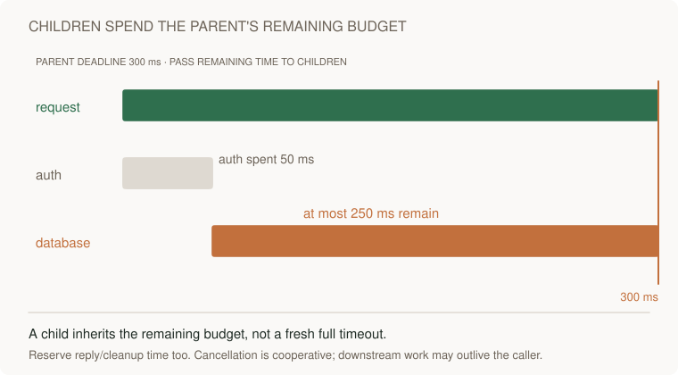

[Static view](../../../assets/learning/deadline-budget-still.svg)

A browser resolves a name, establishes a secure connection, sends a request, waits for backend work, then renders the result. An API's fast database query does not guarantee a fast page: network setup, payload size, CPU, and rendering also consume the user's budget. Persisted state survives process restarts; in-memory state usually does not.

Suppose the target is 400 ms and measured dependencies take 80 ms and 140 ms. Sequential calls consume about 220 ms before other work. Independent parallel calls consume roughly the slower duration, but parallelizing dependent reads changes correctness. Tail latency and contention prevent simply adding averages to predict p99.

Throughput is completed work per second; latency is time per request; concurrency is simultaneous work. In a stable system, Little's law relates averages: in-flight work ≈ arrival rate × time in system. At 200 requests/s and 0.25 s, average in-flight work is 50. A growing queue is not stable, so do not use that calculation to claim unlimited capacity.

**Implement:** timestamp request entry, dependency calls, and response completion; compare serial versus parallel independent I/O. **Predict:** if latency doubles with constant arrival rate, what happens to in-flight work? **Further:** show the thread/connection pool limit that makes latency accelerate.

## 2 · APIs, ownership, and data modelling

An API is a contract about state transitions. Define allowed actors, validation, status codes, idempotency, and version conflicts. Start from access patterns: “list my newest bookmarks” suggests an owner key and creation-order index. A generic data model drawn before queries can hide a full scan.

Use `POST /bookmarks`, `GET /bookmarks?cursor=...`, and `PATCH /bookmarks/{id}`. The server derives the owner from authenticated identity; it does not trust a submitted ownerId. Authenticate the caller, then authorize their access to the specific object. Parameterize SQL. Keep tenant boundaries in cache keys and background messages too.

A cursor based on `(created_at,id)` gives a stable tie-breaker. Offset pagination can skip/duplicate items under concurrent insertions and becomes costly at large offsets. Cursors still need rules for deleted records and the consistency of the listing.

**Implement:** a conditional version update and an owner-scoped query. **Test:** two concurrent edits using the same version; exactly one succeeds. **Further:** describe migration compatibility when old clients omit a new field.

## 3 · Indexes, storage, and transactions

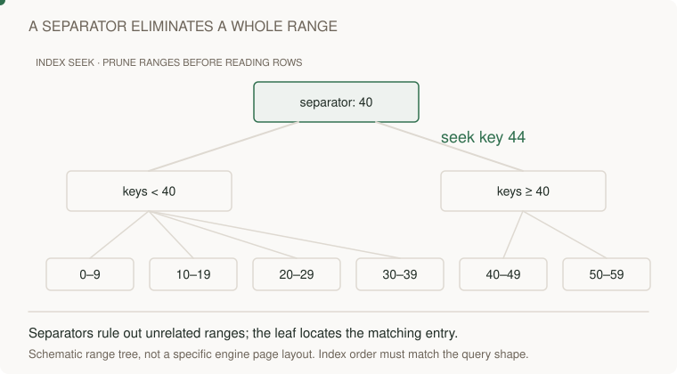

[Static view](../../../assets/learning/index-seek-still.svg)

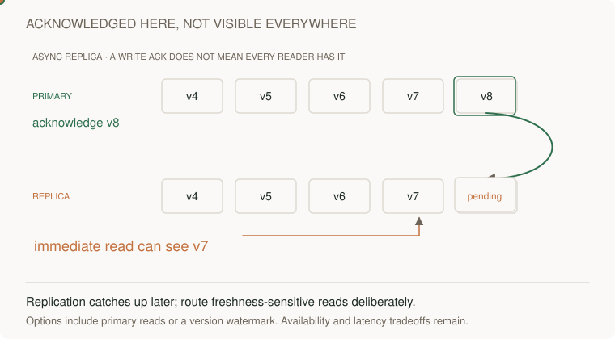

[Static view](../../../assets/learning/replication-lag-still.svg)

An index trades additional storage and write work for cheaper reads. A B-tree narrows a key range; it does not make any arbitrary filter O(log n). A composite `(owner_id,created_at,id)` index serves the query above; query predicates and ordering determine which part is usable.

In PostgreSQL the heap stores row versions separately from B-tree key order.
Ordered IDs can help index locality without continuously clustering heap rows.
HOT-eligible updates can avoid new ordinary index entries; not every update
writes every index. Compare small, large, and skewed plans with actual row and
buffer counts in the [PostgreSQL lab](../../02-applications/02-databases/labs/postgresql/README.md).

Transactions group changes into a unit with a chosen isolation level. A transaction alone does not imply that two concurrent read-then-write flows cannot oversell. Use an atomic conditional update, an appropriate lock, or serializable isolation with retries. Explain the invariant: available stock never becomes negative.

SQL is a natural start for relational integrity and changing queries. DynamoDB fits known key-based access patterns and explicit partition design. Neither choice removes modelling work. Replicas can serve reads but introduce lag; a read immediately after a write may need primary routing or a stronger read mode.

**Implement:** compare a query plan before/after an index and measure write cost. **Test:** oversell with concurrent buyers. **Further:** explain why adding a cache does not repair the transaction.

## 4 · Caching and stampedes

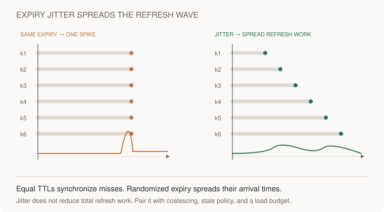

[Static view](../../../assets/learning/cache-expiry-still.svg)

Cache-aside reads the cache, reads the database on a miss, then stores the result. This saves repeated work while introducing stale data and another failure mode. Specify a staleness tolerance and TTL. If all clients miss a hot key at once, they can all load the database.

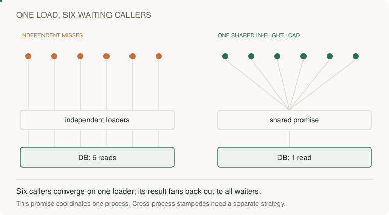
[Static diagram](../../../assets/learning/cache-coalescing-still.svg)

Single-flight lets same-key requests in a process await one in-flight load.
Across processes, one-loader exclusion requires shared coordination. Serving
stale values is a freshness policy; refreshes still need coordination if one
loader is required. Jitter spreads different-key expirations; it does not lock
one expired key. Cache outage bypass needs rate and concurrency admission so the
database survives. A finite primary pin cannot guarantee read-your-writes if
replica lag outlasts it: use authoritative reads or verified session watermarks
with deadline/fallback. [Executable counterexamples](../../04-scale-and-evolution/01-data-at-scale/labs/cache-consistency/README.md)
check these boundaries separately.

**Implement:** expire one hot key with 100 simultaneous reads; count database loads. **Test:** the loader fails and all waiters are released; the in-flight entry is removed on success and error. **Further:** explain what happens with ten application instances.

## 5 · Queues, backpressure, and bounded work

[Static view](../../../assets/learning/backpressure-still.svg)

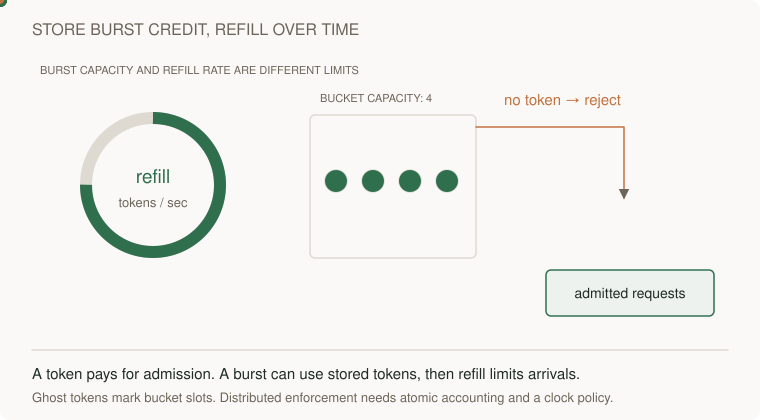

[Static view](../../../assets/learning/token-bucket-still.svg)

A queue absorbs a burst and separates request acceptance from completion. It does not manufacture processing capacity. If 500 jobs/s arrive and workers finish 300/s, backlog grows 200/s: 12,000 jobs in one minute. Once arrivals stop, draining that backlog at 300/s takes 40 seconds, ignoring variance and retries.

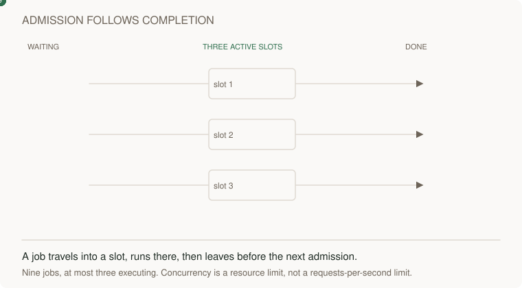
[Static diagram](../../../assets/learning/worker-slots-still.svg)

Bound concurrent work and choose a full policy: reject, delay, or degrade. Monitor oldest-message age, retry rate, and completion latency. A queue-depth graph alone cannot tell whether the oldest item is stuck. Partition fairness matters: one tenant should not consume all workers.

**Implement:** the [AWS queue lab](../03-infrastructure/aws/labs/job-pipeline/README.md). **Test:** poison jobs retry and move to a dead-letter queue. **Further:** set admission based on an acceptable waiting-time budget rather than an arbitrary queue size.

## 6 · Idempotency and delivery guarantees

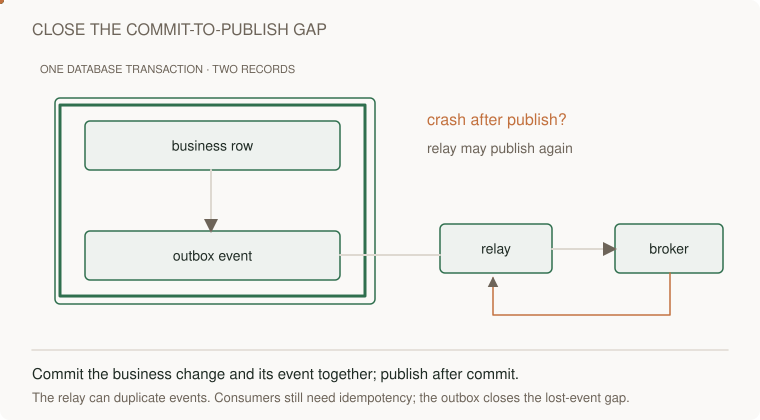

[Static view](../../../assets/learning/transaction-outbox-still.svg)

A caller times out. The server may have committed. Retrying therefore risks duplicate effects. An idempotency key names the logical operation, and a payload digest detects reuse with different input. The deduplication record and effect must be atomic if the guarantee relies on both.

[Static diagram](../../../assets/learning/conditional-result-still.svg)

The queue lab stores its deterministic result and operation key in the **same DynamoDB item** using a conditional put. That is a narrow guarantee. If you add an email call before the put, a crash can send twice. If you put first then email, a crash can lose the email. Use destination idempotency or model uncertain outcomes and reconciliation.

An outbox transaction removes the gap between a business write and recording the intent to publish. The relay can still redeliver. Delivery, processing, and observable effect are different layers of a guarantee.

An expired lease does not stop a paused worker from resuming. Require an atomic
fencing/version check at the result write. One stored result does not imply one
remote fetch when a crash can occur before recording completion. The
[separate recovery extension](../../04-scale-and-evolution/04-migrations/labs/recovery-migration/README.md) tests stale owners,
provider success with lost response, outbox rollback, and dedup retention.

**Test:** commit the result, lose the acknowledgement, retry with the same key; then retry with a different payload. **Further:** decide retention before expiring keys—old retries after expiry can execute again.

## 7 · Scaling, partitioning, and consistency


[Static view](../../../assets/learning/partition-skew-still.svg)

First measure the bottleneck. Improve a query before adding a replica; add replicas before partitioning only when that matches the load. Sharding divides ownership but makes cross-shard joins, rebalancing, and transactions harder. Hashing keys does not eliminate hot-key traffic. Partitioning by tenant can isolate ownership while creating large-tenant hotspots.

Availability-zone redundancy and regional recovery solve different failure scopes. Define RPO (tolerable data loss) and RTO (tolerable recovery time). Async replication can lose acknowledged writes during failover. “Multi-region” is not itself a consistency policy.

**Implement:** partition a synthetic workload by tenant and graph the largest partition. **Test:** route 80% of requests to one tenant. **Further:** compare tenant-specific capacity with salting and the read fan-out it creates.

## 8 · Reliability and observability

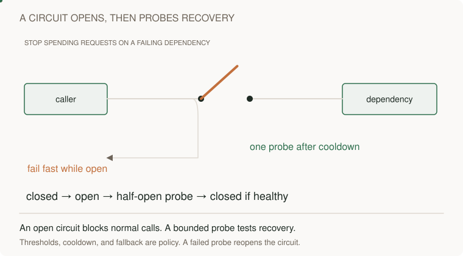

[Static view](../../../assets/learning/circuit-breaker-still.svg)

[Static view](../../../assets/learning/bulkhead-still.svg)

Choose the user outcome: successful eligible requests within 500 ms. At 99.9%, the budget is 0.1% of eligible requests. With one million requests, 1,000 can be bad. Do not convert this directly into outage minutes under variable traffic.

A timeout bounds waiting; a retry spends more time and capacity; a circuit breaker temporarily stops calls to an unhealthy dependency. Place retry responsibility at a deliberate layer and fit attempts plus backoff inside a total deadline. Use jitter to reduce synchronization, not as a correctness guarantee.

Metrics show aggregate behavior; traces connect dependency work; logs carry detailed events. Avoid IDs as unbounded metric labels. Alert on user impact and actionable queue age. Use both service success and asynchronous completion metrics: returning 202 successfully while jobs never finish is still a product failure.

**Test:** slow a dependency rather than killing it. Explain why that can be worse. **Further:** show a dashboard that distinguishes input overload from reduced worker capacity.

## 9 · Security and full-stack boundaries

Browser state is untrusted input. Enforce object-level authorization at the API and data access boundaries. IAM controls what the service can do to AWS; it does not decide which application user owns an object. Signed upload URLs are temporary capabilities: use short lifetimes, narrow object keys, and server-side ownership records. Validate completion before exposing the object as ready.

Origin-only token authorization is bypassed on shared cache hits. Choose
authorization on every delivery or an explicit bounded-stale decision policy;
test the same warmed token after revocation, cache-key isolation, and origin/auth
outages in [the revocation lab](../../04-scale-and-evolution/01-data-at-scale/labs/cache-consistency/revocation.md). A model
declaration also differs from runtime validation: see the
[API Gateway contract exercise](../../02-applications/01-backend/labs/api-contract/README.md).

Protect session credentials, consider CSRF for cookie-based authenticated mutations, use output encoding, and never treat CORS as authorization. Explain how users see authorization failures without leaking another tenant's existence.

**Implement:** a cross-owner access test, an invalid payload test, and an expired capability test. **Further:** carry tenant identity through queue workers and audit logs without trusting submitted tenant IDs.

## 10 · Deployment and migration

[Static view](../../../assets/learning/traffic-shift-still.svg)

Separate deploy from release. Expand a schema so old and new code both work; deploy compatible writers/readers; backfill with a checkpoint; reconcile; shift reads; remove old fields only after all clients migrate. Dual writes without a consistency mechanism create divergence.

Declare the write authority, capture changes durably, apply versions and delete
tombstones, and repair divergence. Sampled comparison is detection, not repair.
Rollback after new-only writes needs reverse capture and compatible data. DNS
TTL and existing connections limit routing reversal; migrated cohorts can gain
value before full retirement. The [migration fixture](../../04-scale-and-evolution/04-migrations/labs/recovery-migration/migration.md)
executes partial failure, stale backfill, deletion, and replay schedules; the
[region exercise](../../04-scale-and-evolution/04-migrations/labs/recovery-migration/regions.md) makes authority and RPO explicit.

A feature flag can reverse routing, but it cannot reverse destructive data transformation. Define the point of no return and the restore path. Include a named owner and a deadline for retiring the old path.

**Implement:** migrate a local table while both API versions run. **Test:** kill a backfill and resume without duplicates. **Further:** reconcile values, not only row counts.

## 11 · AI features as systems

For retrieval-augmented answers, ingest authorized documents, retrieve candidates, optionally rerank, generate, and evaluate. Retrieval misses and bad source documents cannot be repaired simply by changing the model. Enforce permissions before returning context and before executing a tool. Treat retrieved text as data, not authority to change tool permissions.

Build an evaluation set with task success, unsupported claims, authorization leakage, latency, and cost. Compare to a simple search or rules baseline. Model outage should produce a defined fallback. Keep AI quality metrics separate from HTTP availability.

**Implement:** a fixed test set containing irrelevant, conflicting, and adversarial documents. **Further:** identify which failures are retrieval, generation, or product-policy failures and how you would measure them.

## 12 · Cost is a design constraint

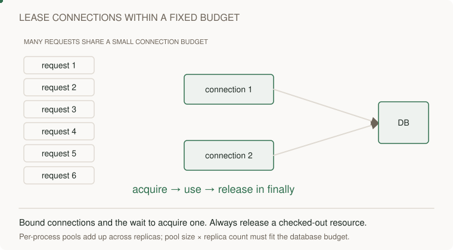

[Static view](../../../assets/learning/connection-pool-still.svg)

Estimate request count, compute duration, storage growth, replication, and egress. Separate steady-state and migration costs. A cheaper service per request may increase engineering effort or operational risk. Use current regional pricing before deploying; examples here use workload arithmetic, not invented dollar prices.

**Exercise:** 2 million users × 5 reads/day = 10 million reads/day ≈116 average reads/s. A hypothetical 10× peak is ~1,160/s; the multiplier is an assumption to validate. At 2 KB per response, payload egress is ~20 GB/day before overhead. Explain how caching changes origin load versus total client egress.

[Worked designs](../../../indexes/system-designs.md) · [AWS](../03-infrastructure/aws/README.md) · [Interview home](../../../practice/interview-guide.md)
