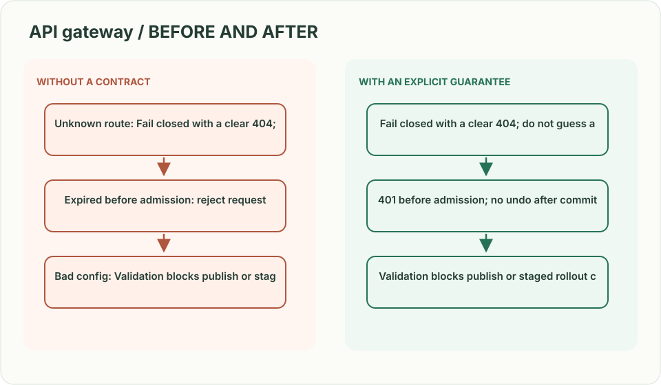
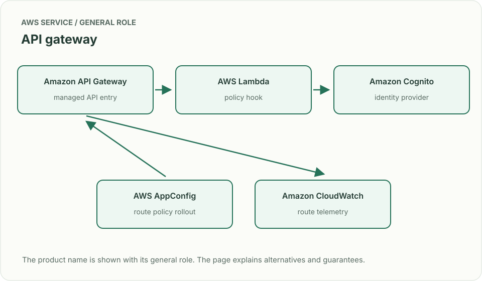
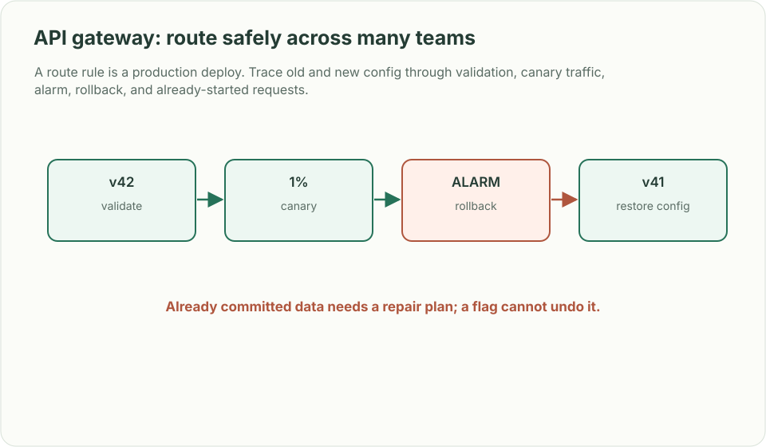

# API gateway: route safely across many teams

*Design brief · diagrams and reasoning exercises; no complete application is supplied.*

> **Interviewer:** “Build a shared gateway for dozens of product teams. It validates identity, routes API versions, enforces quotas, and protects downstream services. One team deploys a bad route rule.”

This is a **commonly listed system-design interview prompt** with a concrete practice contract. Assume 25,000 requests/s, 150 services and gateway p99 overhead under 15 ms. Clarify service guarantees and a first version before filling the board with services.

| Situation | Input / condition | Expected result |
|---|---|---|
| Unknown route | Caller requests `/v9/billing` | Fail closed with a clear 404; do not guess a backend. |
| Auth expires | Token expires during request | Return standardized 401; never send unauthenticated work downstream. |
| Bad config | New route points billing to staging | Validation blocks publish or staged rollout catches it. |
| Dependency slow | One service stalls 8 seconds | Per-route deadline and circuit breaker protect unrelated APIs. |

## Think from the contract to the boxes

The gateway should centralize policy and routing, not domain business logic. Treat config as a versioned artifact: validate route targets, auth modes, timeout budgets, and compatibility before a canary. Keep each request’s end-to-end deadline; retry only safe/idempotent operations and never beyond remaining time. Avoid becoming a global failure domain by isolating route/config caches and rollout.

**First diagram:** Draw config publish separately from request flow. Label the validation gate, per-route budget, auth decision, and backend health boundary.

| AWS service / general role | Why it fits this design | Alternative and when it fits better |
|---|---|---|
| **Amazon API Gateway** / managed API entry | Handle managed HTTP APIs and common auth/throttle policies. | ALB + ECS proxy for custom protocol transformations and high request control. |
| **AWS Lambda** / policy hook | Run short custom request validation. | ECS sidecar/plugin for low-latency stable policies. |
| **Amazon Cognito** / identity provider | Issue/verify user tokens for applicable products. | External OIDC provider when enterprise identity is already managed. |
| **AWS AppConfig** / route policy rollout | Version and gradually deploy routing/policy config. | GitOps config distribution when team-owned proxy fleet is preferred. |
| **Amazon CloudWatch** / route telemetry | Measure per-route latency, errors and throttles. | Existing OpenTelemetry stack with per-route labels and alarm ownership. |

Service choice follows the contract: the box label gives the generic job, while the table explains the AWS product and a reasonable substitute. Name which component owns durable truth, where retries happen, and the guarantee each managed service does **not** provide by itself.

## Pressure-test the design

**Follow-up: A route rule is a production deploy. Trace old and new config through validation, canary traffic, alarm, rollback, and already-started requests.**

**Senior expectation:** A route has side effects and a timeout. Show why retry could duplicate work, how idempotency is exposed, and how retry budget prevents amplification.

**Staff expectation:** Ten teams want incompatible gateway features. Set extension points, ownership and migration contracts while keeping the gateway’s failure modes bounded.

**Practice artifact:** Draw config publish separately from request flow. Label the validation gate, per-route budget, auth decision, and backend health boundary. Then trace every row in the table, draw one failure, and state what the customer observes. Suggested rehearsal: 35 minutes design, 10 minutes to challenge the guarantees.

**Evidence and origin:** The current community interview-question catalog lists an API gateway platform prompt at MongoDB. It does not publish when that report occurred. The entry does not show the interview date and is not a verified company rubric. The prompt contract, workload, outcomes, diagrams and solution here are original practice material. Treat company tags as reported sightings, not a prediction of your interview loop.

**Interview report listing:** [Open the community question entry](https://www.hellointerview.com/community/questions/api-gateway-design/cmi7ehcp402t108adh7as55gb).
