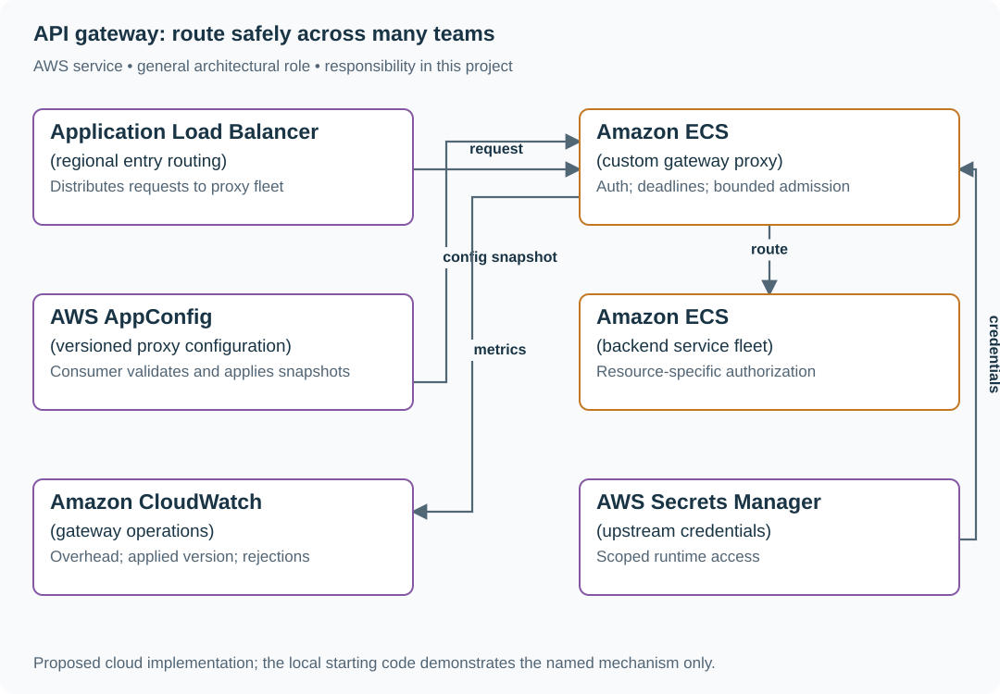

# API gateway: route safely across many teams

## What you are building

> Build the shared API entry layer for 150 internal services. Teams need consistent authentication, coarse admission limits and routing, while each service still owns resource authorization. A malformed route configuration must not take every service offline.

**Working contract:** The gateway verifies identity and routes using a versioned configuration snapshot. Backends authorize requested objects. The gateway adds at most 15 ms p99 overhead under the stated load and propagates a request deadline and trace context.

## Workload and the decisions it changes

These are constructed exercise assumptions. The stated workload is a design target; the local demonstration does not establish that throughput. Use the [estimation constants](../../../01-code/01-problem-solving/estimation-constants.md) to check units before choosing capacity.

| Input or objective | Calculation / consequence |
|---|---|
| 25,000 requests/s across 150 services | Mean per service is about 167/s, but hot routes must be sized separately. |
| 15 ms p99 added overhead | Measure gateway time independently of backend latency and client network time. |
| Configuration rollout to 100 instances assumption | Track applied version and rejection reason; a successful upload is not proof every instance activated it. |

## Start with one working boundary

Run from the repository root with Python 3.12+:

```bash
python3 examples/architecture-starts/api_gateway_platform.py
```

[Open the starting code](../../../../examples/architecture-starts/api_gateway_platform.py). This is a runnable demonstration of the critical state boundary. The API, UI, cloud adapters and operating behavior below are the application you build around it.

| Record / module | Key or interface | Responsibility |
|---|---|---|
| route_config | version,route,upstream,timeout,auth_policy | Validated immutable snapshot with rollback pointer. |
| request_context | subject,claims,deadline,trace_id | Trusted metadata passed through a protected backend boundary. |
| config_status | instance_id,applied_version,error | Evidence of rollout convergence and failed adoption. |

## AWS implementation



This is a custom proxy platform behind an ALB. Managed API Gateway is an alternative when its routing, authentication and quota features fit; its control plane and deployment model are different from an AppConfig-driven proxy.

## Build it in this order

### 1. Implement one protected route

Validate issuer, audience, signature and token expiry. Strip untrusted identity headers before adding trusted context. Protect the gateway-to-backend network/authentication boundary so a caller cannot bypass the gateway and forge context.

### 2. Bound each request

Propagate an absolute remaining deadline and use bounded connections, body sizes and queueing. Do not retry non-idempotent backend operations merely because the gateway timed out. Measure authentication, routing and upstream waiting separately.

### 3. Ship configuration as an atomic snapshot

Validate routes, auth rules and timeout bounds before activation. A custom proxy can consume AppConfig; AppConfig does not automatically reprogram API Gateway. Instances retain the last valid snapshot on parse failure and report the exact applied version.

### 4. Roll out by limited traffic scope

Start with a subset of instances or routes, compare errors/latency, and restore the prior snapshot on an observed regression. Keep configuration change ownership and emergency access explicit without moving object authorization into a universal gateway rule.

## Infrastructure configuration

| Resource or boundary | Initial configuration and reason |
|---|---|
| Gateway fleet | At least two AZs, bounded connection pools and graceful draining; size from measured per-task capacity. |
| Configuration consumer | Poll/cache versioned snapshots with validation and a last-known-good fallback; expose applied version. |
| Authentication | Pin trusted issuers/audiences, handle key rotation and define behavior when key refresh fails. |

Use one disposable AWS environment for the cloud exercise. Put the named resources in `infra/template.yaml` or your existing IaC tool, pass resource IDs through configuration, and scope each runtime role to its own tables, buckets and queues. The diagram is a design to implement; it is not a claim that these resources have been deployed. Record the commands you used to deploy and remove the exercise resources.

For concrete provisioning commands, configuration wiring and cleanup, use the [AWS foundation guide](../../../../examples/architecture-starts/infra/README.md). It includes a deployable table/queue/object-storage foundation and explains which application and service adapters you still implement.

## Observe the result

| Action | Expected visible result |
|---|---|
| Run the starting program | Invalid configuration leaves version 1 active; valid version 3 activates atomically. |
| Forge a subject header | The gateway discards it and the backend receives only verified context. |
| Slow one upstream | Its bounded pool saturates without exhausting unrelated service routes. |

## The next design decision

Offer team-managed routing. Define ownership namespaces, validation and blast-radius limits so a team can change its service without editing a global configuration file that can disable unrelated routes.

<details>
<summary>Additional design cases, alternatives and original source notes</summary>


This is a **commonly listed system-design interview prompt** with a concrete practice contract. Assume 25,000 requests/s, 150 services and gateway p99 overhead under 15 ms. Clarify service guarantees and a first version before filling the board with services.

| Situation | Input / condition | Expected result |
|---|---|---|
| Unknown route | Caller requests `/v9/billing` | Fail closed with a clear 404; do not guess a backend. |
| Auth expires | Token expires before admission | Return 401 without forwarding. An already admitted request follows its deadline and backend policy. |
| Bad config | New route points billing to staging | Validation blocks publish or staged rollout catches it. |
| Dependency slow | One service stalls 8 seconds | Per-route deadline and circuit breaker protect unrelated APIs. |

## Think from the contract to the boxes

The gateway should centralize policy and routing, not domain business logic. Treat config as a versioned artifact: validate route targets, auth modes, timeout budgets, and compatibility before a canary. Keep each request’s end-to-end deadline; retry only safe/idempotent operations and never beyond remaining time. Avoid becoming a global failure domain by isolating route/config caches and rollout.

**Authorization boundary:** validate issuer, audience, signature, expiry and required scope immediately before admission. Pass a trusted, request-bound identity to the backend; each backend still checks resource ownership. In this baseline, expiry after admission does not revoke that request or undo a commit. A backend requiring a fresh check at commit must say so and reject *before* its effect. A 60-second reauthorization interval for long-lived streams is a separate policy, not a property of ordinary HTTP requests.

| Expiry trace | Result |
|---|---|
| Admission at 12:00:01; token expired at 12:00:00 | 401; nothing sent downstream. |
| Admission at 11:59:59; expiry 12:00:00; commit 12:00:01 | Accepted operation may complete under its original deadline. |
| Commit succeeded, response was lost, token now expired | Authenticate again; replay the same operation key and recover the committed result. Do not turn credential refresh into a new charge. |

**Route-control choice:** API Gateway integrations are deployed through its configuration API/IaC. AppConfig does not directly rewrite those integrations. For a custom ALB/ECS proxy, an AppConfig client fetches a candidate route snapshot; the proxy validates destinations against an allowlist and atomically swaps an in-memory version. In-flight requests retain their selected route version. Keep the last known good snapshot on fetch/validation failure. Test a bad target and rollback without moving already-started requests.

**First diagram:** Draw config publish separately from request flow. Label the validation gate, per-route budget, auth decision, and backend health boundary.

| AWS service / general role | Why it fits this design | Alternative and when it fits better |
|---|---|---|
| **Amazon API Gateway** / managed API entry | Handle managed HTTP APIs and common auth/throttle policies. | ALB + ECS proxy for custom protocol transformations and high request control. |
| **AWS Lambda** / policy hook | Run short custom request validation. | ECS sidecar/plugin for low-latency stable policies. |
| **Amazon Cognito** / identity provider | Issue/verify user tokens for applicable products. | External OIDC provider when enterprise identity is already managed. |
| **AWS AppConfig** / route policy rollout | Distribute versioned policy to an explicit custom consumer; not a direct API Gateway integration updater. | GitOps config distribution when team-owned proxy fleet is preferred. |
| **Amazon CloudWatch** / route telemetry | Measure per-route latency, errors and throttles. | Existing OpenTelemetry stack with per-route labels and alarm ownership. |

Service choice follows the contract: the box label gives the generic job, while the table explains the AWS product and a reasonable substitute. Name which component owns durable truth, where retries happen, and the guarantee each managed service does **not** provide by itself.

## Pressure-test the design

**Follow-up: A route rule is a production deploy. Trace old and new config through validation, canary traffic, alarm, rollback, and already-started requests.**

**Senior expectation:** A route has side effects and a timeout. Show why retry could duplicate work, how idempotency is exposed, and how retry budget prevents amplification.

**Staff expectation:** Ten teams want incompatible gateway features. Set extension points, ownership and migration contracts while keeping the gateway’s failure modes bounded.

**Practice artifact:** Draw config publish separately from request flow. Label the validation gate, per-route budget, auth decision, and backend health boundary. Then trace every row in the table, draw one failure, and state what the customer observes. Suggested rehearsal: 35 minutes design, 10 minutes to challenge the guarantees.

**Evidence and origin:** The current community interview-question catalog lists an API gateway platform prompt at MongoDB. It does not publish when that report occurred. The entry does not show the interview date and is not a verified company rubric. The prompt contract, workload, outcomes, diagrams and solution here are original practice material. Treat company tags as reported sightings, not a prediction of your interview loop.

**Interview report listing:** [Open the community question entry](https://www.hellointerview.com/community/questions/api-gateway-design/cmi7ehcp402t108adh7as55gb).

</details>
