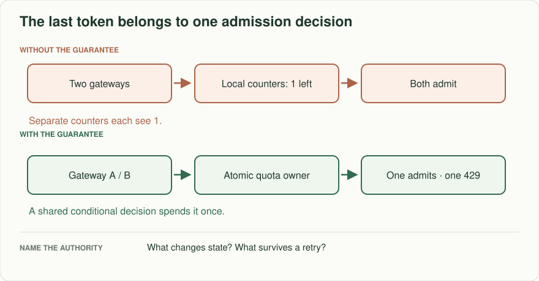
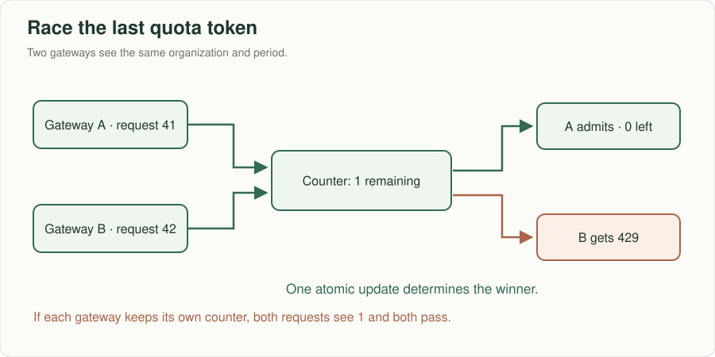
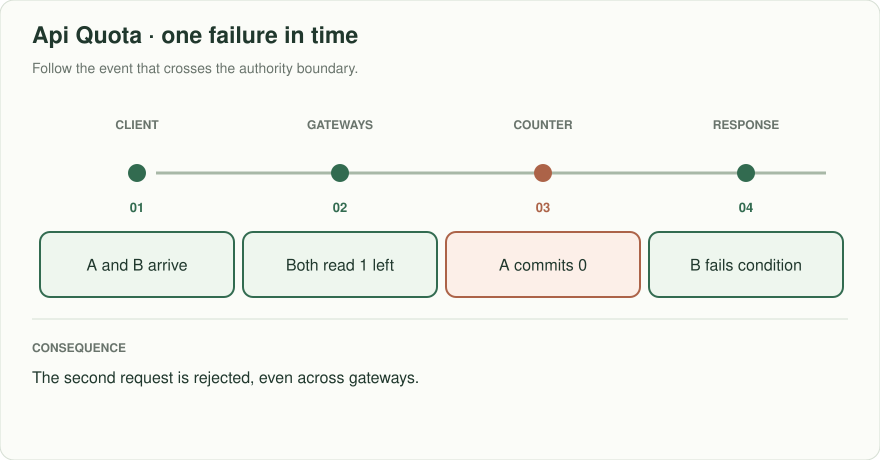

# API quota: which request spends the last token?

> **Interviewer:** “Partners call our public API. Each organization may make 100 requests per minute, and a paid organization also has a daily quota. Two gateways receive requests for the same organization simultaneously. Define exactly which requests are admitted and what the client sees at the limit.”

This is a constructed prompt. Assume 8,000 organizations, 20,000 peak requests/s overall, and an occasional 2,000 requests/s from one organization. Start with per-organization policy; do not guess an individual IP is an organization.

| Example | Input or condition | Expected outcome |
|---|---|---|
| One request left | Remaining = 1; two gateways each admit one request | **Invalid:** only one may be admitted; the other receives 429 |
| Ordinary limit | 101 requests in one minute for one organization | At most 100 accepted under the chosen window semantics |
| Client failure | An admitted request fails downstream | State whether admission spends quota; do not quietly refund it |
| Burst | Paid client sends 100 requests in one second | Define whether burst is legal before selecting token bucket or sliding window |

## Think aloud before naming a service

The decision must have one authority per `(organization, policy, period)` at the moment of admission. A local dictionary on each gateway answers a different question: *how many requests did this gateway see?* A token bucket smooths bursts; a fixed window resets sharply at its boundary; a sliding window gives a closer rolling limit but needs more state or an approximation. Ask whether “100 per minute” means a fixed calendar minute or any moving 60 seconds. Estimate key cardinality and the hottest single key before talking about sharding.

The simplest correct version writes a conditional counter for each organization and period. Serialize competing admissions through one owner or use an atomic conditional update. Daily and minute counters form **two constraints**: if checking the first spends it and the second rejects, you need an atomic joint decision, a reservation/compensation policy, or a carefully documented approximation. A fast cache can reduce reads, but an eventually synchronized cache cannot promise an exact hard quota by itself.

Read the fork: A and B arrive independently. One successful conditional decrement changes the state; the other must observe a failed condition. Redraw this with two independent local counters and locate the extra admitted request.

## Draw, test, change

Draw client → gateway → shared admission authority → API and label the key, policy version, atomic operation, and 429 response. Explain why gateway retrying the admission after a timeout can spend a token twice unless the decision has a request identity. Specify a small expiry and a rule for clock skew. For a policy update during the window, choose whether the old or new rule applies and explain how to audit it.

**Senior follow-up:** The shared quota store goes down while the API still works. Choose fail-open or fail-closed separately for an expensive paid endpoint and a cheap read endpoint, then cap worst-case overspend. Measure decisions, rejected legitimate traffic, latency, and policy version.

**Staff follow-up:** One organization floods two Regions. An eventually replicated counter cannot provide a hard global maximum. Propose a home-region admission owner, leased regional budgets with bounded overshoot, or a higher-latency coordination point. State the exact lost-capacity or overspend bound when a Region disappears.

**Practice artifact:** Two diagrams, the acceptance rule, a 10-line concurrent-request trace, and a table of decisions under normal, timeout, policy-change, and regional-failure conditions. Spend 35 minutes drawing and revising; use 10 minutes to explain why the first design fails.

**AWS translation:** API Gateway usage plans can help with coarse throttling; enforce product-specific, exact organization quotas at your own atomic authority. A DynamoDB conditional update can protect a single counter item; multiple quota items need an explicit transactional or reservation design. Check throttling and hot-key capacity, not just total table throughput.

**Evidence and origin:** An [anonymous January 2026 interview report](https://www.reddit.com/r/leetcode/comments/1qijuto/linkedin_interview_experience/) mentions an API quota/rate-tracker design prompt; its details are unverified. This exercise, numbers, and follow-ups are original. See [DynamoDB read consistency](https://docs.aws.amazon.com/amazondynamodb/latest/developerguide/HowItWorks.ReadConsistency.html) for a primary-source consistency constraint.
