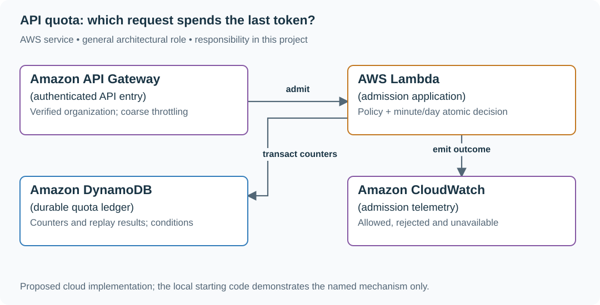

# API quota: which request spends the last token?

## What you are building

> Build partner API admission for 8,000 organizations. A free organization gets 100 admissions per fixed UTC minute; paid organizations also have a daily entitlement. Two gateway instances must not both spend the last available request.

**Working contract:** Admission returns allowed with remaining quota, or 429 with a bounded Retry-After. A successful admission spends quota even if downstream work fails. Scope counters by verified organization, policy version and period.

## Workload and the decisions it changes

These are constructed exercise assumptions. The stated workload is a design target; the local demonstration does not establish that throughput. Use the [estimation constants](../../../01-code/01-problem-solving/estimation-constants.md) to check units before choosing capacity.

| Input or objective | Calculation / consequence |
|---|---|
| 20,000 peak attempts/s; 2,000/s from one organization | That tenant is a hot coordination key even if most attempts are rejected. |
| 100 admissions per fixed UTC minute | A client can legally use 100 just before and 100 just after a boundary; this is not a rolling-window promise. |
| 8,000 organizations × 2 active counters | About 16,000 minute/day counter records before policy versions and history; cardinality and contention are different concerns. |

## Start with one working boundary

Run from the repository root with Python 3.12+:

```bash
python3 examples/architecture-starts/api_quota.py
```

[Open the starting code](../../../../examples/architecture-starts/api_quota.py). This is a runnable demonstration of the critical state boundary. The API, UI, cloud adapters and operating behavior below are the application you build around it.

| Record / module | Key or interface | Responsibility |
|---|---|---|
| quota_policy | organization,version,minute_limit,daily_limit | Authenticated organization selects policy; client IP does not. |
| counters | (organization,policy,period) | Minute and daily admission are one atomic decision. |
| admission.py | admit(org, request_id, now) | Defines request replay behavior and returns a reason for rejection. |

## AWS implementation



The database or atomic script arbitrates the last token. A gateway-local dictionary cannot coordinate another gateway. Use a durable conditional ledger for hard business entitlements; use an in-memory limiter when its failure/overshoot contract is acceptable.

## Build it in this order

### 1. Make window semantics visible

Implement a server-clock function that returns the UTC minute and UTC date. Print their IDs in an admission trace. Send 100 requests near each side of a minute boundary and explain why both groups may pass in a fixed-window system.

### 2. Make admission atomic

In PostgreSQL, lock the relevant counters in a consistent order and update both within one transaction. In Redis, use one script with organization-tagged keys on the same cluster slot. A successful minute debit followed by a failed daily debit must not consume only one counter.

### 3. Specify replay and outage behavior

Choose whether a retried API attempt spends again or uses an admission request ID. Keep that choice separate from business-operation idempotency. For a strict paid entitlement, fail closed if the quota authority is unavailable; expose 503 rather than pretending the limit was checked.

### 4. Measure the hot organization

Run two client processes against one real shared authority. Observe accepted, rejected and authority latency separately. If a single key limits throughput, consider leased local allocations only after budgeting their possible overshoot and recovery behavior.

## Infrastructure configuration

| Resource or boundary | Initial configuration and reason |
|---|---|
| ElastiCache admission state | One atomic script per decision; colocate minute/day keys. Define what failover can lose before using it for strict billing entitlements. |
| DynamoDB alternative | Use conditional transactional minute/day counters when durable strict admission matters more than lowest latency; hot-key throughput must be measured. |
| Gateway configuration | Managed gateway throttles are a coarse protection layer; do not describe them as your exact organization entitlement ledger. |
| Metrics | Record admitted/rejected/unavailable counts and authority latency by bounded plan/route labels, not every request ID. |

Use one disposable AWS environment for the cloud exercise. Put the named resources in `infra/template.yaml` or your existing IaC tool, pass resource IDs through configuration, and scope each runtime role to its own tables, buckets and queues. The diagram is a design to implement; it is not a claim that these resources have been deployed. Record the commands you used to deploy and remove the exercise resources.

For concrete provisioning commands, configuration wiring and cleanup, use the [AWS foundation guide](../../../../examples/architecture-starts/infra/README.md). It includes a deployable table/queue/object-storage foundation and explains which application and service adapters you still implement.

## Observe the result

| Action | Expected visible result |
|---|---|
| Run the starting program | Only gateway-a spends the remaining request; gateway-b sees 429. |
| Exhaust the daily quota first | Minute quota is unchanged when the combined decision rejects. |
| Disconnect admission authority | The API returns the declared unavailable result, not an unmetered success. |

## The next design decision

Replace fixed windows with a rolling 60-second policy. Estimate the state needed for an exact timestamp log versus buckets, then state the approximation error if you choose buckets. A token bucket is a different burst contract, not merely a faster implementation of the same words.

<details>
<summary>Additional design cases, alternatives and original source notes</summary>


This is a constructed prompt. Assume 8,000 organizations, 20,000 peak requests/s overall, and an occasional 2,000 requests/s from one organization. Start with per-organization policy; do not guess an individual IP is an organization.

| Example | Input or condition | Expected outcome |
|---|---|---|
| One request left | Remaining = 1; two gateways each admit one request | **Invalid:** only one may be admitted; the other receives 429 |
| Ordinary limit | 101 requests in one minute for one organization | At most 100 accepted under the chosen window semantics |
| Client failure | An admitted request fails downstream | State whether admission spends quota; do not quietly refund it |
| Burst | Paid client sends 100 requests in one second | Define whether burst is legal before selecting token bucket or sliding window |

## Think aloud before naming a service

The decision must have one authority per `(organization, policy, period)` at the moment of admission. A local dictionary on each gateway answers a different question: *how many requests did this gateway see?* A token bucket smooths bursts; a fixed window resets sharply at its boundary; a sliding window gives a closer rolling limit but needs more state or an approximation. Ask whether “100 per minute” means a fixed calendar minute or any moving 60 seconds. Estimate key cardinality and the hottest single key before talking about sharding.

The simplest correct version writes a conditional counter for each organization and period. Serialize competing admissions through one owner or use an atomic conditional update. Daily and minute counters form **two constraints**: if checking the first spends it and the second rejects, you need an atomic joint decision, a reservation/compensation policy, or a carefully documented approximation. A fast cache can reduce reads, but an eventually synchronized cache cannot promise an exact hard quota by itself.

Read the fork: A and B arrive independently. One successful conditional decrement changes the state; the other must observe a failed condition. Redraw this with two independent local counters and locate the extra admitted request.

## Draw, test, change

Draw client → gateway → shared admission authority → API and label the key, policy version, atomic operation, and 429 response. Explain why gateway retrying the admission after a timeout can spend a token twice unless the decision has a request identity. Specify a small expiry and a rule for clock skew. For a policy update during the window, choose whether the old or new rule applies and explain how to audit it.

## Put the AWS names on the boxes

**Why these boxes, and what changes the choice:** DynamoDB conditional updates arbitrate a single shared quota key; a transaction or reservation handles minute and daily quotas together. An ElastiCache cache is useful for approximate reads, but a stale cache cannot enforce an exact limit. ECS can replace Lambda when connection reuse or steady traffic justifies a service.


**Senior follow-up:** The shared quota store goes down while the API still works. Choose fail-open or fail-closed separately for an expensive paid endpoint and a cheap read endpoint, then cap worst-case overspend. Measure decisions, rejected legitimate traffic, latency, and policy version.

**Staff follow-up:** One organization floods two Regions. An eventually replicated counter cannot provide a hard global maximum. Propose a home-region admission owner, leased regional budgets with bounded overshoot, or a higher-latency coordination point. State the exact lost-capacity or overspend bound when a Region disappears.

**Practice artifact:** Two diagrams, the acceptance rule, a 10-line concurrent-request trace, and a table of decisions under normal, timeout, policy-change, and regional-failure conditions. Spend 35 minutes drawing and revising; use 10 minutes to explain why the first design fails.

**AWS translation:** API Gateway usage plans can help with coarse throttling; enforce product-specific, exact organization quotas at your own atomic authority. A DynamoDB conditional update can protect a single counter item; multiple quota items need an explicit transactional or reservation design. Check throttling and hot-key capacity, not just total table throughput.

**Evidence and origin:** An [anonymous January 2026 interview report](https://www.reddit.com/r/leetcode/comments/1qijuto/linkedin_interview_experience/) mentions an API quota/rate-tracker design prompt; its details are unverified. This exercise, numbers, and follow-ups are original. See [DynamoDB read consistency](https://docs.aws.amazon.com/amazondynamodb/latest/developerguide/HowItWorks.ReadConsistency.html) for a primary-source consistency constraint.

</details>
