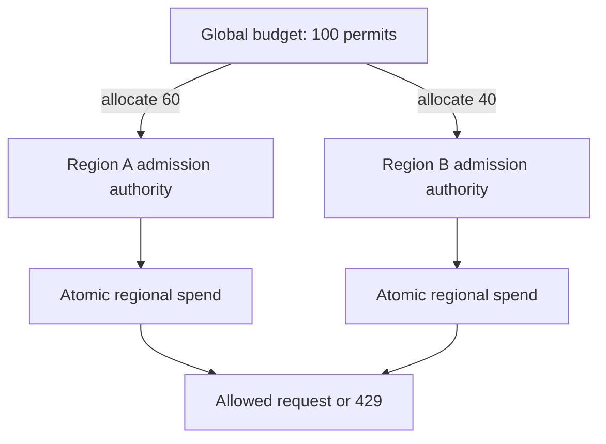

# Enforce API quotas across concurrent gateways

## Application background

Your company sells access to an API. A partner sends requests to retrieve data, and its plan allows only a certain number of requests during each minute. Before doing the requested work, the service must decide whether that partner has any allowance left.

Several gateway processes receive requests at the same time. A gateway is the entry point that forwards accepted requests to the application. If each gateway keeps its own count, the partner can spend the same remaining allowance more than once.

### A proposed rejection response

For an organization that has spent this minute's allowance, the endpoint should return a result such as this. The three seconds here are an example of the remaining time until its window resets:

```http
HTTP/1.1 429 Too Many Requests
Retry-After: 3
Content-Type: application/json

{"error":"minute_quota_exhausted","remaining":0}
```

This is the interface you implement around the local quota model. It is not a captured response from a supplied server. The database decision must precede any expensive downstream work.

Admission means deciding whether work may start. The count update and that decision must happen as one indivisible operation, commonly called an atomic operation.

## Your assignment

**Deliver:** Build the decision that admits or rejects a partner request. Make two gateways share the same allowance and demonstrate what happens when both try to spend its final unit.

**Required behavior:** Admission returns allowed with remaining quota, or 429 with a bounded Retry-After. A successful admission spends quota even if downstream work fails. Scope counters by verified organization, policy version and period.

The required first milestone is a working local implementation of the behavior above. The numbered implementation steps define the scope. The cloud architecture is a later extension, not something the starter has already provisioned.

## Get the code and run the supplied example

The code is in the public [junior-to-staff repository](https://github.com/Soulful-Iris/junior-to-staff). Install Git and Python 3.12+. No AWS account or Python packages are required for this first run. If you already have a checkout, use it and skip cloning.

```bash
git clone https://github.com/Soulful-Iris/junior-to-staff.git
cd junior-to-staff
python3 examples/architecture-starts/api_quota.py
```

**Supplied file:** [`examples/architecture-starts/api_quota.py`](https://github.com/Soulful-Iris/junior-to-staff/blob/main/examples/architecture-starts/api_quota.py). You can also [read or download the source here](../../../../examples/architecture-starts/api_quota.py).

This program is a **mechanism demonstration**: it runs the small scenario in one process and prints the result. It is not an HTTP service, a complete application, or an AWS deployment. A successful run demonstrates this mechanism only. It does not establish the workload or failure guarantees of the application you will build.

**Example output from the supplied run:**

Generated IDs and timestamps may differ. Compare the state transitions and outcomes.

```text
gateway-a allowed
gateway-b 429 quota exhausted
remaining: 0
```

### Set up your implementation workspace

Create `work/api-quota/` in your checkout (or use a separate repository). Copy the supplied mechanism into that directory as `mechanism.py`, then extract its state transitions into functions you can call from your implementation. The record and module names below describe what you must implement. They are not a promise that files with those names already exist. Keep a `README.md` beside your implementation with its exact run commands and observed results.

## Local components and state to implement

This table names the records, interfaces or decision inputs for your deliverable. Unless a name is explicitly linked to supplied source above, it is something you create. Implement the local state transitions first, then connect the HTTP, storage or worker boundaries required by the steps.

| Record / module | Key or interface | Responsibility |
|---|---|---|
| quota_policy | organization,version,minute_limit,daily_limit | Authenticated organization selects policy. Client IP does not. |
| counters | (organization,policy,period) | Minute and daily admission are one atomic decision. |
| admission.py | admit(org, request_id, now) | Defines request replay behavior and returns a reason for rejection. |

## Implement the assignment

### 1. Make window semantics visible

Implement a server-clock function that returns the UTC minute and UTC date. Print their IDs in an admission trace. Send 100 requests near each side of a minute boundary and explain why both groups may pass in a fixed-window system.

### 2. Make admission atomic

In PostgreSQL, lock the relevant counters in a consistent order and update both within one transaction. In Redis, use one script with organization-tagged keys on the same cluster slot. A successful minute debit followed by a failed daily debit must not consume only one counter.

### 3. Specify replay and outage behavior

Choose whether a retried API attempt spends again or uses an admission request ID. Keep that choice separate from business-operation idempotency. For a strict paid entitlement, fail closed if the quota authority is unavailable. Expose 503 rather than pretending the limit was checked.

### 4. Measure the hot organization

Run two client processes against one real shared authority. Observe accepted, rejected and authority latency separately. If a single key limits throughput, consider leased local allocations only after budgeting their possible overshoot and recovery behavior.

## Demonstrate the completed local result

| Action | Expected visible result |
|---|---|
| Run the starting program | Only gateway-a spends the remaining request. Gateway-b sees 429. |
| Exhaust the daily quota first | Minute quota is unchanged when the combined decision rejects. |
| Disconnect admission authority | The API returns the declared unavailable result, not an unmetered success. |

**Handoff:** In your implementation README, include the start command, one successful operation, the failure case above and the resulting stored state or decision. State which dependencies are simulated. Someone with a fresh checkout should be able to reproduce this without your chat history.

## Workload assumptions and capacity decisions

These are constructed exercise assumptions. The stated workload is a design target. The local demonstration does not establish that throughput. Use the [estimation constants](../../../01-code/01-problem-solving/estimation-constants.md) to check units before choosing capacity.

| Input or objective | Calculation / consequence |
|---|---|
| 20,000 peak attempts/s. 2,000/s from one organization | That tenant is a hot coordination key even if most attempts are rejected. |
| 100 admissions per fixed UTC minute | A client can legally use 100 just before and 100 just after a boundary. This is not a rolling-window promise. |
| 8,000 organizations × 2 active counters | About 16,000 minute/day counter records before policy versions and history. Cardinality and contention are different concerns. |

## Map the local implementation to AWS

**Deployment status: local only.** Running the supplied command creates no AWS resources and configures no cloud connections. The diagram is a proposed deployment of the completed application. Each box needs either a deployed runtime, a provisioned service or an explicitly external dependency.

Read the diagram by following the arrows from the entry point: application code accepts the request or event, the state owner commits it, and any worker produces the later result. The table ties those roles to code and adapter work. Multiple boxes do not imply multiple Python files already exist.


The database or atomic script arbitrates the last token. A gateway-local dictionary cannot coordinate another gateway. Use a durable conditional ledger for hard business entitlements. Use an in-memory limiter when its failure/overshoot contract is acceptable.

| Local responsibility | Cloud destination and role | Implementation still required |
|---|---|---|
| Local HTTP boundary or the endpoint you will add | Amazon API Gateway: authenticated API entry | Create routes and an integration. Translate requests and responses and configure identity validation. |
| Python operation or worker function | AWS Lambda: admission application | Write a Lambda event adapter, package its dependencies and give its role only the required resource actions. |
| Local dictionary, SQLite records or state model | Amazon DynamoDB: durable quota ledger | Design partition/sort keys and write a storage adapter with conditional updates or transactions. Python state and SQL are not uploaded as a database. |
| Local counters, timestamps and diagnostic output | Amazon CloudWatch: admission telemetry | Emit bounded metrics and logs, build the named operational view and configure retention and access. |

### Provision resources, then connect the application

| Resource or boundary | Initial configuration and reason |
|---|---|
| ElastiCache admission state | One atomic script per decision. Colocate minute/day keys. Define what failover can lose before using it for strict billing entitlements. |
| DynamoDB alternative | Use conditional transactional minute/day counters when durable strict admission matters more than lowest latency. Hot-key throughput must be measured. |
| Gateway configuration | Managed gateway throttles are a coarse protection layer. Do not describe them as your exact organization entitlement ledger. |
| Metrics | Record admitted/rejected/unavailable counts and authority latency by bounded plan/route labels, not every request ID. |

Use one disposable AWS environment for the cloud exercise. Put the named resources in `infra/template.yaml` or your existing IaC tool, pass resource IDs through configuration, and scope each runtime role to its own tables, buckets and queues. The diagram is a design to implement. It is not a claim that these resources have been deployed. Record the commands you used to deploy and remove the exercise resources.

For concrete provisioning commands, configuration wiring and cleanup, use the [AWS foundation guide](../../../../examples/architecture-starts/infra/README.md). It includes a deployable table/queue/object-storage foundation and explains which application and service adapters you still implement.

A provisioned queue or table does not make the local program use it. Configure resource IDs in the deployed runtime, replace the local adapter, and replay the same successful and failing operation against that runtime. Record the deployed commit and observable result, then remove the disposable resources using your infrastructure tool.

## Extend the design after the baseline works
### Worked follow-up: Enforce one hard quota across regions

An organization has 100 admissions left. If both regions cache that value and admit 100, the product has sold the same allowance twice. A hard global maximum needs coordination or preallocated capacity.

| Starting design | Changed requirement |
|---|---|
| All gateways spend from one shared counter. | Regional gateways spend explicit portions of one global allowance. |

**Revised architecture.** Follow the changed responsibility and failure path below. This is a design to implement. The supplied local example does not provision these components.



**What to implement.** For this variant, allocate 60 permits to A and 40 to B in a durable global budget ledger. Each regional authority atomically spends only its allocation and records request identities. Do not let gateway processes each hold their own copy of those 60 permits. Persist the period and allocation generation. If A is unreachable, its unreported capacity is unavailable until you can prove it cannot still be spent. Reallocating it blindly weakens the hard cap. Use conditional storage operations for both the ledger and regional admission owners.

**Walk through the result.** A admits 60 and B admits 40. The next request is rejected even if the other region is unreachable. If A disappears after spending 10, up to 50 permits may be stranded for this period. Present that lost-capacity trade alongside a single home-region admission alternative.


Replace fixed windows with a rolling 60-second policy. Estimate the state needed for an exact timestamp log versus buckets, then state the approximation error if you choose buckets. A token bucket is a different burst contract, not merely a faster implementation of the same words.

<details>
<summary>Additional design cases, alternatives and original source notes</summary>


This is a constructed prompt. Assume 8,000 organizations, 20,000 peak requests/s overall, and an occasional 2,000 requests/s from one organization. Start with per-organization policy. Do not guess an individual IP is an organization.

| Example | Input or condition | Expected outcome |
|---|---|---|
| One request left | Remaining = 1. Two gateways each admit one request | **Invalid:** only one may be admitted. The other receives 429 |
| Ordinary limit | 101 requests in one minute for one organization | At most 100 accepted under the chosen window semantics |
| Client failure | An admitted request fails downstream | State whether admission spends quota. Do not quietly refund it |
| Burst | Paid client sends 100 requests in one second | Define whether burst is legal before selecting token bucket or sliding window |

## Think aloud before naming a service

The decision must have one authority per `(organization, policy, period)` at the moment of admission. A local dictionary on each gateway answers a different question: *how many requests did this gateway see?* A token bucket smooths bursts. A fixed window resets sharply at its boundary. A sliding window gives a closer rolling limit but needs more state or an approximation. Ask whether “100 per minute” means a fixed calendar minute or any moving 60 seconds. Estimate key cardinality and the hottest single key before talking about sharding.

The simplest correct version writes a conditional counter for each organization and period. Serialize competing admissions through one owner or use an atomic conditional update. Daily and minute counters form **two constraints**: if checking the first spends it and the second rejects, you need an atomic joint decision, a reservation/compensation policy, or a carefully documented approximation. A fast cache can reduce reads, but an eventually synchronized cache cannot promise an exact hard quota by itself.

Read the fork: A and B arrive independently. One successful conditional decrement changes the state. The other must observe a failed condition. Redraw this with two independent local counters and locate the extra admitted request.

## Draw, test, change

Draw client → gateway → shared admission authority → API and label the key, policy version, atomic operation, and 429 response. Explain why gateway retrying the admission after a timeout can spend a token twice unless the decision has a request identity. Specify a small expiry and a rule for clock skew. For a policy update during the window, choose whether the old or new rule applies and explain how to audit it.

## Put the AWS names on the boxes

**Why these boxes, and what changes the choice:** DynamoDB conditional updates arbitrate a single shared quota key. A transaction or reservation handles minute and daily quotas together. An ElastiCache cache is useful for approximate reads, but a stale cache cannot enforce an exact limit. ECS can replace Lambda when connection reuse or steady traffic justifies a service.


**Senior follow-up:** The shared quota store goes down while the API still works. Choose fail-open or fail-closed separately for an expensive paid endpoint and a cheap read endpoint, then cap worst-case overspend. Measure decisions, rejected legitimate traffic, latency, and policy version.

**Staff follow-up:** One organization floods two Regions. An eventually replicated counter cannot provide a hard global maximum. Propose a home-region admission owner, leased regional budgets with bounded overshoot, or a higher-latency coordination point. State the exact lost-capacity or overspend bound when a Region disappears.

**Practice artifact:** Two diagrams, the acceptance rule, a 10-line concurrent-request trace, and a table of decisions under normal, timeout, policy-change, and regional-failure conditions. Spend 35 minutes drawing and revising. Use 10 minutes to explain why the first design fails.

**AWS translation:** API Gateway usage plans can help with coarse throttling. Enforce product-specific, exact organization quotas at your own atomic authority. A DynamoDB conditional update can protect a single counter item. Multiple quota items need an explicit transactional or reservation design. Check throttling and hot-key capacity, not just total table throughput.

**Evidence and origin:** An [anonymous January 2026 interview report](https://www.reddit.com/r/leetcode/comments/1qijuto/linkedin_interview_experience/) mentions an API quota/rate-tracker design prompt. Its details are unverified. This exercise, numbers, and follow-ups are original. See [DynamoDB read consistency](https://docs.aws.amazon.com/amazondynamodb/latest/developerguide/HowItWorks.ReadConsistency.html) for a primary-source consistency constraint.

</details>
