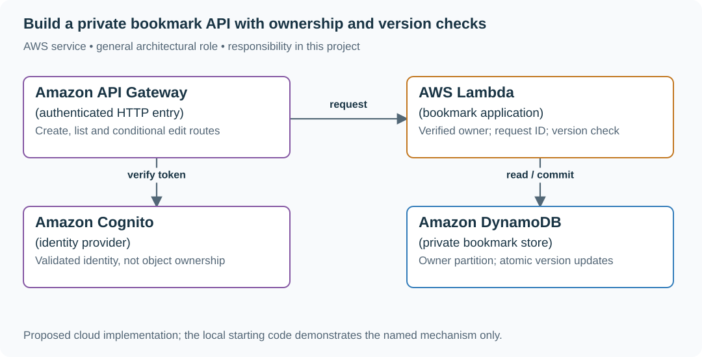
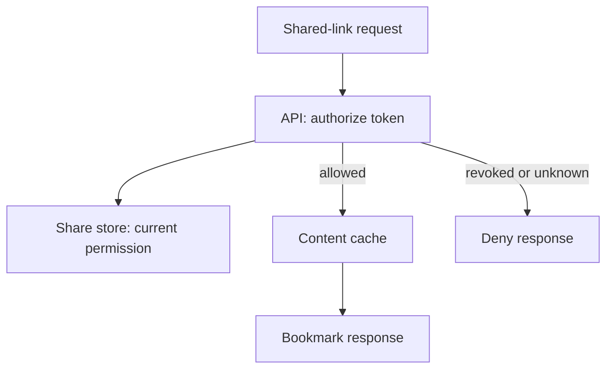

# Build a private bookmark API with ownership and version checks

## Application background

Ana finds an article on her phone and taps Save. Later she opens the learning portal on her laptop and expects to find the same link. The portal therefore needs to store bookmarks in a database, rather than only in one browser.

Each bookmark belongs to one person. Ana should see her own links, and Ben should see his. Another problem appears when Ana leaves the same bookmark open on two devices and edits both copies.

### Example walkthrough

| Action | Expected behavior |
|---|---|
| Ana saves `https://example.com/sql` | Return a bookmark ID and show the link in Ana's list. |
| Ben asks for his list | Do not include Ana's private bookmark. |
| Two devices edit bookmark 41 from version 3 | Accept one edit as version 4. Tell the second device its copy is out of date. |

A version is a number attached to a saved record. Checking it before an edit prevents an older browser view from silently replacing a newer change.

### Sizing that affects this decision

10,000 users with 20 bookmarks each means 200,000 records. At an assumed 1 KiB of metadata per record, that is about 195 MiB of raw data before indexes and backups. The initial target of 100 peak reads/s and 20 writes/s supports starting with one regional database and measuring it. It does not, on its own, justify adding a cache.

These are exercise assumptions. The [estimation reference](../../../01-code/01-problem-solving/estimation-constants.md) explains the units and approximations. They do not establish the local demo's measured capacity.

## Your assignment

**Deliver:** Build endpoints to save, list and edit private bookmarks. Keep the records across restarts, enforce their owner and report when an edit is based on an old version.

**Required behavior:** POST /bookmarks returns 201 and a version. GET /bookmarks returns only the authenticated owner’s rows. PATCH /bookmarks/{id} requires expected_version and returns 409 on conflict. Sharing is a later feature.

The required first milestone is a working local implementation of the behavior above. The numbered implementation steps define the scope. The cloud architecture is a later extension, not something the starter has already provisioned.

## Get the code and run the supplied example

The code is in the public [junior-to-staff repository](https://github.com/Soulful-Iris/junior-to-staff). Install Git and Python 3.12+. No AWS account or Python packages are required for this first run. If you already have a checkout, use it and skip cloning.

```bash
git clone https://github.com/Soulful-Iris/junior-to-staff.git
cd junior-to-staff
python3 examples/architecture-starts/bookmark_service.py
```

**Supplied file:** [`examples/architecture-starts/bookmark_service.py`](https://github.com/Soulful-Iris/junior-to-staff/blob/main/examples/architecture-starts/bookmark_service.py). You can also [read or download the source here](../../../../examples/architecture-starts/bookmark_service.py).

This program is a **mechanism demonstration**: it runs the small scenario in one process and prints the result. It is not an HTTP service, a complete application, or an AWS deployment. A successful run demonstrates this mechanism only. It does not establish the workload or failure guarantees of the application you will build.

**Example output from the supplied run:**

Generated IDs and timestamps may differ. Compare the state transitions and outcomes.

```text
ben Unauthorized not found or version conflict
ana Phone edit saved
ana Laptop edit not found or version conflict
Final: [('ana', 7, 'Phone edit', 4)]
```

### Set up your implementation workspace

Create `work/bookmark-service/` in your checkout (or use a separate repository). Copy the supplied mechanism into that directory as `mechanism.py`, then extract its state transitions into functions you can call from your implementation. The record and module names below describe what you must implement. They are not a promise that files with those names already exist. Keep a `README.md` beside your implementation with its exact run commands and observed results.

## Local components and state to implement

This table names the records, interfaces or decision inputs for your deliverable. Unless a name is explicitly linked to supplied source above, it is something you create. Implement the local state transitions first, then connect the HTTP, storage or worker boundaries required by the steps.

| Record / module | Key or interface | Responsibility |
|---|---|---|
| bookmarks | (owner_id, bookmark_id), version | Owns the URL, title and current revision. |
| operations | (owner_id, request_id), payload_hash | An exact retry returns the same result. Changed payload under the same key conflicts. |
| api.py / store.py | create, list_owned, edit_if_version | Derive owner from verified identity. Enforce it in every database operation. |

## Implement the assignment

### 1. Create and list one private record

Implement `api.py` with create/list routes and a trusted request context containing the authenticated subject. In `store.py`, scope both lookup and update by owner. Save a URL without fetching it. An unavailable title service must not lose the bookmark. Show Ana’s list and Ben’s empty list for the same ID.

### 2. Preserve a client’s edit

Keep `expected_version` and the user’s unsaved draft in the browser. Commit `UPDATE ... WHERE owner_id=? AND id=? AND version=?`. Zero affected rows require a fresh read to distinguish missing from conflicting under your disclosure policy. The losing client keeps its draft and sees the latest saved version.

### 3. Make create retries safe

Commit the bookmark and operation result in one transaction. Compare a canonical payload hash when a request ID reappears. Crash after commit but before replying, then repeat the same request and show the original ID. Retain operation IDs for the documented retry window.

### 4. Add the cloud adapter

Map owner to the DynamoDB partition and bookmark ID to the sort key. Use a conditional version update and strongly consistent reads for the immediate post-write list. Keep the local SQL and cloud code behind the same store interface. Add cursor pagination with a stable ordering before creating a large inventory.

## Demonstrate the completed local result

| Action | Expected visible result |
|---|---|
| Run the starting program | Ben changes zero rows. Ana’s first edit succeeds. Her second version-3 edit conflicts. |
| Retry a committed create | One bookmark and the original response ID. |
| Open the losing browser draft | The draft remains visible beside the current server version. |

**Handoff:** In your implementation README, include the start command, one successful operation, the failure case above and the resulting stored state or decision. State which dependencies are simulated. Someone with a fresh checkout should be able to reproduce this without your chat history.

## Workload assumptions and capacity decisions

These are constructed exercise assumptions. The stated workload is a design target. The local demonstration does not establish that throughput. Use the [estimation constants](../../../01-code/01-problem-solving/estimation-constants.md) to check units before choosing capacity.

| Input or objective | Calculation / consequence |
|---|---|
| 10,000 users × 20 bookmarks | 200,000 rows. At 1 KiB per row, about 195 MiB before indexes and backups. |
| 100 peak reads/s. 20 writes/s | Start with a single regional database. A cache is an additional consistency problem, not a prerequisite. |
| Create/list p95 under 300 ms | Measure the complete request. Reserve time for authentication, database work and response transfer. |

## Map the local implementation to AWS

**Deployment status: local only.** Running the supplied command creates no AWS resources and configures no cloud connections. The diagram is a proposed deployment of the completed application. Each box needs either a deployed runtime, a provisioned service or an explicitly external dependency.

Read the diagram by following the arrows from the entry point: application code accepts the request or event, the state owner commits it, and any worker produces the later result. The table ties those roles to code and adapter work. Multiple boxes do not imply multiple Python files already exist.



DynamoDB is a good fit for owner-keyed lists and conditional edits. PostgreSQL remains a simpler choice when sharing and relational queries dominate. Cognito authenticates the caller. Application code still decides who owns each record.

| Local responsibility | Cloud destination and role | Implementation still required |
|---|---|---|
| Local HTTP boundary or the endpoint you will add | Amazon API Gateway: authenticated HTTP entry | Create routes and an integration. Translate requests and responses and configure identity validation. |
| Python operation or worker function | AWS Lambda: bookmark application | Write a Lambda event adapter, package its dependencies and give its role only the required resource actions. |
| Local fixture identity or caller supplied to the operation | Amazon Cognito: identity provider | Configure an identity provider and validate tokens. Retain resource ownership checks in application code. |
| Local dictionary, SQLite records or state model | Amazon DynamoDB: private bookmark store | Design partition/sort keys and write a storage adapter with conditional updates or transactions. Python state and SQL are not uploaded as a database. |

### Provision resources, then connect the application

| Resource or boundary | Initial configuration and reason |
|---|---|
| API Gateway + Lambda | Set application deadline 2 s and a short database timeout. Validate the JWT issuer/audience and required claims. |
| DynamoDB | Owner-prefixed keys. Conditional version changes. Point-in-time recovery. Do not use a stale secondary index to promise immediate read-your-writes. |
| CloudFront + S3 | Serve the static UI. Keep private API responses out of shared response caches. |
| IAM and logs | API role accesses the bookmark table only. Do not put private URLs or tokens in request logs. |

Use one disposable AWS environment for the cloud exercise. Put the named resources in `infra/template.yaml` or your existing IaC tool, pass resource IDs through configuration, and scope each runtime role to its own tables, buckets and queues. The diagram is a design to implement. It is not a claim that these resources have been deployed. Record the commands you used to deploy and remove the exercise resources.

For concrete provisioning commands, configuration wiring and cleanup, use the [AWS foundation guide](../../../../examples/architecture-starts/infra/README.md). It includes a deployable table/queue/object-storage foundation and explains which application and service adapters you still implement.

A provisioned queue or table does not make the local program use it. Configure resource IDs in the deployed runtime, replace the local adapter, and replay the same successful and failing operation against that runtime. Record the deployed commit and observable result, then remove the disposable resources using your infrastructure tool.

## Extend the design after the baseline works
### Worked follow-up: Revoke a shared bookmark even when its content is cached

Alice shares item 41 with Bob, then withdraws the share. A cached copy can still contain the correct bookmark text while carrying an obsolete access decision. Content freshness and permission freshness now have different owners.

| Starting design | Changed requirement |
|---|---|
| Only an authenticated owner can read a bookmark. | A recipient can read through a share token until the owner revokes it. |

**Revised architecture.** Follow the changed responsibility and failure path below. This is a design to implement. The supplied local example does not provision these components.



**What to implement.** Add a share record with token hash, item ID, expiry and revoked state. In the read handler, check the share against authoritative state before serving cached content. Keep private responses out of browser and CDN response caches. For the immediate-revocation contract, deny new reads when the permission store cannot be reached. A response already delivered cannot be recalled. On AWS, keep this decision in the API handler with a suitable consistent database read. CloudFront may still cache the static app.

**Walk through the result.** Warm token S by reading item 41. Revoke S, leave the content cache untouched, then repeat the same request. It must be denied. Document the ordering point: revocation completed before the new authorization check. Your deliverable is the share schema, revised read path and this request transcript.


Add revocable sharing only after private reads work. State the authorization decision point, recheck it on cache hits, and demonstrate that a revoked share token cannot authorize a new response. At ten times the read rate, measure query latency and hot owners before adding a cache.

<details>
<summary>Additional design cases, alternatives and original source notes</summary>

[Curriculum](../../../README.md) · [Design services from requirements to failure behavior](../README.md)

All prompts here are constructed practice, without company attribution.

> **Candidate opening:** “Ana saves a private bookmark and immediately lists her
bookmarks. Ben must not see it. Both of Ana's devices try to edit version 3.
Preserve ownership and show one conflict without losing either device's draft.”

| Input | Expected behavior | Scope |
|---|---|---|
| Ana creates URL, then lists | New ID appears in Ana's list | Read-your-writes required |
| Ben reads Ana's ID | Denied | Derive owner from authenticated identity |
| Two PATCH requests expect v3 | One v4. One 409 | No silent overwrite |

Prerequisites: [API/transaction concepts](../mechanism-reference.md). This is a build brief.
start from the [full-stack exercise](../../../02-applications/03-frontend/full-stack-practice.md). First deliver
one owner-scoped create/list, then conditional edits, then a retained conflict
state. Run that exercise's commands and record visible behavior.

Before the worked design, name the invariant and move authority out of the
submitted payload. Then trace a commit whose HTTP response disappears. Operation
identity must survive a retry.

<details>
<summary>Worked approach and AWS mapping — open after your attempt</summary>

**Prompt:** save, list, and edit private bookmarks. Start with 10,000 users, 20 bookmarks each, and 100 peak reads/s. These are exercise assumptions. Require read-your-writes and owner-only access. Exclude sharing and search initially.

API: POST bookmark, GET own bookmarks with cursor, PATCH by id plus expected version. Data: id, owner, url, title, created_at, version. Enforce URL scheme rules. Do not fetch arbitrary submitted URLs in the API process.

**AWS choice:** API Gateway and Lambda for a small intermittent API. DynamoDB with owner partition and ordered keys for fixed queries. RDS PostgreSQL is a reasonable alternative for relational needs. Cognito or another identity provider authenticates. Ownership checks still live in your application. For TypeScript UI delivery, S3 and CloudFront can serve static assets.

**Worked decision:** do not cache private reads initially at this scale. First measure the actual query. A cache adds invalidation and tenant-isolation obligations before there is evidence it is necessary.

**Implement:** [full-stack exercise](../../../02-applications/03-frontend/full-stack-practice.md), then AWS lab 1. **Break:** read another owner's id. Concurrently PATCH version 3 twice. **Expected:** access denied and exactly one conditional write succeeds. **Senior extension:** add sharing with revocation. **Staff extension:** roll out a new authorization model across old clients and background jobs.

</details>

## Follow-up: sharing becomes revocable

Predict the warm-cache path before adding a CDN. A token-specific cache key
alone does not recheck a revoked token.

Use the [warm/cold revocation fixture](../../../04-scale-and-evolution/01-data-at-scale/labs/cache-consistency/revocation.md)
for immediate or explicitly bounded authorization. **Senior:** test a repeated
warmed token after revocation and a version conflict. **Lead follow-up:** old
clients do not send the new version field. Stage compatibility and a rollout
stop criterion instead of silently accepting blind overwrites. Assessor evidence
is the denied cross-owner request, one winner/one conflict, and a stated revocation
bound—not merely a diagram containing “auth.”


[Design route](../../../../indexes/system-designs.md) · [Practice rubric](../../../../practice/README.md)

</details>
