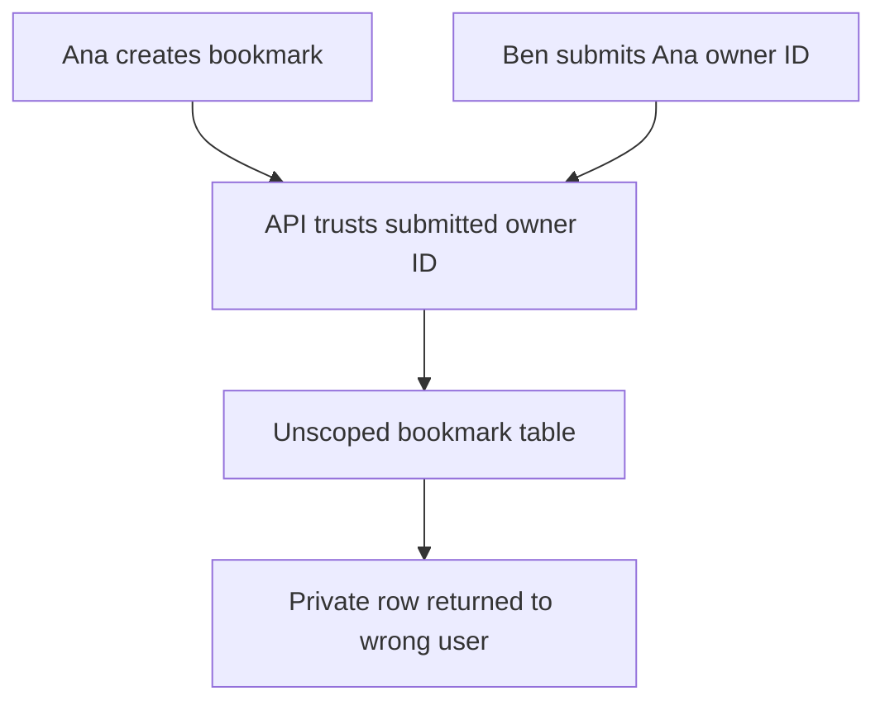
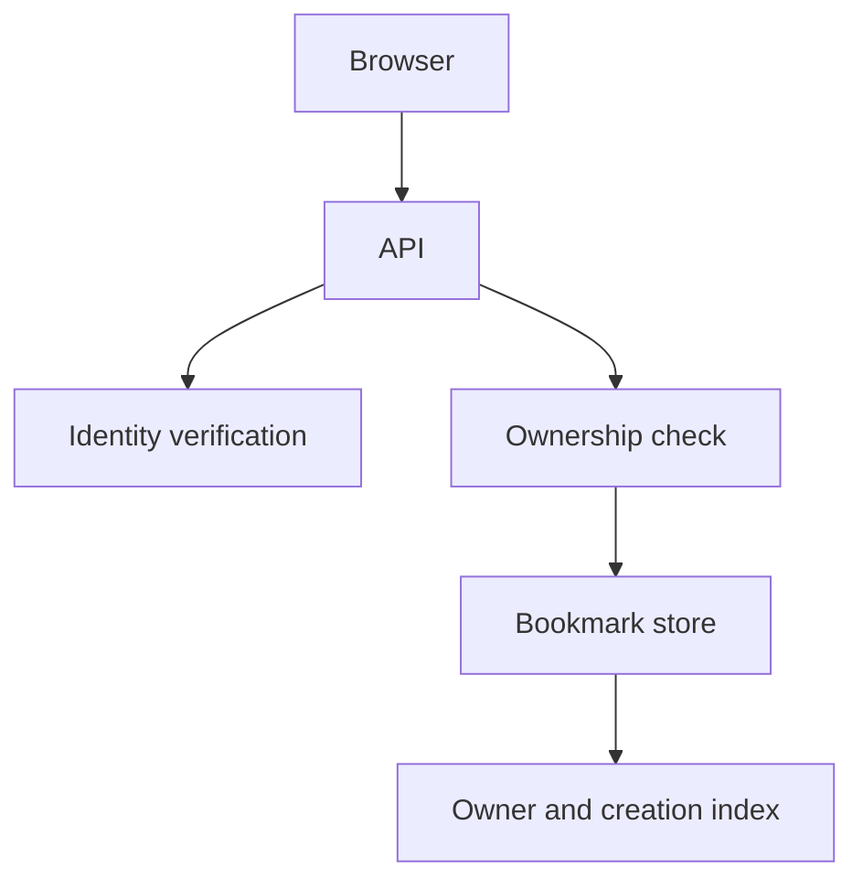
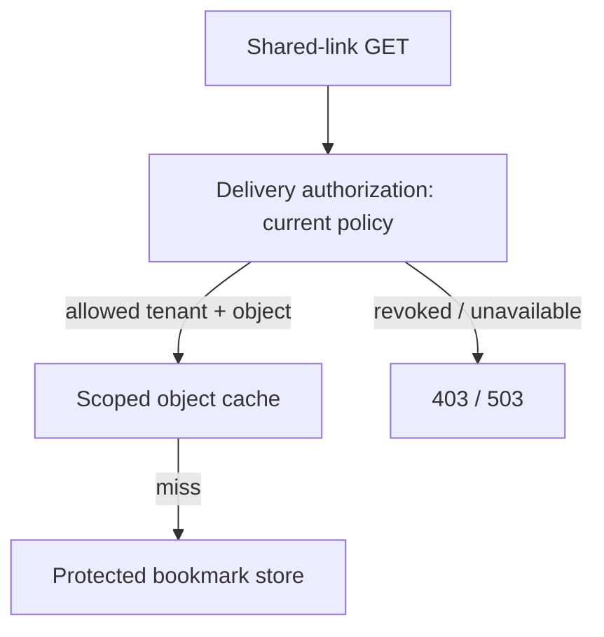

# Bookmark service

## What you are building

> Build a private bookmark service for a company learning portal. Ana saves a link on her phone and immediately opens it on her laptop. Ben must never see Ana’s private links, and two edits to the same version must produce a visible conflict.

**Working contract:** POST /bookmarks returns 201 and a version; GET /bookmarks returns only the authenticated owner’s rows; PATCH /bookmarks/{id} requires expected_version and returns 409 on conflict. Sharing is a later feature.

## Workload and the decisions it changes

These are constructed exercise assumptions. The large workload is a design target; the local demonstration does not establish that throughput. Use the [estimation constants](../../../01-code/01-problem-solving/estimation-constants.md) to check units before choosing capacity.

| Input or objective | Calculation / consequence |
|---|---|
| 10,000 users × 20 bookmarks | 200,000 rows; at 1 KiB per row, about 195 MiB before indexes and backups. |
| 100 peak reads/s; 20 writes/s | Start with a single regional database. A cache is an additional consistency problem, not a prerequisite. |
| Create/list p95 under 300 ms | Measure the complete request; reserve time for authentication, database work and response transfer. |

## Start with one working boundary

Run from the repository root with Python 3.12+:

```bash
python3 examples/architecture-starts/bookmark_service.py
```

[Open the starting code](../../../../examples/architecture-starts/bookmark_service.py). This is a runnable demonstration of the critical state boundary. The API, UI, cloud adapters and operating behavior below are the application you build around it.

| Record / module | Key or interface | Responsibility |
|---|---|---|
| bookmarks | (owner_id, bookmark_id), version | Owns the URL, title and current revision. |
| operations | (owner_id, request_id), payload_hash | An exact retry returns the same result; changed payload under the same key conflicts. |
| api.py / store.py | create, list_owned, edit_if_version | Derive owner from verified identity; enforce it in every database operation. |

## AWS implementation


DynamoDB is a good fit for owner-keyed lists and conditional edits. PostgreSQL remains a simpler choice when sharing and relational queries dominate. Cognito authenticates the caller; application code still decides who owns each record.

## Build it in this order

### 1. Create and list one private record

Implement `api.py` with create/list routes and a trusted request context containing the authenticated subject. In `store.py`, scope both lookup and update by owner. Save a URL without fetching it; an unavailable title service must not lose the bookmark. Show Ana’s list and Ben’s empty list for the same ID.

### 2. Preserve a client’s edit

Keep `expected_version` and the user’s unsaved draft in the browser. Commit `UPDATE ... WHERE owner_id=? AND id=? AND version=?`; zero affected rows require a fresh read to distinguish missing from conflicting under your disclosure policy. The losing client keeps its draft and sees the latest saved version.

### 3. Make create retries safe

Commit the bookmark and operation result in one transaction. Compare a canonical payload hash when a request ID reappears. Crash after commit but before replying, then repeat the same request and show the original ID. Retain operation IDs for the documented retry window.

### 4. Add the cloud adapter

Map owner to the DynamoDB partition and bookmark ID to the sort key. Use a conditional version update and strongly consistent reads for the immediate post-write list. Keep the local SQL and cloud code behind the same store interface. Add cursor pagination with a stable ordering before creating a large inventory.

## Infrastructure configuration

| Resource or boundary | Initial configuration and reason |
|---|---|
| API Gateway + Lambda | Set application deadline 2 s and a short database timeout; validate the JWT issuer/audience and required claims. |
| DynamoDB | Owner-prefixed keys; conditional version changes; point-in-time recovery. Do not use a stale secondary index to promise immediate read-your-writes. |
| CloudFront + S3 | Serve the static UI; keep private API responses out of shared response caches. |
| IAM and logs | API role accesses the bookmark table only; do not put private URLs or tokens in request logs. |

Use one disposable AWS environment for the cloud exercise. Put the named resources in `infra/template.yaml` or your existing IaC tool, pass resource IDs through configuration, and scope each runtime role to its own tables, buckets and queues. The diagram is a design to implement; it is not a claim that these resources have been deployed. Record the commands you used to deploy and remove the exercise resources.

## Observe the result

| Action | Expected visible result |
|---|---|
| Run the starting program | Ben changes zero rows; Ana’s first edit succeeds; her second version-3 edit conflicts. |
| Retry a committed create | One bookmark and the original response ID. |
| Open the losing browser draft | The draft remains visible beside the current server version. |

## The next design decision

Add revocable sharing only after private reads work. State the authorization decision point, recheck it on cache hits, and demonstrate that a revoked share token cannot authorize a new response. At ten times the read rate, measure query latency and hot owners before adding a cache.

<details>
<summary>Additional design cases, alternatives and original source notes</summary>

[Curriculum](../../../README.md) · [System design](../README.md)

All prompts here are constructed practice, without company attribution.

> **Candidate opening:** “Ana saves a private bookmark and immediately lists her
bookmarks. Ben must not see it. Both of Ana's devices try to edit version 3.
Preserve ownership and show one conflict without losing either device's draft.”

| Input | Expected behavior | Scope |
|---|---|---|
| Ana creates URL, then lists | New ID appears in Ana's list | Read-your-writes required |
| Ben reads Ana's ID | Denied | Derive owner from authenticated identity |
| Two PATCH requests expect v3 | One v4; one 409 | No silent overwrite |

Prerequisites: [API/transaction concepts](../mechanism-reference.md). This is a build brief;
start from the [full-stack exercise](../../../02-applications/03-frontend/full-stack-practice.md). First deliver
one owner-scoped create/list, then conditional edits, then a retained conflict
state. Run that exercise's commands and record visible behavior.



Before the worked design, name the invariant and move authority out of the
submitted payload. Then trace a commit whose HTTP response disappears; operation
identity must survive a retry.

<details>
<summary>Worked approach and AWS mapping — open after your attempt</summary>

**Prompt:** save, list, and edit private bookmarks. Start with 10,000 users, 20 bookmarks each, and 100 peak reads/s; these are exercise assumptions. Require read-your-writes and owner-only access. Exclude sharing and search initially.

API: POST bookmark, GET own bookmarks with cursor, PATCH by id plus expected version. Data: id, owner, url, title, created_at, version. Enforce URL scheme rules; do not fetch arbitrary submitted URLs in the API process.



**AWS choice:** API Gateway and Lambda for a small intermittent API; DynamoDB with owner partition and ordered keys for fixed queries. RDS PostgreSQL is a reasonable alternative for relational needs. Cognito or another identity provider authenticates; ownership checks still live in your application. For TypeScript UI delivery, S3 and CloudFront can serve static assets.

**Worked decision:** do not cache private reads initially at this scale. First measure the actual query. A cache adds invalidation and tenant-isolation obligations before there is evidence it is necessary.

**Implement:** [full-stack exercise](../../../02-applications/03-frontend/full-stack-practice.md), then AWS lab 1. **Break:** read another owner's id; concurrently PATCH version 3 twice. **Expected:** access denied and exactly one conditional write succeeds. **Senior extension:** add sharing with revocation. **Staff extension:** roll out a new authorization model across old clients and background jobs.

</details>

## Follow-up: sharing becomes revocable

Predict the warm-cache path before adding a CDN. A token-specific cache key
alone does not recheck a revoked token.



Use the [warm/cold revocation fixture](../../../04-scale-and-evolution/01-data-at-scale/labs/cache-consistency/revocation.md)
for immediate or explicitly bounded authorization. **Senior:** test a repeated
warmed token after revocation and a version conflict. **Lead follow-up:** old
clients do not send the new version field; stage compatibility and a rollout
stop criterion instead of silently accepting blind overwrites. Assessor evidence
is the denied cross-owner request, one winner/one conflict, and a stated revocation
bound—not merely a diagram containing “auth.”


[Design route](../../../../indexes/system-designs.md) · [Practice rubric](../../../../practice/README.md)

</details>
