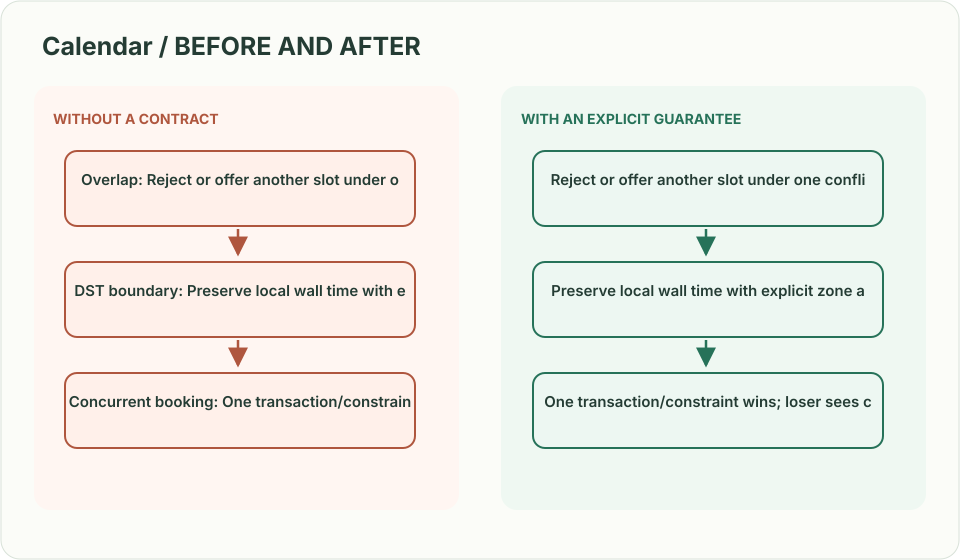
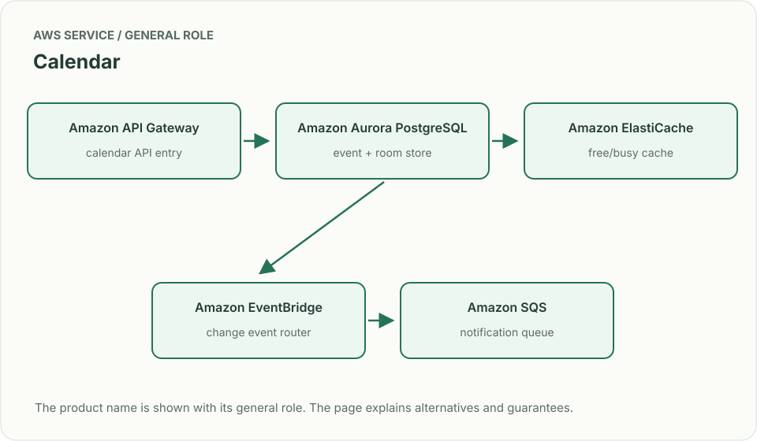
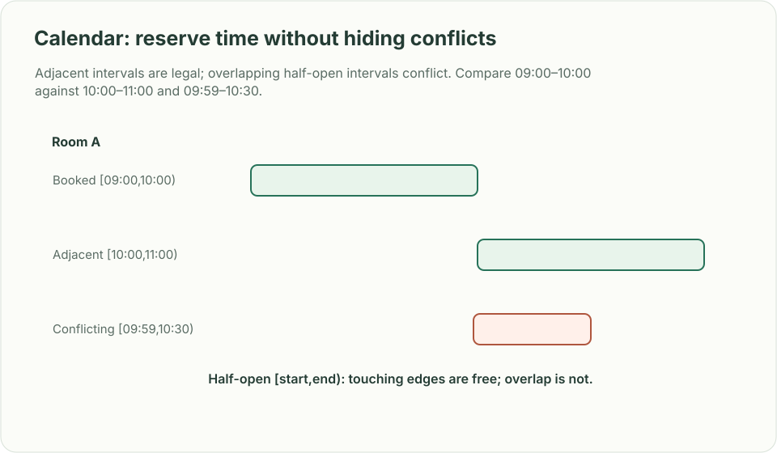

# Calendar: reserve time without hiding conflicts

*Design brief · diagrams and reasoning exercises; no complete application is supplied.*

> **Interviewer:** “People create events, invite guests, and look up free/busy time across calendars. Two organizers may book the same room at once. Time zones and daylight saving changes matter.”

This is a **commonly listed system-design interview prompt** with a concrete practice contract. Assume 100 million calendars, 3 million active users, and free/busy reads much more frequent than event writes. Clarify service guarantees and a first version before filling the board with services.

| Situation | Input / condition | Expected result |
|---|---|---|
| Overlap | Room booked 09:00–10:00; request 09:30–10:30 | Reject or offer another slot under one conflict rule. |
| DST boundary | Recurring 09:00 local meeting crosses clock change | Preserve local wall time with explicit zone and recurrence semantics. |
| Concurrent booking | Two users claim the last room | One transaction/constraint wins; loser sees conflict. |
| Invite response | Guest accepts after organizer cancels | Reject stale event version or mark response to canceled event. |

## Think from the contract to the boxes

Store instants in UTC plus the original time-zone identifier and recurrence rule. Use interval overlap semantics `[start,end)` so adjacent meetings do not conflict. A precomputed free/busy view accelerates reads, but booking must check authoritative intervals at commit. Make invitations versioned events; a delayed response cannot resurrect a canceled meeting.

**First diagram:** Draw event authority, free/busy projection, notification delivery, and a conflict check using the exact interval boundary.

| AWS service / general role | Why it fits this design | Alternative and when it fits better |
|---|---|---|
| **Amazon API Gateway** / calendar API entry | Authenticate calendar reads and writes. | ALB + ECS for long-lived sync clients. |
| **Amazon Aurora PostgreSQL** / event + room store | Range constraints/transactions prevent conflicting reservations. | DynamoDB with carefully partitioned per-calendar transactions. |
| **Amazon ElastiCache** / free/busy cache | Speed repeated availability reads. | Aurora read replicas when freshness can remain transactional. |
| **Amazon EventBridge** / change event router | Publish event changes to notification and sync consumers. | Transactional outbox + SQS for tighter publish recovery. |
| **Amazon SQS** / notification queue | Retry mail/push without blocking calendar writes. | EventBridge Scheduler for delayed reminders. |

Service choice follows the contract: the box label gives the generic job, while the table explains the AWS product and a reasonable substitute. Name which component owns durable truth, where retries happen, and the guarantee each managed service does **not** provide by itself.

## Pressure-test the design

**Follow-up: Adjacent intervals are legal; overlapping half-open intervals conflict. Compare 09:00–10:00 against 10:00–11:00 and 09:59–10:30.**

**Senior expectation:** A calendar write succeeds but an invitation email is delayed. Explain source of truth, outbox, notification dedupe, and what the guest sees before delivery.

**Staff expectation:** Support federated calendars across providers with different recurrence semantics. Set compatibility contracts, conflict ownership and a safe migration for stored time zones.

**Practice artifact:** Draw event authority, free/busy projection, notification delivery, and a conflict check using the exact interval boundary. Then trace every row in the table, draw one failure, and state what the customer observes. Suggested rehearsal: 35 minutes design, 10 minutes to challenge the guarantees.

**Evidence and origin:** The current community interview-question catalog lists calendar/free-busy reports at Microsoft, Oracle and LinkedIn; individual interview dates are not provided. The entry does not show the interview date and is not a verified company rubric. The prompt contract, workload, outcomes, diagrams and solution here are original practice material. Treat company tags as reported sightings, not a prediction of your interview loop.

**Interview report listing:** [Open the community question entry](https://www.hellointerview.com/community/questions/calendar-free-busy/cm8c1h59t005n8pgzdq4ynqjo).
