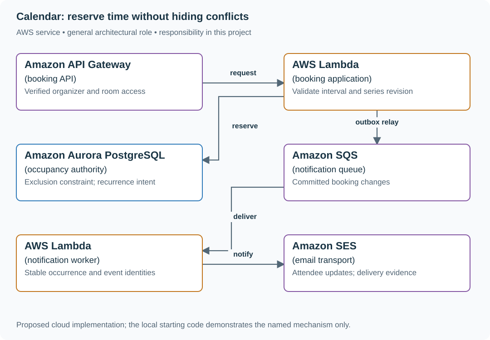

# Calendar: reserve time without hiding conflicts

## What you are building

> Build room booking for a company with offices in London and New York. Two organizers select the last available room for overlapping meetings. A weekly 09:00 meeting must stay at 09:00 local time when daylight-saving time changes.

**Working contract:** POST /rooms/{id}/bookings accepts an interval and request ID; conflicting room occupancy returns 409. GET /availability is advisory. The booking transaction decides whether the interval is still available.

## Workload and the decisions it changes

These are constructed exercise assumptions. The large workload is a design target; the local demonstration does not establish that throughput. Use the [estimation constants](../../../01-code/01-problem-solving/estimation-constants.md) to check units before choosing capacity.

| Input or objective | Calculation / consequence |
|---|---|
| 100 million calendars; 3 million active/day | 3% daily activity; partitioning every request by calendar avoids global scans. |
| 100 bookings/s exercise peak; 60-day availability view | Expand bounded recurrence horizons; do not materialize an infinite series. |
| Intervals are [start,end) | A 10:00–11:00 booking and an 11:00–12:00 booking do not overlap. |

## Start with one working boundary

Run from the repository root with Python 3.12+:

```bash
python3 examples/architecture-starts/calendar_availability.py
```

[Open the starting code](../../../../examples/architecture-starts/calendar_availability.py). This is a runnable demonstration of the critical state boundary. The API, UI, cloud adapters and operating behavior below are the application you build around it.

| Record / module | Key or interface | Responsibility |
|---|---|---|
| bookings | room_id,booking_id,start_utc,end_utc | Committed occupancy; enforce no overlap at the database. |
| series | series_id,local_time,IANA_zone,rule,revision | Recurrence intent plus exception dates. |
| booking_operations | organizer,request_id,payload_hash | Exact retries reuse one booking. |

## AWS implementation



A relational occupancy constraint fits interval exclusion directly. DynamoDB conditional puts alone do not prevent arbitrary overlapping intervals without an additional serialized room-calendar design.

## Build it in this order

### 1. Implement one room first

Store UTC instants and require end after start. In PostgreSQL, use a GiST exclusion constraint combining room equality with overlapping tstzrange values; enable btree_gist where required. A SELECT availability followed by an unconstrained INSERT can double-book under concurrency.

### 2. Add recurrence without losing local intent

Keep the IANA timezone, local recurrence rule and occurrence exceptions. For this exercise skip nonexistent local times and choose the earlier instant for ambiguous times; display that policy. Recompute future materialized occurrences after rule edits under a series revision.

### 3. Separate browsing from committing

Cache availability briefly with an as-of timestamp. On submit, recheck through the authoritative constraint. Preserve the organizer’s proposed time when returning a conflict, and offer a fresh availability read.

### 4. Handle series edits and cancellation

Change only the explicitly chosen occurrence or future series segment. Use stable occurrence IDs and transactionally update occupancy; notify attendees asynchronously from an outbox. A failed email must not roll back an already reserved room.

## Infrastructure configuration

| Resource or boundary | Initial configuration and reason |
|---|---|
| Aurora PostgreSQL | Use a supported engine and range/exclusion constraint; cap pooled connections and keep reservation transactions short. |
| Application configuration | Store timezone identifiers, not fixed UTC offsets. Pin and deliberately update timezone data used for expansion. |
| Notification queue | Bound retries, record delivery state and keep room occupancy independent of provider health. |

Use one disposable AWS environment for the cloud exercise. Put the named resources in `infra/template.yaml` or your existing IaC tool, pass resource IDs through configuration, and scope each runtime role to its own tables, buckets and queues. The diagram is a design to implement; it is not a claim that these resources have been deployed. Record the commands you used to deploy and remove the exercise resources.

## Observe the result

| Action | Expected visible result |
|---|---|
| Run the starting program | The overlap at 10:30 conflicts; the back-to-back 11:00 booking succeeds. |
| Submit two overlapping reservations concurrently | One commits and the other returns a conflict from the authoritative write. |
| Cross a daylight-saving transition | The recurring event follows the published local-time policy. |

## The next design decision

Add a meeting requiring three rooms atomically. Compare a database transaction spanning all room constraints with independent reservations and compensation. Explain what the organizer sees if only two rooms can be acquired.

<details>
<summary>Additional design cases, alternatives and original source notes</summary>

> **Interviewer:** “People create events, invite guests, and look up free/busy time across calendars. Two organizers may book the same room at once. Time zones and daylight saving changes matter.”

This is a **commonly listed system-design interview prompt** with a concrete practice contract. Assume 100 million calendars, 3 million active users, and free/busy reads much more frequent than event writes. Clarify service guarantees and a first version before filling the board with services.

| Situation | Input / condition | Expected result |
|---|---|---|
| Overlap | Room booked 09:00–10:00; request 09:30–10:30 | Reject or offer another slot under one conflict rule. |
| DST boundary | Recurring 09:00 local meeting crosses clock change | Preserve local wall time with explicit zone and recurrence semantics. |
| Concurrent booking | Two users claim the last room | One transaction/constraint wins; loser sees conflict. |
| Invite response | Guest accepts after organizer cancels | Reject stale event version or mark response to canceled event. |


## Think from the contract to the boxes

Store each occurrence as UTC instants, but retain the recurring series' **local wall-time anchor**, IANA zone, recurrence rule, version and exceptions. Expand future occurrences in that zone, not by repeatedly adding 24 hours in UTC. This exercise skips nonexistent spring-forward times and chooses the earlier offset for ambiguous fall-back times; expose that policy to the organizer. Use interval overlap semantics `[start,end)` so adjacent meetings do not conflict. A precomputed free/busy view accelerates reads, but booking must check authoritative intervals at commit. Make invitations versioned events; a delayed response cannot resurrect a canceled meeting.

### One room, one conflict authority

`POST /rooms/{room}/bookings` includes an idempotency key, start and end; identity and room permission are server-checked. The PostgreSQL authority commits booking, replay result and outbox together. For a disposable PostgreSQL database, the core constraint is:

```sql
CREATE EXTENSION IF NOT EXISTS btree_gist;
CREATE TABLE room_booking (
  booking_id text PRIMARY KEY, room_id text NOT NULL,
  starts_at timestamptz NOT NULL, ends_at timestamptz NOT NULL,
  cancelled boolean NOT NULL DEFAULT false,
  CHECK (starts_at < ends_at),
  EXCLUDE USING gist (room_id WITH =,
    tstzrange(starts_at, ends_at, '[)') WITH &&)
    WHERE (NOT cancelled)
);
```

Concurrent overlaps conflict at this constraint; a preceding availability SELECT is only a hint. Cancel/update uses a version condition in the same authority. Event changes and outbox rows commit together; the relay sends to EventBridge/SQS and consumers deduplicate `(event_id, version)`. EventBridge routes events—it cannot make a separate database write and publish atomic.

| Trace to test | Expected result |
|---|---|
| Insert 09:00–10:00 and 09:30–10:30 concurrently | Only one active booking commits. |
| Insert 09:00–10:00 and 10:00–11:00 | Both commit: half-open intervals are adjacent. |
| Cancellation races with a new booking | Outcome follows commit order; no overlapping active pair. |
| Replica still shows an old free slot | Final write rechecks the primary constraint; strict free/busy reads use the primary. |
| Crash after database commit, before event send | Outbox relay resumes; no missing accepted event, duplicates tolerated. |
| A 09:00 recurring meeting crosses DST | It remains 09:00 local under the declared expansion policy. |

This is a schema and test schedule to execute, not evidence that PostgreSQL or AWS was deployed.

**First diagram:** Draw event authority, free/busy projection, notification delivery, and a conflict check using the exact interval boundary.


| AWS service / general role | Why it fits this design | Alternative and when it fits better |
|---|---|---|
| **Amazon API Gateway** / calendar API entry | Authenticate calendar reads and writes. | ALB + ECS for long-lived sync clients. |
| **Amazon Aurora PostgreSQL** / event + room store | Range constraints/transactions prevent conflicting reservations. | DynamoDB with one fenced per-room decision owner, or a fixed-slot model that transactionally claims every slot; arbitrary overlap is not a conditional item check. |
| **Amazon ElastiCache** / free/busy cache | Speed repeated availability reads. | Read replicas for explicitly stale views; primary or a verified watermark for strict reads. |
| **Amazon EventBridge** / change event router | Route changes delivered by the database outbox relay. | Outbox relay → SQS when a queue is enough; routing and atomic publication are different jobs. |
| **Amazon SQS** / notification queue | Retry mail/push without blocking calendar writes. | EventBridge Scheduler for delayed reminders. |

Service choice follows the contract: the box label gives the generic job, while the table explains the AWS product and a reasonable substitute. Name which component owns durable truth, where retries happen, and the guarantee each managed service does **not** provide by itself.


## Pressure-test the design

**Follow-up: Adjacent intervals are legal; overlapping half-open intervals conflict. Compare 09:00–10:00 against 10:00–11:00 and 09:59–10:30.**

**Senior expectation:** A calendar write succeeds but an invitation email is delayed. Explain source of truth, outbox, notification dedupe, and what the guest sees before delivery.

**Staff expectation:** Support federated calendars across providers with different recurrence semantics. Set compatibility contracts, conflict ownership and a safe migration for stored time zones.

**Practice artifact:** Draw event authority, free/busy projection, notification delivery, and a conflict check using the exact interval boundary. Then trace every row in the table, draw one failure, and state what the customer observes. Suggested rehearsal: 35 minutes design, 10 minutes to challenge the guarantees.

**Evidence and origin:** The current community interview-question catalog lists calendar/free-busy reports at Microsoft, Oracle and LinkedIn; individual interview dates are not provided. The entry does not show the interview date and is not a verified company rubric. The prompt contract, workload, outcomes, diagrams and solution here are original practice material. Treat company tags as reported sightings, not a prediction of your interview loop.

**Interview report listing:** [Open the community question entry](https://www.hellointerview.com/community/questions/calendar-free-busy/cm8c1h59t005n8pgzdq4ynqjo).

</details>
