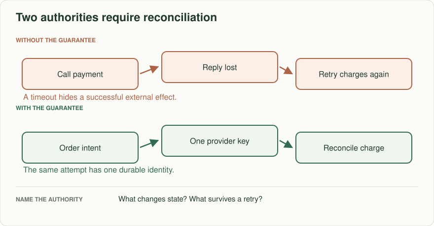
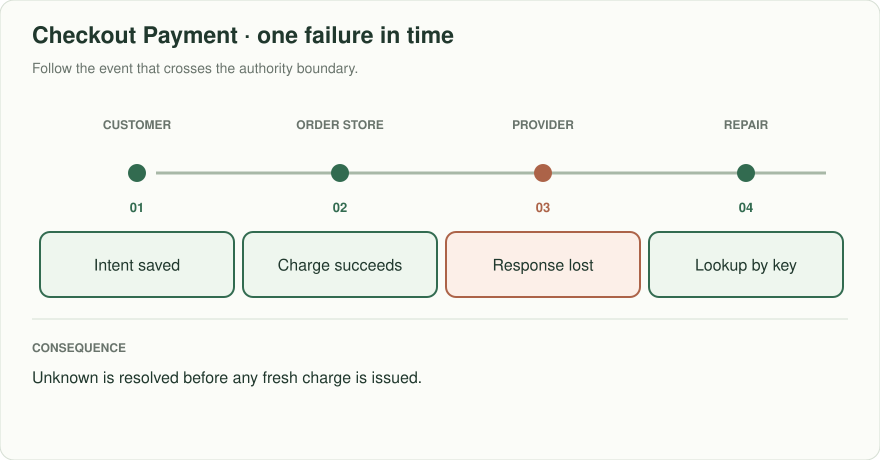
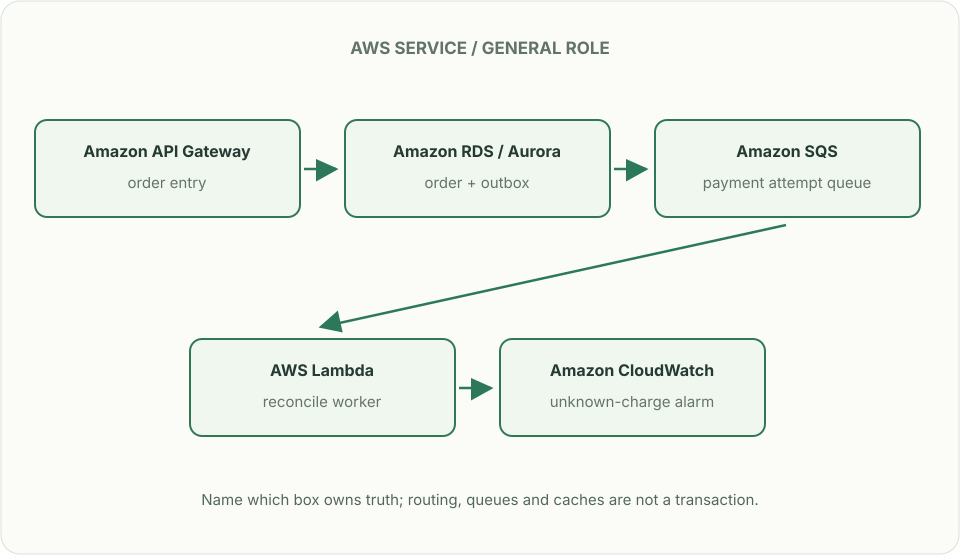

# Checkout: paid twice, ordered once?

> **Interviewer:** “A customer clicks Pay. The payment provider charges their card; your server times out before saving the result. The customer retries. Design checkout so you can explain which order exists, which charge exists, and how an operator repairs disagreements.”

Assume 200 checkout requests/s peak, 10% provider timeouts during an incident, and an inventory reservation that expires after ten minutes. These are exercise conditions. Clarify whether the contract promises no duplicate charge, no duplicate order, or both; each needs its own authority.

| Event sequence | Required decision |
|---|---|
| Provider charges, response lost | Retry uses same provider idempotency key; reconcile unknown result |
| Client retries same checkout with changed cart | Reject conflicting reuse of request ID |
| Inventory hold expires while charge succeeds | Order state records repair/refund work; do not pretend payment rolled back |
| Confirmation worker receives duplicate | One confirmation event per committed order version |

## Find each authority

Your order database owns order state; the payment provider owns charge state; an inventory authority owns the hold. Save checkout intent and immutable cart fingerprint before calling the provider. Reuse one provider key per order attempt and check the provider's actual idempotency retention; your internal record must live long enough for your retry and reconciliation window. Unknown is a real state between attempted and verified success. Never treat a timeout as “not charged.”

## A durable answer under failure

Show PENDING → PAYMENT_UNKNOWN/PAID → CONFIRMED or REFUND_REQUIRED. Persist the external charge reference on confirmation. To send receipts, commit an outbox event in the same database transaction as the order state and publish it asynchronously; consumers still deduplicate delivery. The reconciliation job compares provider charge IDs and local order IDs, pays attention to refunds and provider webhooks arriving out of order, and reports exceptions to a human owner.

## Put the AWS names on the boxes

**Why these boxes, and what changes the choice:** An Aurora transaction records intent and local state; DynamoDB transactional writes are an alternative for key-oriented orders. SQS retries can duplicate work: the provider idempotency key and status lookup are still required. An ECS worker suits high-volume, long-running reconciliation.

Read the smaller label under each service first: it names the architectural job. Then ask whether that service supplies the guarantee in the problem, or simply moves work to the next box.

**Senior follow-up:** Provider idempotency lasts only 24 hours; a DLQ is replayed in three days. Derive why replaying a charge blindly is unsafe, then use provider status lookup, a durable attempt record, and manual escalation for unknowns. Make the maximum auto-retry window explicit.

**Staff follow-up:** Regional failover starts a second worker while the first may still run. Fence ownership or use the same durable order ID/provider key; decide how to audit and repair split decisions. Explain what “exactly once” refers to and what proof you can actually gather.

**Practice artifact:** Three-column ledger of order, hold, and charge after each failure; before/after diagram; operator reconciliation checklist; and one replay test where provider success arrives late.

**AWS translation:** RDS transaction/outbox or DynamoDB transactions for local state; SQS for retryable workers (at least once); EventBridge for notification routes; provider payment API remains external. SQS FIFO deduplication has a bounded interval and cannot make a provider side effect globally exactly once. See [AWS SQS deduplication](https://docs.aws.amazon.com/AWSSimpleQueueService/latest/SQSDeveloperGuide/FIFO-queues-exactly-once-processing.html).

**Source note:** Constructed practice, not an attributed interview or payment provider guarantee.
