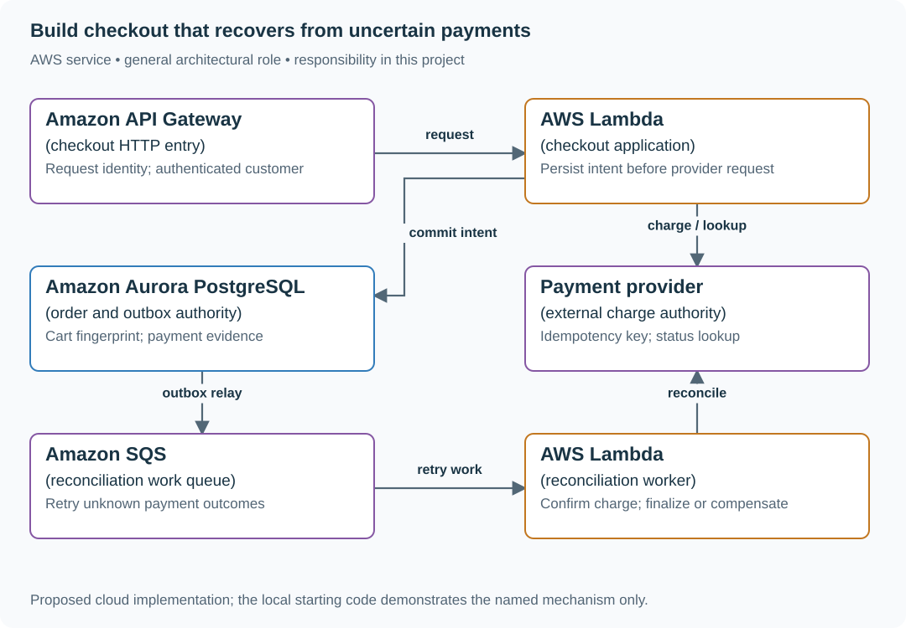

# Build checkout that recovers from uncertain payments

## Application background

Ana buys a book from an online shop. When she presses Pay, the shop records her order, holds a copy of the book and asks a separate payment company to charge her card. Normally the payment company replies with a charge ID, and the shop shows a confirmation.

Now suppose the card is charged but the reply never reaches the shop. After waiting a fixed amount of time, the shop stops waiting. That is a timeout. It tells the shop that an answer is missing, not whether the charge happened.

### Follow the missing payment reply



The status endpoint you will implement should expose that uncertainty. This is a proposed API excerpt, not an HTTP endpoint supplied by the local model:

```http
GET /checkouts/order-7
```

```json
{"id":"order-7","state":"payment_unknown"}
```

The repair operation looks up the original payment identity before changing this result to paid or deciding another action is needed.

Reconciliation means comparing the shop's record with the payment company's record and resolving the disagreement. Your project must make that repair possible without a second charge.

## Your assignment

**Deliver:** Build checkout records and payment handling, including a repair command that finds an uncertain payment's actual outcome without charging the customer twice.

**Required behavior:** POST /checkouts requires an ID reused for retries of the same purchase and a cart fingerprint, a value identifying the exact items, quantities and prices agreed to. Reusing the request ID with a different cart must be rejected. GET /checkouts/{id} exposes pending, payment_unknown, paid, confirmed or refund_required. Timeout must never be translated into definitely_not_charged.

The required first milestone is a working local implementation of the behavior above. The numbered implementation steps define the scope. The cloud architecture is a later extension, not something the starter has already provisioned.

## Get the code and run the supplied example

The code is in the public [junior-to-staff repository](https://github.com/Soulful-Iris/junior-to-staff). Install Git and Python 3.12+. No AWS account or Python packages are required for this first run. If you already have a checkout, use it and skip cloning.

```bash
git clone https://github.com/Soulful-Iris/junior-to-staff.git
cd junior-to-staff
python3 examples/architecture-starts/checkout_payment.py
```

**Supplied file:** [`examples/architecture-starts/checkout_payment.py`](https://github.com/Soulful-Iris/junior-to-staff/blob/main/examples/architecture-starts/checkout_payment.py). You can also [read or download the source here](../../../../examples/architecture-starts/checkout_payment.py).

This program is a **mechanism demonstration**: it runs the small scenario in one process and prints the result. It is not an HTTP service, a complete application, or an AWS deployment. A successful run demonstrates this mechanism only. It does not establish the workload or failure guarantees of the application you will build.

**Example output from the supplied run:**

Generated IDs and timestamps may differ. Compare the state transitions and outcomes.

```text
After timeout: {'id': 'order-7', 'state': 'payment_unknown'}
After reconciliation: {'id': 'order-7', 'state': 'paid', 'charge_id': 'charge-91'} provider charge count: 1
```

### Set up your implementation workspace

Create `work/checkout-payment/` in your checkout (or use a separate repository). Copy the supplied mechanism into that directory as `mechanism.py`, then extract its state transitions into functions you can call from your implementation. The record and module names below describe what you must implement. They are not a promise that files with those names already exist. Keep a `README.md` beside your implementation with its exact run commands and observed results.

## Local components and state to implement

This table names the records, interfaces or decision inputs for your deliverable. Unless a name is explicitly linked to supplied source above, it is something you create. Implement the local state transitions first, then connect the HTTP, storage or worker boundaries required by the steps.

| Record / module | Key or interface | Responsibility |
|---|---|---|
| checkouts | checkout_id,request_id,cart_hash,state | One immutable customer intent per request identity. |
| payment_attempts | checkout_id,provider_key,charge_id,status | Owns the relationship to provider evidence. |
| outbox | checkout_id,event_version | Confirmation and repair jobs committed with order state. |

## Implement the assignment

### 1. Persist checkout before contacting payment

Validate the cart and calculate money in integer minor units with currency. Store request ID, cart fingerprint and the reserved-stock reference. Exact replay returns the same checkout. Changed cart under that ID returns 409.

### 2. Record the payment attempt

Allocate one provider key for this order attempt and persist it before sending. Apply a bounded deadline. A timeout records `payment_unknown`. It does not clear the attempt key. Use a provider that supports deduplication and lookup for the required retry horizon.

### 3. Reconcile ambiguous outcomes

Implement `reconcile.py` to look up the attempt or safely repeat the same key under the provider’s contract. Validate webhook signatures and deduplicate provider event IDs. Handle callbacks arriving before, during or after polling with conditional state transitions.

### 4. Finalize or compensate

Commit paid evidence and order transition. If the inventory hold is gone, record `refund_required` or attempt an explicit new reservation according to product policy. Put confirmation/refund work in an outbox. A database rollback cannot undo a completed external charge.

## Demonstrate the completed local result

| Action | Expected visible result |
|---|---|
| Run the starting program | Order becomes payment_unknown, then paid. The provider fixture contains one charge. |
| Retry with a changed cart | 409 and no second payment attempt. |
| Let stock expire before payment is confirmed | A visible repair/refund state, never an invented all-or-nothing rollback. |

**Handoff:** In your implementation README, include the start command, one successful operation, the failure case above and the resulting stored state or decision. State which dependencies are simulated. Someone with a fresh checkout should be able to reproduce this without your chat history.

## Workload assumptions and capacity decisions

These are constructed exercise assumptions. The stated workload is a design target. The local demonstration does not establish that throughput. Use the [estimation constants](../../../01-code/01-problem-solving/estimation-constants.md) to check units before choosing capacity.

| Input or objective | Calculation / consequence |
|---|---|
| 200 checkout requests/s peak | At a two-second mean provider response, about 400 calls are in flight. Connection pools and provider quotas need an explicit ceiling. |
| 10% of provider responses time out | At peak, 20 unknown outcomes/s need reconciliation. Unknown is a stored state, not an error message discarded from logs. |
| Inventory hold: 10 minutes | A late successful payment may arrive after stock is released. Reserve, finalize or refund through explicit compensating work. |

## Map the local implementation to AWS

**Deployment status: local only.** Running the supplied command creates no AWS resources and configures no cloud connections. The diagram is a proposed deployment of the completed application. Each box needs either a deployed runtime, a provisioned service or an explicitly external dependency.

Read the diagram by following the arrows from the entry point: application code accepts the request or event, the state owner commits it, and any worker produces the later result. The table ties those roles to code and adapter work. Multiple boxes do not imply multiple Python files already exist.



Aurora owns order truth. The provider owns charge truth. A queue coordinates retryable work across those authorities. Their independent commits are the reason for a durable unknown state and compensating actions.

| Local responsibility | Cloud destination and role | Implementation still required |
|---|---|---|
| Local HTTP boundary or the endpoint you will add | Amazon API Gateway: checkout HTTP entry | Create routes and an integration. Translate requests and responses and configure identity validation. |
| Python operation or worker function | AWS Lambda: checkout application | Write a Lambda event adapter, package its dependencies and give its role only the required resource actions. |
| Local records and transaction boundary | Amazon Aurora PostgreSQL: order and outbox authority | Write PostgreSQL schema/migrations and a database adapter. Configure credentials, connection limits and recovery. |
| Controlled payment response fixture | Payment provider: external charge authority | Implement provider calls and reconciliation under the provider actual idempotency contract. Keep credentials outside the client. |
| Local pending-work collection | Amazon SQS: reconciliation work queue | Publish committed job intent, consume messages and persist deduplication/ownership state. Add visibility, retry and dead-letter handling. |
| Python operation or worker function | AWS Lambda: reconciliation worker | Write a Lambda event adapter, package its dependencies and give its role only the required resource actions. |

### Provision resources, then connect the application

| Resource or boundary | Initial configuration and reason |
|---|---|
| Aurora PostgreSQL | Unique request and provider-operation keys. One transaction for order state and outbox. Size DB connections independently of HTTP concurrency. |
| SQS reconciliation queue | Retain the original checkout identity on retries. DLQ after bounded failures. Monitor oldest unknown-payment age. |
| Payment integration | Keep credentials in Secrets Manager. Validate callback signatures. Document provider idempotency retention and query behavior before live charging. |
| API + worker separation | Return pending status without holding a request open for a long reconciliation loop. Restrict the worker role to required tables and secrets. |

Use one disposable AWS environment for the cloud exercise. Put the named resources in `infra/template.yaml` or your existing IaC tool, pass resource IDs through configuration, and scope each runtime role to its own tables, buckets and queues. The diagram is a design to implement. It is not a claim that these resources have been deployed. Record the commands you used to deploy and remove the exercise resources.

For concrete provisioning commands, configuration wiring and cleanup, use the [AWS foundation guide](../../../../examples/architecture-starts/infra/README.md). It includes a deployable table/queue/object-storage foundation and explains which application and service adapters you still implement.

A provisioned queue or table does not make the local program use it. Configure resource IDs in the deployed runtime, replace the local adapter, and replay the same successful and failing operation against that runtime. Record the deployed commit and observable result, then remove the disposable resources using your infrastructure tool.

## Extend the design after the baseline works


Add two payment providers. Define which provider owns an attempt before failover: switching providers after a timeout can create two charges because their idempotency domains are independent. Route only new attempts automatically. Reconcile ambiguous existing ones with their original provider.

<details>
<summary>Additional design cases, alternatives and original source notes</summary>


Assume 200 checkout requests/s peak, 10% provider timeouts during an incident, and an inventory reservation that expires after ten minutes. These are exercise conditions. Clarify whether the contract promises no duplicate charge, no duplicate order, or both. Each needs its own authority.

| Event sequence | Required decision |
|---|---|
| Provider charges, response lost | Retry uses same provider idempotency key. Reconcile unknown result |
| Client retries same checkout with changed cart | Reject conflicting reuse of request ID |
| Inventory hold expires while charge succeeds | Order state records repair/refund work. Do not pretend payment rolled back |
| Confirmation worker receives duplicate | One confirmation event per committed order version |

## Find each authority

Your order database owns order state. The payment provider owns charge state. An inventory authority owns the hold. Save checkout intent and immutable cart fingerprint before calling the provider. Reuse one provider key per order attempt and check the provider's actual idempotency retention. Your internal record must live long enough for your retry and reconciliation window. Unknown is a real state between attempted and verified success. Never treat a timeout as “not charged.”

## A durable answer under failure

Show PENDING → PAYMENT_UNKNOWN/PAID → CONFIRMED or REFUND_REQUIRED. Persist the external charge reference on confirmation. To send receipts, commit an outbox event in the same database transaction as the order state and publish it asynchronously. Consumers still deduplicate delivery. The reconciliation job compares provider charge IDs and local order IDs, pays attention to refunds and provider webhooks arriving out of order, and reports exceptions to a human owner.

## Put the AWS names on the boxes

**Why these boxes, and what changes the choice:** An Aurora transaction records intent and local state. DynamoDB transactional writes are an alternative for key-oriented orders. SQS retries can duplicate work: the provider idempotency key and status lookup are still required. An ECS worker suits high-volume, long-running reconciliation.


**Senior follow-up:** Provider idempotency lasts only 24 hours. A DLQ is replayed in three days. Derive why replaying a charge blindly is unsafe, then use provider status lookup, a durable attempt record, and manual escalation for unknowns. Make the maximum auto-retry window explicit.

**Staff follow-up:** Regional failover starts a second worker while the first may still run. Fence ownership or use the same durable order ID/provider key. Decide how to audit and repair split decisions. Explain what “exactly once” refers to and what proof you can actually gather.

**Practice artifact:** Three-column ledger of order, hold, and charge after each failure. Before/after diagram. Operator reconciliation checklist. And one replay test where provider success arrives late.

**AWS translation:** RDS transaction/outbox or DynamoDB transactions for local state. SQS for retryable workers (at least once). EventBridge for notification routes. Provider payment API remains external. SQS FIFO deduplication has a bounded interval and cannot make a provider side effect globally exactly once. See [AWS SQS deduplication](https://docs.aws.amazon.com/AWSSimpleQueueService/latest/SQSDeveloperGuide/FIFO-queues-exactly-once-processing.html).

**Source note:** Constructed practice, not an attributed interview or payment provider guarantee.

</details>
