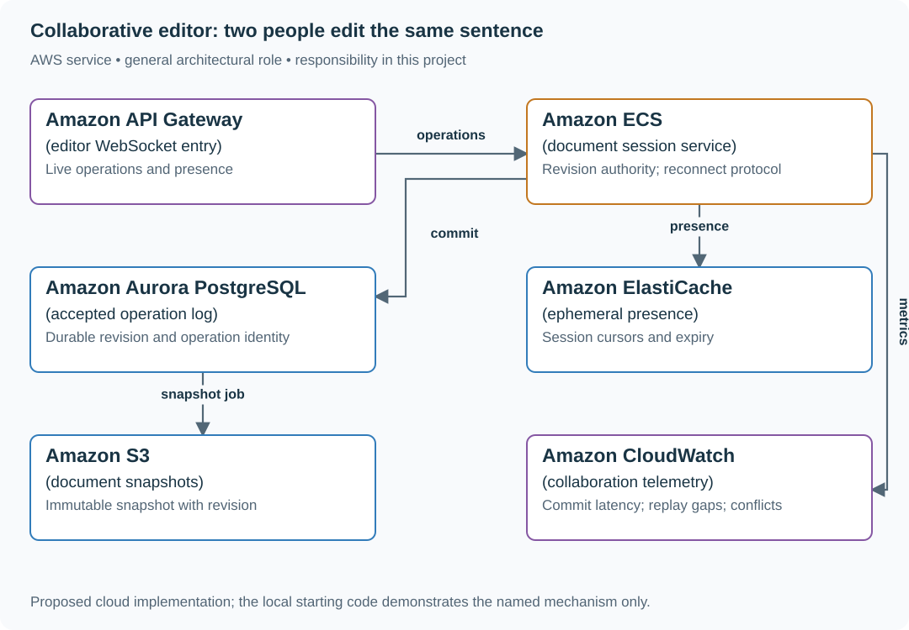

# Build a versioned shared document editor

## Application background

Incident responders edit one shared document from several browsers. Each edit starts from a known revision; offline changes may conflict with changes already accepted by the server.

This is a fictional engineering scenario. The workload figures later in the page are exercise assumptions, not measured production traffic.

## Your assignment

**Deliver:** A durable revision and operation log, conditional edits and a reconnect/conflict interface before any automatic merge extension.

Build a shared incident document for up to 50 responders. Two browsers edit revision 12 at once, one laptop works offline, and a server restarts after acknowledging an operation. Start with a correct versioned editor before adding automatic merging.

**Required behavior:** An acknowledged edit is durable and assigned a document revision. The first milestone accepts an edit only against its stated base revision; stale edits remain as local drafts with an explicit conflict. Presence and cursors are best-effort.

The required first milestone is a working local implementation of the behavior above. The numbered implementation steps define the scope; the cloud architecture is a later extension, not something the starter has already provisioned.

## Get the code and run the supplied example

The code is in the public [junior-to-staff repository](https://github.com/Soulful-Iris/junior-to-staff). Install Git and Python 3.12+. No AWS account or Python packages are required for this first run. If you already have a checkout, use it and skip cloning.

```bash
git clone https://github.com/Soulful-Iris/junior-to-staff.git
cd junior-to-staff
python3 examples/architecture-starts/collaborative_editor.py
```

**Supplied file:** [`examples/architecture-starts/collaborative_editor.py`](https://github.com/Soulful-Iris/junior-to-staff/blob/main/examples/architecture-starts/collaborative_editor.py). You can also [read or download the source here](../../../../examples/architecture-starts/collaborative_editor.py).

This program is a **mechanism demonstration**: it runs the small scenario in one process and prints the result. It is not an HTTP service, a complete application, or an AWS deployment. A successful run demonstrates this mechanism only; it does not establish the workload or failure guarantees of the application you will build.

**Example output from the supplied run:**

Generated IDs and timestamps may differ; compare the state transitions and outcomes.

```text
{'revision': 13, 'text': 'Ana update'}
{'status': 409, 'server_revision': 13, 'keep_draft': 'Ben offline draft'}
{'revision': 13, 'text': 'Ana update'}
```

### Set up your implementation workspace

Create `work/collaborative-editor/` in your checkout (or use a separate repository). Copy the supplied mechanism into that directory as `mechanism.py`, then extract its state transitions into functions you can call from your implementation. The record and module names below describe what you must implement; they are not a promise that files with those names already exist. Keep a `README.md` beside your implementation with its exact run commands and observed results.

## Local components and state to implement

This table names the records, interfaces or decision inputs for your deliverable. Unless a name is explicitly linked to supplied source above, it is something you create. Implement the local state transitions first, then connect the HTTP, storage or worker boundaries required by the steps.

| Record / module | Key or interface | Responsibility |
|---|---|---|
| documents | document_id,revision,snapshot_pointer | Current durable state and snapshot boundary. |
| operations | document_id,operation_id,base_revision,new_revision | Idempotent accepted changes in order. |
| presence | document_id,session_id,last_seen | Expiring cursor information; never durable edit truth. |

## Implement the assignment

### 1. Build a versioned save protocol

Implement GET document and POST operation with base revision and operation identity. Commit accepted operation and new revision together. Keep the losing draft visible and support a manual merge against the latest revision. This is a useful working baseline, not a claim of conflict-free editing.

### 2. Add live operation delivery

Broadcast only committed operations. Clients track the last applied revision and fetch missing ranges on reconnect. Apply duplicate operation IDs once. Store snapshots with a proven last included revision so replay neither skips nor doubles an edit.

### 3. Choose an actual merge algorithm

For automatic concurrent editing, choose a maintained OT or CRDT implementation and document its operation identities, causal metadata and persistence format. Do not invent string-offset merging after the fact; deletion and insertion offsets change under concurrent edits.

### 4. Bound offline and presence state

Specify the supported offline duration and history/metadata retention required by the chosen algorithm. Expire presence independently. A user removed from the document cannot upload old offline edits without a current authorization check.

## Demonstrate the completed local result

| Action | Expected visible result |
|---|---|
| Run the starting program | Ana reaches revision 13; Ben keeps an explicit conflicting draft; Ana’s retry returns revision 13. |
| Restart after acknowledgement | The accepted edit reappears from the log. |
| Drop a live event | The client discovers the revision gap and replays durable operations. |

**Handoff:** In your implementation README, include the start command, one successful operation, the failure case above and the resulting stored state or decision. State which dependencies are simulated. Someone with a fresh checkout should be able to reproduce this without your chat history.

## Workload assumptions and capacity decisions

These are constructed exercise assumptions. The stated workload is a design target; the local demonstration does not establish that throughput. Use the [estimation constants](../../../01-code/01-problem-solving/estimation-constants.md) to check units before choosing capacity.

| Input or objective | Calculation / consequence |
|---|---|
| 10,000 active documents; 50 possible editors/document | Up to 500,000 connected editors; actual active edit rate must be measured separately. |
| Two edits/s from 10% of connected editors | 100,000 operations/s in this constructed active scenario, not a benchmark claim. |
| Snapshots every 1,000 accepted operations | Recovery replays a bounded tail; retain enough history for supported offline clients. |

## Map the local implementation to AWS

**Deployment status: local only.** Running the supplied command creates no AWS resources and configures no cloud connections. The diagram is a proposed deployment of the completed application. Each box needs either a deployed runtime, a provisioned service or an explicitly external dependency.

Read the diagram by following the arrows from the entry point: application code accepts the request or event, the state owner commits it, and any worker produces the later result. The table ties those roles to code and adapter work. Multiple boxes do not imply multiple Python files already exist.



The operation log is durable; presence is disposable. ECS exposes the stateful session and ordering problem clearly. A managed synchronization product can replace parts of this design, but its conflict and offline semantics must still match the product.

| Local responsibility | Cloud destination and role | Implementation still required |
|---|---|---|
| Local HTTP boundary or the endpoint you will add | Amazon API Gateway: editor WebSocket entry | Create routes and an integration; translate requests and responses and configure identity validation. |
| Application or worker process | Amazon ECS: document session service | Build a container and task definition; supply configuration, task roles and graceful shutdown behavior. |
| Local records and transaction boundary | Amazon Aurora PostgreSQL: accepted operation log | Write PostgreSQL schema/migrations and a database adapter; configure credentials, connection limits and recovery. |
| Local cache, counter or coordination state | Amazon ElastiCache: ephemeral presence | Implement a Redis/Valkey adapter and atomic operations, expiry and unavailable-cache behavior; keep the durable authority separate. |
| Local file, object fixture or exported payload | Amazon S3: document snapshots | Implement upload/download and metadata adapters, scoped access, object naming, retention and incomplete-upload cleanup. |
| Local counters, timestamps and diagnostic output | Amazon CloudWatch: collaboration telemetry | Emit bounded metrics and logs, build the named operational view and configure retention and access. |

### Provision resources, then connect the application

| Resource or boundary | Initial configuration and reason |
|---|---|
| Document ownership | Route a document to one logical ordering authority; persist ownership/fencing if session owners can change. |
| Operation storage | Unique document/operation identity; bounded replay pages; snapshot publication after durable upload. |
| Connection limits | Cap sessions per document and reconnect replay rate; reject oversized operations before broadcasting. |

Use one disposable AWS environment for the cloud exercise. Put the named resources in `infra/template.yaml` or your existing IaC tool, pass resource IDs through configuration, and scope each runtime role to its own tables, buckets and queues. The diagram is a design to implement; it is not a claim that these resources have been deployed. Record the commands you used to deploy and remove the exercise resources.

For concrete provisioning commands, configuration wiring and cleanup, use the [AWS foundation guide](../../../../examples/architecture-starts/infra/README.md). It includes a deployable table/queue/object-storage foundation and explains which application and service adapters you still implement.

A provisioned queue or table does not make the local program use it. Configure resource IDs in the deployed runtime, replace the local adapter, and replay the same successful and failing operation against that runtime. Record the deployed commit and observable result, then remove the disposable resources using your infrastructure tool.

## Extend the design after the baseline works


Allow two offline users to delete and insert at the same position. Show the chosen algorithm’s actual operation data and convergence rule. A diagram labeled merge is not enough to define the result.

<details>
<summary>Additional design cases, alternatives and original source notes</summary>


**Your contract.** Start with plain text, 50 concurrent editors per document, 10,000 active documents, and a durable history. Presence may disappear temporarily; acknowledged edits may not. Agree on whether an offline edit must merge automatically or can require a visible conflict resolution. This is a constructed exercise, not a claimed company question.

| Situation | Submitted edits | What the reader should see |
|---|---|---|
| Uncontested | Ana adds “!” at version 4 | Version 5 contains “!”; reconnect replays it once |
| Concurrent | Ana and Ben both replace the word at version 4 | One defined merge rule or a visible conflict; neither edit silently vanishes |
| Lost acknowledgement | Server commits operation `a17`, then Ana retries `a17` | One committed edit and the same acknowledgement |
| Offline | Ben edits version 4; document advances to 7 | Rebase or conflict path is explicit; stale positions are not applied blindly |

## Work through the authority

Draw a single-document sequencer first. A connection carries an **operation ID, document ID, base version, and edit**. The authority verifies permissions, deduplicates by operation ID, assigns the next version, and commits the operation before broadcasting it. Presence can be best effort; it must not be confused with durable edits. The first version may reject a stale base with the latest version and ask the client to rebase. If automatic merges are required, explain the transform or CRDT rule and prove convergence on a concurrent insertion before committing to it.

| AWS box | Job here | Alternative and deciding factor |
|---|---|---|
| API Gateway WebSocket | Hold live editor connections and route messages | ECS service with WebSockets for tighter connection control or custom protocols |
| ECS document owners | Serialize one document's decisions and broadcast results | Lambda with conditional DynamoDB writes if connection affinity and long-running merge logic are unnecessary |
| DynamoDB operation log | Persist `(document, version)` and operation IDs; conditional version advance | Aurora PostgreSQL transaction when relational collaboration queries matter more |
| S3 snapshots | Store periodic materialized documents to bound replay | Keep short documents in DynamoDB if snapshot size and cost stay small |

The ECS owner is an optimization, **not** the only protection: a restarted owner must still lose a conditional version race to the durable store. WebSocket delivery is not a commit acknowledgement. Be precise about the log, snapshot version, and replay cursor.

**Senior follow-up:** Split a document's readers across connection nodes. How does a node replay versions 5–7 after a dropped broadcast? Discuss presence expiration separately from document state.

**Staff follow-up:** A celebrity document attracts 10,000 readers; a Region fails while edits are in flight. Set explicit write locality, fanout budget, conflict policy, RPO, and client behavior during failover. Show which acknowledgement can survive the move.

**Practice artifact:** Draw the authority and three client states (current, stale, reconnecting). Walk the four rows above with version numbers. Spend 35 minutes designing and 10 minutes attacking an acknowledged but not broadcast edit.

**Source boundary:** This problem and capacities are original. Current [DynamoDB condition expressions](https://docs.aws.amazon.com/amazondynamodb/latest/developerguide/Expressions.ConditionExpressions.html) describe the AWS primitive; they do not provide automatic merge semantics.

</details>
