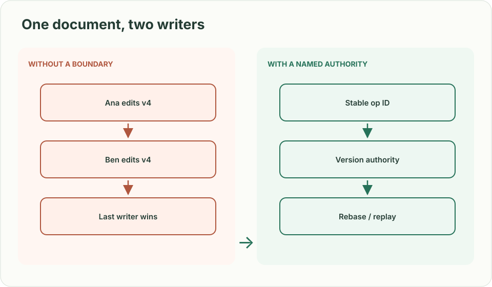
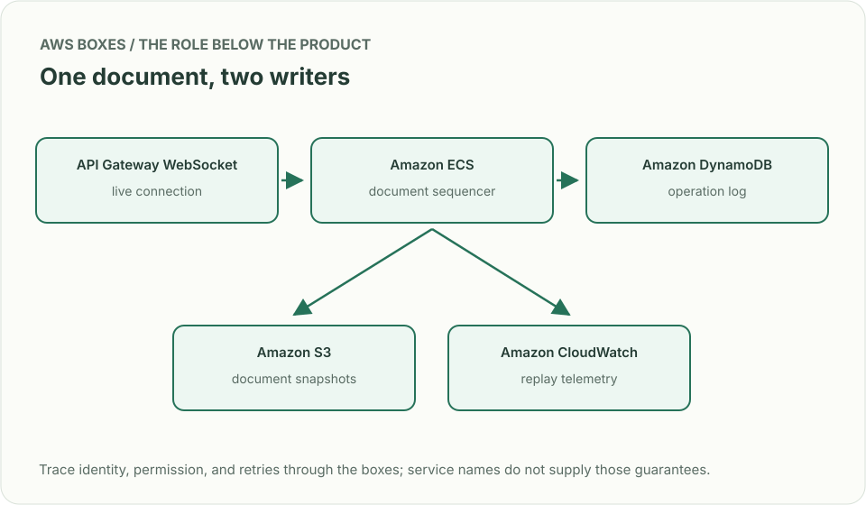
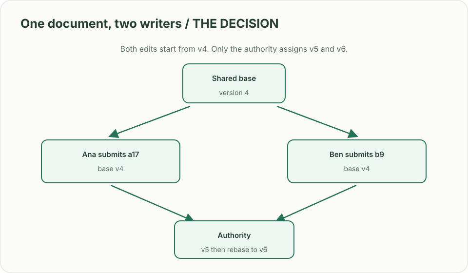

# Collaborative editor: two people edit the same sentence

> **Interviewer:** “Build a shared document editor. Ana and Ben can edit the same document while one is offline. They should see changes within a second when connected. What does the server accept, and what happens when edits collide?”

**Your contract.** Start with plain text, 50 concurrent editors per document, 10,000 active documents, and a durable history. Presence may disappear temporarily; acknowledged edits may not. Agree on whether an offline edit must merge automatically or can require a visible conflict resolution. This is a constructed exercise, not a claimed company question.

| Situation | Submitted edits | What the reader should see |
|---|---|---|
| Uncontested | Ana adds “!” at version 4 | Version 5 contains “!”; reconnect replays it once |
| Concurrent | Ana and Ben both replace the word at version 4 | One defined merge rule or a visible conflict; neither edit silently vanishes |
| Lost acknowledgement | Server commits operation `a17`, then Ana retries `a17` | One committed edit and the same acknowledgement |
| Offline | Ben edits version 4; document advances to 7 | Rebase or conflict path is explicit; stale positions are not applied blindly |

## Work through the authority

Draw a single-document sequencer first. A connection carries an **operation ID, document ID, base version, and edit**. The authority verifies permissions, deduplicates by operation ID, assigns the next version, and commits the operation before broadcasting it. Presence can be best effort; it must not be confused with durable edits. The first version may reject a stale base with the latest version and ask the client to rebase. If automatic merges are required, explain the transform or CRDT rule and prove convergence on a concurrent insertion before committing to it.

| AWS box | Job here | Alternative and deciding factor |
|---|---|---|
| API Gateway WebSocket | Hold live editor connections and route messages | ECS service with WebSockets for tighter connection control or custom protocols |
| ECS document owners | Serialize one document's decisions and broadcast results | Lambda with conditional DynamoDB writes if connection affinity and long-running merge logic are unnecessary |
| DynamoDB operation log | Persist `(document, version)` and operation IDs; conditional version advance | Aurora PostgreSQL transaction when relational collaboration queries matter more |
| S3 snapshots | Store periodic materialized documents to bound replay | Keep short documents in DynamoDB if snapshot size and cost stay small |

The ECS owner is an optimization, **not** the only protection: a restarted owner must still lose a conditional version race to the durable store. WebSocket delivery is not a commit acknowledgement. Be precise about the log, snapshot version, and replay cursor.

**Senior follow-up:** Split a document's readers across connection nodes. How does a node replay versions 5–7 after a dropped broadcast? Discuss presence expiration separately from document state.

**Staff follow-up:** A celebrity document attracts 10,000 readers; a Region fails while edits are in flight. Set explicit write locality, fanout budget, conflict policy, RPO, and client behavior during failover. Show which acknowledgement can survive the move.

**Practice artifact:** Draw the authority and three client states (current, stale, reconnecting). Walk the four rows above with version numbers. Spend 35 minutes designing and 10 minutes attacking an acknowledged but not broadcast edit.

**Source boundary:** This problem and capacities are original. Current [DynamoDB condition expressions](https://docs.aws.amazon.com/amazondynamodb/latest/developerguide/Expressions.ConditionExpressions.html) describe the AWS primitive; they do not provide automatic merge semantics.
