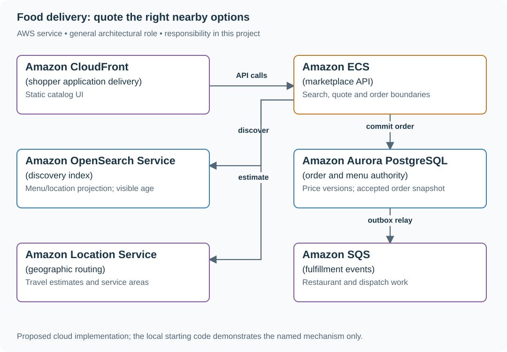
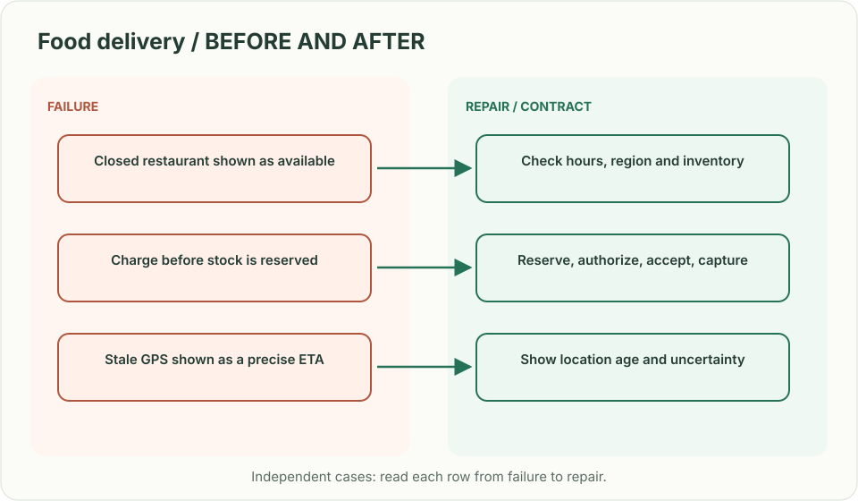
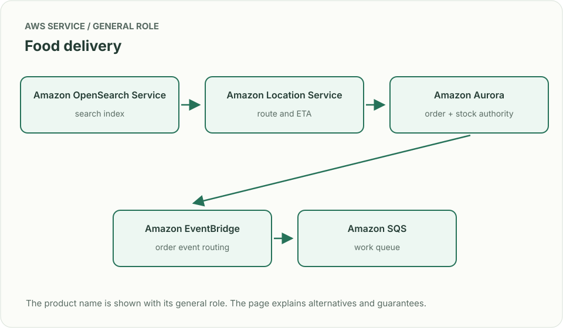
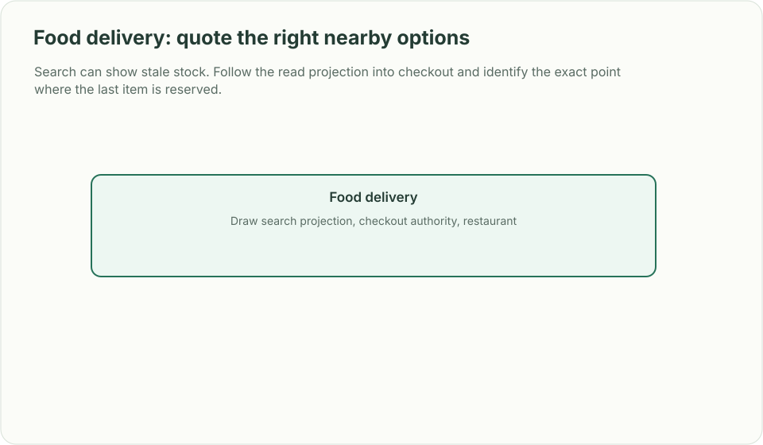

# Food delivery: quote the right nearby options

## What you are building

> Build restaurant discovery and order placement for a delivery marketplace. A customer sees a meal at £12.50, but the restaurant changes its price or sells out before checkout. Search should stay responsive without making stale catalog data the authority for an order.

**Working contract:** GET /restaurants searches nearby open restaurants. POST /orders submits item IDs, displayed price version and request identity. The order service revalidates availability and returns either a committed priced order or an explicit change requiring customer acceptance.

## Workload and the decisions it changes

These are constructed exercise assumptions. The large workload is a design target; the local demonstration does not establish that throughput. Use the [estimation constants](../../../01-code/01-problem-solving/estimation-constants.md) to check units before choosing capacity.

| Input or objective | Calculation / consequence |
|---|---|
| 200,000 restaurants; two million concurrent shoppers | Popular restaurants and geographic cells are hot spots even when total capacity is sufficient. |
| Catalog freshness target: 30 seconds | Search may be stale; price and stock are checked again at the order boundary. |
| 100 items/restaurant assumption | 20 million menu records before option combinations and search-index overhead. |

## Start with one working boundary

Run from the repository root with Python 3.12+:

```bash
python3 examples/architecture-starts/food_delivery_marketplace.py
```

[Open the starting code](../../../../examples/architecture-starts/food_delivery_marketplace.py). This is a runnable demonstration of the critical state boundary. The API, UI, cloud adapters and operating behavior below are the application you build around it.

| Record / module | Key or interface | Responsibility |
|---|---|---|
| menu_items | restaurant,item,price_minor,currency,version | Authoritative price and sale availability. |
| search_documents | restaurant,location,menu_revision | Discovery projection with freshness metadata. |
| orders | customer,request_id,priced_items,state | Immutable accepted price snapshot and fulfillment state. |

## AWS implementation



OpenSearch finds candidates; Aurora decides what is being purchased. A location service provides geography and routing, not inventory ownership or a restaurant’s ability to fulfill an order.

## Build it in this order

### 1. Build discovery as a projection

Store restaurant opening rules, service area and menu revision in the source database. Index geographic/search fields asynchronously. Return an as-of marker and stable IDs; do not place the only copy of availability in the search index.

### 2. Make checkout authoritative

Load current items and versions inside the order transaction. Calculate integer minor-unit totals, currency, fees and taxes under an explicit pricing policy. A changed price returns a new quote for acceptance instead of silently charging more.

### 3. Track fulfillment transitions

Record created, restaurant_accepted, preparing, assigned, delivered or cancelled with conditional versions. A restaurant rejection and a payment success need an explicit refund/reconciliation path. Separate estimated delivery time from a guaranteed promise.

### 4. Add dispatch and degraded browsing

Use location/routing services for candidate travel estimates. When search indexing lags, show stale discovery honestly and keep authoritative checkout available where possible. Bound restaurant-level order intake so a viral promotion cannot create impossible kitchen demand.

## Infrastructure configuration

| Resource or boundary | Initial configuration and reason |
|---|---|
| Search index | Version source updates and tombstones; monitor oldest unapplied change, not just cluster health. |
| Order database | Unique customer/request identity, short transactions and explicit price snapshots. |
| Location integration | Treat route estimates as time-sensitive predictions; cache within a documented freshness bound. |

Use one disposable AWS environment for the cloud exercise. Put the named resources in `infra/template.yaml` or your existing IaC tool, pass resource IDs through configuration, and scope each runtime role to its own tables, buckets and queues. The diagram is a design to implement; it is not a claim that these resources have been deployed. Record the commands you used to deploy and remove the exercise resources.

## Observe the result

| Action | Expected visible result |
|---|---|
| Run the starting program | The old £12.50 cart receives a £14.00 change requiring acceptance. |
| Remove an item while search is stale | Checkout rejects the unavailable item. |
| Retry a committed order | The original order returns without another charge. |

## The next design decision

Add restaurant-specific promotions and substitutions. Define which changes require renewed customer consent and which can be applied within the accepted quote; preserve the exact accepted policy version.

<details>
<summary>Additional design cases, alternatives and original source notes</summary>

> **Interviewer:** “Customers search nearby restaurants, place an order, and track delivery. Restaurants change hours and menus; couriers move; inventory can sell out between browse and checkout. Design the customer path.”

This is a **commonly listed system-design interview prompt** with a concrete practice contract. Assume 200,000 restaurants, 2 million concurrent shoppers during dinner, and availability freshness within 30 seconds. Clarify service guarantees and a first version before filling the board with services.

| Situation | Input / condition | Expected result |
|---|---|---|
| Nearby search | Cuisine + 3 km radius | Return open restaurants whose location and filters match. |
| Menu race | Last item sells after browse | Reject or substitute before payment capture; explain the reservation rule. |
| Courier GPS stale | Last update 90 seconds old | Show uncertainty or refresh; avoid precise false ETA. |
| Duplicate order submit | Mobile retry after timeout | Idempotency key returns the same order, not a second charge. |



## Think from the contract to the boxes

Search is a discovery view, not inventory authority. Index restaurant location and catalog for fast filtering; recheck opening state, price and stock at checkout. Persist an order state machine (CREATED → ACCEPTED → PREPARING → PICKED_UP → DELIVERED) and keep payment/courier side effects idempotent. A nearby result is not a confirmed order.

### Follow one order across the boundaries

| Arrow | Commit / acknowledgement meaning | Retry and recovery |
|---|---|---|
| Authenticated shopper → checkout (`order_key`, menu version, items) | Aurora transaction conditionally decrements available stock and creates reservation, order, replay result and outbox. A stale price returns conflict before payment. | Same key + same request returns the stored result; different request conflicts. |
| Outbox relay → EventBridge → restaurant queue (`order_id`, version) | Database commit accepted the order request; queue acknowledgement is not restaurant acceptance. | Relay retries; restaurant transition is conditional on current order version. |
| Payment worker → provider (`payment_intent_id`) | Authorization reserves funds; capture occurs only after restaurant acceptance. | Reconcile timeout with the same provider key; do not switch providers while the first outcome is unknown. |
| Restaurant response → order authority | Accept or a two-minute timeout wins one conditional state transition. | Timeout releases stock and queues authorization void. A late capture requires a durable, idempotent refund operation. |

Each worker authenticates with a role limited to its queue and domain records; shopper identity cannot be taken from the queued body without validating its trusted origin. Keep provider deadlines shorter than the operation deadline and persist uncertainty instead of labelling it failure.

**Freshness budget (exercise target):** change detection 5 s + queue delay 5 s + indexing 15 s + visibility 5 s = **30 s**. If backlog breaks that budget, label discovery stale; checkout still reads current authority. At 2 million shoppers refreshing once per 30 s, budget roughly **66,667 discovery reads/s**, before bursts.

**Failure trace:** stock/order/outbox commit → relay crashes → shopper retries. Return the original order; relay later publishes its existing event. Deliver that event twice and timeout the restaurant: assert one stock release and one void/refund intent, not a second order.

**First diagram:** Draw search projection, checkout authority, restaurant acceptance, courier assignment, and customer status as separate boxes.



| AWS service / general role | Why it fits this design | Alternative and when it fits better |
|---|---|---|
| **Amazon OpenSearch Service** / search index | Filter and rank current restaurant/menu candidates. | Aurora spatial queries at modest data size. |
| **Amazon Location Service** / route and ETA | Estimate routes for locations supplied by the owned restaurant index; it is not the authority for our menus, stock or filters. | Another routing provider; keep owned catalog search in OpenSearch or Aurora spatial queries. |
| **Amazon Aurora** / order + stock authority | Transactionally validate price, stock and order creation. | DynamoDB conditional item updates for key-oriented inventory. |
| **Amazon EventBridge** / order event routing | Route changes sent by the transactional outbox relay; routing does not close the database/publish gap. | SNS when simple topic broadcast is enough. |
| **Amazon SQS** / work queue | Buffer assignment/retry work independently. | Step Functions when long-lived workflow state is the main need. |

Service choice follows the contract: the box label gives the generic job, while the table explains the AWS product and a reasonable substitute. Name which component owns durable truth, where retries happen, and the guarantee each managed service does **not** provide by itself.



## Pressure-test the design

**Follow-up: Search can show stale stock. Follow the read projection into checkout and identify the exact point where the last item is reserved.**

**Senior expectation:** A restaurant does not respond before the timeout. Separate payment authorization from capture, define cancellation compensation, and keep customer status honest.

**Staff expectation:** Expand into a new country with different tax, courier and payment providers. Keep domain events stable while assigning regional ownership, compliance, and rollout measures.

**Practice artifact:** Draw search projection, checkout authority, restaurant acceptance, courier assignment, and customer status as separate boxes. Then trace every row in the table, draw one failure, and state what the customer observes. Suggested rehearsal: 35 minutes design, 10 minutes to challenge the guarantees.

**Evidence and origin:** The current community interview-question catalog lists food-delivery design reports at Uber, Meta and Twilio; the report dates are not shown. The entry does not show the interview date and is not a verified company rubric. The prompt contract, workload, outcomes, diagrams and solution here are original practice material. Treat company tags as reported sightings, not a prediction of your interview loop.

**Interview report listing:** [Open the community question entry](https://www.hellointerview.com/community/questions/nearby-restaurants-app/cmacvonzo00r0ad08c9ona48e).

</details>
