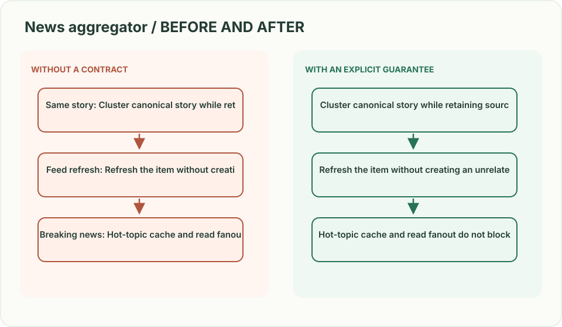
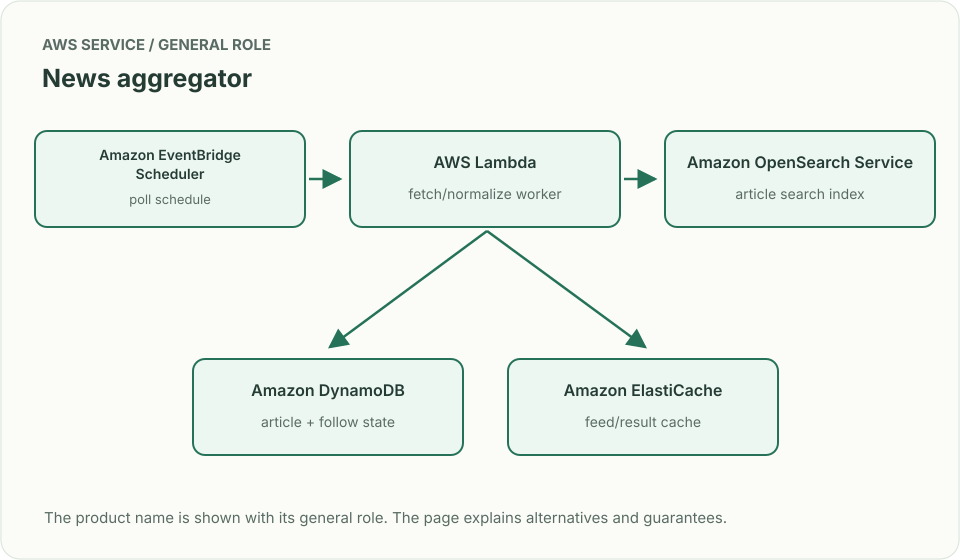
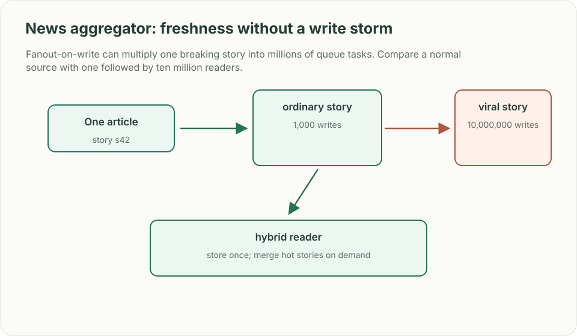

# News aggregator: freshness without a write storm

*Design brief · diagrams and reasoning exercises; no complete application is supplied.*

> **Interviewer:** “Collect articles from publishers, remove duplicates, and make a personalized feed from topics and followed sources. A major story arrives from hundreds of sources at once.”

This is a **commonly listed system-design interview prompt** with a concrete practice contract. Assume 50,000 publisher feeds, 20 million daily readers, and new stories visible within 60 seconds. Clarify service guarantees and a first version before filling the board with services.

| Situation | Input / condition | Expected result |
|---|---|---|
| Same story | Three publishers syndicate one article | Cluster canonical story while retaining source attribution. |
| Feed refresh | One publisher updates title | Refresh the item without creating an unrelated duplicate. |
| Breaking news | Topic query receives 5× normal traffic | Hot-topic cache and read fanout do not block ingestion. |
| Unfollow | Reader unfollows a source | Feed response stops showing it within the declared privacy/freshness bound. |

## Think from the contract to the boxes

Treat collection, canonicalization, ranking and feed reads as separate stages. Keep source article IDs and a canonical cluster ID; dedupe is probabilistic candidate grouping followed by explainable rules. Precompute ordinary feeds where it helps, but do not copy every breaking story to every user synchronously. Recheck follows and muted topics when composing the page.

**First diagram:** Trace publisher fetch → canonical story → topic index → feed composition; mark which copy is source and which is projection.

| AWS service / general role | Why it fits this design | Alternative and when it fits better |
|---|---|---|
| **Amazon EventBridge Scheduler** / poll schedule | Trigger publisher fetches at per-source cadence. | SQS delayed work when retry timing needs tighter control. |
| **AWS Lambda** / fetch/normalize worker | Parse small source feeds and enforce per-domain limits. | ECS for heavy parsers and persistent connections. |
| **Amazon OpenSearch Service** / article search index | Find text/topic candidates and support filtered discovery. | Aurora full-text search at lower volume. |
| **Amazon DynamoDB** / article + follow state | Store canonical IDs and reader/source relationships. | Aurora when joins and consistency across follows dominate. |
| **Amazon ElastiCache** / feed/result cache | Protect hot stories and repeated feed reads. | CloudFront for public non-personalized pages. |

Service choice follows the contract: the box label gives the generic job, while the table explains the AWS product and a reasonable substitute. Name which component owns durable truth, where retries happen, and the guarantee each managed service does **not** provide by itself.

## Pressure-test the design

**Follow-up: Fanout-on-write can multiply one breaking story into millions of queue tasks. Compare a normal source with one followed by ten million readers.**

**Senior expectation:** Publisher fetches become rate-limited and malformed. Isolate domains, add backoff and quarantine, and tell readers when content is stale.

**Staff expectation:** A new editorial policy changes canonicalization across regions. Define data ownership, safe reindexing, relevance quality measures, and rollback without duplicate feed entries.

**Practice artifact:** Trace publisher fetch → canonical story → topic index → feed composition; mark which copy is source and which is projection. Then trace every row in the table, draw one failure, and state what the customer observes. Suggested rehearsal: 35 minutes design, 10 minutes to challenge the guarantees.

**Evidence and origin:** The current community interview-question catalog lists personalized news-aggregation reports at Amazon, Microsoft and Rippling; interview dates are not shown. The entry does not show the interview date and is not a verified company rubric. The prompt contract, workload, outcomes, diagrams and solution here are original practice material. Treat company tags as reported sightings, not a prediction of your interview loop.

**Interview report listing:** [Open the community question entry](https://www.hellointerview.com/community/questions/news-aggregator-feed/cm96lh25n0039ad08067audlg).
