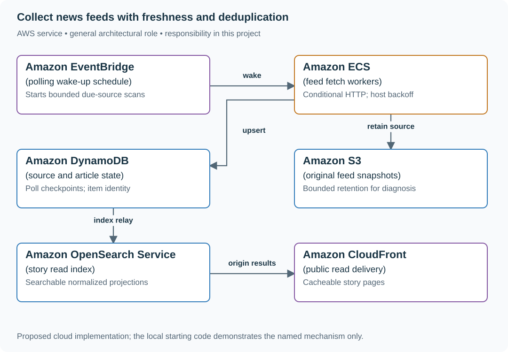

# Collect news feeds with freshness and deduplication

## Application background

A news reader polls publisher feeds, stores articles and groups repeated coverage of the same story. Readers need both article results and an honest indication of source freshness.

This is a fictional engineering scenario. The workload figures later in the page are exercise assumptions, not measured production traffic.

## Your assignment

**Deliver:** A per-source polling schedule, duplicate grouping and a feed response showing the last successful source check.

Build a news reader that polls publisher feeds and groups duplicate stories. Editors expect responsive feeds to appear within a minute, but some publishers throttle requests or stop updating. Readers need to see when a source was last checked successfully.

**Required behavior:** Ingest RSS/Atom updates, retain source attribution and publish normalized stories with stable IDs. Freshness is measured per reachable source; a publisher outage must not be presented as an empty successful feed.

The required first milestone is a working local implementation of the behavior above. The numbered implementation steps define the scope; the cloud architecture is a later extension, not something the starter has already provisioned.

## Get the code and run the supplied example

The code is in the public [junior-to-staff repository](https://github.com/Soulful-Iris/junior-to-staff). Install Git and Python 3.12+. No AWS account or Python packages are required for this first run. If you already have a checkout, use it and skip cloning.

```bash
git clone https://github.com/Soulful-Iris/junior-to-staff.git
cd junior-to-staff
python3 examples/architecture-starts/news_aggregator.py
```

**Supplied file:** [`examples/architecture-starts/news_aggregator.py`](https://github.com/Soulful-Iris/junior-to-staff/blob/main/examples/architecture-starts/news_aggregator.py). You can also [read or download the source here](../../../../examples/architecture-starts/news_aggregator.py).

This program is a **mechanism demonstration**: it runs the small scenario in one process and prints the result. It is not an HTTP service, a complete application, or an AWS deployment. A successful run demonstrates this mechanism only; it does not establish the workload or failure guarantees of the application you will build.

**Example output from the supplied run:**

Generated IDs and timestamps may differ; compare the state transitions and outcomes.

```text
upserted ('publisher-a', '42')
upserted ('publisher-a', '42')
304 response: retain existing articles {('publisher-a', '42'): {'url': 'https://example.invalid/story', 'title': 'Corrected title'}}
```

### Set up your implementation workspace

Create `work/news-aggregator/` in your checkout (or use a separate repository). Copy the supplied mechanism into that directory as `mechanism.py`, then extract its state transitions into functions you can call from your implementation. The record and module names below describe what you must implement; they are not a promise that files with those names already exist. Keep a `README.md` beside your implementation with its exact run commands and observed results.

## Local components and state to implement

This table names the records, interfaces or decision inputs for your deliverable. Unless a name is explicitly linked to supplied source above, it is something you create. Implement the local state transitions first, then connect the HTTP, storage or worker boundaries required by the steps.

| Record / module | Key or interface | Responsibility |
|---|---|---|
| sources | feed_id,url,etag,last_modified,next_poll | Poll state and publisher-specific backoff. |
| articles | source_id,source_item_id,canonical_url,revision | Provenance-preserving normalized records. |
| clusters | cluster_id,article_ids,merge_version | Reversible grouping; not destructive deduplication. |

## Implement the assignment

### 1. Poll one source correctly

Send If-None-Match/If-Modified-Since when supported. Treat 304 as successful unchanged content, not deletion. Bound response size and parsing time, disable unsafe XML entity expansion, and preserve the original feed/item identity.

### 2. Coordinate host load

Schedule next_poll by source freshness and host allowance. Respect bounded Retry-After and back off failing publishers. Apply outbound destination validation to feed URLs and redirects; a submitted feed must not become an internal-network fetch endpoint.

### 3. Normalize without losing attribution

Keep publisher item IDs, observed canonical URLs, published/updated times and retrieved time separately. Group likely duplicates while retaining each source record. A corrected headline updates a revision; a mistaken cluster merge must be reversible.

### 4. Serve an explicit read model

Index published stories and serve bounded pages with cache headers. Show source freshness and partial ingestion status in the editor view. A feed disappearing should trigger a source incident, not mass deletion of historical articles.

## Demonstrate the completed local result

| Action | Expected visible result |
|---|---|
| Run the starting program | A corrected title replaces one source item; 304 retains the existing record. |
| Return 429 from one publisher | That host backs off while unrelated hosts continue. |
| Merge two stories incorrectly | Editors can split the cluster without losing either source article. |

**Handoff:** In your implementation README, include the start command, one successful operation, the failure case above and the resulting stored state or decision. State which dependencies are simulated. Someone with a fresh checkout should be able to reproduce this without your chat history.

## Workload assumptions and capacity decisions

These are constructed exercise assumptions. The stated workload is a design target; the local demonstration does not establish that throughput. Use the [estimation constants](../../../01-code/01-problem-solving/estimation-constants.md) to check units before choosing capacity.

| Input or objective | Calculation / consequence |
|---|---|
| 50,000 feeds; one poll/minute baseline | About 833 requests/s before retries; coordinate by host as well as feed. |
| 20 million daily readers | Reader traffic belongs behind a cacheable read model, separate from outbound polling capacity. |
| Average feed response 50 KiB assumption | About 41 MiB/s if every poll returns full content; conditional requests can materially reduce transfer. |

## Map the local implementation to AWS

**Deployment status: local only.** Running the supplied command creates no AWS resources and configures no cloud connections. The diagram is a proposed deployment of the completed application. Each box needs either a deployed runtime, a provisioned service or an explicitly external dependency.

Read the diagram by following the arrows from the entry point: application code accepts the request or event, the state owner commits it, and any worker produces the later result. The table ties those roles to code and adapter work. Multiple boxes do not imply multiple Python files already exist.



Polling and reader delivery have different scaling patterns. Conditional requests save transfer, while source/item identity preserves corrections without manufacturing duplicate stories.

| Local responsibility | Cloud destination and role | Implementation still required |
|---|---|---|
| Local event dispatch | Amazon EventBridge: polling wake-up schedule | Define event rules/targets and delivery failure handling; persist logical event/run identity in the application. |
| Application or worker process | Amazon ECS: feed fetch workers | Build a container and task definition; supply configuration, task roles and graceful shutdown behavior. |
| Local dictionary, SQLite records or state model | Amazon DynamoDB: source and article state | Design partition/sort keys and write a storage adapter with conditional updates or transactions; Python state and SQL are not uploaded as a database. |
| Local file, object fixture or exported payload | Amazon S3: original feed snapshots | Implement upload/download and metadata adapters, scoped access, object naming, retention and incomplete-upload cleanup. |
| Local derived search records | Amazon OpenSearch Service: story read index | Implement indexing, updates/deletions and queries; recheck current authorization before returning sensitive results. |
| Local static/media delivery path | Amazon CloudFront: public read delivery | Configure an origin, cache policy and private-content access; distinguish cached bytes from current authorization. |

### Provision resources, then connect the application

| Resource or boundary | Initial configuration and reason |
|---|---|
| Fetch workers | Fixed outbound concurrency, host limits, response byte cap and a total request deadline. |
| Read projection | Version updates and expose oldest indexing lag; keep source originals outside the index. |
| Retention | Store only required feed snapshots and attribution; separate diagnostic retention from reader history. |

Use one disposable AWS environment for the cloud exercise. Put the named resources in `infra/template.yaml` or your existing IaC tool, pass resource IDs through configuration, and scope each runtime role to its own tables, buckets and queues. The diagram is a design to implement; it is not a claim that these resources have been deployed. Record the commands you used to deploy and remove the exercise resources.

For concrete provisioning commands, configuration wiring and cleanup, use the [AWS foundation guide](../../../../examples/architecture-starts/infra/README.md). It includes a deployable table/queue/object-storage foundation and explains which application and service adapters you still implement.

A provisioned queue or table does not make the local program use it. Configure resource IDs in the deployed runtime, replace the local adapter, and replay the same successful and failing operation against that runtime. Record the deployed commit and observable result, then remove the disposable resources using your infrastructure tool.

## Extend the design after the baseline works


Add multilingual story grouping. Preserve original language and attribution, and evaluate false merges separately from missed duplicates; similarity is a candidate signal, not identity.

<details>
<summary>Additional design cases, alternatives and original source notes</summary>


This is a **commonly listed system-design interview prompt** with a concrete practice contract. Assume 50,000 publisher feeds, 20 million daily readers, and new stories visible within a 60-second target for responsive, successfully polled sources. Publisher outages cannot meet that target; surface stale-source status. Clarify service guarantees and a first version before filling the board with services.

| Situation | Input / condition | Expected result |
|---|---|---|
| Same story | Three publishers syndicate one article | Cluster canonical story while retaining source attribution. |
| Feed refresh | One publisher updates title | Refresh the item without creating an unrelated duplicate. |
| Breaking news | Topic query receives 5× normal traffic | Hot-topic cache and read fanout do not block ingestion. |
| Unfollow | Reader unfollows a source | Feed response stops showing it within the declared privacy/freshness bound. |

## Think from the contract to the boxes

Treat collection, canonicalization, ranking and feed reads as separate stages. Keep source article IDs and a canonical cluster ID; dedupe is probabilistic candidate grouping followed by explainable rules. Precompute ordinary feeds where it helps, but do not copy every breaking story to every user synchronously. Recheck follows and muted topics when composing the page.

### Publication and freshness budget

| Arrow | Identity and accepted state | Failure policy |
|---|---|---|
| Scheduler → fetcher | `(publisher_id, poll_slot)`; a scheduled tick means work is due, not fetched. | Per-domain concurrency cap and 5 s HTTP deadline; record stale status when publisher limits prevent freshness. |
| Fetcher → article authority | `(publisher_id, source_article_id, source_version)` plus content hash; commit article revision and outbox together. | Replay revision without duplicating it; credentials are scoped to that publisher/domain. |
| Outbox → indexer | `(article_id, revision, cluster_version)`; index is a projection. | Reject older versions, retry failed writes; outbox survives a crash before send. |
| Index/cache → feed composer | Candidate IDs, then current follow/mute and content policy checks. | Never treat a personalized cached response as current permission. |

A worked **60 s target** is 20 s maximum poll delay + 5 s fetch + 10 s queue + 15 s normalize/index + 10 s index/cache visibility. Polling 50,000 feeds every 20 s needs **2,500 fetch starts/s** before retries; provider limits can make this target infeasible, requiring push feeds or an explicitly relaxed promise.

Keep publisher articles immutable by revision. Cluster merges store aliases from old cluster IDs to the chosen cluster; splits increment cluster version and emit membership corrections. Preserve source attribution; rebuild projected feeds from those corrections rather than changing article identity.

**Check:** commit revision 8, crash before indexing, replay twice, then deliver revision 7. One current revision 8 is visible. Pause invalidation, unfollow a source, and confirm feed composition removes it on the next authorized read. Record detection-to-visibility latency, not merely worker execution time.

**First diagram:** Trace publisher fetch → canonical story → topic index → feed composition; mark which copy is source and which is projection.

| AWS service / general role | Why it fits this design | Alternative and when it fits better |
|---|---|---|
| **Amazon EventBridge Scheduler** / poll schedule | Trigger publisher fetches at per-source cadence. | SQS delayed work when retry timing needs tighter control. |
| **AWS Lambda** / fetch/normalize worker | Parse small source feeds and enforce per-domain limits. | ECS for heavy parsers and persistent connections. |
| **Amazon OpenSearch Service** / article search index | Find text/topic candidates and support filtered discovery. | Aurora full-text search at lower volume. |
| **Amazon DynamoDB** / article + follow state | Store canonical IDs and reader/source relationships. | Aurora when joins and consistency across follows dominate. |
| **Amazon ElastiCache** / feed/result cache | Protect hot stories and repeated feed reads. | CloudFront for public non-personalized pages. |

Service choice follows the contract: the box label gives the generic job, while the table explains the AWS product and a reasonable substitute. Name which component owns durable truth, where retries happen, and the guarantee each managed service does **not** provide by itself.

## Pressure-test the design

**Follow-up: Fanout-on-write can multiply one breaking story into millions of queue tasks. Compare a normal source with one followed by ten million readers.**

**Senior expectation:** Publisher fetches become rate-limited and malformed. Isolate domains, add backoff and quarantine, and tell readers when content is stale.

**Staff expectation:** A new editorial policy changes canonicalization across regions. Define data ownership, safe reindexing, relevance quality measures, and rollback without duplicate feed entries.

**Practice artifact:** Trace publisher fetch → canonical story → topic index → feed composition; mark which copy is source and which is projection. Then trace every row in the table, draw one failure, and state what the customer observes. Suggested rehearsal: 35 minutes design, 10 minutes to challenge the guarantees.

**Evidence and origin:** The current community interview-question catalog lists personalized news-aggregation reports at Amazon, Microsoft and Rippling; interview dates are not shown. The entry does not show the interview date and is not a verified company rubric. The prompt contract, workload, outcomes, diagrams and solution here are original practice material. Treat company tags as reported sightings, not a prediction of your interview loop.

**Interview report listing:** [Open the community question entry](https://www.hellointerview.com/community/questions/news-aggregator-feed/cm96lh25n0039ad08067audlg).

</details>
