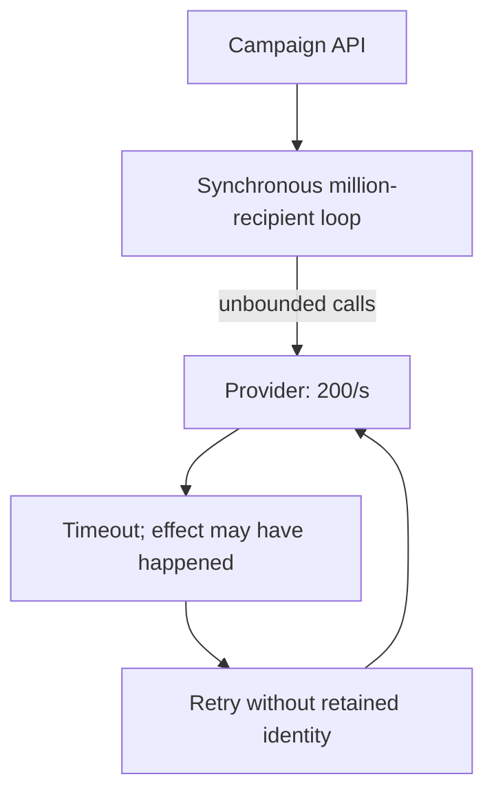
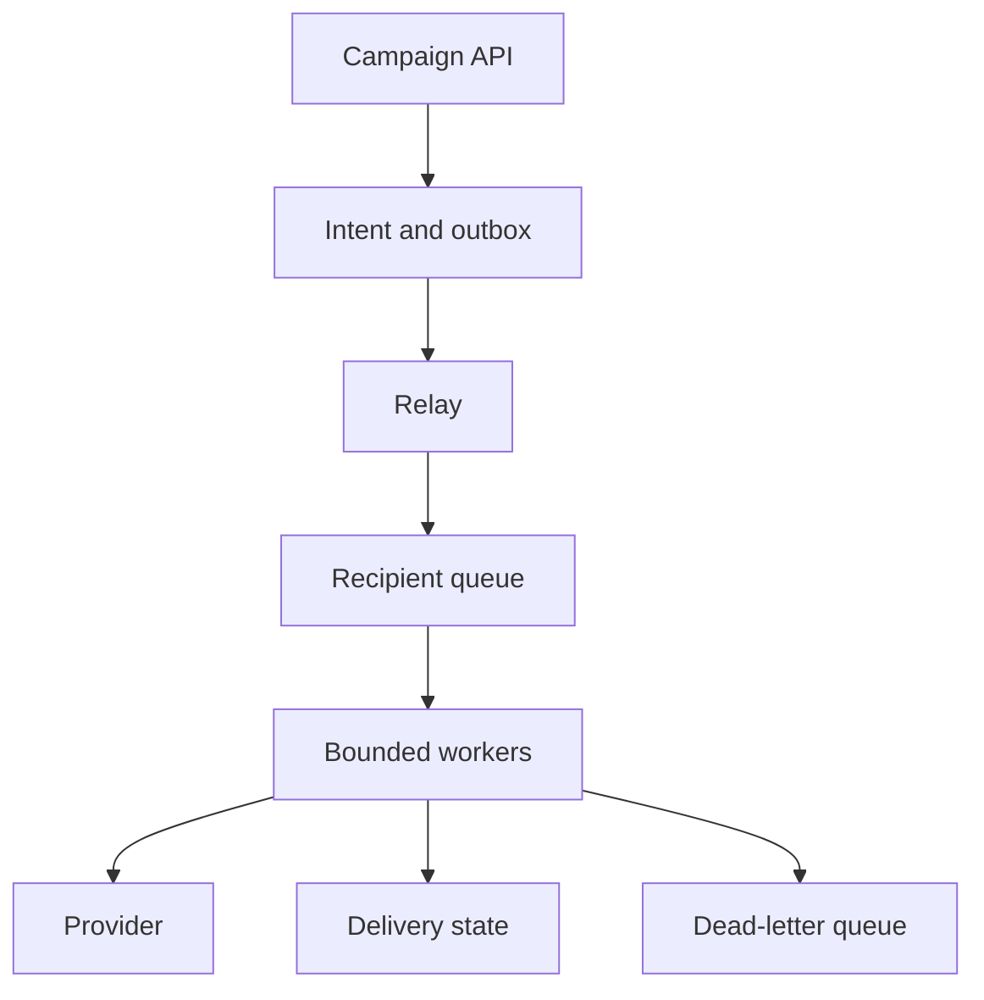
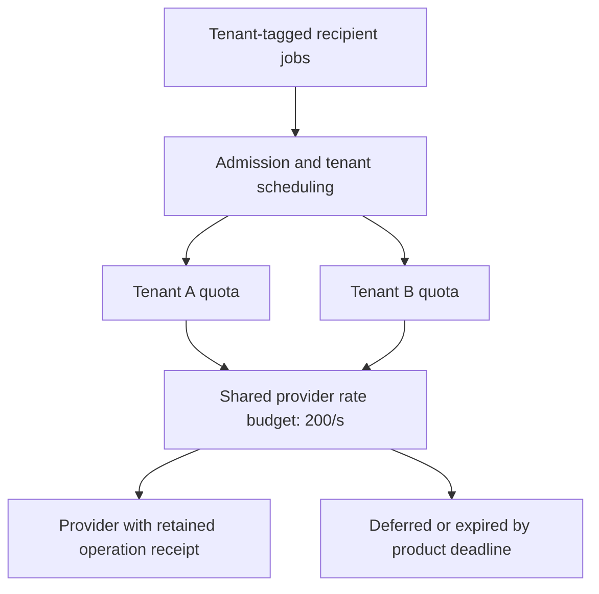

# Notification platform

## What you are building

> Build customer notifications for order status, security alerts and a monthly digest. Marketing schedules a million-recipient campaign just before a password-reset burst. Recipients can unsubscribe while jobs wait, and a provider may accept an email before its response is lost.

**Working contract:** Create a notification intent with a stable event identity and channel policy. Track queued, suppressed, attempted, provider_accepted and confirmed-delivery evidence separately. Transactional security messages and marketing preferences have distinct rules.

## Workload and the decisions it changes

These are constructed exercise assumptions. The large workload is a design target; the local demonstration does not establish that throughput. Use the [estimation constants](../../../01-code/01-problem-solving/estimation-constants.md) to check units before choosing capacity.

| Input or objective | Calculation / consequence |
|---|---|
| One million recipients in ten minutes | About 1,667 recipient jobs/s before channel fan-out and retries. |
| Provider limit: 2,000 submissions/s exercise assumption | Reserve capacity for urgent traffic; a 20% retry rate can consume the apparent headroom. |
| Campaign payload 1 KiB/recipient | About 1 GB of raw work data; store template references rather than repeating large HTML bodies. |

## Start with one working boundary

Run from the repository root with Python 3.12+:

```bash
python3 examples/architecture-starts/notification_platform.py
```

[Open the starting code](../../../../examples/architecture-starts/notification_platform.py). This is a runnable demonstration of the critical state boundary. The API, UI, cloud adapters and operating behavior below are the application you build around it.

| Record / module | Key or interface | Responsibility |
|---|---|---|
| intents | source_event_id,recipient,channel | Stable logical notification identity. |
| preferences | recipient,category,revision | Current suppression and channel rules. |
| attempts | intent_id,attempt_id,provider_key,outcome | Provider evidence and ambiguous outcomes. |

## AWS implementation


A durable intent ledger distinguishes one desired notification from many delivery attempts. Separate queues make priority enforceable; a priority label inside one unbounded FIFO workload does not guarantee urgent progress.

## Build it in this order

### 1. Persist intent at the source boundary

Accept an idempotent event and expand recipients in checkpointed pages. Persist each recipient/channel identity before dispatch. A source transaction should write an outbox event rather than calling the provider and then hoping its business record commits.

### 2. Recheck preferences at send time

The worker loads current preferences and consent category before submission. Render a versioned template using bounded payload data. Store the reason for suppression; unsubscribing after provider acceptance cannot retract an already submitted message.

### 3. Budget channel capacity

Use separate urgent and bulk queues with explicit concurrency/rate budgets. Respect provider throttling and Retry-After with bounded jitter. Track oldest age by priority; total queue length can conceal a stuck urgent message behind healthy bulk throughput.

### 4. Handle ambiguous sends honestly

Reuse provider idempotency only where that provider actually supports it for the required duration. Otherwise a timeout requires reconciliation or an explicit duplicate-versus-loss policy. Provider acceptance is not proof that the user received or read the message.

## Infrastructure configuration

| Resource or boundary | Initial configuration and reason |
|---|---|
| SQS queues | Separate urgent/bulk DLQs and concurrency; retain original recipient identity when replaying. |
| SES account | Verify sending identities and current quotas in the exercise account; do not infer capacity from an architecture diagram. |
| Secrets and payloads | Restrict provider credentials; avoid personal message content in logs and queue dead-letter exports. |

Use one disposable AWS environment for the cloud exercise. Put the named resources in `infra/template.yaml` or your existing IaC tool, pass resource IDs through configuration, and scope each runtime role to its own tables, buckets and queues. The diagram is a design to implement; it is not a claim that these resources have been deployed. Record the commands you used to deploy and remove the exercise resources.

## Observe the result

| Action | Expected visible result |
|---|---|
| Run the starting program | Duplicate source event yields one intent; unsubscribe before send suppresses it. |
| Throttle the bulk provider path | Security traffic retains its reserved capacity. |
| Lose a provider response | The attempt is unknown, with a documented reconciliation or duplicate-risk policy. |

## The next design decision

Add SMS fallback. Define whether an unknown email attempt justifies sending a second channel, and let the product choose the user-visible duplication tradeoff.

<details>
<summary>Additional design cases, alternatives and original source notes</summary>

[Curriculum](../../../README.md) · [System design](../README.md)

All prompts here are constructed practice, without company attribution.

> **Candidate opening:** “A campaign is accepted, but its provider can deliver
only 200 messages/s. A recipient send succeeds just before the response is lost.
Show users truthful status while bounding retries and duplicate effects.”

| Input | Expected behavior | Scope |
|---|---|---|
| 1,000,000 recipients in 600 seconds | About 1,667 jobs/s arrive | Provider 200/s cannot meet this deadline |
| Provider success, lost response | Uncertain until receipt/replay resolves | Provider idempotency required for one effect |
| Same recipient operation ID, changed body | Conflict/quarantine | Intent identity must not mutate |

Prerequisites: [queue and outbox concepts](../mechanism-reference.md). Build brief with a
runnable starting point: [atomic-result worker](../../03-infrastructure/aws/labs/job-pipeline/README.md),
then [external-provider extension](../../../04-scale-and-evolution/04-migrations/labs/recovery-migration/README.md). Deliver
accepted intent, bounded fan-out, and truthful per-recipient state in that order.



Decide the deadline and provider capacity before worker count. Separate accepted,
processed, provider-accepted, and delivered states; choose which the product can
actually observe. Draw every crash around the provider call before promising an
effect count.

<details>
<summary>Worked approach and AWS mapping — open after your attempt</summary>

**Prompt:** accept a campaign, fan it out to users, deliver email/push, and display status. Exercise load: 1 million recipients over 10 minutes ≈1,667 recipient jobs/s before retries. Do not promise exact external delivery if a provider lacks idempotency.

API: POST campaign returns campaign id and accepted state; GET campaign returns accepted/processed/failed counts. Model campaign intent, per-recipient job id, channel, payload version, attempt state, and provider receipt. A campaign accepted is not a campaign delivered.



**AWS mapping:** a transactional database plus outbox, SQS standard for independent recipient jobs, Lambda or ECS workers, DynamoDB for status keyed by job, CloudWatch for completion age and failure rate. SNS/EventBridge can route events; they do not replace your per-recipient delivery-state model. Choose FIFO only for a demonstrated ordering requirement and design message groups deliberately.

**Deep dive:** if a provider accepts 200 requests/s, more workers cannot make 1,667/s delivery possible. Negotiate deadline, batch with provider support, or distribute channels/providers. Queueing only delays the failure. A timeout after provider success is uncertain; retry with the provider's idempotency key or reconcile receipts.

**Implement:** queue lab's conditional result write, then add a fake provider with a controllable timeout. **Break:** success then lost acknowledgement; poison message; slow provider; tenant flooding. **Junior:** trace acceptance and retry. **Senior:** define retry/expiry/deduplication and queue-age SLO. **Staff:** specify provider failover, quotas, consent ownership, and backfill/replay contracts across teams.

</details>

## Follow-up: one tenant monopolizes the queue



**Senior:** supply the lost-response test, oldest-job age, and bounded retry/expiry
policy. **Lead follow-up:** fail over to a second provider; does the first
provider's idempotency key protect the second provider's effect? Usually it does
not. Reconcile uncertain sends before failover or explicitly accept a business
risk. Assessor evidence names the first provider's uncertainty, consent owner,
quota allocation, and backlog drain arithmetic; queueing does not manufacture
capacity.


[Design route](../../../../indexes/system-designs.md) · [Practice rubric](../../../../practice/README.md)

</details>
