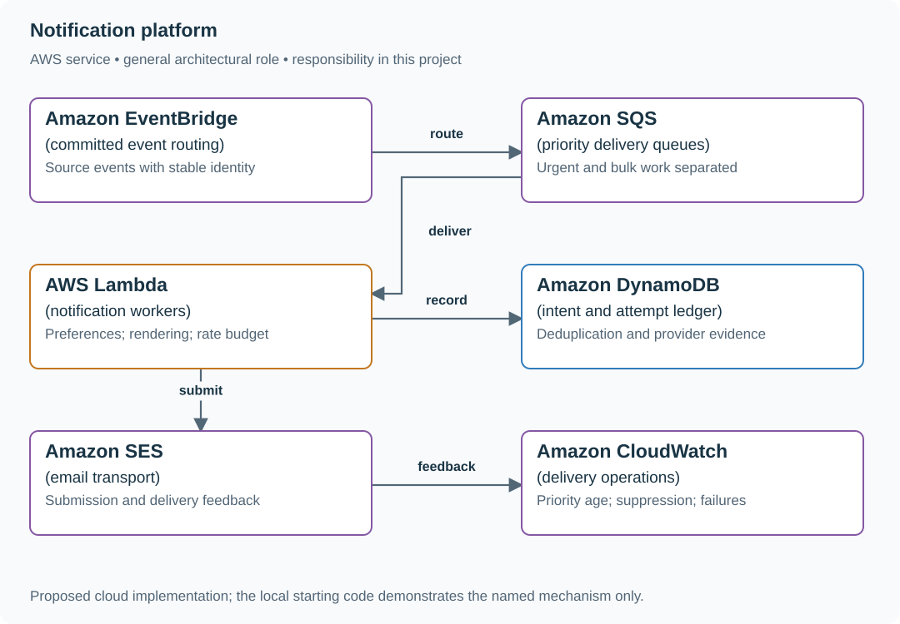
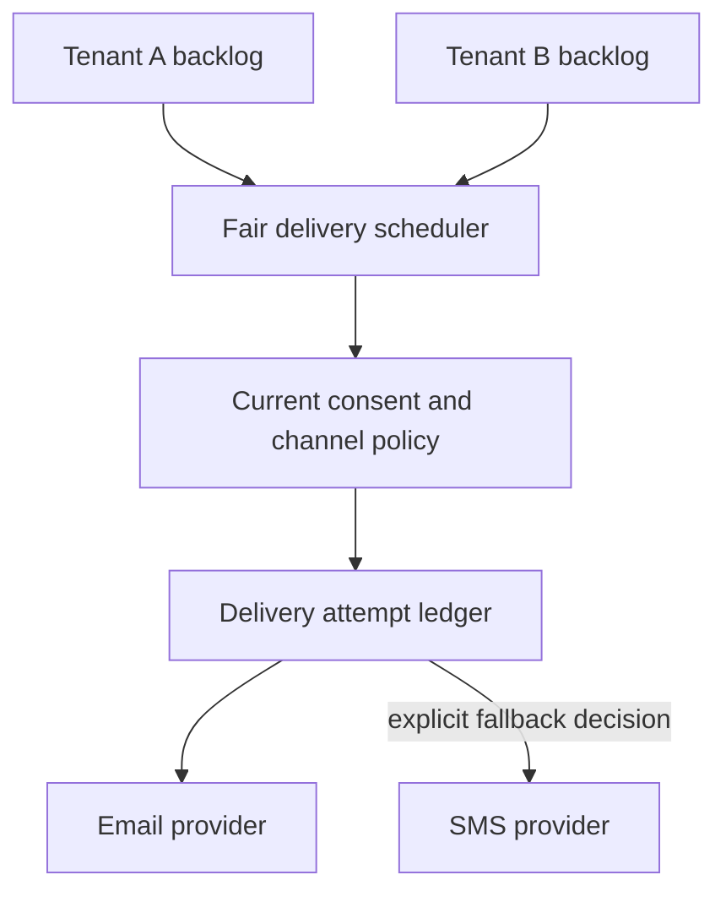

# Deliver notifications with preferences and priority

## Application background

A commerce product sends password-reset emails, order updates and marketing campaigns. An application asks for a message to be sent, a worker submits it to an email provider, and the recipient may receive it later.

These steps can fail independently. A campaign must not delay password resets for hours. Someone may unsubscribe while their campaign message is waiting. The provider may accept an email even when the worker never receives its reply.

### Example walkthrough

| Action | Expected behavior |
|---|---|
| A million-recipient campaign is waiting | Keep separate capacity for urgent security messages. |
| A recipient unsubscribes before their marketing message is sent | Recheck preferences and skip that message. |
| The provider accepts a message but its response is lost | Record an uncertain outcome instead of assuming no email was sent. |

The message record tracks an intention to send and its later attempts. Queue acceptance, provider acceptance and delivery to an inbox are distinct results.

### Sizing that affects this decision

One million campaign recipients in ten minutes means about 1,667 submissions/s before retries. Against the assumed 2,000/s provider limit, one extra attempt for 20% of recipients uses roughly the entire remaining capacity. Reserve capacity for password resets rather than sharing one undifferentiated campaign queue.

These are exercise assumptions. The [estimation reference](../../../01-code/01-problem-solving/estimation-constants.md) explains the units and approximations. They do not establish the local demo's measured capacity.

## Your assignment

**Deliver:** Build saved notification work and delivery workers. Recheck recipient preferences, reserve capacity for urgent messages and record uncertain provider outcomes honestly.

**Required behavior:** Create a notification intent with a stable event identity and channel policy. Track queued, suppressed, attempted, provider_accepted and confirmed-delivery evidence separately. Transactional security messages and marketing preferences have distinct rules.

The required first milestone is a working local implementation of the behavior above. The numbered implementation steps define the scope. The cloud architecture is a later extension, not something the starter has already provisioned.

## Get the code and run the supplied example

The code is in the public [junior-to-staff repository](https://github.com/Soulful-Iris/junior-to-staff). Install Git and Python 3.12+. No AWS account or Python packages are required for this first run. If you already have a checkout, use it and skip cloning.

```bash
git clone https://github.com/Soulful-Iris/junior-to-staff.git
cd junior-to-staff
python3 examples/architecture-starts/notification_platform.py
```

**Supplied file:** [`examples/architecture-starts/notification_platform.py`](https://github.com/Soulful-Iris/junior-to-staff/blob/main/examples/architecture-starts/notification_platform.py). You can also [read or download the source here](../../../../examples/architecture-starts/notification_platform.py).

This program is a **mechanism demonstration**: it runs the small scenario in one process and prints the result. It is not an HTTP service, a complete application, or an AWS deployment. A successful run demonstrates this mechanism only. It does not establish the workload or failure guarantees of the application you will build.

**Example output from the supplied run:**

Generated IDs and timestamps may differ. Compare the state transitions and outcomes.

```text
{('campaign-7', 'ana'): {'state': 'suppressed'}} provider attempts: []
```

### Set up your implementation workspace

Create `work/notification-platform/` in your checkout (or use a separate repository). Copy the supplied mechanism into that directory as `mechanism.py`, then extract its state transitions into functions you can call from your implementation. The record and module names below describe what you must implement. They are not a promise that files with those names already exist. Keep a `README.md` beside your implementation with its exact run commands and observed results.

## Local components and state to implement

This table names the records, interfaces or decision inputs for your deliverable. Unless a name is explicitly linked to supplied source above, it is something you create. Implement the local state transitions first, then connect the HTTP, storage or worker boundaries required by the steps.

| Record / module | Key or interface | Responsibility |
|---|---|---|
| intents | source_event_id,recipient,channel | Stable logical notification identity. |
| preferences | recipient,category,revision | Current suppression and channel rules. |
| attempts | intent_id,attempt_id,provider_key,outcome | Provider evidence and ambiguous outcomes. |

## Implement the assignment

### 1. Persist intent at the source boundary

Accept an idempotent event and expand recipients in checkpointed pages. Persist each recipient/channel identity before dispatch. A source transaction should write an outbox event rather than calling the provider and then hoping its business record commits.

### 2. Recheck preferences at send time

The worker loads current preferences and consent category before submission. Render a versioned template using bounded payload data. Store the reason for suppression. Unsubscribing after provider acceptance cannot retract an already submitted message.

### 3. Budget channel capacity

Use separate urgent and bulk queues with explicit concurrency/rate budgets. Respect provider throttling and Retry-After with bounded jitter. Track oldest age by priority. Total queue length can conceal a stuck urgent message behind healthy bulk throughput.

### 4. Handle ambiguous sends honestly

Reuse provider idempotency only where that provider actually supports it for the required duration. Otherwise a timeout requires reconciliation or an explicit duplicate-versus-loss policy. Provider acceptance is not proof that the user received or read the message.

## Demonstrate the completed local result

| Action | Expected visible result |
|---|---|
| Run the starting program | Duplicate source event yields one intent. Unsubscribe before send suppresses it. |
| Throttle the bulk provider path | Security traffic retains its reserved capacity. |
| Lose a provider response | The attempt is unknown, with a documented reconciliation or duplicate-risk policy. |

**Handoff:** In your implementation README, include the start command, one successful operation, the failure case above and the resulting stored state or decision. State which dependencies are simulated. Someone with a fresh checkout should be able to reproduce this without your chat history.

## Workload assumptions and capacity decisions

These are constructed exercise assumptions. The stated workload is a design target. The local demonstration does not establish that throughput. Use the [estimation constants](../../../01-code/01-problem-solving/estimation-constants.md) to check units before choosing capacity.

| Input or objective | Calculation / consequence |
|---|---|
| One million recipients in ten minutes | About 1,667 recipient jobs/s before channel fan-out and retries. |
| Provider limit: 2,000 submissions/s exercise assumption | Reserve capacity for urgent traffic. A 20% retry rate can consume the apparent headroom. |
| Campaign payload 1 KiB/recipient | About 1 GB of raw work data. Store template references rather than repeating large HTML bodies. |

## Map the local implementation to AWS

**Deployment status: local only.** Running the supplied command creates no AWS resources and configures no cloud connections. The diagram is a proposed deployment of the completed application. Each box needs either a deployed runtime, a provisioned service or an explicitly external dependency.

Read the diagram by following the arrows from the entry point: application code accepts the request or event, the state owner commits it, and any worker produces the later result. The table ties those roles to code and adapter work. Multiple boxes do not imply multiple Python files already exist.



A durable intent ledger distinguishes one desired notification from many delivery attempts. Separate queues make priority enforceable. A priority label inside one unbounded FIFO workload does not guarantee urgent progress.

| Local responsibility | Cloud destination and role | Implementation still required |
|---|---|---|
| Local event dispatch | Amazon EventBridge: committed event routing | Define event rules/targets and delivery failure handling. Persist logical event/run identity in the application. |
| Local pending-work collection | Amazon SQS: priority delivery queues | Publish committed job intent, consume messages and persist deduplication/ownership state. Add visibility, retry and dead-letter handling. |
| Python operation or worker function | AWS Lambda: notification workers | Write a Lambda event adapter, package its dependencies and give its role only the required resource actions. |
| Local dictionary, SQLite records or state model | Amazon DynamoDB: intent and attempt ledger | Design partition/sort keys and write a storage adapter with conditional updates or transactions. Python state and SQL are not uploaded as a database. |
| Local notification delivery fixture | Amazon SES: email transport | Implement email submission and provider outcome tracking with verified sender configuration and scoped credentials. |
| Local counters, timestamps and diagnostic output | Amazon CloudWatch: delivery operations | Emit bounded metrics and logs, build the named operational view and configure retention and access. |

### Provision resources, then connect the application

| Resource or boundary | Initial configuration and reason |
|---|---|
| SQS queues | Separate urgent/bulk DLQs and concurrency. Retain original recipient identity when replaying. |
| SES account | Verify sending identities and current quotas in the exercise account. Do not infer capacity from an architecture diagram. |
| Secrets and payloads | Restrict provider credentials. Avoid personal message content in logs and queue dead-letter exports. |

Use one disposable AWS environment for the cloud exercise. Put the named resources in `infra/template.yaml` or your existing IaC tool, pass resource IDs through configuration, and scope each runtime role to its own tables, buckets and queues. The diagram is a design to implement. It is not a claim that these resources have been deployed. Record the commands you used to deploy and remove the exercise resources.

For concrete provisioning commands, configuration wiring and cleanup, use the [AWS foundation guide](../../../../examples/architecture-starts/infra/README.md). It includes a deployable table/queue/object-storage foundation and explains which application and service adapters you still implement.

A provisioned queue or table does not make the local program use it. Configure resource IDs in the deployed runtime, replace the local adapter, and replay the same successful and failing operation against that runtime. Record the deployed commit and observable result, then remove the disposable resources using your infrastructure tool.

## Extend the design after the baseline works
### Worked follow-up: Isolate tenant backlogs and add an explicit fallback policy

A global FIFO lets one campaign delay every other customer. A second channel also creates a new side effect: an unknown email outcome does not prove that the customer received nothing.

| Starting design | Changed requirement |
|---|---|
| All notifications share delivery capacity. | One tenant floods the queue while another needs timely delivery, and email may fall back to SMS. |

**Revised architecture.** Follow the changed responsibility and failure path below. This is a design to implement. The supplied local example does not provision these components.



**What to implement.** Introduce per-tenant pending work and a scheduler that grants bounded sends under the shared provider rate. Store consent and channel policy with a version, then recheck current authorization before delivery. Keep a delivery attempt ledger per channel. Product must choose whether uncertain email may trigger SMS and accept possible duplicate contact. SQS can buffer ready work, while a database scheduler owns fair selection and quota accounting.

**Walk through the result.** Give A 10,000 pending messages and B ten. Show B making progress while total sends stay under the provider budget. Lose an email response for one recipient and record UNKNOWN. Demonstrate either delayed reconciliation or an explicitly permitted SMS fallback, with both attempts visible. Do not relabel UNKNOWN as failed to make the policy easier.


Add SMS fallback. Define whether an unknown email attempt justifies sending a second channel, and let the product choose the user-visible duplication tradeoff.

<details>
<summary>Additional design cases, alternatives and original source notes</summary>

[Curriculum](../../../README.md) · [System design under constraints](../README.md)

All prompts here are constructed practice, without company attribution.

> **Candidate opening:** “A campaign is accepted, but its provider can deliver
only 200 messages/s. A recipient send succeeds just before the response is lost.
Show users truthful status while bounding retries and duplicate effects.”

| Input | Expected behavior | Scope |
|---|---|---|
| 1,000,000 recipients in 600 seconds | About 1,667 jobs/s arrive | Provider 200/s cannot meet this deadline |
| Provider success, lost response | Uncertain until receipt/replay resolves | Provider idempotency required for one effect |
| Same recipient operation ID, changed body | Conflict/quarantine | Intent identity must not mutate |

Prerequisites: [queue and outbox concepts](../mechanism-reference.md). Build brief with a
runnable starting point: [atomic-result worker](../../03-infrastructure/aws/labs/job-pipeline/README.md),
then [external-provider extension](../../../04-scale-and-evolution/04-migrations/labs/recovery-migration/README.md). Deliver
accepted intent, bounded fan-out, and truthful per-recipient state in that order.

Decide the deadline and provider capacity before worker count. Separate accepted,
processed, provider-accepted, and delivered states. Choose which the product can
actually observe. Draw every crash around the provider call before promising an
effect count.

<details>
<summary>Worked approach and AWS mapping — open after your attempt</summary>

**Prompt:** accept a campaign, fan it out to users, deliver email/push, and display status. Exercise load: 1 million recipients over 10 minutes ≈1,667 recipient jobs/s before retries. Do not promise exact external delivery if a provider lacks idempotency.

API: POST campaign returns campaign id and accepted state. GET campaign returns accepted/processed/failed counts. Model campaign intent, per-recipient job id, channel, payload version, attempt state, and provider receipt. A campaign accepted is not a campaign delivered.

**AWS mapping:** a transactional database plus outbox, SQS standard for independent recipient jobs, Lambda or ECS workers, DynamoDB for status keyed by job, CloudWatch for completion age and failure rate. SNS/EventBridge can route events. They do not replace your per-recipient delivery-state model. Choose FIFO only for a demonstrated ordering requirement and design message groups deliberately.

**Deep dive:** if a provider accepts 200 requests/s, more workers cannot make 1,667/s delivery possible. Negotiate deadline, batch with provider support, or distribute channels/providers. Queueing only delays the failure. A timeout after provider success is uncertain. Retry with the provider's idempotency key or reconcile receipts.

**Implement:** queue lab's conditional result write, then add a fake provider with a controllable timeout. **Break:** success then lost acknowledgement. Poison message. Slow provider. Tenant flooding. **Junior:** trace acceptance and retry. **Senior:** define retry/expiry/deduplication and queue-age SLO. **Staff:** specify provider failover, quotas, consent ownership, and backfill/replay contracts across teams.

</details>

## Follow-up: one tenant monopolizes the queue

**Senior:** supply the lost-response test, oldest-job age, and bounded retry/expiry
policy. **Lead follow-up:** fail over to a second provider. Does the first
provider's idempotency key protect the second provider's effect? Usually it does
not. Reconcile uncertain sends before failover or explicitly accept a business
risk. Assessor evidence names the first provider's uncertainty, consent owner,
quota allocation, and backlog drain arithmetic. Queueing does not manufacture
capacity.


[Design route](../../../../indexes/system-designs.md) · [Practice rubric](../../../../practice/README.md)

</details>
