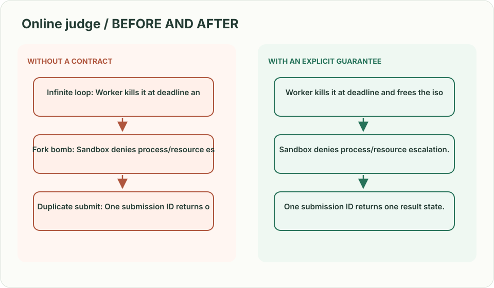
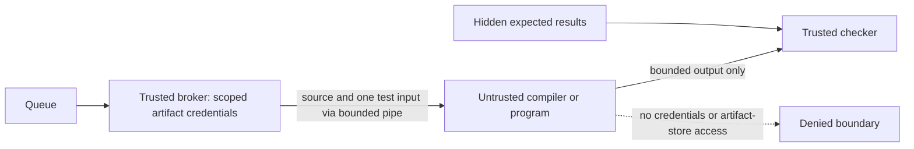
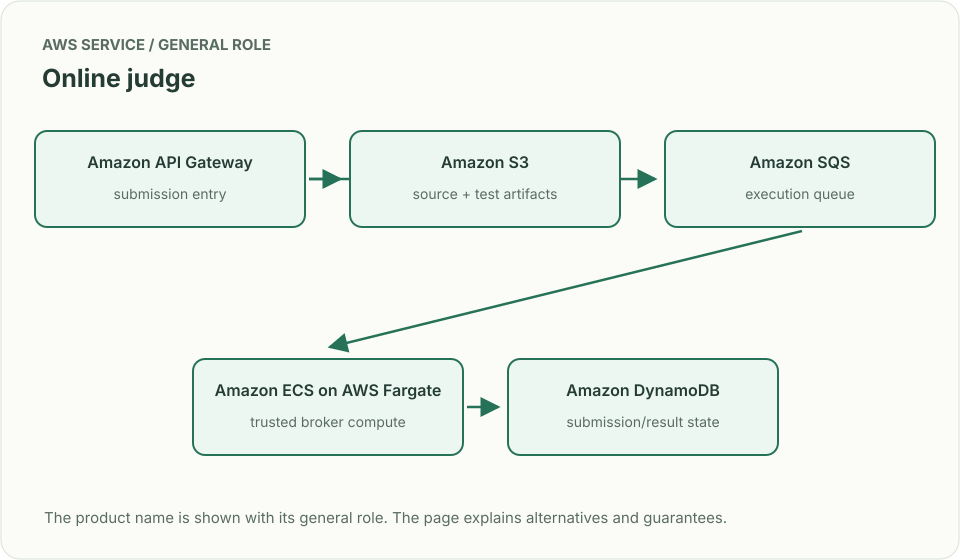
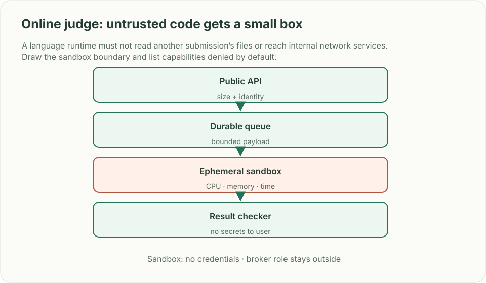

# Online judge: untrusted code gets a small box

*Design brief · diagrams and reasoning exercises; no complete application is supplied.*

> **Interviewer:** “Users submit code to a timed contest. Compile and run it against hidden tests, report results, and update a live leaderboard. Submissions are untrusted.”

This is a **commonly listed system-design interview prompt** with a concrete practice contract. Assume 100,000 contest participants, 10,000 submissions/minute at peak and strict CPU, memory, and wall-time caps. Clarify service guarantees and a first version before filling the board with services.

| Situation | Input / condition | Expected result |
|---|---|---|
| Infinite loop | Submission never exits | Worker kills it at deadline and frees the isolated sandbox. |
| Fork bomb | Code spawns many processes | Sandbox denies process/resource escalation. |
| Duplicate submit | Client retries after lost ACK | One submission ID returns one result state. |
| Hidden tests | User requests detailed failure output | Do not expose test input, secrets, or another user’s source. |

## Think from the contract to the boxes

Persist the submission and its outbox record together; a relay enqueues its ID.
The trusted broker obtains artifacts and starts a **separate untrusted execution
domain**. Compilation is untrusted too. Results use the submission/version key,
and output is bounded and treated as hostile text before display.

The program must see the input it computes on; it must not mount the whole hidden
test corpus, expected outputs, another submission, a Docker socket or cloud
credentials. The trusted checker decides what limited feedback can leave.

| Boundary | Required enforcement / negative test |
|---|---|
| Identity and network | No execution-role credentials; deny egress including metadata/credential endpoints; probe only a fake endpoint in a disposable test |
| Files and processes | Read-only runtime, isolated size-bounded scratch space, non-root identity, dropped capabilities, bounded process count; test cross-submission reads and controlled process exhaustion |
| CPU, memory, wall time | Enforced outside the submitted process; terminate the whole execution domain, not only its parent PID |
| Output and cleanup | Cap stdout/stderr bytes and disk writes; truncate safely, reap descendants and discard the domain before reuse |

**Implementation gate:** this is a design brief, not a supplied or cloud-verified
sandbox. Choose a runtime whose documented controls satisfy this table and run
loop/process/output/disk/credential-isolation fixtures in a disposable environment.
Do not assume every seccomp, capability, process or network control is configurable
on every managed container runtime. No malicious-program execution or live-cloud
isolation result is claimed here.

**First diagram:** Draw public API, durable submission state, queue, isolated compile/run pool, result checker, and leaderboard projection.

| AWS service / general role | Why it fits this design | Alternative and when it fits better |
|---|---|---|
| **Amazon API Gateway** / submission entry | Authenticate, bound payload size and rate. | ALB + ECS for custom upload/stream behavior. |
| **Amazon S3** / source + test artifacts | Keep versioned packages away from worker images. | EFS for shared read-only test corpora with careful isolation. |
| **Amazon SQS** / execution queue | Buffer work and separate compile from run tiers. | Step Functions for explicit multi-language orchestration. |
| **Amazon ECS on AWS Fargate** / trusted orchestration | Can host the broker; its artifact role must never reach submitted code. A task role alone is not a hostile-code sandbox. | Separately controlled VM/microVM sandbox fleet after validating the required isolation controls. |
| **Amazon DynamoDB** / submission/result state | Store state transitions and idempotent result IDs. | Aurora for relational contest/rank queries. |

Service choice follows the contract: the box label gives the generic job, while the table explains the AWS product and a reasonable substitute. Name which component owns durable truth, where retries happen, and the guarantee each managed service does **not** provide by itself.

## Pressure-test the design

**Follow-up: A language runtime must not read another submission’s files or reach internal network services. Draw the sandbox boundary and list capabilities denied by default.**

**Senior expectation:** A contest bursts at start time and leaderboard writes become hot. Partition execution by language/problem while aggregating rank updates asynchronously with visible freshness.

**Staff expectation:** A new language requires an untrusted runtime and supply-chain updates. Define image provenance, patch windows, emergency disable, isolation tests and acceptable blast radius.

**Practice artifact:** Draw public API, durable submission state, queue, isolated compile/run pool, result checker, and leaderboard projection. Then trace every row in the table, draw one failure, and state what the customer observes. Suggested rehearsal: 35 minutes design, 10 minutes to challenge the guarantees.

**Evidence and origin:** The current community interview-question catalog lists an online coding-judge design at Meta, Whatnot, Microsoft and other companies; individual dates are unavailable. The entry does not show the interview date and is not a verified company rubric. The prompt contract, workload, outcomes, diagrams and solution here are original practice material. Treat company tags as reported sightings, not a prediction of your interview loop.

**Interview report listing:** [Open the community question entry](https://www.hellointerview.com/community/questions/coding-contest-platform/cm4szs6ae002w3g2e09amf982).
