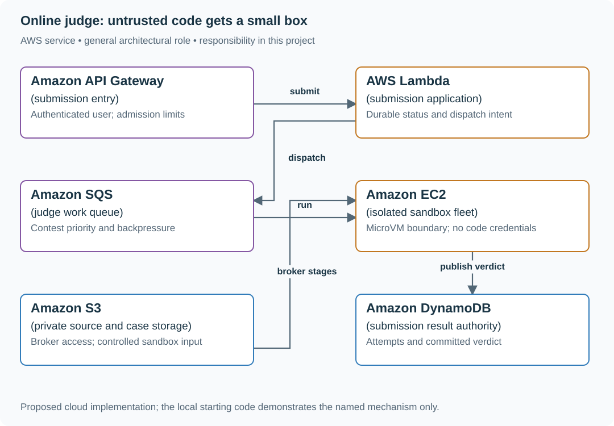
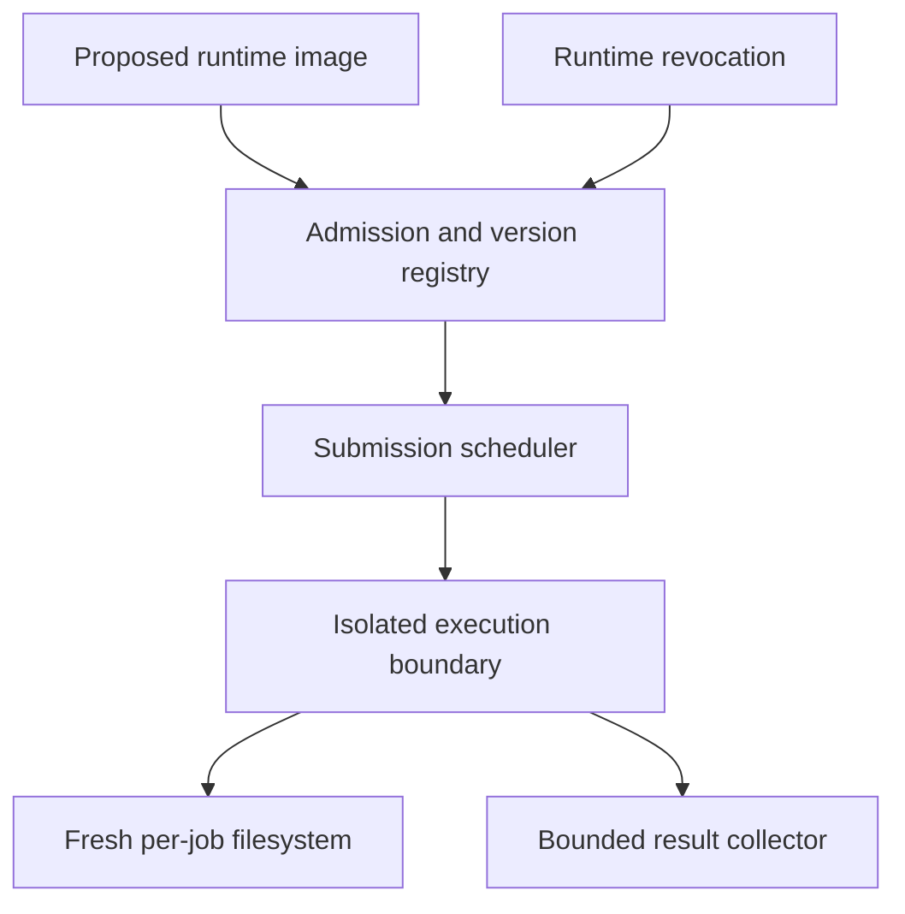

# Run programming submissions inside isolated workers

## Application background

A programming contest accepts a participant's source code and language. The judge runs that program against controlled inputs, compares its output with the expected answers and reports a verdict such as accepted, wrong answer or time limit exceeded.

The submitted program belongs to an untrusted user. It might loop forever, create processes or try to read credentials. Running it as an ordinary function inside the API process would give it too much access.

### Example walkthrough

| Action | Expected behavior |
|---|---|
| A participant submits code | Save a submission ID and queue the judging work. |
| The program exceeds its time limit | Stop its isolated execution and record that verdict. |
| An old worker reports after a newer attempt finished | Reject the outdated result. |

Isolation means restricting the program's files, network, privileges and resources outside the API process. The local scheduling demonstration does not itself provide that isolation.

## Your assignment

**Deliver:** Build submission records and the protocol between the API and judging workers. Demonstrate job handling locally, then define the isolated runtime required before executing untrusted code.

**Required behavior:** POST /submissions durably accepts source and language under a request identity. Execution occurs in an isolated sandbox with CPU, memory, process, output and wall-clock limits. Results identify compiler/runtime versions and hidden-case bundle version.

The required first milestone is a working local implementation of the behavior above. The numbered implementation steps define the scope. The cloud architecture is a later extension, not something the starter has already provisioned.

## Get the code and run the supplied example

The code is in the public [junior-to-staff repository](https://github.com/Soulful-Iris/junior-to-staff). Install Git and Python 3.12+. No AWS account or Python packages are required for this first run. If you already have a checkout, use it and skip cloning.

```bash
git clone https://github.com/Soulful-Iris/junior-to-staff.git
cd junior-to-staff
python3 examples/architecture-starts/online_judge.py
```

**Supplied file:** [`examples/architecture-starts/online_judge.py`](https://github.com/Soulful-Iris/junior-to-staff/blob/main/examples/architecture-starts/online_judge.py). You can also [read or download the source here](../../../../examples/architecture-starts/online_judge.py).

This program is a **mechanism demonstration**: it runs the small scenario in one process and prints the result. It is not an HTTP service, a complete application, or an AWS deployment. A successful run demonstrates this mechanism only. It does not establish the workload or failure guarantees of the application you will build.

**Example output from the supplied run:**

Generated IDs and timestamps may differ. Compare the state transitions and outcomes.

```text
wall-clock limit exceeded; child terminated
This subprocess example is NOT a security sandbox.
```

### Set up your implementation workspace

Create `work/online-judge/` in your checkout (or use a separate repository). Copy the supplied mechanism into that directory as `mechanism.py`, then extract its state transitions into functions you can call from your implementation. The record and module names below describe what you must implement. They are not a promise that files with those names already exist. Keep a `README.md` beside your implementation with its exact run commands and observed results.

## Local components and state to implement

This table names the records, interfaces or decision inputs for your deliverable. Unless a name is explicitly linked to supplied source above, it is something you create. Implement the local state transitions first, then connect the HTTP, storage or worker boundaries required by the steps.

| Record / module | Key or interface | Responsibility |
|---|---|---|
| submissions | submission_id,user,source_hash,language,state | Durable intent and reproducible toolchain selection. |
| judge_runs | submission_id,attempt,sandbox_id,limits | One isolated execution attempt. |
| results | submission_id,bundle_version,verdict,evidence | Published verdict. Hidden input/output stays private. |

## Implement the assignment

### 1. Accept before compiling

Validate language and source-size limits, store source privately and commit a submission record plus dispatch intent. Return a status URL. Duplicate client requests return the original submission rather than spending another execution slot.

### 2. Design the isolation boundary

Use a dedicated sandbox fleet with microVM or equivalent hardened isolation, no instance credentials and no external network access for submitted code. A normal subprocess or ordinary application container is not the promised hostile-code boundary. Keep the broker outside the untrusted execution environment.

### 3. Run reproducibly with limits

Select a pinned compiler/runtime image and case bundle. Enforce CPU, memory, process count, writable filesystem, output bytes and an independent wall deadline. Destroy the sandbox after use. Never let a prior submission’s files contaminate the next one.

### 4. Publish bounded evidence

Store verdict, resource usage and safe compiler output. Do not reveal hidden cases in public logs. Conditionally publish the winning run and keep retries linked to the same submission. Separate infrastructure failure from wrong answer or time limit exceeded.

## Demonstrate the completed local result

| Action | Expected visible result |
|---|---|
| Run the starting program | The infinite loop is terminated at the wall deadline. |
| Submit a program that reads prior files | A fresh sandbox contains no previous submission artifacts. |
| Crash a judge host | The submission retries with the same identity and publishes at most one current verdict. |

**Handoff:** In your implementation README, include the start command, one successful operation, the failure case above and the resulting stored state or decision. State which dependencies are simulated. Someone with a fresh checkout should be able to reproduce this without your chat history.

## Workload assumptions and capacity decisions

These are constructed exercise assumptions. The stated workload is a design target. The local demonstration does not establish that throughput. Use the [estimation constants](../../../01-code/01-problem-solving/estimation-constants.md) to check units before choosing capacity.

| Input or objective | Calculation / consequence |
|---|---|
| 10,000 submissions/minute | About 167 submissions/s. At five seconds average execution, roughly 835 occupied execution slots before headroom. |
| 256 MiB and two CPU seconds per case as exercise limits | Wall-clock timeout is separate. Sleeping or blocked programs must still terminate. |
| 100,000 participants | Apply per-user admission limits and contest priority before expensive compilation. |

## Map the local implementation to AWS

**Deployment status: local only.** Running the supplied command creates no AWS resources and configures no cloud connections. The diagram is a proposed deployment of the completed application. Each box needs either a deployed runtime, a provisioned service or an explicitly external dependency.

Read the diagram by following the arrows from the entry point: application code accepts the request or event, the state owner commits it, and any worker produces the later result. The table ties those roles to code and adapter work. Multiple boxes do not imply multiple Python files already exist.



EC2 is the host for an isolation design you must implement. Naming EC2 or Fargate does not itself prove safe execution of hostile code. The local program demonstrates only wall-clock termination.

| Local responsibility | Cloud destination and role | Implementation still required |
|---|---|---|
| Local HTTP boundary or the endpoint you will add | Amazon API Gateway: submission entry | Create routes and an integration. Translate requests and responses and configure identity validation. |
| Python operation or worker function | AWS Lambda: submission application | Write a Lambda event adapter, package its dependencies and give its role only the required resource actions. |
| Local pending-work collection | Amazon SQS: judge work queue | Publish committed job intent, consume messages and persist deduplication/ownership state. Add visibility, retry and dead-letter handling. |
| Local process or worker model | Amazon EC2: isolated sandbox fleet | Provision isolated hosts, package the runtime and implement lifecycle/resource limits. A local simulation is not a hostile-code sandbox. |
| Local file, object fixture or exported payload | Amazon S3: private source and case storage | Implement upload/download and metadata adapters, scoped access, object naming, retention and incomplete-upload cleanup. |
| Local dictionary, SQLite records or state model | Amazon DynamoDB: submission result authority | Design partition/sort keys and write a storage adapter with conditional updates or transactions. Python state and SQL are not uploaded as a database. |

### Provision resources, then connect the application

| Resource or boundary | Initial configuration and reason |
|---|---|
| Sandbox hosts | Dedicated role and network boundary. Submitted processes receive neither host credentials nor metadata access. |
| Queue admission | Cap outstanding submissions per participant and total waiting time. Expose queue age. |
| Artifact handling | Enforce source/output size limits and scrub compiler diagnostics of private paths or hidden-case content. |

Use one disposable AWS environment for the cloud exercise. Put the named resources in `infra/template.yaml` or your existing IaC tool, pass resource IDs through configuration, and scope each runtime role to its own tables, buckets and queues. The diagram is a design to implement. It is not a claim that these resources have been deployed. Record the commands you used to deploy and remove the exercise resources.

For concrete provisioning commands, configuration wiring and cleanup, use the [AWS foundation guide](../../../../examples/architecture-starts/infra/README.md). It includes a deployable table/queue/object-storage foundation and explains which application and service adapters you still implement.

A provisioned queue or table does not make the local program use it. Configure resource IDs in the deployed runtime, replace the local adapter, and replay the same successful and failing operation against that runtime. Record the deployed commit and observable result, then remove the disposable resources using your infrastructure tool.

## Extend the design after the baseline works
### Worked follow-up: Admit a new language runtime without trusting its code

A runtime is executable code inside the worker boundary. A container image label does not demonstrate that the submitted program cannot reach another submission or the host.

| Starting design | Changed requirement |
|---|---|
| Workers run an approved set of language images. | A third party submits a runtime that could access files, credentials or the network. |

**Revised architecture.** Follow the changed responsibility and failure path below. This is a design to implement. The supplied local example does not provision these components.



**What to implement.** Create an image admission record with immutable digest, builder provenance, supported language version, owner and retirement date. Run each submission with fresh storage, resource limits, no application credentials and denied outbound access unless the exercise explicitly needs it. Separate the scheduling service from the execution boundary. Choose an isolation mechanism appropriate to hostile code rather than treating ECS placement alone as a sandbox. Keep old result metadata reproducible without leaving retired vulnerable workers available to new jobs.

**Walk through the result.** Submit a program that attempts to read another job's file, contact an internal address and exceed its time budget. Record the denied capabilities and termination reason from a disposable local exercise. Then revoke one runtime digest and show new submissions refused while historical results still name the original digest.


Allow third-party language runtimes. Define the image admission process, patch ownership, version retirement and how old submissions remain reproducible without keeping vulnerable hosts publicly reachable.

<details>
<summary>Additional design cases, alternatives and original source notes</summary>


This is a **commonly listed system-design interview prompt** with a concrete practice contract. Assume 100,000 contest participants, 10,000 submissions/minute at peak and strict CPU, memory, and wall-time caps. Clarify service guarantees and a first version before filling the board with services.

| Situation | Input / condition | Expected result |
|---|---|---|
| Infinite loop | Submission never exits | Worker kills it at deadline and frees the isolated sandbox. |
| Fork bomb | Code spawns many processes | Sandbox denies process/resource escalation. |
| Duplicate submit | Client retries after lost ACK | One submission ID returns one result state. |
| Hidden tests | User requests detailed failure output | Do not expose test input, secrets, or another user’s source. |

## Think from the contract to the boxes

Persist the submission and its outbox record together. A relay enqueues its ID.
The trusted broker obtains artifacts and starts a **separate untrusted execution
domain**. Compilation is untrusted too. Results use the submission/version key,
and output is bounded and treated as hostile text before display.

The program must see the input it computes on. It must not mount the whole hidden
test corpus, expected outputs, another submission, a Docker socket or cloud
credentials. The trusted checker decides what limited feedback can leave.

| Boundary | Required enforcement / negative test |
|---|---|
| Identity and network | No execution-role credentials. Deny egress including metadata/credential endpoints. Probe only a fake endpoint in a disposable test |
| Files and processes | Read-only runtime, isolated size-bounded scratch space, non-root identity, dropped capabilities, bounded process count. Test cross-submission reads and controlled process exhaustion |
| CPU, memory, wall time | Enforced outside the submitted process. Terminate the whole execution domain, not only its parent PID |
| Output and cleanup | Cap stdout/stderr bytes and disk writes. Truncate safely, reap descendants and discard the domain before reuse |

**Implementation gate:** this is a design brief, not a supplied or cloud-verified
sandbox. Choose a runtime whose documented controls satisfy this table and run
loop/process/output/disk/credential-isolation fixtures in a disposable environment.
Do not assume every seccomp, capability, process or network control is configurable
on every managed container runtime. No malicious-program execution or live-cloud
isolation result is claimed here.

**First diagram:** Draw public API, durable submission state, queue, isolated compile/run pool, result checker, and leaderboard projection.

| AWS service / general role | Why it fits this design | Alternative and when it fits better |
|---|---|---|
| **Amazon API Gateway** / submission entry | Authenticate, bound payload size and rate. | ALB + ECS for custom upload/stream behavior. |
| **Amazon S3** / source + test artifacts | Keep versioned packages away from worker images. | EFS for shared read-only test corpora with careful isolation. |
| **Amazon SQS** / execution queue | Buffer work and separate compile from run tiers. | Step Functions for explicit multi-language orchestration. |
| **Amazon ECS on AWS Fargate** / trusted orchestration | Can host the broker. Its artifact role must never reach submitted code. A task role alone is not a hostile-code sandbox. | Separately controlled VM/microVM sandbox fleet after validating the required isolation controls. |
| **Amazon DynamoDB** / submission/result state | Store state transitions and idempotent result IDs. | Aurora for relational contest/rank queries. |

Service choice follows the contract: the box label gives the generic job, while the table explains the AWS product and a reasonable substitute. Name which component owns durable truth, where retries happen, and the guarantee each managed service does **not** provide by itself.

## Pressure-test the design

**Follow-up: A language runtime must not read another submission’s files or reach internal network services. Draw the sandbox boundary and list capabilities denied by default.**

**Senior expectation:** A contest bursts at start time and leaderboard writes become hot. Partition execution by language/problem while aggregating rank updates asynchronously with visible freshness.

**Staff expectation:** A new language requires an untrusted runtime and supply-chain updates. Define image provenance, patch windows, emergency disable, isolation tests and acceptable blast radius.

**Practice artifact:** Draw public API, durable submission state, queue, isolated compile/run pool, result checker, and leaderboard projection. Then trace every row in the table, draw one failure, and state what the customer observes. Suggested rehearsal: 35 minutes design, 10 minutes to challenge the guarantees.

**Evidence and origin:** The current community interview-question catalog lists an online coding-judge design at Meta, Whatnot, Microsoft and other companies. Individual dates are unavailable. The entry does not show the interview date and is not a verified company rubric. The prompt contract, workload, outcomes, diagrams and solution here are original practice material. Treat company tags as reported sightings, not a prediction of your interview loop.

**Interview report listing:** [Open the community question entry](https://www.hellointerview.com/community/questions/coding-contest-platform/cm4szs6ae002w3g2e09amf982).

</details>
