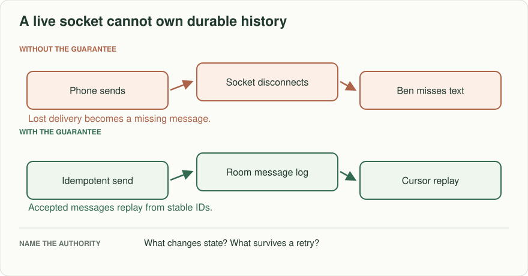
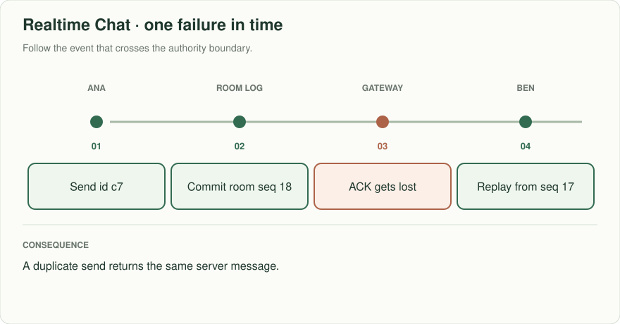
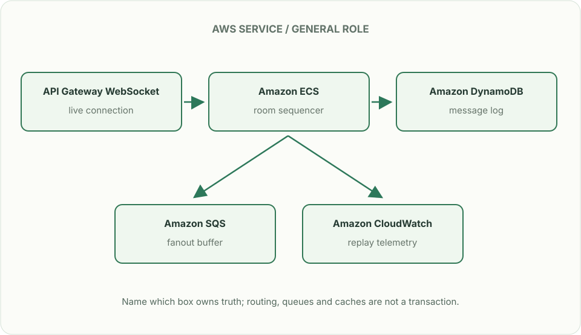

# Realtime chat: reconnect without losing the conversation

## What you are building

> Build team chat for field-support crews. A phone loses its connection after sending a message and retries on reconnect. Another member joins after messages were sent. The interface must distinguish saved, delivered and read, without showing a duplicate conversation entry.

**Working contract:** POST /conversations/{id}/messages uses a client_message_id. Acknowledged means the message is durably stored. Reconnect reads after a conversation cursor; delivered and read receipts describe particular devices or users.

## Workload and the decisions it changes

These are constructed exercise assumptions. The large workload is a design target; the local demonstration does not establish that throughput. Use the [estimation constants](../../../01-code/01-problem-solving/estimation-constants.md) to check units before choosing capacity.

| Input or objective | Calculation / consequence |
|---|---|
| Two million daily users; 30,000 messages/s peak | At 1 KiB/message that is about 30 MiB/s before indexes, replicas and attachments. |
| Groups of 2–500 members | A 500-member conversation can turn one write into 499 delivery attempts; fan-out costs differ from stored message rate. |
| One-year history | Estimate from average messages/day; attachments need a separate size and retention model. |

## Start with one working boundary

Run from the repository root with Python 3.12+:

```bash
python3 examples/architecture-starts/realtime_chat.py
```

[Open the starting code](../../../../examples/architecture-starts/realtime_chat.py). This is a runnable demonstration of the critical state boundary. The API, UI, cloud adapters and operating behavior below are the application you build around it.

| Record / module | Key or interface | Responsibility |
|---|---|---|
| messages | conversation_id,sequence,message_id | Durable ordered conversation history. |
| client_operations | sender,client_message_id,payload_hash | Retry identity; changed text under the same ID conflicts. |
| member_cursors | conversation,member,delivered_seq,read_seq | Monotonic receipt positions; membership gates history. |

## AWS implementation


WebSockets carry live updates but are not the history authority. DynamoDB fits conversation-keyed access; PostgreSQL is a practical smaller baseline if sequence assignment and membership transactions dominate.

## Build it in this order

### 1. Store before acknowledging

Authenticate membership, allocate a conversation sequence through a serialized partition owner or database transaction, then commit the message and retry result. Do not acknowledge based only on writing to a WebSocket buffer. Keep attachments outside message rows with authorized object references.

### 2. Implement reconnect replay

Persist each device’s last received sequence. Fetch bounded pages after that cursor, detect gaps, and deduplicate by message ID in the client. Push delivery is an acceleration; durable history fills missed messages.

### 3. Separate receipt meanings

Show saved once the server commit is known, delivered after a device acknowledgement, and read after the user’s explicit view event. Advance cursors monotonically. A recipient going offline cannot retract the sender’s stored message.

### 4. Enforce membership across history

Check current membership before history reads and attachment downloads, and define access to messages from before joining. On removal, stop new push delivery and reject reads even if cached conversation metadata is old.

## Infrastructure configuration

| Resource or boundary | Initial configuration and reason |
|---|---|
| Message partitions | Measure hot conversations and avoid claiming an unlimited per-conversation write rate; sequence allocation is coordination. |
| Connection registry | Expiring device routes; stale connection failures remove routes, never message history. |
| Storage and logs | Encrypt private content; bound attachment sizes; avoid logging message text or signed URLs. |

Use one disposable AWS environment for the cloud exercise. Put the named resources in `infra/template.yaml` or your existing IaC tool, pass resource IDs through configuration, and scope each runtime role to its own tables, buckets and queues. The diagram is a design to implement; it is not a claim that these resources have been deployed. Record the commands you used to deploy and remove the exercise resources.

## Observe the result

| Action | Expected visible result |
|---|---|
| Run the starting program | Two sends with one client ID produce one stored message and the same sequence. |
| Disconnect after server commit | Reconnect replay includes the message; retry does not duplicate it. |
| Remove a member with a warm history cache | New reads and attachment access are denied. |

## The next design decision

Add cross-region conversations. State which region orders a conversation and what happens during its outage. Global delivery does not imply independent regions can allocate the same conversation sequence safely.

<details>
<summary>Additional design cases, alternatives and original source notes</summary>

> **Interviewer:** “Design a team chat. Ana sends ‘Ready?’ on her phone, loses reception before the acknowledgement, and retries from her laptop. Ben was offline. When both reconnect, which messages appear, in what order, and how do you avoid an accidental duplicate?”

Assume 2 million daily active users, 30,000 peak messages/s, groups of 2–500 members, and one-year history. These are exercise inputs. Distinguish server-accepted messages from messages displayed or read on a device.

| Scenario | Expected visible result |
|---|---|
| Send succeeds, reply disappears, same client message ID retried | One stored message and one stable server message ID |
| Ben reconnects after missing messages 18–21 | Resume after acknowledged cursor 17; return 18–21, then live delivery |
| Two devices send concurrently into one room | Explain the chosen per-room ordering rule; no unearned global order |
| Device is offline for two days | History query and pagination work even when live connection state expired |



## Separate storage from delivery

The message write becomes authoritative when the server persists it and assigns a room sequence or another documented order. WebSockets carry low-latency delivery, presence, and acknowledgements; connections are not the message database. Store `(room_id, sequence, message_id, sender_id, body, created_at)` and an idempotency key scoped to sender and room. A client must retain the same send-operation ID across retries; a laptop cannot deduplicate a phone's uncertain send unless that pending ID was synchronized. Two independently composed identical texts remain two messages. If a device misses sequence 19, fetch the gap before advancing its cursor. Delivery may be at least once; the UI deduplicates by message ID. “Read” means the client confirms display according to an explicit policy, not merely that a push reached a gateway.



### One accepted message

`send(room_id, operation_id, body)` derives sender identity from authentication. A fenced room owner chooses `next_sequence`; one DynamoDB transaction checks its ownership epoch and current counter, advances the counter, and stores the message, `(sender, room, operation_id) → result + request_hash`, and an outbox row. A duplicate key reads the existing result; different content under that key conflicts. If the epoch or sequence check fails, reload or hand off—do not publish the uncommitted message.

| Arrow | Acknowledgement means | Recovery |
|---|---|---|
| Sender → room authority | Transaction committed message + sequence + replay + outbox. | Same operation ID recovers an uncertain acknowledgement. |
| Outbox → fanout queue | Fanout work is queued, not displayed. | Retry relay; consumers deduplicate `(message_id, recipient)`. |
| Fanout → authorized connection | Delivery attempt only; recheck membership before private bytes leave. | Missing/duplicate broadcast is repaired by authorized history replay. |
| Device → cursor store | Client has received a contiguous range. | Never advance over a missing sequence; retention expiry requires explicit resync. |

**Failure trace:** commit sequence 18 → owner crashes before broadcasting → outbox relays twice → recipient reconnects at cursor 17. History returns message 18 once in the UI; a stale owner fails its epoch condition.

**Capacity example:** 30,000 messages/s × 50 online recipients = **1.5 million delivery attempts/s**, excluding retries. If accepted-to-queued takes 50 ms, queueing 100 ms and live delivery 150 ms, the target is 300 ms for online devices, not for offline readers. Bound queue age and per-room fanout; retained history, not infinite live buffering, handles slow clients.

## Make the boxes accountable

Draw authentication/room membership check → message authority → history store → fanout workers → connection gateways → devices. Membership changes must be checked before fetching private history as well as before live subscriptions. Estimate the largest room's fanout separately from average room size. If media is added, separate encrypted object storage and its authorization from message ordering.

## Put the AWS names on the boxes



**Why these boxes, and what changes the choice:** WebSocket connections deliver low-latency updates, while a DynamoDB log owns acknowledged history. ECS owners may assign room sequence numbers; a database conditional write must still fence old owners. SQS fans out work but can redeliver, so reconnect uses log cursors instead.

Read the smaller label under each service first: it names the architectural job. Then ask whether that service supplies the guarantee in the problem, or simply moves work to the next box.

**Senior follow-up:** A fanout worker dies after delivering to half a room. The cursor-based recovery path replays without duplicating visible messages. Show what a restarted worker reads, when it checkpoints, and what happens if a user is removed halfway through a backlog.

**Staff follow-up:** The same room has members in three Regions. Choose one sequencing authority per room or state the weaker ordering promise. Partition a hot room's fanout without promising independent writers a single total order for free. Specify how ownership transfers and how to check no accepted message disappears.

**Practice artifact:** Label the durable commit on a before/after diagram; trace the lost acknowledgement and reconnect; define retention, per-room ordering, and two tests for replay plus removal.

**AWS translation:** API Gateway WebSocket or self-managed ECS gateways hold connections; a durable store holds history and cursor. DynamoDB can model `PK=room`, `SK=sequence`, but a single huge room may need a different distribution strategy; SQS standard delivery can duplicate and reorder, so it cannot establish room ordering. See [SQS standard queue guarantees](https://docs.aws.amazon.com/AWSSimpleQueueService/latest/SQSDeveloperGuide/standard-queues.html).

**Source note:** Original scenario, inspired by recurrent senior-level delivery/consistency themes; no company attribution.

</details>
