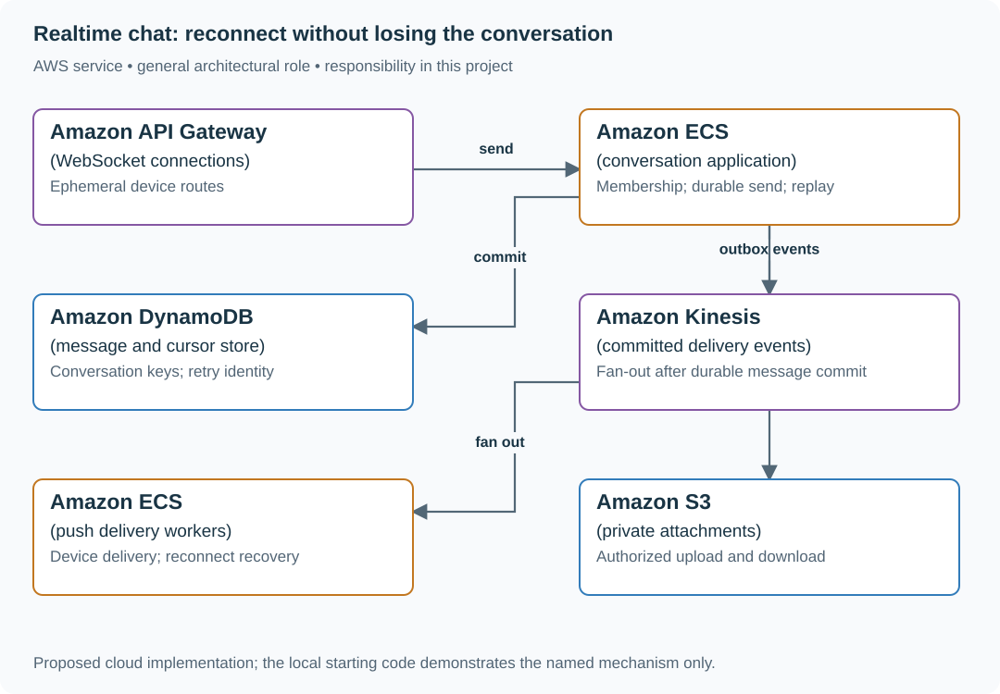
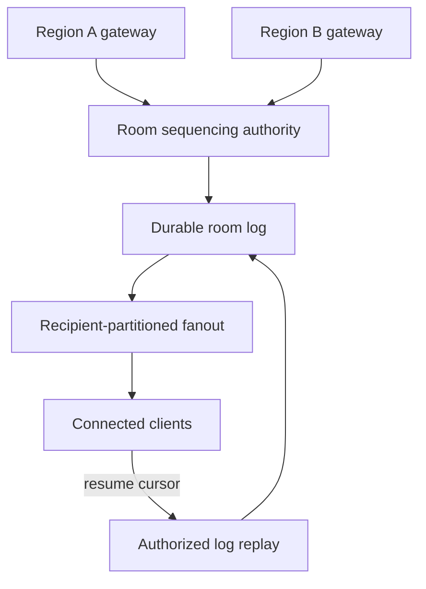

# Build chat with durable messages and reconnect recovery

## Application background

Ana sends a message to her field-support team from her phone. The server saves it, forwards it to connected teammates and later records who has read it. Those are three different events, so the interface should not use one status to mean all three.

Ana's connection can drop after the server saves the message but before her phone receives confirmation. Her phone then resends it. Without a stable message identity, the conversation may show the same message twice.

### Example walkthrough

| Action | Expected behavior |
|---|---|
| Ana sends message `phone-42` | Store one conversation entry. |
| Her phone reconnects and resends `phone-42` | Return the existing entry rather than creating another. |
| Ben reconnects after missing messages | Resume from his last received position. |

A reconnect cursor is a saved position in the conversation. It tells the server which later messages to send without assuming the phone received everything previously transmitted.

## Your assignment

**Deliver:** Build message saving and reconnect recovery. Recognize repeated sends as the same message and report saved, delivered and read outcomes separately.

**Required behavior:** POST /conversations/{id}/messages uses a client_message_id. Acknowledged means the message is durably stored. Reconnect reads after a conversation cursor. Delivered and read receipts describe particular devices or users.

The required first milestone is a working local implementation of the behavior above. The numbered implementation steps define the scope. The cloud architecture is a later extension, not something the starter has already provisioned.

## Get the code and run the supplied example

The code is in the public [junior-to-staff repository](https://github.com/Soulful-Iris/junior-to-staff). Install Git and Python 3.12+. No AWS account or Python packages are required for this first run. If you already have a checkout, use it and skip cloning.

```bash
git clone https://github.com/Soulful-Iris/junior-to-staff.git
cd junior-to-staff
python3 examples/architecture-starts/realtime_chat.py
```

**Supplied file:** [`examples/architecture-starts/realtime_chat.py`](https://github.com/Soulful-Iris/junior-to-staff/blob/main/examples/architecture-starts/realtime_chat.py). You can also [read or download the source here](../../../../examples/architecture-starts/realtime_chat.py).

This program is a **mechanism demonstration**: it runs the small scenario in one process and prints the result. It is not an HTTP service, a complete application, or an AWS deployment. A successful run demonstrates this mechanism only. It does not establish the workload or failure guarantees of the application you will build.

**Example output from the supplied run:**

Generated IDs and timestamps may differ. Compare the state transitions and outcomes.

```text
{'sequence': 1, 'sender': 'ana', 'text': 'On my way'}
{'sequence': 1, 'sender': 'ana', 'text': 'On my way'}
Reconnect after sequence 0: [{'sequence': 1, 'sender': 'ana', 'text': 'On my way'}]
```

### Set up your implementation workspace

Create `work/realtime-chat/` in your checkout (or use a separate repository). Copy the supplied mechanism into that directory as `mechanism.py`, then extract its state transitions into functions you can call from your implementation. The record and module names below describe what you must implement. They are not a promise that files with those names already exist. Keep a `README.md` beside your implementation with its exact run commands and observed results.

## Local components and state to implement

This table names the records, interfaces or decision inputs for your deliverable. Unless a name is explicitly linked to supplied source above, it is something you create. Implement the local state transitions first, then connect the HTTP, storage or worker boundaries required by the steps.

| Record / module | Key or interface | Responsibility |
|---|---|---|
| messages | conversation_id,sequence,message_id | Durable ordered conversation history. |
| client_operations | sender,client_message_id,payload_hash | Retry identity. Changed text under the same ID conflicts. |
| member_cursors | conversation,member,delivered_seq,read_seq | Monotonic receipt positions. Membership gates history. |

## Implement the assignment

### 1. Store before acknowledging

Authenticate membership, allocate a conversation sequence through a serialized partition owner or database transaction, then commit the message and retry result. Do not acknowledge based only on writing to a WebSocket buffer. Keep attachments outside message rows with authorized object references.

### 2. Implement reconnect replay

Persist each device’s last received sequence. Fetch bounded pages after that cursor, detect gaps, and deduplicate by message ID in the client. Push delivery is an acceleration. Durable history fills missed messages.

### 3. Separate receipt meanings

Show saved once the server commit is known, delivered after a device acknowledgement, and read after the user’s explicit view event. Advance cursors monotonically. A recipient going offline cannot retract the sender’s stored message.

### 4. Enforce membership across history

Check current membership before history reads and attachment downloads, and define access to messages from before joining. On removal, stop new push delivery and reject reads even if cached conversation metadata is old.

## Demonstrate the completed local result

| Action | Expected visible result |
|---|---|
| Run the starting program | Two sends with one client ID produce one stored message and the same sequence. |
| Disconnect after server commit | Reconnect replay includes the message. Retry does not duplicate it. |
| Remove a member with a warm history cache | New reads and attachment access are denied. |

**Handoff:** In your implementation README, include the start command, one successful operation, the failure case above and the resulting stored state or decision. State which dependencies are simulated. Someone with a fresh checkout should be able to reproduce this without your chat history.

## Workload assumptions and capacity decisions

These are constructed exercise assumptions. The stated workload is a design target. The local demonstration does not establish that throughput. Use the [estimation constants](../../../01-code/01-problem-solving/estimation-constants.md) to check units before choosing capacity.

| Input or objective | Calculation / consequence |
|---|---|
| Two million daily users. 30,000 messages/s peak | At 1 KiB/message that is about 30 MiB/s before indexes, replicas and attachments. |
| Groups of 2–500 members | A 500-member conversation can turn one write into 499 delivery attempts. Fan-out costs differ from stored message rate. |
| One-year history | Estimate from average messages/day. Attachments need a separate size and retention model. |

## Map the local implementation to AWS

**Deployment status: local only.** Running the supplied command creates no AWS resources and configures no cloud connections. The diagram is a proposed deployment of the completed application. Each box needs either a deployed runtime, a provisioned service or an explicitly external dependency.

Read the diagram by following the arrows from the entry point: application code accepts the request or event, the state owner commits it, and any worker produces the later result. The table ties those roles to code and adapter work. Multiple boxes do not imply multiple Python files already exist.



WebSockets carry live updates but are not the history authority. DynamoDB fits conversation-keyed access. PostgreSQL is a practical smaller baseline if sequence assignment and membership transactions dominate.

| Local responsibility | Cloud destination and role | Implementation still required |
|---|---|---|
| Local HTTP boundary or the endpoint you will add | Amazon API Gateway: WebSocket connections | Create routes and an integration. Translate requests and responses and configure identity validation. |
| Application or worker process | Amazon ECS: conversation application | Build a container and task definition. Supply configuration, task roles and graceful shutdown behavior. |
| Local dictionary, SQLite records or state model | Amazon DynamoDB: message and cursor store | Design partition/sort keys and write a storage adapter with conditional updates or transactions. Python state and SQL are not uploaded as a database. |
| Local event sequence or input stream | Amazon Kinesis: committed delivery events | Implement producer/consumer adapters, partition keys, durable acceptance and checkpoint/replay behavior. |
| Application or worker process | Amazon ECS: push delivery workers | Build a container and task definition. Supply configuration, task roles and graceful shutdown behavior. |
| Local file, object fixture or exported payload | Amazon S3: private attachments | Implement upload/download and metadata adapters, scoped access, object naming, retention and incomplete-upload cleanup. |

### Provision resources, then connect the application

| Resource or boundary | Initial configuration and reason |
|---|---|
| Message partitions | Measure hot conversations and avoid claiming an unlimited per-conversation write rate. Sequence allocation is coordination. |
| Connection registry | Expiring device routes. Stale connection failures remove routes, never message history. |
| Storage and logs | Encrypt private content. Bound attachment sizes. Avoid logging message text or signed URLs. |

Use one disposable AWS environment for the cloud exercise. Put the named resources in `infra/template.yaml` or your existing IaC tool, pass resource IDs through configuration, and scope each runtime role to its own tables, buckets and queues. The diagram is a design to implement. It is not a claim that these resources have been deployed. Record the commands you used to deploy and remove the exercise resources.

For concrete provisioning commands, configuration wiring and cleanup, use the [AWS foundation guide](../../../../examples/architecture-starts/infra/README.md). It includes a deployable table/queue/object-storage foundation and explains which application and service adapters you still implement.

A provisioned queue or table does not make the local program use it. Configure resource IDs in the deployed runtime, replace the local adapter, and replay the same successful and failing operation against that runtime. Record the deployed commit and observable result, then remove the disposable resources using your infrastructure tool.

## Extend the design after the baseline works
### Worked follow-up: Order a chat room across regions and scale its delivery

Connection proximity does not determine message order. If two regions independently allocate sequence 42, reconnecting clients cannot know which message belongs at that position.

| Starting design | Changed requirement |
|---|---|
| One room sequencer orders durable messages. | Users connect in several regions and a hot room needs multiple fanout workers. |

**Revised architecture.** Follow the changed responsibility and failure path below. This is a design to implement. The supplied local example does not provision these components.



**What to implement.** Choose a home sequencer for each room. Remote gateways forward sends to it and acknowledge only after the room log is durable under the stated recovery contract. Partition delivery by recipient, not by independent room writers. Every client keeps its last received sequence and deduplicates replayed messages. Recheck room membership before backlog delivery. On failover, fence the old sequencer and verify log coverage before the new owner allocates sequence numbers.

**Walk through the result.** Deliver message 42 to half the room, stop a fanout worker and reconnect a client at cursor 41. It receives 42 once visibly, then 43. Remove another member before replay and show denial. Your diagram and transcript must distinguish ordering, durable acknowledgement and delivery, which are three separate responsibilities.


Add cross-region conversations. State which region orders a conversation and what happens during its outage. Global delivery does not imply independent regions can allocate the same conversation sequence safely.

<details>
<summary>Additional design cases, alternatives and original source notes</summary>


Assume 2 million daily active users, 30,000 peak messages/s, groups of 2–500 members, and one-year history. These are exercise inputs. Distinguish server-accepted messages from messages displayed or read on a device.

| Scenario | Expected visible result |
|---|---|
| Send succeeds, reply disappears, same client message ID retried | One stored message and one stable server message ID |
| Ben reconnects after missing messages 18–21 | Resume after acknowledged cursor 17. Return 18–21, then live delivery |
| Two devices send concurrently into one room | Explain the chosen per-room ordering rule. No unearned global order |
| Device is offline for two days | History query and pagination work even when live connection state expired |

## Separate storage from delivery

The message write becomes authoritative when the server persists it and assigns a room sequence or another documented order. WebSockets carry low-latency delivery, presence, and acknowledgements. Connections are not the message database. Store `(room_id, sequence, message_id, sender_id, body, created_at)` and an idempotency key scoped to sender and room. A client must retain the same send-operation ID across retries. A laptop cannot deduplicate a phone's uncertain send unless that pending ID was synchronized. Two independently composed identical texts remain two messages. If a device misses sequence 19, fetch the gap before advancing its cursor. Delivery may be at least once. The UI deduplicates by message ID. “Read” means the client confirms display according to an explicit policy, not merely that a push reached a gateway.

### One accepted message

`send(room_id, operation_id, body)` derives sender identity from authentication. A fenced room owner chooses `next_sequence`. One DynamoDB transaction checks its ownership epoch and current counter, advances the counter, and stores the message, `(sender, room, operation_id) → result + request_hash`, and an outbox row. A duplicate key reads the existing result. Different content under that key conflicts. If the epoch or sequence check fails, reload or hand off—do not publish the uncommitted message.

| Arrow | Acknowledgement means | Recovery |
|---|---|---|
| Sender → room authority | Transaction committed message + sequence + replay + outbox. | Same operation ID recovers an uncertain acknowledgement. |
| Outbox → fanout queue | Fanout work is queued, not displayed. | Retry relay. Consumers deduplicate `(message_id, recipient)`. |
| Fanout → authorized connection | Delivery attempt only. Recheck membership before private bytes leave. | Missing/duplicate broadcast is repaired by authorized history replay. |
| Device → cursor store | Client has received a contiguous range. | Never advance over a missing sequence. Retention expiry requires explicit resync. |

**Failure trace:** commit sequence 18 → owner crashes before broadcasting → outbox relays twice → recipient reconnects at cursor 17. History returns message 18 once in the UI. A stale owner fails its epoch condition.

**Capacity example:** 30,000 messages/s × 50 online recipients = **1.5 million delivery attempts/s**, excluding retries. If accepted-to-queued takes 50 ms, queueing 100 ms and live delivery 150 ms, the target is 300 ms for online devices, not for offline readers. Bound queue age and per-room fanout. Retained history, not infinite live buffering, handles slow clients.

## Make the boxes accountable

Draw authentication/room membership check → message authority → history store → fanout workers → connection gateways → devices. Membership changes must be checked before fetching private history as well as before live subscriptions. Estimate the largest room's fanout separately from average room size. If media is added, separate encrypted object storage and its authorization from message ordering.

## Put the AWS names on the boxes

**Why these boxes, and what changes the choice:** WebSocket connections deliver low-latency updates, while a DynamoDB log owns acknowledged history. ECS owners may assign room sequence numbers. A database conditional write must still fence old owners. SQS fans out work but can redeliver, so reconnect uses log cursors instead.


**Senior follow-up:** A fanout worker dies after delivering to half a room. The cursor-based recovery path replays without duplicating visible messages. Show what a restarted worker reads, when it checkpoints, and what happens if a user is removed halfway through a backlog.

**Staff follow-up:** The same room has members in three Regions. Choose one sequencing authority per room or state the weaker ordering promise. Partition a hot room's fanout without promising independent writers a single total order for free. Specify how ownership transfers and how to check no accepted message disappears.

**Practice artifact:** Label the durable commit on a before/after diagram. Trace the lost acknowledgement and reconnect. Define retention, per-room ordering, and two tests for replay plus removal.

**AWS translation:** API Gateway WebSocket or self-managed ECS gateways hold connections. A durable store holds history and cursor. DynamoDB can model `PK=room`, `SK=sequence`, but a single huge room may need a different distribution strategy. SQS standard delivery can duplicate and reorder, so it cannot establish room ordering. See [SQS standard queue guarantees](https://docs.aws.amazon.com/AWSSimpleQueueService/latest/SQSDeveloperGuide/standard-queues.html).

**Source note:** Original scenario, inspired by recurrent senior-level delivery/consistency themes. No company attribution.

</details>
