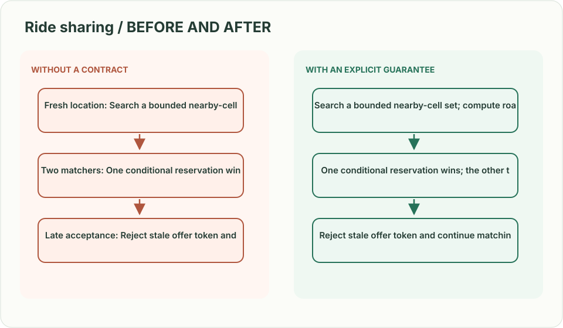
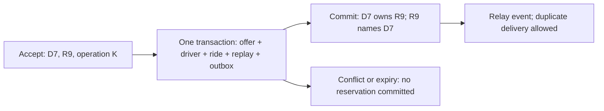
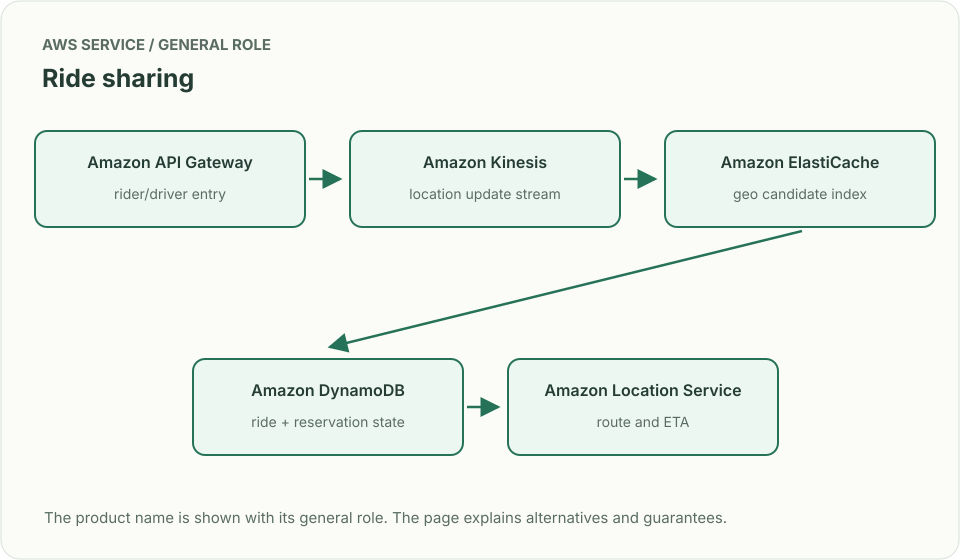
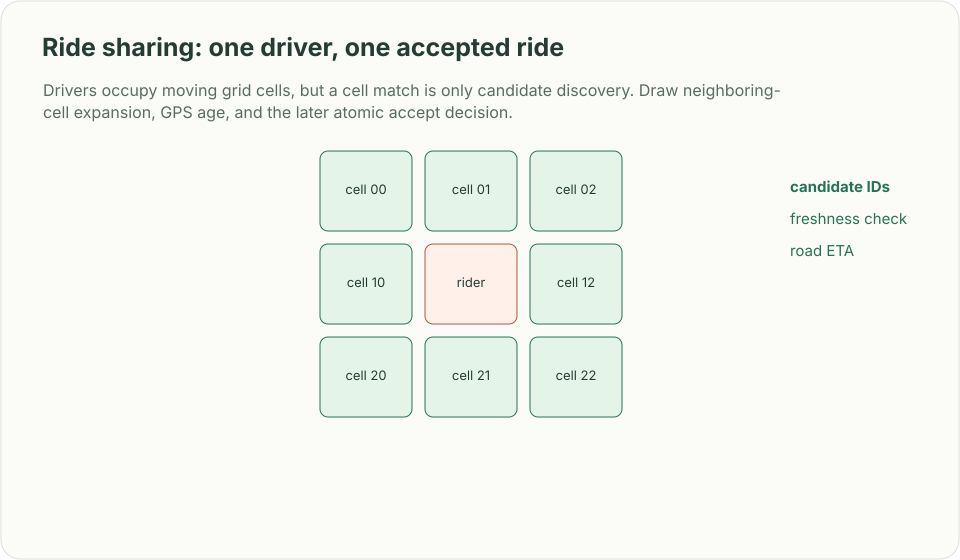

# Ride sharing: one driver, one accepted ride

*Design brief · diagrams and reasoning exercises; no complete application is supplied.*

> **Interviewer:** “A rider asks for a car. Drivers move every few seconds, one driver can accept only one trip, and the rider wants a live ETA. Design matching and state transitions.”

This is a **commonly listed system-design interview prompt** with a concrete practice contract. Assume 5 million active drivers, location p95 younger than 5 seconds, and bursts around commute and event traffic. Clarify service guarantees and a first version before filling the board with services.

| Situation | Input / condition | Expected result |
|---|---|---|
| Fresh location | Driver D7 reports at 10:00:03 | Search a bounded nearby-cell set; compute road ETA before offer. |
| Two accept attempts | Both try to assign D7, or two drivers accept the same ride | One joined assignment transaction wins; the loser retries matching. |
| Late acceptance | D7 accepts after offer expires | Reject stale offer token and continue matching. |
| Stale GPS | D8 was nearby 40 seconds ago | Exclude or down-rank by freshness; do not claim it is currently nearby. |

## Think from the contract to the boxes

Split the fast changing location index from the authoritative ride record. Geospatial cells find candidates; a road-network ETA ranks them. An offer has an expiry and token. An offer is a short-lived invitation, not a reservation. On accept, commit driver ownership, ride ownership and replay identity together. GPS updates are hints, not ownership.

### The decision that makes one assignment true

`POST /rides/{ride_id}/accept` carries `offer_id` and `operation_id`; the authenticated driver identity comes from the server. In a single-region DynamoDB transaction, check that the offer names this driver and ride, is still open and unexpired; conditionally change `Driver(D7): AVAILABLE → RESERVED(ride_id)` and `Ride(R9): SEARCHING → ASSIGNED(D7)`; consume the offer; store `Operation(driver, operation_id, request_hash, result)` and an outbox event. Reuse of an operation ID with a different request is a conflict.

| Interleaving | Required outcome |
|---|---|
| D7 accepts R9 and R10 concurrently | Driver condition lets only one transaction commit. |
| D7 and D8 accept R9 concurrently | Ride condition lets only one transaction commit. |
| Process dies before transaction commit | Neither side is reserved; another attempt may win. |
| Commit succeeds; reply or event delivery is lost | Read the stored operation result; outbox relay retries. No second assignment. |

Treat transaction conflicts as conflicts, not as unconditional retries of stale offers. The server checks expiry at the acceptance decision using a trusted clock; an expired TTL row is not proof of deletion. One authority Region owns each ride/driver assignment. At five million drivers reporting every five seconds, ingress is **one million location updates/s** before retries: partition and rate-limit that separate hint path. Measure accept throughput independently; a hot city must not serialize on one shared counter.

**Acceptance exercise:** run both races above, interrupt immediately before/after commit, and replay the same operation. Assert both uniqueness rules and no permanently reserved driver without an assigned ride. These are proposed deployment tests, not a claim of live DynamoDB execution.

**First diagram:** Draw location ingress separately from offer/accept state. Label freshness, cell coverage, offer expiry, and the conditional reservation.

| AWS service / general role | Why it fits this design | Alternative and when it fits better |
|---|---|---|
| **Amazon API Gateway** / rider/driver entry | Authenticate updates and ride requests. | ALB + ECS for persistent bidirectional traffic. |
| **Amazon Kinesis** / location update stream | Buffer high-volume GPS changes. | MSK when Kafka tooling and replay consumers dominate. |
| **Amazon ElastiCache** / geo candidate index | Keep short-lived driver cells and availability hints. | MemoryDB for stronger in-memory durability; a dedicated geo index for richer shapes. |
| **Amazon DynamoDB** / ride + reservation state | Transact driver, ride, offer, replay result and outbox conditions together. | Aurora for transactional multi-entity booking with lower write scale. |
| **Amazon Location Service** / route and ETA | Estimate route distance/time from candidates. | Self-hosted routing when map coverage, control, or price requires it. |

Service choice follows the contract: the box label gives the generic job, while the table explains the AWS product and a reasonable substitute. Name which component owns durable truth, where retries happen, and the guarantee each managed service does **not** provide by itself.

## Pressure-test the design

**Follow-up: Drivers occupy moving grid cells, but a cell match is only candidate discovery. Draw neighboring-cell expansion, GPS age, and the later atomic accept decision.**

**Senior expectation:** An event venue creates a hot cell and floods location writes. Split or salt the index while preserving a bounded search radius and explain how drivers move between cells.

**Staff expectation:** Different cities need local matching and disaster recovery. Define regional ownership, cross-region request behavior, regulatory location retention, and fairness across driver cohorts.

**Practice artifact:** Draw location ingress separately from offer/accept state. Label freshness, cell coverage, offer expiry, and the conditional reservation. Then trace every row in the table, draw one failure, and state what the customer observes. Suggested rehearsal: 35 minutes design, 10 minutes to challenge the guarantees.

**Evidence and origin:** The current community interview-question catalog lists ride-sharing design reports at companies including Google, Salesforce, Visa, and Meta; dates are generally omitted. The entry does not show the interview date and is not a verified company rubric. The prompt contract, workload, outcomes, diagrams and solution here are original practice material. Treat company tags as reported sightings, not a prediction of your interview loop.

**Interview report listing:** [Open the community question entry](https://www.hellointerview.com/community/questions/rideshare-architecture/cm6u9yzg000y87oi9k1oi7qx8).
