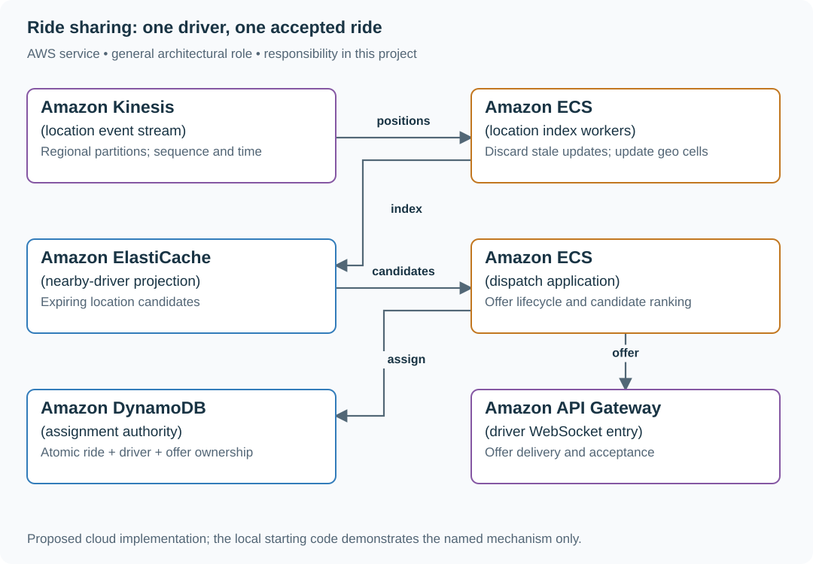
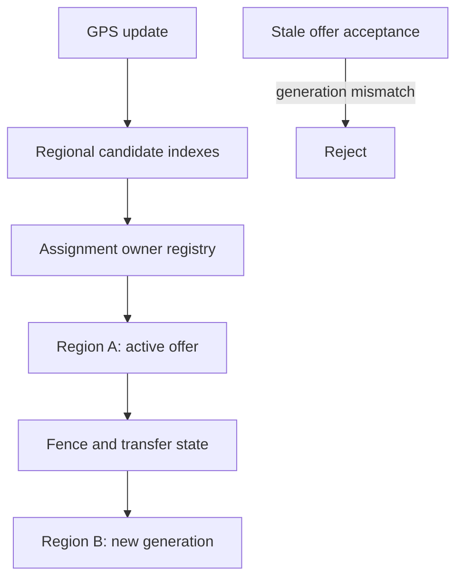

# Assign drivers safely with expiring offers

## Application background

A rider requests a car. The application looks at recent driver locations, offers the ride to a nearby driver and records an assignment if the driver accepts. Finding someone nearby does not yet reserve that driver's time.

Two riders may be offered the same driver. Location messages can also arrive late, and a dispatch process that paused may wake up after another process has taken over its work.

### Example walkthrough

| Action | Expected behavior |
|---|---|
| Ana requests a ride near driver D7 | Create a time-limited offer. |
| D7 accepts one of two competing offers | Assign D7 to only that ride. |
| An older dispatcher resumes and tries to overwrite the assignment | Reject its expired authority. |

A lease grants temporary ownership of dispatch work. A fencing value is a newer ownership number that lets the data store reject writes from an old owner.

## Your assignment

**Deliver:** Build driver offers and acceptance using recent location data. Prevent competing offers or an outdated dispatcher from assigning the same driver to two rides.

**Required behavior:** A ride and driver may belong to at most one active assignment. Location search suggests candidates. Accepting an offer conditionally commits the ride, driver and offer under the current dispatch epoch.

The required first milestone is a working local implementation of the behavior above. The numbered implementation steps define the scope. The cloud architecture is a later extension, not something the starter has already provisioned.

## Get the code and run the supplied example

The code is in the public [junior-to-staff repository](https://github.com/Soulful-Iris/junior-to-staff). Install Git and Python 3.12+. No AWS account or Python packages are required for this first run. If you already have a checkout, use it and skip cloning.

```bash
git clone https://github.com/Soulful-Iris/junior-to-staff.git
cd junior-to-staff
python3 examples/architecture-starts/rideshare_dispatch.py
```

**Supplied file:** [`examples/architecture-starts/rideshare_dispatch.py`](https://github.com/Soulful-Iris/junior-to-staff/blob/main/examples/architecture-starts/rideshare_dispatch.py). You can also [read or download the source here](../../../../examples/architecture-starts/rideshare_dispatch.py).

This program is a **mechanism demonstration**: it runs the small scenario in one process and prints the result. It is not an HTTP service, a complete application, or an AWS deployment. A successful run demonstrates this mechanism only. It does not establish the workload or failure guarantees of the application you will build.

**Example output from the supplied run:**

Generated IDs and timestamps may differ. Compare the state transitions and outcomes.

```text
assignment committed
409 already assigned
{'r1': 'd7', 'r2': None} {'d7': 'r1'}
Latest location: {'seq': 10, 'cell': 'east'}
```

### Set up your implementation workspace

Create `work/rideshare-dispatch/` in your checkout (or use a separate repository). Copy the supplied mechanism into that directory as `mechanism.py`, then extract its state transitions into functions you can call from your implementation. The record and module names below describe what you must implement. They are not a promise that files with those names already exist. Keep a `README.md` beside your implementation with its exact run commands and observed results.

## Local components and state to implement

This table names the records, interfaces or decision inputs for your deliverable. Unless a name is explicitly linked to supplied source above, it is something you create. Implement the local state transitions first, then connect the HTTP, storage or worker boundaries required by the steps.

| Record / module | Key or interface | Responsibility |
|---|---|---|
| locations | driver_id,event_time,sequence,cell | Latest useful position. A lossy search projection. |
| rides / drivers | ride_id and driver_id,assignment,status | Authoritative availability and ownership. |
| offers | offer_id,ride_id,driver_id,epoch,expires_at | A bounded invitation, not an assignment. |

## Implement the assignment

### 1. Build regional candidate lookup

Partition positions by geographic cell and region. Accept only newer per-driver sequence updates. Expire stale locations. Query neighboring cells and rank by estimated pickup time. A geo index may contain a driver who is already assigned, so treat each candidate as provisional.

### 2. Create a versioned offer

Persist ride, driver, expiry and dispatcher epoch. Deliver the offer with a stable offer ID. The mobile client shows its expiration and sends that exact ID when accepting, rather than submitting a new free-form driver choice.

### 3. Commit both owners together

In DynamoDB TransactWriteItems, update ride and driver with availability conditions and update the offer with epoch/expiry conditions. All conditions belong to that single transaction. On conflict, fetch current ride status before trying another candidate.

### 4. Handle disconnects and cancellation

A new dispatcher increments ownership epoch before issuing replacement offers. Old acceptances and old dispatchers fail conditional writes. Cancellation releases a driver only if the assignment ID still matches. It cannot clear a newer assignment.

## Demonstrate the completed local result

| Action | Expected visible result |
|---|---|
| Run the starting program | r1 owns d7. R2 conflicts. Sequence 8 cannot overwrite sequence 9. |
| Accept an expired offer | The write is rejected even if its push notification arrived late. |
| Resume a paused old dispatcher | Its epoch cannot commit a new assignment. |

**Handoff:** In your implementation README, include the start command, one successful operation, the failure case above and the resulting stored state or decision. State which dependencies are simulated. Someone with a fresh checkout should be able to reproduce this without your chat history.

## Workload assumptions and capacity decisions

These are constructed exercise assumptions. The stated workload is a design target. The local demonstration does not establish that throughput. Use the [estimation constants](../../../01-code/01-problem-solving/estimation-constants.md) to check units before choosing capacity.

| Input or objective | Calculation / consequence |
|---|---|
| Five million active drivers. One update every five seconds | One million location updates/s if all are reporting. Regional partitioning and retention are major decisions. |
| Location p95 age under five seconds | Track event age separately from ingestion latency. Stale positions must be excluded or clearly downgraded. |
| Ten-second offer lifetime | A late acceptance must fail after the offer is replaced or expires. |

## Map the local implementation to AWS

**Deployment status: local only.** Running the supplied command creates no AWS resources and configures no cloud connections. The diagram is a proposed deployment of the completed application. Each box needs either a deployed runtime, a provisioned service or an explicitly external dependency.

Read the diagram by following the arrows from the entry point: application code accepts the request or event, the state owner commits it, and any worker produces the later result. The table ties those roles to code and adapter work. Multiple boxes do not imply multiple Python files already exist.



The high-volume location path can drop obsolete updates. The assignment path cannot drop ownership conflicts. Keeping those paths separate prevents a fast but stale geo cache from assigning one driver twice.

| Local responsibility | Cloud destination and role | Implementation still required |
|---|---|---|
| Local event sequence or input stream | Amazon Kinesis: location event stream | Implement producer/consumer adapters, partition keys, durable acceptance and checkpoint/replay behavior. |
| Application or worker process | Amazon ECS: location index workers | Build a container and task definition. Supply configuration, task roles and graceful shutdown behavior. |
| Local cache, counter or coordination state | Amazon ElastiCache: nearby-driver projection | Implement a Redis/Valkey adapter and atomic operations, expiry and unavailable-cache behavior. Keep the durable authority separate. |
| Application or worker process | Amazon ECS: dispatch application | Build a container and task definition. Supply configuration, task roles and graceful shutdown behavior. |
| Local dictionary, SQLite records or state model | Amazon DynamoDB: assignment authority | Design partition/sort keys and write a storage adapter with conditional updates or transactions. Python state and SQL are not uploaded as a database. |
| Local HTTP boundary or the endpoint you will add | Amazon API Gateway: driver WebSocket entry | Create routes and an integration. Translate requests and responses and configure identity validation. |

### Provision resources, then connect the application

| Resource or boundary | Initial configuration and reason |
|---|---|
| Location stream | Choose partition keys and provision shards/throughput from measured record size. Monitor per-partition lag and event age. |
| DynamoDB transactions | Keep ride/driver/offer checks in one transaction in the selected region. Persist request identity beyond SDK retry-token windows. |
| WebSocket delivery | Track connections as ephemeral routes. Reconnect fetches durable offer/ride state. |

Use one disposable AWS environment for the cloud exercise. Put the named resources in `infra/template.yaml` or your existing IaC tool, pass resource IDs through configuration, and scope each runtime role to its own tables, buckets and queues. The diagram is a design to implement. It is not a claim that these resources have been deployed. Record the commands you used to deploy and remove the exercise resources.

For concrete provisioning commands, configuration wiring and cleanup, use the [AWS foundation guide](../../../../examples/architecture-starts/infra/README.md). It includes a deployable table/queue/object-storage foundation and explains which application and service adapters you still implement.

A provisioned queue or table does not make the local program use it. Configure resource IDs in the deployed runtime, replace the local adapter, and replay the same successful and failing operation against that runtime. Record the deployed commit and observable result, then remove the disposable resources using your infrastructure tool.

## Extend the design after the baseline works
### Worked follow-up: Keep one driver owner during a region crossing

A GPS update makes the driver visible in region B before an offer from A expires. If B treats location as ownership, it may assign the driver to another rider.

| Starting design | Changed requirement |
|---|---|
| A city dispatch service owns a driver assignment. | A driver changes location while an active offer still belongs to the previous city. |

**Revised architecture.** Follow the changed responsibility and failure path below. This is a design to implement. The supplied local example does not provision these components.



**What to implement.** Separate the location index from an assignment record with owner_region and generation. Keep A authoritative until the active offer is accepted, rejected or expires. A later handoff first fences A, transfers the current assignment state, then enables B under a new generation. Stale offers carry the old generation and cannot be accepted. Regional indexes remain candidate discovery only. Use the conditional database write as the acceptance boundary.

**Walk through the result.** Driver D appears in B while offer O from A is active. B can discover D but cannot issue a competing accepted assignment. After transfer to generation 8, replay acceptance of generation 7. It must fail without changing the new assignment. Show both rider-facing outcomes.


Let a driver cross a regional boundary while an offer is active. Choose one assignment authority until the ride completes or perform an explicit authority transfer. Do not independently mark the driver free in both regions.

<details>
<summary>Additional design cases, alternatives and original source notes</summary>


This is a **commonly listed system-design interview prompt** with a concrete practice contract. Assume 5 million active drivers, location p95 younger than 5 seconds, and bursts around commute and event traffic. Clarify service guarantees and a first version before filling the board with services.

| Situation | Input / condition | Expected result |
|---|---|---|
| Fresh location | Driver D7 reports at 10:00:03 | Search a bounded nearby-cell set. Compute road ETA before offer. |
| Two accept attempts | Both try to assign D7, or two drivers accept the same ride | One joined assignment transaction wins. The loser retries matching. |
| Late acceptance | D7 accepts after offer expires | Reject stale offer token and continue matching. |
| Stale GPS | D8 was nearby 40 seconds ago | Exclude or down-rank by freshness. Do not claim it is currently nearby. |

## Think from the contract to the boxes

Split the fast changing location index from the authoritative ride record. Geospatial cells find candidates. A road-network ETA ranks them. An offer has an expiry and token. An offer is a short-lived invitation, not a reservation. On accept, commit driver ownership, ride ownership and replay identity together. GPS updates are hints, not ownership.

### The decision that makes one assignment true

`POST /rides/{ride_id}/accept` carries `offer_id` and `operation_id`. The authenticated driver identity comes from the server. In a single-region DynamoDB transaction, check that the offer names this driver and ride, is still open and unexpired. Conditionally change `Driver(D7): AVAILABLE → RESERVED(ride_id)` and `Ride(R9): SEARCHING → ASSIGNED(D7)`. Consume the offer. Store `Operation(driver, operation_id, request_hash, result)` and an outbox event. Reuse of an operation ID with a different request is a conflict.

| Interleaving | Required outcome |
|---|---|
| D7 accepts R9 and R10 concurrently | Driver condition lets only one transaction commit. |
| D7 and D8 accept R9 concurrently | Ride condition lets only one transaction commit. |
| Process dies before transaction commit | Neither side is reserved. Another attempt may win. |
| Commit succeeds. Reply or event delivery is lost | Read the stored operation result. Outbox relay retries. No second assignment. |

Treat transaction conflicts as conflicts, not as unconditional retries of stale offers. The server checks expiry at the acceptance decision using a trusted clock. An expired TTL row is not proof of deletion. One authority Region owns each ride/driver assignment. At five million drivers reporting every five seconds, ingress is **one million location updates/s** before retries: partition and rate-limit that separate hint path. Measure accept throughput independently. A hot city must not serialize on one shared counter.

**Acceptance exercise:** run both races above, interrupt immediately before/after commit, and replay the same operation. Assert both uniqueness rules and no permanently reserved driver without an assigned ride. These are proposed deployment tests, not a claim of live DynamoDB execution.

**First diagram:** Draw location ingress separately from offer/accept state. Label freshness, cell coverage, offer expiry, and the conditional reservation.

| AWS service / general role | Why it fits this design | Alternative and when it fits better |
|---|---|---|
| **Amazon API Gateway** / rider/driver entry | Authenticate updates and ride requests. | ALB + ECS for persistent bidirectional traffic. |
| **Amazon Kinesis** / location update stream | Buffer high-volume GPS changes. | MSK when Kafka tooling and replay consumers dominate. |
| **Amazon ElastiCache** / geo candidate index | Keep short-lived driver cells and availability hints. | MemoryDB for stronger in-memory durability. A dedicated geo index for richer shapes. |
| **Amazon DynamoDB** / ride + reservation state | Transact driver, ride, offer, replay result and outbox conditions together. | Aurora for transactional multi-entity booking with lower write scale. |
| **Amazon Location Service** / route and ETA | Estimate route distance/time from candidates. | Self-hosted routing when map coverage, control, or price requires it. |

Service choice follows the contract: the box label gives the generic job, while the table explains the AWS product and a reasonable substitute. Name which component owns durable truth, where retries happen, and the guarantee each managed service does **not** provide by itself.

## Pressure-test the design

**Follow-up: Drivers occupy moving grid cells, but a cell match is only candidate discovery. Draw neighboring-cell expansion, GPS age, and the later atomic accept decision.**

**Senior expectation:** An event venue creates a hot cell and floods location writes. Split or salt the index while preserving a bounded search radius and explain how drivers move between cells.

**Staff expectation:** Different cities need local matching and disaster recovery. Define regional ownership, cross-region request behavior, regulatory location retention, and fairness across driver cohorts.

**Practice artifact:** Draw location ingress separately from offer/accept state. Label freshness, cell coverage, offer expiry, and the conditional reservation. Then trace every row in the table, draw one failure, and state what the customer observes. Suggested rehearsal: 35 minutes design, 10 minutes to challenge the guarantees.

**Evidence and origin:** The current community interview-question catalog lists ride-sharing design reports at companies including Google, Salesforce, Visa, and Meta. Dates are generally omitted. The entry does not show the interview date and is not a verified company rubric. The prompt contract, workload, outcomes, diagrams and solution here are original practice material. Treat company tags as reported sightings, not a prediction of your interview loop.

**Interview report listing:** [Open the community question entry](https://www.hellointerview.com/community/questions/rideshare-architecture/cm6u9yzg000y87oi9k1oi7qx8).

</details>
