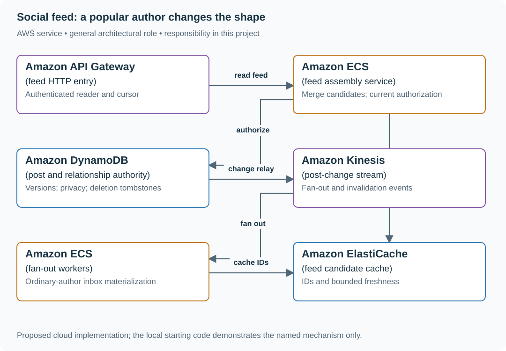

# Build a following feed with current access checks

## Application background

A creator network shows posts from accounts a reader follows. Feed entries are candidate post IDs; the current post and permission records determine what can actually be displayed.

This is a fictional engineering scenario. The workload figures later in the page are exercise assumptions, not measured production traffic.

## Your assignment

**Deliver:** A feed candidate pipeline, a special path for very large audiences, and read-time deletion/privacy enforcement.

Build a following feed for a creator network. Ordinary authors have hundreds of followers, while one celebrity has ten million. A post deleted or made private must not remain readable simply because its ID is in a follower’s cached feed.

**Required behavior:** GET /feed returns up to 30 currently authorized posts using a stable cursor. New eligible posts should appear within ten seconds under normal load. Feed materialization is a candidate index; post visibility is checked before returning content.

The required first milestone is a working local implementation of the behavior above. The numbered implementation steps define the scope; the cloud architecture is a later extension, not something the starter has already provisioned.

## Get the code and run the supplied example

The code is in the public [junior-to-staff repository](https://github.com/Soulful-Iris/junior-to-staff). Install Git and Python 3.12+. No AWS account or Python packages are required for this first run. If you already have a checkout, use it and skip cloning.

```bash
git clone https://github.com/Soulful-Iris/junior-to-staff.git
cd junior-to-staff
python3 examples/architecture-starts/social_feed.py
```

**Supplied file:** [`examples/architecture-starts/social_feed.py`](https://github.com/Soulful-Iris/junior-to-staff/blob/main/examples/architecture-starts/social_feed.py). You can also [read or download the source here](../../../../examples/architecture-starts/social_feed.py).

This program is a **mechanism demonstration**: it runs the small scenario in one process and prints the result. It is not an HTTP service, a complete application, or an AWS deployment. A successful run demonstrates this mechanism only; it does not establish the workload or failure guarantees of the application you will build.

**Example output from the supplied run:**

Generated IDs and timestamps may differ; compare the state transitions and outcomes.

```text
Warm feed candidates: ['p2', 'p1']
Returned content: ['Team update']
After revocation: []
```

### Set up your implementation workspace

Create `work/social-feed/` in your checkout (or use a separate repository). Copy the supplied mechanism into that directory as `mechanism.py`, then extract its state transitions into functions you can call from your implementation. The record and module names below describe what you must implement; they are not a promise that files with those names already exist. Keep a `README.md` beside your implementation with its exact run commands and observed results.

## Local components and state to implement

This table names the records, interfaces or decision inputs for your deliverable. Unless a name is explicitly linked to supplied source above, it is something you create. Implement the local state transitions first, then connect the HTTP, storage or worker boundaries required by the steps.

| Record / module | Key or interface | Responsibility |
|---|---|---|
| posts | author,post_id,version,visibility,deleted | Current content and authorization authority. |
| feed_entries | reader,sort_key,post_id | Candidate references, never independent permission grants. |
| follow_edges | follower,author,revision | Relationship source for fan-out and read-time eligibility. |

## Implement the assignment

### 1. Build a read-time feed first

Query recent posts by followed authors and merge by a deterministic order. Use opaque cursors that preserve ordering across pages. Measure the cost before introducing fan-out; this baseline is also a recovery path when materialization lags.

### 2. Materialize ordinary-author candidates

Emit post events from an outbox and append idempotent references to follower inboxes. Record fan-out progress and age. Treat deletion as a source version change so late create events cannot resurrect a removed post.

### 3. Handle celebrities on read

Keep very large-author streams separate and merge them with the reader’s materialized candidates. Choose a threshold from measured fan-out cost and read frequency, not follower count alone. Bound candidate fetches so one empty/private stream cannot cause unbounded refill work.

### 4. Authorize before returning content

Batch-fetch current post metadata and apply membership, blocks, privacy and deletion rules. Cached candidates may survive; restricted content must not. Define whether a cursor remains usable when eligibility changes, and tolerate shorter pages rather than leaking an item.

## Demonstrate the completed local result

| Action | Expected visible result |
|---|---|
| Run the starting program | A cached private candidate is filtered; revoking the remaining post produces an empty result. |
| Pause fan-out | Freshness age rises and the bounded read-time fallback remains available. |
| Deliver an old create after deletion | Its version cannot make the post visible again. |

**Handoff:** In your implementation README, include the start command, one successful operation, the failure case above and the resulting stored state or decision. State which dependencies are simulated. Someone with a fresh checkout should be able to reproduce this without your chat history.

## Workload assumptions and capacity decisions

These are constructed exercise assumptions. The stated workload is a design target; the local demonstration does not establish that throughput. Use the [estimation constants](../../../01-code/01-problem-solving/estimation-constants.md) to check units before choosing capacity.

| Input or objective | Calculation / consequence |
|---|---|
| 20 million daily users; 15,000 writes/s and 120,000 reads/s peak | Read amplification, fan-out and content storage need separate capacity models. |
| 30 items/page | 120,000 reads/s can require 3.6 million candidate checks/s before batching and caching. |
| Celebrity with ten million followers | One post can create ten million inbox writes; use a different delivery strategy for such authors. |

## Map the local implementation to AWS

**Deployment status: local only.** Running the supplied command creates no AWS resources and configures no cloud connections. The diagram is a proposed deployment of the completed application. Each box needs either a deployed runtime, a provisioned service or an explicitly external dependency.

Read the diagram by following the arrows from the entry point: application code accepts the request or event, the state owner commits it, and any worker produces the later result. The table ties those roles to code and adapter work. Multiple boxes do not imply multiple Python files already exist.



The hybrid design spends writes for ordinary authors and reads for celebrities. Neither path owns privacy; current source state decides which content can leave the service.

| Local responsibility | Cloud destination and role | Implementation still required |
|---|---|---|
| Local HTTP boundary or the endpoint you will add | Amazon API Gateway: feed HTTP entry | Create routes and an integration; translate requests and responses and configure identity validation. |
| Application or worker process | Amazon ECS: feed assembly service | Build a container and task definition; supply configuration, task roles and graceful shutdown behavior. |
| Local dictionary, SQLite records or state model | Amazon DynamoDB: post and relationship authority | Design partition/sort keys and write a storage adapter with conditional updates or transactions; Python state and SQL are not uploaded as a database. |
| Local event sequence or input stream | Amazon Kinesis: post-change stream | Implement producer/consumer adapters, partition keys, durable acceptance and checkpoint/replay behavior. |
| Application or worker process | Amazon ECS: fan-out workers | Build a container and task definition; supply configuration, task roles and graceful shutdown behavior. |
| Local cache, counter or coordination state | Amazon ElastiCache: feed candidate cache | Implement a Redis/Valkey adapter and atomic operations, expiry and unavailable-cache behavior; keep the durable authority separate. |

### Provision resources, then connect the application

| Resource or boundary | Initial configuration and reason |
|---|---|
| Feed storage | Partition inboxes by reader and time range; bound retained candidates and large-author fan-out. |
| Caching | Keep content authorization outside cached candidate membership; never cache a shared private response under an unscoped key. |
| Operations | Track ten-second freshness attainment, fan-out lag, candidate rejection rate and read amplification. |

Use one disposable AWS environment for the cloud exercise. Put the named resources in `infra/template.yaml` or your existing IaC tool, pass resource IDs through configuration, and scope each runtime role to its own tables, buckets and queues. The diagram is a design to implement; it is not a claim that these resources have been deployed. Record the commands you used to deploy and remove the exercise resources.

For concrete provisioning commands, configuration wiring and cleanup, use the [AWS foundation guide](../../../../examples/architecture-starts/infra/README.md). It includes a deployable table/queue/object-storage foundation and explains which application and service adapters you still implement.

A provisioned queue or table does not make the local program use it. Configure resource IDs in the deployed runtime, replace the local adapter, and replay the same successful and failing operation against that runtime. Record the deployed commit and observable result, then remove the disposable resources using your infrastructure tool.

## Extend the design after the baseline works


Introduce ranked ordering. Freeze or version enough ranking context to make pagination understandable, then explain how you avoid duplicate posts when new scores arrive between pages.

<details>
<summary>Additional design cases, alternatives and original source notes</summary>


Assume 20 million daily readers, 15,000 ordinary writes/s, 120,000 peak read requests/s, and a home page of 30 items. These are capacity assumptions, not observed company numbers. First clarify follow privacy, delete behavior, ranking versus recency, and the ten-second measurement point.

| Event | Expected user behavior |
|---|---|
| Author publishes and refreshes immediately | Own post visible from authoritative write path |
| Eight-million-follower author posts | Posting acknowledgement does not wait for eight million feed writes |
| Follower is removed before feed read | Former follower cannot read a now-private post from stale fanout |
| One fanout partition lags | Feed can show an explicit partial/freshness state; catch up with cursor |

## Show the multiplication

Fanout on write copies or indexes each ordinary post into follower feed candidates. For a 500-follower account one post entails roughly 500 feed insertions. For eight million followers, four posts would imply 32 million candidate insertions in a minute. A hybrid design writes the post once, fanouts ordinary accounts, and merges popular-account posts at read time. Mark thresholds as measured operational choices; the 500/8m distinction is illustrative.

The fork shows why average follower count is a bad capacity input. Work for the viral branch moves to reads, so also estimate what happens to read amplification when many followed popular authors post at once.

## What each store owns

Posts live in the source-of-truth store; follower edges and privacy are authoritative elsewhere; feed rows are a repairable projection. On pagination, pin a ranking/version watermark or specify how inserts move the page boundary. Stable IDs prevent duplicates when fanout and read-time merge both produce the same post. Cache an eligible candidate list, but recheck authorization on read for private content and revoke or filter cached rows when relationships change.

## Put the AWS names on the boxes

**Why these boxes, and what changes the choice:** DynamoDB owns post IDs and versioned views; Aurora is a reasonable alternative for follower joins under smaller load. SQS decouples ordinary fanout but has duplicate delivery; cache readers merge high-fanout authors. Neither queue nor cache replaces read-time privacy checks.


**Senior follow-up:** Queue backlog exceeds the ten-second freshness target. Derive backlog duration from ingestion and drain rates, choose whether to shed expensive ranking or delay social content, and define a user-facing freshness metric. A DLQ alone does not catch the main queue up.

**Staff follow-up:** A creator with eight million followers is removed for abuse while their post remains in millions of projections. Specify source-of-truth revocation, projection repair, regional invalidation, and audit evidence. A complete purge of every copy may take time; access control cannot rely on that purge finishing.

**Practice artifact:** Baseline and hybrid box diagrams, fanout estimate, freshness calculation, one privacy revocation test, and a failure-injection recovery plan.

**AWS translation:** S3 for large media; DynamoDB/RDS for posts and follower relationships subject to access patterns; SQS/Kinesis for asynchronous fanout as appropriate; ElastiCache for hot candidates. Queue delivery can duplicate, so projection writes must be idempotent. [Spotify's 2026 engineering discussion](https://engineering.atspotify.com/2026/1/why-we-use-separate-tech-stacks-for-personalization-and-experimentation) separates serving and evaluation responsibilities; this exercise makes the simpler feed/data ownership distinction without claiming to reproduce Spotify's design.

</details>
