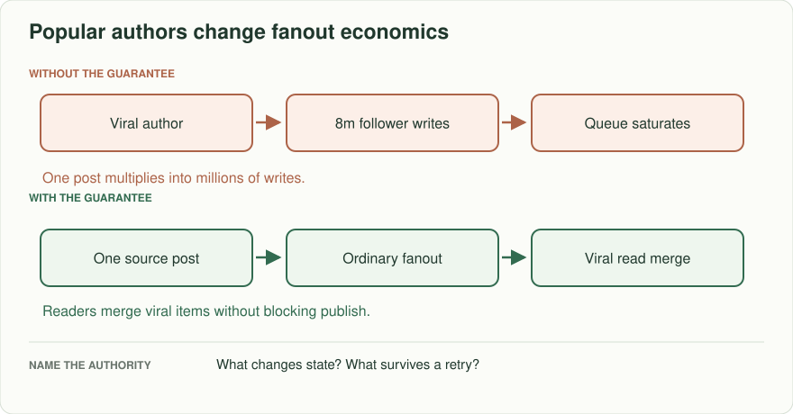
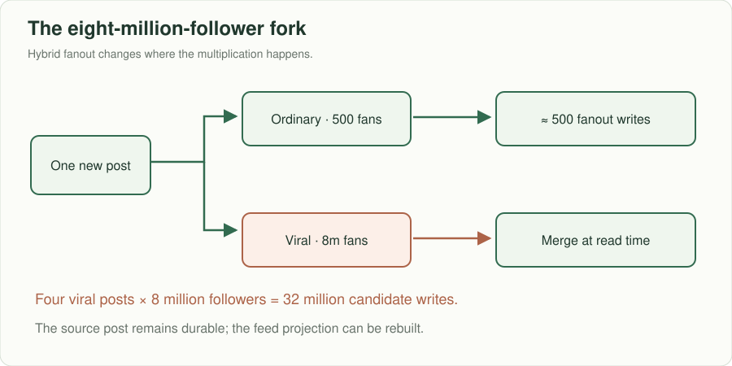
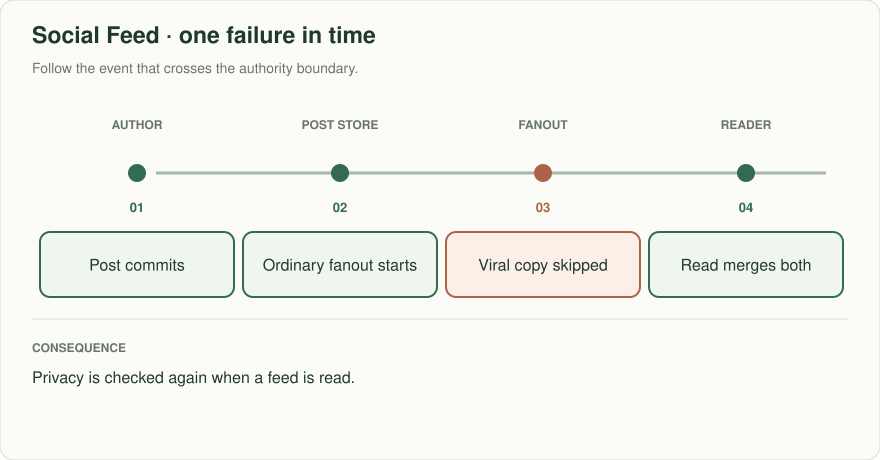
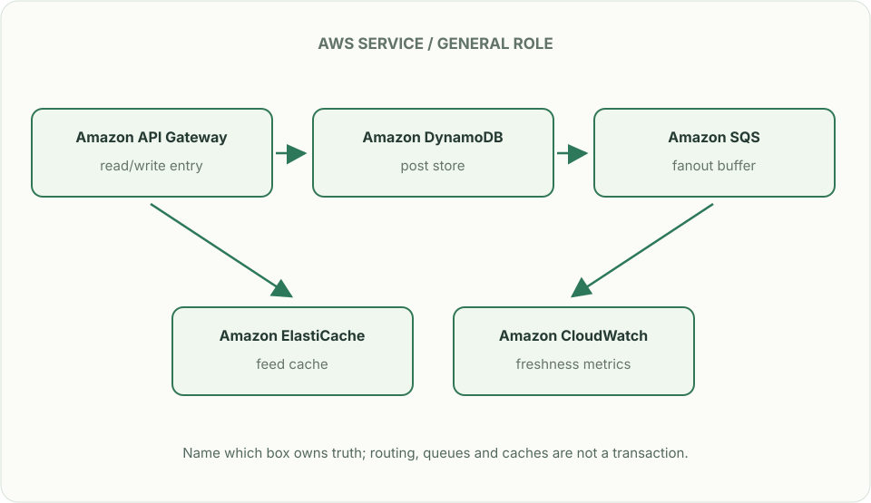

# Social feed: a popular author changes the shape

*Design brief · diagrams and reasoning exercises; no complete application is supplied.*

> **Interviewer:** “Build a home feed. Most authors have hundreds of followers; one has eight million. People expect their own new post immediately and friends' posts within ten seconds. Show what happens when the popular author posts four times in a minute.”

Assume 20 million daily readers, 15,000 ordinary writes/s, 120,000 peak read requests/s, and a home page of 30 items. These are capacity assumptions, not observed company numbers. First clarify follow privacy, delete behavior, ranking versus recency, and the ten-second measurement point.

| Event | Expected user behavior |
|---|---|
| Author publishes and refreshes immediately | Own post visible from authoritative write path |
| Eight-million-follower author posts | Posting acknowledgement does not wait for eight million feed writes |
| Follower is removed before feed read | Former follower cannot read a now-private post from stale fanout |
| One fanout partition lags | Feed can show an explicit partial/freshness state; catch up with cursor |

## Show the multiplication

Fanout on write copies or indexes each ordinary post into follower feed candidates. For a 500-follower account one post entails roughly 500 feed insertions. For eight million followers, four posts would imply 32 million candidate insertions in a minute. A hybrid design writes the post once, fanouts ordinary accounts, and merges popular-account posts at read time. Mark thresholds as measured operational choices; the 500/8m distinction is illustrative.

The fork shows why average follower count is a bad capacity input. Work for the viral branch moves to reads, so also estimate what happens to read amplification when many followed popular authors post at once.

## What each store owns

Posts live in the source-of-truth store; follower edges and privacy are authoritative elsewhere; feed rows are a repairable projection. On pagination, pin a ranking/version watermark or specify how inserts move the page boundary. Stable IDs prevent duplicates when fanout and read-time merge both produce the same post. Cache an eligible candidate list, but recheck authorization on read for private content and revoke or filter cached rows when relationships change.

## Put the AWS names on the boxes

**Why these boxes, and what changes the choice:** DynamoDB owns post IDs and versioned views; Aurora is a reasonable alternative for follower joins under smaller load. SQS decouples ordinary fanout but has duplicate delivery; cache readers merge high-fanout authors. Neither queue nor cache replaces read-time privacy checks.

Read the smaller label under each service first: it names the architectural job. Then ask whether that service supplies the guarantee in the problem, or simply moves work to the next box.

**Senior follow-up:** Queue backlog exceeds the ten-second freshness target. Derive backlog duration from ingestion and drain rates, choose whether to shed expensive ranking or delay social content, and define a user-facing freshness metric. A DLQ alone does not catch the main queue up.

**Staff follow-up:** A creator with eight million followers is removed for abuse while their post remains in millions of projections. Specify source-of-truth revocation, projection repair, regional invalidation, and audit evidence. A complete purge of every copy may take time; access control cannot rely on that purge finishing.

**Practice artifact:** Baseline and hybrid box diagrams, fanout estimate, freshness calculation, one privacy revocation test, and a failure-injection recovery plan.

**AWS translation:** S3 for large media; DynamoDB/RDS for posts and follower relationships subject to access patterns; SQS/Kinesis for asynchronous fanout as appropriate; ElastiCache for hot candidates. Queue delivery can duplicate, so projection writes must be idempotent. [Spotify's 2026 engineering discussion](https://engineering.atspotify.com/2026/1/why-we-use-separate-tech-stacks-for-personalization-and-experimentation) separates serving and evaluation responsibilities; this exercise makes the simpler feed/data ownership distinction without claiming to reproduce Spotify's design.
